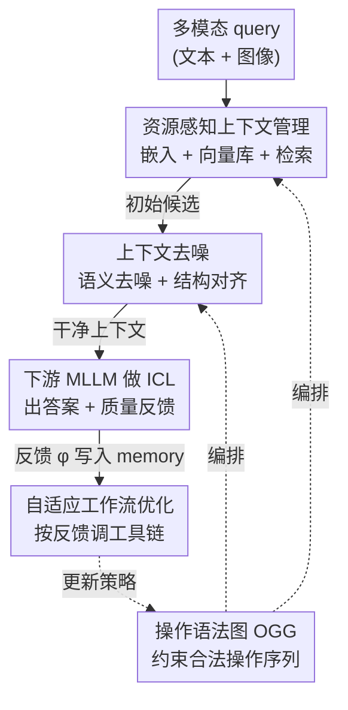

# ContextNav: Towards Agentic Multimodal In-Context Learning

**会议**: ICLR2026  
**OpenReview**: [https://openreview.net/forum?id=k3DZzBl2EZ](https://openreview.net/forum?id=k3DZzBl2EZ)  
**代码**: 待确认（项目页 https://contextnavpage.github.io/）  
**领域**: 多模态VLM / 多模态上下文学习 / Agent  
**关键词**: 多模态 ICL, agentic 工作流, 上下文去噪, 检索, 操作语法图

## 一句话总结
ContextNav 把"为多模态 in-context learning 挑选并清洗示例"这件事做成一个由 MLLM 驱动的闭环 agentic 工作流——先资源感知地嵌入并检索候选，再用 agent 推理去掉语义噪声和结构噪声，最后用一张操作语法图约束工具调用顺序、并靠下游 ICL 反馈持续优化策略，在 8 个数据集上把平均 ICL 增益从 SOTA 的 7.6% 提到 16.8%。

## 研究背景与动机
**领域现状**：多模态大模型（MLLM）已经展现出很强的 in-context learning（ICL）能力——给几个图文示例（demonstration），不更新参数就能适应新的视觉语言任务。现在喂示例主要有两条路：一条是**手工 ICL**，人工挑选并组织示例，得到的上下文干净、结构整齐；另一条是**基于检索的 ICL**，用特征相似度从候选库里自动检索示例。

**现有痛点**：手工 ICL 质量高但靠人力堆，劳动密集、任务专用，没法在大规模多模态语料上泛化。检索式 ICL 省了人力，却会把两类"噪声"塞进上下文：一是**语义噪声**（检索到的样本话题跑偏、甚至和 query 意图矛盾），二是**结构噪声**（候选的疑问句/祈使句/陈述句结构和 query 不一致）。这两类噪声都会实打实地拖垮下游 ICL 表现，论文 Figure 1 给了一个遥感问答的例子：含噪上下文把模型从正确答案带偏。

**核心矛盾**：更深一层的问题是，检索本身是一次性、规则化的静态过程——它不像人那样会"看效果再调整选样策略"。于是矛盾就是：**自动检索的可扩展性**和**人工策展的质量与自适应性**很难同时拿到。

**本文目标**：做一个上下文构建方法，既要检索的 scalability，又要人工策展那样的去噪能力和"边做边学"的自适应性，分解成三件事——怎么管理/嵌入多模态语料、怎么把噪声候选清掉、怎么让选样流程根据反馈进化。

**切入角度**：作者的观察是，"挑示例 + 清洗示例 + 重排示例 + 根据下游效果调策略"整套动作本质上是一个**可被 agent 编排的工具驱动工作流**，而 MLLM 自己就有多模态推理能力可以当这个 agent 的策略大脑。

**核心 idea**：把多模态上下文构建形式化成一个由 MLLM 策略驱动、图结构约束、带下游反馈闭环的 **agentic 工作流**——这就是 ContextNav，号称是第一个面向多模态 ICL 上下文构建的 agentic 框架。

## 方法详解

### 整体框架
ContextNav 接收一个多模态 query（文本 query $q_t$ 配对图像 $q_v$），输出一组"干净、和 query 相关、结构对齐"的上下文，拼到 query 前面喂给下游 MLLM $\Phi$ 做 ICL。整条管线由一个 MLLM 策略 $\pi_\theta$（默认 Gemini-2.0-flash）当 agent 来驱动，分三个协同模块外加一圈反馈闭环：

1. **Agentic Context Management（入口）**：agent 做资源感知的多模态嵌入，建并持续更新一个向量数据库，给定 query 从中检索出一批初始候选 $R^{init}_\tau$。
2. **Context Denoising（清洗）**：对初始候选先后做 agentic retrieval（去语义噪声）和 structural alignment（去结构噪声），得到噪声最小化的上下文 $R^{alin}_\tau$。
3. **Graph-driven Workflow Orchestration（编排）**：用一张操作语法图（OGG）约束上面这些操作必须按合法依赖顺序执行，并靠 memory 里"历史工作流 ↔ 下游 ICL 反馈"的关联，自适应地规划和优化操作序列。

最后把清洗好的上下文和 query 一起喂给下游 MLLM，模型不仅吐出答案 $y_\tau$，还吐出一段对"这次上下文质量好不好"的文本反馈 $\phi_\tau$；这个反馈被写进 memory，闭环回去指导下一轮的工具链选择。整套就是一个自优化的闭环系统。

### 关键设计

**1. 资源感知的 Agentic 上下文管理：把"嵌入 + 建库 + 检索"做成 agent 驱动的动态过程**

这一步针对的痛点是：大规模多模态嵌入又贵又占存储，而且不同 embedding 模型在精度和效率之间各有取舍、不同用户对资源的偏好也不同——固定一套嵌入方案不灵活。ContextNav 把嵌入做成 agent 决策：嵌入规格 prompt $P_{emb}$ 编码用户的资源偏好、当前硬件状态和可选的 embedding 模型库，MLLM 策略据此做"硬件-模型匹配"，挑出一对文本/视觉嵌入模型 $(E_T, E_V) = \pi_\theta(P_{emb})$。对语料 $C=\{(T_i, I_i)\}_{i=1}^N$，在时刻 $\tau$ 生成嵌入集 $E_\tau = \{(E_{text}(T_i), E_{vis}(I_i)) \mid (T_i,I_i)\in C_\tau\}$。

更关键的是这个库是"活"的：agent 用数据库工具持续监控语料，发现新增/改动但还没向量化的样本 $\Delta C_{\tau+1}$，就触发按需嵌入，把库更新成 $D_{\tau+1} = D_\tau \cup \{(T_j, I_j, e_j)\}$。建好库后用一个 Top-$k$ 相似检索函数 $f_\tau$（文本/视觉/级联三种检索工具的自适应组合）给出初始候选池 $R^{init}_\tau = f_\tau(q, D_\tau, k)$。和"一刀切固定 embedding + 静态库"相比，这套让嵌入成本可按需分配、库始终反映语料最新状态。

**2. 上下文去噪：用 agent 推理分别打掉语义噪声和结构噪声**

这是 ContextNav 真正"像人一样策展"的核心，对应前面 Figure 1 点名的两类噪声。语义噪声指候选内容跑题或和 query 意图矛盾；结构噪声指候选的疑问/祈使/陈述句式和 query 不一致。两步都建立在 MLLM 策略的内部推理上：

- **Agentic Retrieval（去语义噪声）**：在裸相似检索之外加一道"二次过滤"。coherence prompt $P_{coh}$ 给出语义判定指令（如核对 query 与候选的话题一致性、丢掉矛盾或分散注意力的候选），策略逐个评估初始候选并决定去留，$R^{sem}_\tau = \pi_\theta(q, P_{coh}, R^{init}_\tau)$。
- **Structural Alignment（去结构噪声）**：结构对齐 prompt $P_{str}$ 指导 agent 把句式发散的候选**改写**成和 query 文本 $q_t$ 一致的形式，$R^{alin}_\tau = \pi_\theta(q_t, P_{str}, R^{sem}_\tau)$。注意它不是丢候选而是重组文本结构，减少分布偏置。

之所以有效，是因为相似度高 ≠ 语义相关、更 ≠ 句式一致；先按语义保真、再按结构对齐，最终得到一组"噪声最小化"的上下文。消融里这两步各自的价值很直观：去掉 Agentic Retrieval，语义噪声从 0.053 飙到 0.171、ICL 增益从 +11.8% 掉到 +1.6%；去掉 Structural Alignment，结构噪声从 0.084 暴涨到 0.573、增益掉到 +6.7%。

**3. 操作语法图 OGG：用有向图约束 agent 只能走合法的操作序列**

上面这些操作（工具调用或内部推理）之间有严格的依赖和组合约束——底层数据结构在工作流里逐步演化，每一步都在改写上一步的结果，乱拼或启发式拼接会导致冗余甚至非法执行（比如还没建库就检索）。ContextNav 构造一张有向图 $G=(V,E)$，称为 Operational Grammar Graph：$V$ 是原子操作集合，$E$ 编码合法的执行依赖，等于把"哪些操作能接哪些操作"的语法显式写死。agent 实例化的工作流是一条操作序列 $S=(v_1 \to v_2 \to \cdots \to v_m)$，每个转移都要满足 $(v_i, v_{i+1})\in E$，从而保证模块按有效顺序执行。消融里 **去掉 OGG 后 1-step / 5-step 工具链成功率直接归零**——说明没有这层语法约束，agent 几乎生成不出可执行的合法工具链。

**4. 基于下游反馈的自适应工作流优化：把一次性检索升级成会"边做边学"的闭环**

光有 OGG 保证合法还不够：在没有中间反馈的一次性规划下，实例化出的工作流可能次优，引入不准的候选、压缩有效上下文长度、最终拖垮 ICL。ContextNav 给 agent 加了 memory $M$ 和闭环反馈。工作流编排 prompt $P_{wop}$ 指定初始时刻的需求并声明后续时刻的优化逻辑，时刻 $\tau$ 的操作序列建模为 $S_\tau = \pi_\theta(P_{wop}, M_\tau, G)$。下游 MLLM 跑完 ICL 后同时给出预测 $y_\tau$ 和质量反馈 $\phi_\tau$：$(y_\tau, \phi_\tau)=\Phi(R^{alin}_\tau, q, P_{icl})$。agent 把"执行过的序列 ↔ 反馈"记进 memory：

$$M_{\tau+1} = M_\tau \cup \{(S_\tau, \phi_\tau)\} = \{(S_i, \phi_i)\}_{i=1}^{\tau}.$$

这条持续更新闭合了"多模态 ICL ↔ 工具链优化"的回路，让 agent 跨多个时刻逐步精炼规划策略、挑出能给更强上下文支撑的工具链。这也是 ContextNav 区别于"静态一次性检索"的本质：检索式 ICL 选完就完了，而这里的选样策略会随经验进化。

### 一个完整示例
拿一个遥感视觉问答 query "深蓝屋顶的建筑在哪？"（GT：右下）走一遍：agent 先按资源偏好选好文本/视觉嵌入模型、从向量库相似检索出 3 个候选——Shot 1 是话题相近但其实是彩绘地图（语义噪声），Shot 2 话题对但句式是另一种问法（结构噪声），Shot 3 完美匹配。Agentic Retrieval 先把 Shot 1 当语义噪声滤掉；Structural Alignment 把 Shot 2 的句式改写得和 query 一致；Shot 3 原样保留。于是得到一组干净上下文，喂给下游 MLLM 得到正确答案"右下"；若直接用含噪候选，模型会被带偏答成"左中/上中"。整个过程的操作顺序由 OGG 约束合法，下游给出的反馈再写回 memory 指导后续 query 的策略。

## 实验关键数据

### 主实验
覆盖 8 个数据集（BlindTest、MME-RealWorld、CharXiv、GVL、MathVision、以及 VL-ICL Bench 的 CLEVR/FOMI/TextOCR），6 个代表性 MLLM。难度标注按"过半模型答对 = easy，否则 hard"，并按 3:7 采样 easy:hard。下表为各 MLLM 套用 ContextNav 前后的平均准确率（节选）：

| 模型 | 零样本 | +Rand. | +VL-ICL | +MMICES | +ContextNav |
|------|--------|--------|---------|---------|-------------|
| Qwen2.5-VL-7B | 0.440 | 0.408 | 0.460 | 0.456 | **0.480** |
| Gemini-1.5-flash | 0.505 | 0.476 | 0.528 | 0.528 | **0.574** |
| Gemini-2.0-flash | 0.542 | 0.504 | 0.561 | 0.559 | **0.604** |
| GPT-4o | 0.484 | 0.473 | 0.510 | 0.514 | **0.547** |

整体上 ContextNav 的平均 ICL 增益 **跨模型 16.8% / 跨数据集 16.2%**，远超此前 SOTA 的 7.6% / 8.2%。一个值得注意的现象：在 BlindTest、RealWorld、CharXiv、MathVision 这类复合任务、更复杂更噪的支撑数据上，随机采样/VL-ICL/MMICES 这些非 agentic 方法常常不稳定甚至**负增益**（如随机采样在 MathVision 上 -20%），而 ContextNav 稳定正向提升。

### 消融实验
在 MathVision 上做（Full = Gemini-2.0-flash 策略）：

| 配置 | 语义噪声 ↓ | 结构噪声 ↓ | ICL 增益 ↑ | 5-step TSR ↑ |
|------|-----------|-----------|-----------|--------------|
| Full | 0.053 | 0.084 | +11.8% | 1.000 |
| w/o Agentic Retrieval | 0.171 | 0.090 | +1.6% | 1.000 |
| w/o Structural Alignment | 0.053 | 0.573 | +6.7% | 1.000 |
| w/o Textual Retrieval & AR | 0.433 | 0.143 | **-18.7%** | 1.000 |
| w/o Toolchain Optimization | 0.093 | 0.091 | +5.0% | 1.000 |
| w/o Operational Grammar Graph | – | – | – | **0** |

其中 TSR（Toolchain Success Rate）= 在 X 次迭代内成功生成合法工具链的概率。

### 关键发现
- **每个模块都不可或缺**：去 Agentic Retrieval → 语义噪声翻 3 倍、增益几乎归零；去 Structural Alignment → 结构噪声从 0.084 暴涨到 0.573；去文本检索工具 → 增益变负（-18.7%）。
- **OGG 是工作流能否跑通的命门**：去掉它后工具链成功率直接归零，agent 生成不出合法可执行序列。
- **策略模型越强越好但不依赖最强**：GPT-4o / Gemini-2.0-flash 当策略均 +11.8%，换更小的 Qwen2.5-VL-3B 仍有 +8.4%。
- **embedding 选择影响噪声基线**：在不加 AR&SA 的情况下，Qwen3-Embedding 系列比 CLIP-text 的初始语义/结构噪声更低、有效保留率（Effective Rate）更高；最终框架用 Qwen3-Embedding-4B + Qwen2.5-VL 视觉编码器，8 shots 效果最佳。

## 亮点与洞察
- **把"选示例"重新定义为一个 agentic 工作流**：传统检索是一次性静态过程，ContextNav 把它拆成"管理→去噪→编排→反馈"的闭环，让 MLLM 自己当策展人——这个视角迁移性很强，文本 RAG 的上下文构建同样可以套。
- **语义噪声和结构噪声分开治理**：明确区分"内容跑题"和"句式不一致"，并分别用过滤和改写两种手段，比笼统的相似度重排更有针对性；结构对齐是改写而非删除，保住了候选数量。
- **用图当 agent 的"语法"**：OGG 把工具调用的合法依赖显式编码进有向图，消融显示这是工具链能否成功的命门——这是约束 LLM agent 行为空间、避免非法/冗余调用的一个干净做法。
- **下游反馈闭环**：让下游 ICL 模型不仅出答案、还出一段上下文质量反馈，把它当 memory 信号优化工具链选择，是"用任务效果反向监督流程"的一个轻量实现。

## 局限性 / 可改进方向
- **强依赖一个能干的 MLLM 策略**：整套去噪、编排、改写都靠 $\pi_\theta$ 的推理，策略模型偏弱时（Qwen2.5-VL-3B）增益明显下滑；且每个 query 要多次调用 MLLM 做评估/改写，推理开销和延迟成本论文未充分讨论。
- **噪声判定本身可能引入偏差**：语义/结构噪声靠 prompt 让 MLLM 主观判定，存在误删真正有用候选的风险；论文 Appendix 提到有 failure case，但正文未量化误删率。
- **结构对齐改写候选**：改写文本可能改变示例原意或引入幻觉，在对示例保真度敏感的任务上需谨慎。
- **评测多为 training-free baseline 对比**：与 many-shot ICL、Cache of Thought 的扩展对比放在附录，正文主表主要对比随机采样/VL-ICL/MMICES。
- **改进方向**：把多次 MLLM 调用蒸馏成轻量打分器以降本；让 OGG/工具库可学习而非人工定义；把反馈闭环扩展到跨 query 的长期记忆。

## 相关工作与启发
- **vs 手工 ICL（如 Zhang et al. 2023 的多模态 CoT 选样）**：他们靠人工挑选得到干净上下文但不可扩展；ContextNav 用 agent 自动化策展，兼顾质量与 scalability。
- **vs 检索式 ICL（VL-ICL / MMICES）**：它们用相似度（或视觉→文本级联检索）一次性选样，会带入语义/结构噪声且不会自适应；ContextNav 在检索之外加二次语义过滤 + 结构对齐 + 反馈闭环，主表上跨模型平均增益 16.8% vs 它们的 ≤7.6%。
- **vs 图结构编排（LangGraph 等）**：借鉴了用图捕捉操作依赖与控制流的思路，但 ContextNav 的 OGG 专门服务于多模态上下文构建的原子操作语法，并和下游 ICL 反馈耦合做自适应优化。

## 评分
- 新颖性: ⭐⭐⭐⭐⭐ 首个把多模态 ICL 上下文构建做成 agentic 闭环工作流，语义/结构噪声分治 + OGG 语法约束 + 反馈优化都很有想法。
- 实验充分度: ⭐⭐⭐⭐ 8 数据集 6 模型，消融把每个模块拆得很清楚；但开销/延迟与误删率缺量化，主表对比 baseline 略集中。
- 写作质量: ⭐⭐⭐⭐ 框架三模块 + 闭环讲得清楚，公式记号自洽；术语略多需要对照 Figure 2。
- 价值: ⭐⭐⭐⭐⭐ 把 ICL 增益从 7.6% 提到 16.8%，且"agent 当策展人 + 图约束工具链"的范式对 RAG / agent 上下文工程有普适借鉴。

<!-- RELATED:START -->

## 相关论文

- [\[ICLR 2026\] DeepEyesV2: Toward Agentic Multimodal Model](deepeyesv2_toward_agentic_multimodal_model.md)
- [\[CVPR 2026\] HiFICL: High-Fidelity In-Context Learning for Multimodal Tasks](../../CVPR2026/multimodal_vlm/hificl_highfidelity_incontext_learning_for_multimo.md)
- [\[ICLR 2026\] EgoHandICL: Egocentric 3D Hand Reconstruction with In-Context Learning](egohandicl_egocentric_3d_hand_reconstruction_with_in-context_learning.md)
- [\[CVPR 2025\] Mimic In-Context Learning for Multimodal Tasks](../../CVPR2025/multimodal_vlm/mimic_in-context_learning_for_multimodal_tasks.md)
- [\[CVPR 2026\] EvoGraph-R1: Self-Evolving Multimodal Knowledge Hypergraphs for Agentic Retrieval](../../CVPR2026/multimodal_vlm/evograph-r1_self-evolving_multimodal_knowledge_hypergraphs_for_agentic_retrieval.md)

<!-- RELATED:END -->
