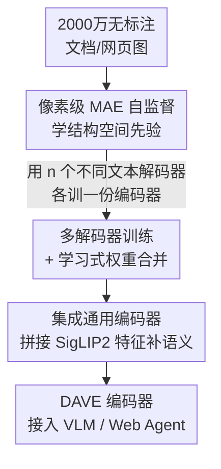

# DAVE: A VLM Vision Encoder for Document Understanding and Web Agents

**会议**: ICLR 2026  
**OpenReview**: [https://openreview.net/forum?id=kgk0NqjsoW](https://openreview.net/forum?id=kgk0NqjsoW)  
**代码**: https://github.com/Brandon3964/DAVE  
**领域**: 多模态VLM  
**关键词**: 视觉编码器, 文档理解, Web Agent, 自监督预训练, 模型合并

## 一句话总结
DAVE 针对文档/网页图像专门训练了一个 VLM 视觉编码器：先用改造过的像素级 MAE 在 2000 万无标注文档/网页图上做自监督，再用少量高质量数据做自回归监督预训练，并通过"多解码器权重合并 + 与 SigLIP2 集成"两招让编码器既懂结构空间又不丢通用语义，在文档识别、Web 定位和 Mind2Web Agent 任务上平均超过 SigLIP2 约 10.5% / 5%。

## 研究背景与动机
**领域现状**：现在的 VLM 几乎都把视觉编码器选型作为核心，主流是 CLIP/SigLIP 这类图文对比学习编码器，或 DINO 这类自监督编码器，它们在自然图像上表现很强。

**现有痛点**：这两类编码器都不适合文档和网页。对比学习编码器的底层特征缺乏文档/UI 所需的精细**结构与空间信息**（文字排版、表格线、控件位置）；DINO 式模型虽然有低层特征，但只在自然图上调优，迁移到文档、UI、图表上效果很差。结果是 VLM 在 OCR、版面解析、网页元素定位、Agent 点击这些任务上被编码器拖了后腿。

**核心矛盾**：想要专门为文档/网页训一个编码器，立刻撞上两个矛盾。其一是**数据矛盾**——高质量标注稀缺，现有标注依赖 OCR 模型，既限制规模又限制质量；其二是**通用性矛盾**——专门数据上训出的编码器结构特征很强，但会丢失大规模通用数据带来的高层语义，而且和特定文本解码器绑死，换一个 LLM 解码器就性能骤降。

**本文目标**：造一个既懂文档/网页结构空间、又保留通用视觉语义、还能即插即用接到各种 VLM/Agent 框架上的专用视觉编码器。

**切入角度**：用海量**无标注**文档/网页图做自监督来绕开标注瓶颈；用模型合并和集成把"专精"与"通用"、"绑定解码器"与"解码器无关"这两组对立调和到一个编码器里。

**核心 idea**：两阶段预训练（自监督打底 + 监督精修）造出专精编码器，再用"学习式权重合并 + 与通用编码器集成"把它变成解码器无关、语义不丢的最终编码器 DAVE。

## 方法详解

### 整体框架
DAVE 的目标是产出一个视觉编码器 $\phi$，输入文档/网页图像 $x\in\mathbb{R}^{H\times W\times 3}$，输出 patch 级特征序列供 VLM 的 LLM 主干使用。整条管线分两阶段：**Stage 1** 在 2000 万无标注图上用改造的 MAE 自监督预训练，让编码器学到强结构空间先验；**Stage 2** 在约 200 万有标注样本上做自回归监督预训练（OCR、版面抽取、网页定位），并在这一阶段引入两个关键调和手段——用多个文本解码器分别训练再做**权重合并**，得到解码器无关的专精编码器；同时把它与冻结的通用编码器 SigLIP2 做**特征集成**，补回高层语义。最终把合并、集成后的编码器作为 DAVE，接入 VLM 框架做下游任务。

### 关键设计

**1. 像素级 MAE 自监督：用直接重建原始像素稳住低方差文档图的训练**

Stage 1 想用 MAE 在海量无标注文档/网页图上学结构空间特征，但标准 MAE 在文档图上训练极不稳定。作者把原因定位到 MAE 的**逐 patch 归一化目标**：标准 MAE 在算重建损失前会对每个 patch 做归一化，$L_{\text{MAE}}=\frac{1}{|M|}\sum_{i\in M}\lVert f_\theta(\tilde{x})_i-\frac{x_i-\mu(x_i)}{\sqrt{\sigma^2(x_i)+\epsilon}}\rVert_2^2$，其中 $\epsilon=10^{-6}$。文档/网页图有一个特点——**patch 内方差极低**（大片白底、规整文字），分析图（Figure 3）显示其 inter-patch 标准差比 ImageNet 低一两个数量级，导致归一化时分母接近 $\epsilon$，目标被放大、训练发散。

解法很直接：去掉归一化，直接重建原始像素值 $L_{\text{MAE-pixel}}=\frac{1}{|M|}\sum_{i\in M}\lVert f_\theta(\tilde{x})_i-x_i\rVert_2^2$。这一改让训练稳定到可以无需额外调参就扩展到 2000 万张图。这正是文档场景特有的洞察——同样的归一化在自然图上没问题，恰恰是文档图的低方差暴露了它的数值病态。

**2. 多解码器训练 + 学习式权重合并：让编码器与文本解码器解耦**

Stage 2 把编码器塞进 VLM 用自回归监督训练后，编码器会和它配的那个文本解码器**绑死**，换一个解码器性能就大跌，无法适配各种 Web Agent 架构。作者用"模型汤"思路解耦：给定 $n$ 个预训练文本解码器 $\{\Theta_1,\dots,\Theta_n\}$，分别对齐训练出 $n$ 份结构相同的编码器 $\{\phi_1,\dots,\phi_n\}$，然后合并。

关键是合并方式不用简单平均，而是**蒸馏式学习合并系数**：把每个编码器看成 $m$ 个权重，逐权重学一组系数做加权和 $\theta^{(j)}_{\text{merge}}=\sum_{i=1}^{n}\alpha^{(j)}_i\theta^{(j)}_i$（$\alpha^{(j)}_i\in[0,1]$），合并过程冻结所有原始编码器参数，只优化新引入的系数。优化目标是让合并后特征 $z$ 对齐每个教师编码器的特征：$L_{\text{distill}}=\frac{1}{n}\sum_{i=1}^{n}\lVert\hat{z}_i-z_i\rVert_2^2$。这样得到的 $\phi^{\text{final}}_{\text{DAVE}}$ 兼容各种解码器。消融显示，这种学习式系数优于简单平均（Doc 62.8→63.4）和启发式的 Fisher Merge（60.3→63.4），且合并的 LLM 越多越好（Granite 单个 55.6 → Granite+Qwen+Phi 三个 63.4）。

**3. 集成通用编码器：拼接冻结 SigLIP2 特征补回高层语义**

只在文档/网页数据上训练会让编码器丢失通用视觉表征，而高层语义对鲁棒性同样重要。作者设计集成预训练：把一个**冻结的通用编码器** $\phi_{\text{gen}}$（实现里用 SigLIP2）和自家专精编码器 $\phi_{\text{spec}}$ 的特征直接拼接，$\phi_{\text{DAVE}}(x)=\text{Concat}(\phi_{\text{gen}}(x),\phi_{\text{spec}}(x))$。

这样做有两个好处：其一，高层语义由 $\phi_{\text{gen}}$ 负责，反而**解放** $\phi_{\text{spec}}$ 专注学低层结构与空间表征，分工更清晰；其二，在预训练阶段就把结构空间特征与高层语义**早融合**，而不是事后拼接。消融印证了这一点——用 SigLIP2 去配 DiT/Pix2Struct/Dolphin 这些专精编码器效果都很差（Doc 不到 50.3），唯有 DAVE 的集成方式拿到 63.4，说明专精侧本身的质量和融合方式都关键。这也解释了为什么 DAVE 在保住 MMMU、RealWorldQA 这类通用 VQA 能力的同时还能大幅提升文档/网页性能。

### 损失函数 / 训练策略
- **Stage 1**：ViT-L/16-384 作编码器，像素重建损失 $L_{\text{MAE-pixel}}$，batch size 4096，训练 120K 步，2000 万图（1000 万 DocFM PDF + 1000 万 Common-Web 网页截图）。
- **Stage 2**：tilting 尺寸 384，冻结 SigLIP2 作通用编码器集成，用 QWen2.5-0.5B / Phi-4-mini / Granite-3.1-3B 等多个 LLM 解码器各训一份（自回归监督，全参数训 1 epoch），约 200 万监督样本（PlotQA、ChartQA、fintabnet、Pubtables、DocFM 等 + 50 万 arXiv PDF 经 OCR 转写的识别/定位任务）。
- **权重合并蒸馏**：在无标注文档/网页图上训练合并系数 20 epoch，原编码器全程冻结。
- 下游 VLM 评测用 LLaVA 架构、Llama-3.2-3B / Qwen2.5-7B 作主干，冻结视觉编码器训 1 epoch；Mind2Web 上先在训练集微调再离线评测。

## 实验关键数据

### 主实验
视觉-语言基准（LLaVA + Llama-3.2-3B-Instruct，节选）：

| 基准 | 任务类型 | DAVE | SigLIP2 | 提升 |
|------|---------|------|---------|------|
| OCRBench | 文档 | 62.2 | 51.5 | +10.7 |
| DocVQA | 文档 | 82.1 | 72.1 | +10.0 |
| ChartQA | 文档 | 63.1 | 51.8 | +11.3 |
| Screenspot-V2 | Web 定位 | 64.5 | 40.7 | +23.8 |
| WebSRC | Web QA | 82.6 | 67.8 | +14.8 |
| MMMU | 通用 VQA | 36.6 | 36.9 | ≈持平 |

8 个文档/网页基准平均超过 SigLIP2 约 **10.5%**，且通用 VQA（MMMU、RealWorldQA）基本不掉，说明集成训练成功把结构空间特征和通用语义融到一起。

Web Agent（Mind2Web，Llama-3.2-3B，Step SR）：

| Split | DAVE | Dolphin(最强baseline) | SigLIP2 |
|-------|------|----------------------|---------|
| Cross-Task | 26.1 | 19.6 | 17.3 |
| Cross-Website | 18.0 | 13.6 | 8.7 |
| Cross-Domain | 19.1 | 14.5 | 9.7 |

DAVE 平均比最强 baseline 高约 **5%**；有趣的是 MAE/DinoV2 这类自监督编码器在导航上竟与 SigLIP2/AIMv2 相当，暗示结构空间特征在 Web 导航里比通用语义更重要。

经典文档任务（mAP / 分类准确率）：

| 模型 | DocLayNet | DocBank | RICO-SCA |
|------|-----------|---------|----------|
| SigLIP2 | 70.8 | 51.7 | **93.3** |
| DAVE | **74.1** | **56.9** | 92.8 |

DAVE 在密集文档识别/分割上全面领先，仅在偏语义的截图分类上略逊 SigLIP2（作者归因于 DAVE 隐维度翻倍、单层 MLP 头不好池化）。

### 消融实验
| 配置 | Doc | Web | 说明 |
|------|-----|-----|------|
| Scratch Decoder | 52.2 | 54.7 | 从头训文本解码器 |
| Pretrained Decoder | 55.6 | 53.0 | 换成预训练 LLM |
| + Ensemble | — | 67.7 | 加集成 SigLIP2 |
| + Model Merge (Full) | 63.4 | 68.2 | 完整 DAVE |
| w/ 简单平均合并 | 62.8 | 67.7 | 学习系数→平均 |
| w/ Fisher Merge | 60.3 | 67.0 | 学习系数→启发式 |
| 仅 1 个 LLM (Granite) | 55.6 | 53.0 | vs 三个 LLM 63.4/68.2 |
| Finetune SigLIP2 | 58.2 | 65.2 | 直接微调通用编码器 |

### 关键发现
- **像素级 MAE 的洞察最关键**：文档/网页图 inter-patch 方差远低于自然图，是标准 MAE 归一化目标发散的根因，去掉归一化才得以扩到 2000 万图。
- **学习式权重合并 > 平均/Fisher**，且合并的 LLM 解码器越多越好（55.6→62.1→63.4），印证多解码器训练确实带来解码器无关性。
- **集成融合必须两侧都强**：SigLIP2 配其他弱专精编码器（DiT/Pix2Struct/Dolphin）都拉胯（<50.3），只有 DAVE 的专精侧足够好才能融出 63.4。
- DAVE 整体（63.4/68.2）显著优于直接微调 SigLIP2（58.2/65.2），说明从头自监督学结构特征比微调通用编码器更划算。

## 亮点与洞察
- **把训练不稳定追到数据统计特性上**：不是盲目调超参，而是画出 inter-patch 方差分布，定位到文档图低方差让归一化分母趋零，再用最简单的"去归一化"解决——诊断到位，解法极简。
- **"模型汤 + 蒸馏学系数"做解码器解耦**：把编码器对解码器的过拟合，转化为一个可学习的权重融合问题，且原参数全冻结只学少量系数，代价极低却换来跨 LLM/Agent 框架的即插即用。
- **集成而非替换通用编码器**：冻结 SigLIP2 拼接的设计既补语义又"解放"专精编码器专注低层特征，这种分工思路可迁移到任何"专精 vs 通用"冲突的表征学习场景。

## 局限与展望
- **截图分类略逊 SigLIP2**：DAVE 隐维度翻倍，单层 MLP 头难以有效池化高维信息，偏语义任务上是短板。
- **监督阶段仍依赖 OCR 生成标注**：50 万 arXiv PDF 的识别/定位标签来自 OCR 模型，质量上限受 OCR 限制。
- **集成带来推理开销**：DAVE = SigLIP2 + 专精编码器双路拼接，特征维度和算量都翻倍，部署成本高于单编码器。
- 多解码器训练需要为每个 LLM 各训一份编码器，预训练成本随解码器数量线性增长。

## 相关工作与启发
- **vs Eagle / Perception Encoder**：它们把预训练视觉编码器对齐到预训练 LLM、用大规模通用数据；DAVE 则从头自监督训编码器、用多个 LLM 主干、并用领域数据造专用基础模型。
- **vs SigLIP2 / AIMv2（通用编码器）**：DAVE 不丢通用语义（靠集成 SigLIP2）的同时补上结构空间特征，文档/网页任务大幅领先。
- **vs Dolphin / Pix2Struct（专精编码器-解码器）**：这些专精模型在文档上不错但缺通用语义，配通用解码器或做通用 VQA 时掉点；DAVE 通过集成 + 合并两头兼顾。

## 评分
- 新颖性: ⭐⭐⭐⭐ 专门为文档/网页造 VLM 视觉编码器，像素级 MAE 诊断 + 学习式权重合并都有新意。
- 实验充分度: ⭐⭐⭐⭐⭐ 覆盖经典文档、VQA、Web 定位、Mind2Web Agent，多 LLM 主干 + 细致消融。
- 写作质量: ⭐⭐⭐⭐ 动机推导清晰，两阶段管线和两个调和手段讲得明白。
- 价值: ⭐⭐⭐⭐ 给文档/Web Agent 提供了即插即用的强视觉编码器，实用性高。

<!-- RELATED:START -->

## 相关论文

- [\[ICLR 2026\] LiveWeb-IE: A Benchmark For Online Web Information Extraction](liveweb-ie_a_benchmark_for_online_web_information_extraction.md)
- [\[ICLR 2026\] WebDS: An End-to-End Benchmark for Web-based Data Science](webds_an_end-to-end_benchmark_for_web-based_data_science.md)
- [\[ICLR 2026\] Multimodal Policy Internalization for Conversational Agents](multimodal_policy_internalization_for_conversational_agents.md)
- [\[CVPR 2026\] SEA-Vision: A Multilingual Benchmark for Document and Scene Text Understanding in Southeast Asia](../../CVPR2026/multimodal_vlm/sea-vision_a_multilingual_benchmark_for_comprehensive_document_and_scene_text_un.md)
- [\[CVPR 2026\] RE-VLM: Event-Augmented Vision-Language Model for Scene Understanding](../../CVPR2026/multimodal_vlm/re-vlm_event-augmented_vision-language_model_for_scene_understanding.md)

<!-- RELATED:END -->
