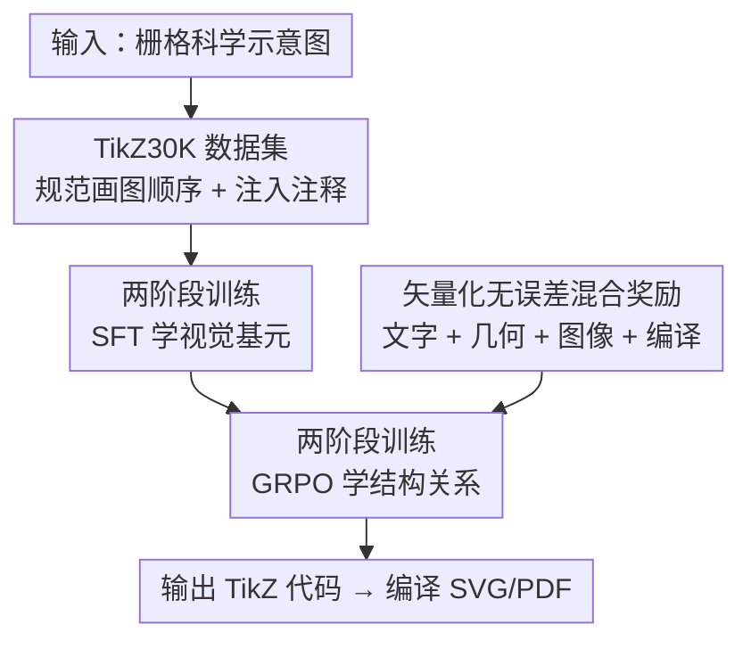

# DaVinci: Reinforcing Visual-Structural Syntax in MLLMs for Generalized Scientific Diagram Parsing

**会议**: ICLR 2026  
**OpenReview**: [https://openreview.net/forum?id=OAXECnLxuk](https://openreview.net/forum?id=OAXECnLxuk)  
**代码**: https://github.com/zengxingchen/Diagram-to-TikZCode  
**领域**: 多模态VLM  
**关键词**: 图表解析, TikZ 代码生成, 强化学习, GRPO, 矢量化奖励

## 一句话总结
DaVinci 用「SFT 先学视觉基元 + GRPO 再学结构关系」的两阶段框架训练一个 7B 的 MLLM，把科学示意图解析成可编译的 TikZ 代码，配合自建的 TikZ30K 数据集（规范画图顺序 + 注入注释）和一套从矢量化表示中无误差提取信号的混合奖励，最终在编译率与视觉保真度上反超 GPT-5、Claude-Sonnet-4 等闭源大模型。

## 研究背景与动机
**领域现状**：科学示意图（论文里的框架图、流程图、神经网络结构图等）广泛存在，但它们大多是栅格位图，无法直接编辑、复用。把位图反解析成结构化的程序表示（diagram-to-code）是打通编辑与复用的关键。在众多表示里，TikZ 因为语法声明式、数学表达能力强、又能编译成 PDF/SVG 矢量格式，成为 MLLM 做图到代码生成的首选目标，DATIkZ 系列工作已经积累了大规模的「图-TikZ 代码」数据集做监督微调（SFT）。

**现有痛点**：即便有大规模 SFT，现有 MLLM 在这个任务上仍然吃力。解析示意图要求像素级精度——要精确指定线、形状、文字等各种图形基元，还要描述它们之间的空间关系，同时严格满足 TikZ 苛刻的语法约束。纯 SFT 学到的更多是「逐 token 模仿参考代码」，难以保证编译通过和几何对齐。

**核心矛盾**：问题的根本原因有两层。其一是**数据噪声**：TikZ 这类绘图语言的渲染结果与代码书写顺序基本无关（除变量声明外），于是同一张图在训练集里可能对应多种被任意打乱顺序的代码序列，对自回归语言模型来说，相似的视觉内容映射到大量随机排列的代码，严重稀释了训练信号；而且原始代码缺乏结构/语义提示，模型对长代码序列容易逻辑不一致、漏画组件。其二是**奖励信号不可靠**：要做强化学习就得评估生成图，但常用的 OCR 抽文字、像素级 MSE/SSIM 比图，对充满符号和图形元素的示意图都误差很大，把噪声直接传进奖励里。

**本文目标**：(1) 给冷启动准备一份干净、结构化、带规划提示的高质量数据；(2) 设计一套不依赖易错 OCR / 像素度量、能精确刻画文字对齐与几何精度的奖励，让强化学习真正优化到「视觉保真 + 可编译」。

**切入角度**：作者把任务拆成两层能力——**视觉基元的识别**（线/形/文字怎么画）和**它们之间的结构关系**（怎么排布、怎么连）。前者用监督学习快速冷启动，后者用强化学习精修。同时观察到 TikZ 编译出的 PDF 本身就携带每个文字/几何对象的精确矢量元数据，可以「无误差」地取出来当奖励的真值来源。

**核心 idea**：用「SFT 学基元 + GRPO 学结构」的两阶段框架，配合规范化画图顺序、注释规划脚手架的 TikZ30K 数据，以及从矢量化表示无误差提取的混合奖励，把示意图解析做到反超闭源大模型。

## 方法详解

### 整体框架
把示意图解析形式化成一个条件序列生成任务：给定输入图像 $I_{in}$，目标是生成一段 TikZ 代码 $C_{pred}=(t_1,\dots,t_L)$，编译渲染后的图像 $I_{pred}=\text{Render}(C_{pred})$ 要忠实重建 $I_{in}$，即用参数 $\theta$ 的 MLLM 建模 $p(C_{pred}\mid I_{in})$ 并自回归解码。

整条管线分两阶段：先用自建的 TikZ30K 做监督冷启动，让基座模型（Qwen2.5-VL-7B-Instruct）学会视觉基元与语法规则，得到 DaVinci-SFT-7B；再以它初始化策略，用 GRPO 强化学习精修结构关系，奖励由「编译产物 + 矢量化表示 + 渲染图」三种模态共同构成，得到最终的 DaVinci-7B；推理时输出 TikZ 代码，可进一步编译成 SVG/PDF 供下游编辑。

### 关键设计

**1. TikZ30K：把「画图顺序」和「注释」当成被忽视的监督信号**

针对「同一张图对应多种乱序代码、稀释训练信号」这个痛点，作者复现 DATIkZ 的采集流程（从 TEX.SE、arXiv、GitHub 收集 366,075 段可编译 TikZ，严格限定 2023 年 12 月前以避免与 DATIkZv3 测试集污染），再做两层清洗：先用启发式规则剔除截断图等低质样本降到 258,421，再用 Qwen-2.5-VL-32B 打语义类别标签和 5 分质量分，只留 4-5 分的 225,648 条。

真正的创新在于识别并修复两个被低估的特征。其一是**画图顺序规范化（Code Reordering）**：TikZ 渲染与代码顺序无关，原始代码常常是「先画中心节点、突然跳去画 node 3、再倒着画 2 和 1、甚至先画边再画节点」这种对人类无所谓、但对自回归模型极其有害的乱序，作者用 Qwen3-Coder-480B 按「语义引导、逻辑递进」的绘制协议重排代码，并做重排前后渲染一致性校验。其二是**注释即规划脚手架（Comment Injection）**：原始 TikZ 是密集的低层绘图指令，缺乏结构/语义线索，于是用 LLM 系统性地补上把绘制过程拆解成有意义子任务的注释（如「从最左边开始：画第一个圆，标号 1，向右连线」），这些注释充当规划锚点，引导模型一步步完成长序列绘制、减少漏画与逻辑不一致。最终对 225,648 条按 token 长度分层抽样出 58,000 条，其中 30,000 做 SFT（29,859 条通过增强后校验，即 TikZ30K）、28,000 做 RL。

**2. 矢量化无误差的混合奖励：绕开 OCR 和像素度量**

针对「OCR 抽文字、像素度量比图都误差大、把噪声传进奖励」这个痛点，作者的核心洞察是：TikZ 编译出的 PDF 本身就以原生矢量元素保留了每个文字/几何对象的精确几何与排版元数据，因此可以用 PyMuPDF 直接读出真值，无需任何识别。混合奖励是四个互补分量的加权和（论文不为各分量设特殊权重）：

$$R_{hybrid}=R_{text}(V_{in},V_{pred})+R_{geom}(V_{in},V_{pred})+R_{img}(I_{in},I_{pred})+R_{pass}(C_{pred})$$

**空间-文字奖励 $R_{text}$** 从两图的 PDF 矢量表示里取出文字内容与包围框，先按完全相同文本贪心匹配，再对剩余元素用带自适应阈值的 Levenshtein 距离配对，一对多冲突时选 Distance-IoU（dIoU）最高的配对，最后把每对 dIoU（原范围 $[-1,1]$）映射到 $[0,1]$ 求和、按两侧元素最大数归一化：$R_{text}=\frac{1}{\max(|B_{pred}|,|B_{gt}|)}\sum_{(b_p,b_g)}\frac{\text{dIoU}(b_p,b_g)+1}{2}$。**几何奖励 $R_{geom}$** 同样从 PDF 取出线、矩形、圆等几何基元及属性，按几何类型用匈牙利算法做二分图最优一对一匹配，代价函数 $C(e_p,e_g)$ 综合归一化质心距离、相对尺寸、朝向/长宽比，再用指数衰减把代价转成相似度分并归一化：$R_{geom}=\frac{1}{\max(|E_{pred}|,|E_{gt}|)}\sum_{(e_p,e_g)}\exp(-k\cdot C(e_p,e_g))$。**图像保真奖励 $R_{img}$** 结合感知度量 DreamSim（特征空间）与裁剪后的 MSE（像素空间）。**编译成功奖励 $R_{pass}$** 不单独加分，而是反向惩罚：一旦代码编译失败，就把其余三个分量全部赋为最小值，确保不可编译代码拿到最低混合奖励。

**3. 两阶段训练：SFT 学视觉基元 + GRPO 学结构关系**

把「识别基元」和「排布结构」两层能力拆开训练，是这篇工作让 7B 小模型反超大模型的关键。第一阶段在 TikZ30K 上对 Qwen2.5-VL-7B-Instruct 全参数 SFT 两个 epoch 完成冷启动，让模型先掌握各类视觉基元与 TikZ 语法。第二阶段用 GRPO（PPO 的一个变体，通过组内相对比较估计优势、无需显式 critic 模型）精修：给定提示，当前策略采样 $G$ 个候选 TikZ 代码，每个算混合奖励 $R_{hybrid}^{(k)}$，再用组内标准化得到优势 $\hat A_k=\big(R_{hybrid}^{(k)}-\text{mean}\{R_{hybrid}^{(j)}\}\big)/\text{std}\{R_{hybrid}^{(j)}\}$，据此更新策略。RL 阶段用全局 batch 512、rollout batch 256、rollout 数 10，在 8×H100-80G 上训 500 步。这一阶段直接优化「可编译 + 视觉忠实」，把 SFT 阶段学到的基元能力组织成正确的结构关系。

### 损失函数 / 训练策略
SFT 阶段为标准的自回归语言建模目标，全参数微调 2 epoch；RL 阶段为 GRPO 目标，优势由式中的组内标准化奖励给出，混合奖励四分量等权相加，编译失败时其余分量取最小值。

## 实验关键数据

### 主实验
评测基准为 DATIkZv3 官方测试集（542 张视觉复杂多样的图）。代码层面看 Pass@1 编译率、文本编辑距离 TED、CrystalBLEU；图像层面看 DreamSim(DSIM)、SigLIP、SSIM、MSE、LPIPS。

| 模型 | Pass@1 ↑ | TED ↓ | cBLEU ↑ | DSIM ↑ | SSIM ↑ | MSE ↓ | LPIPS ↓ |
|--------|---------|-------|---------|--------|--------|-------|---------|
| Gemini-2.5-Pro-Thinking | 69.93 | 53.77 | 6.17 | 88.20 | 75.86 | 66.62 | 21.64 |
| GPT-5-Default | 72.88 | 53.17 | 3.22 | 83.78 | 73.73 | 73.57 | 25.37 |
| Claude-Sonnet-4-Thinking | 86.90 | 54.38 | 3.31 | 82.89 | 72.21 | 73.89 | 25.80 |
| Qwen2.5-VL-72B | 80.04 | 54.80 | 4.18 | 79.35 | 72.42 | 77.63 | 27.24 |
| DetikZify-V2-8B | 78.60 | 55.66 | 7.19 | 82.63 | 74.30 | 68.42 | 23.30 |
| DaVinci-SFT-7B | 84.50 | 56.21 | 7.52 | 81.15 | 72.65 | 73.90 | 26.10 |
| **DaVinci-7B** | **97.60** | 55.13 | 6.57 | 84.83 | 73.65 | **61.81** | 22.32 |

DaVinci-7B 编译率近乎满分（97.60%），超过所有开源模型，并在编译率、DSIM、MSE 等多项指标上反超 GPT-5、Claude-Sonnet-4。Gemini-2.5-Pro 在 DSIM/LPIPS 上更高，但编译率只有 69.93%（常漏掉 LaTeX 库导入或基本符号导致渲染失败），存在明显短板。

人类评测（Best-Worst Scaling）也印证：在非闭源组里 DaVinci-7B 得分 0.36 居首；在闭源组里 DaVinci-7B（-0.01）优于 GPT-5-Default（-0.13）和 Claude-Sonnet-4-Thinking（-0.35），仅次于 Gemini-2.5-Pro-Thinking（0.50）。

### 消融实验
**数据策略消融（Pass@1）**：

| 配置 | Pass@1 ↑ | 说明 |
|------|---------|------|
| Baseline: Qwen2.5-VL-7B | 59.59 | 基座 |
| + Original30K | 69.74 | 仅原始代码（未优化顺序/注释） |
| + Reordering30K | 78.78 | 加画图顺序规范化（+9.04%） |
| + TikZ30K | 84.50 | 再加注释注入（再 +5.72%） |

**奖励消融（基于 DaVinci-SFT-7B）**：

| 奖励设置 | DSIM ↑ | MSE ↓ | Texual ↑ | Geometry ↑ |
|------|--------|-------|----------|------------|
| Base ($R_{img}+R_{pass}$) | 85.00 | 64.58 | 37.23 | 41.44 |
| Base + SSIM | 84.67 | 64.89 | 37.45 | 41.87 |
| Base + $R_{text}$ | 84.85 | 63.35 | 41.58 | 42.12 |
| Base + $R_{text}+R_{geom}$ | 84.75 | 62.30 | 42.28 | 44.10 |

### 关键发现
- **画图顺序规范化贡献最大**：单独重排代码就把编译率从 69.74% 提到 78.78%（+9.04%），注释注入再加 5.72%，说明结构化数据本身就是强信号。
- **矢量化文字/几何奖励确实有效**：加入 $R_{text}$ 把文字分从 37.23 拉到 41.58，再加 $R_{geom}$ 把几何分从 41.44 拉到 44.10，且 MSE 同步下降；而加常规 SSIM 奖励几乎没有增益，印证「像素度量不如矢量基元度量」。
- **高代码相似度并非必要**：SFT 模型 cBLEU 最高，但 RL 后 DaVinci-7B 的 cBLEU 反而下降，其余所有指标却都改善——视觉等价的图可由语法多样的 TikZ 表达，严格的代码级相似度既不必要也未必可取。
- **「思考」未必有用**：开启显式推理链并不稳定提升解析效果，GLM-4.5V-Thinking 的编译率（62.92%）反而低于非思考版（67.90%）；作者推测对结构化代码生成而言，生成代码本身就是一种隐式推理。

## 亮点与洞察
- **用编译产物的矢量元数据当奖励真值**：TikZ→PDF 天然携带每个文字/几何对象的精确坐标，绕开了 OCR 和像素度量这两个噪声大户，把奖励从「估计」变成「读取」，这是把 RL 用在图到代码任务上的关键解锁点。
- **把数据噪声当一等公民来治理**：渲染顺序无关性导致的「乱序代码」是个很隐蔽的训练杀手，作者识别并用 LLM 重排+注释脚手架来根治，比单纯堆数据更有效，这个思路可迁移到任何「输出顺序自由但自回归建模」的代码/序列生成任务。
- **能力分层训练**：SFT 管基元、RL 管结构关系，让 7B 小模型在编译率上反超百倍参数的闭源模型，说明任务结构化拆解比盲目堆参数更划算。

## 局限与展望
- **剩余失败集中在密集可视化**：散点图等需要海量数据点的图，模型容易过量生成、超出上下文长度导致编译失败，这是 97.60% 之外的主要漏洞。
- **奖励依赖可编译的 PDF 矢量表示**：$R_{text}/R_{geom}$ 都建立在「能编译出 PDF」之上，对编译失败样本只能退化到最小奖励，无法提供细粒度梯度信号。
- **「思考无益」结论留作未来工作**：作者只观察到显式推理链不稳定提升，但没深入解释机制，inline 注释 vs 独立推理的取舍仍待研究。
- **数据与方法绑定 TikZ**：整套矢量化奖励依赖 TikZ→PDF 的特性，迁移到 SVG、Mermaid 等其他绘图格式需要重新设计提取管线。

## 相关工作与启发
- **vs DetikZify (DATIkZ 系列)**: 他们靠大规模 SFT + MCTS 推理提升感知相似度，本文复用其采集方法但加了画图顺序规范化与注释增强，并用 GRPO 强化学习替代纯 SFT，在编译率（97.60% vs 78.60%）上大幅领先。
- **vs SVG/图表 RL 工作（如基于像素 L2、DreamSim、CNN 特征的奖励）**: 他们的奖励难以精确刻画示意图的空间-文字对齐与几何特征，本文改用矢量化表示无误差提取文字与几何基元，奖励更精准。
- **vs 闭源大模型（GPT-5 / Claude-Sonnet-4）**: 它们通用能力强但缺乏对 TikZ 语法与结构的专门优化，常漏库导入/符号导致编译失败，本文用专门数据 + 任务专属奖励让 7B 模型在编译率与多项视觉指标上反超。

## 评分
- 新颖性: ⭐⭐⭐⭐⭐ 用编译产物矢量元数据构造无误差奖励 + 把画图顺序/注释当监督信号，两个切口都很新。
- 实验充分度: ⭐⭐⭐⭐⭐ 对比闭源/开源/专用模型，含数据与奖励双重消融及人类评测。
- 写作质量: ⭐⭐⭐⭐ 动机与方法链条清晰，公式与算法交代完整。
- 价值: ⭐⭐⭐⭐⭐ 让小模型在实用指标（编译率）上反超闭源大模型，数据与代码开源，落地价值高。

<!-- RELATED:START -->

## 相关论文

- [\[ICLR 2026\] Sparsity Forcing: Reinforcing Token Sparsity of MLLMs](sparsity_forcing_reinforcing_token_sparsity_of_mllms.md)
- [\[ICLR 2026\] Visual Self-Refine: A Pixel-Guided Paradigm for Accurate Chart Parsing](visual_self-refine_a_pixel-guided_paradigm_for_accurate_chart_parsing.md)
- [\[CVPR 2026\] RxnCaption: Reformulating Reaction Diagram Parsing as Visual Prompt Guided Captioning](../../CVPR2026/multimodal_vlm/rxncaption_reformulating_reaction_diagram_parsing_as_visual_prompt_guided_captio.md)
- [\[ICLR 2026\] InSight-o3: Empowering Multimodal Foundation Models with Generalized Visual Search](insight-o3_empowering_multimodal_foundation_models_with_generalized_visual_searc.md)
- [\[ICLR 2026\] Visual Jigsaw Post-Training Improves MLLMs](visual_jigsaw_post-training_improves_mllms.md)

<!-- RELATED:END -->
