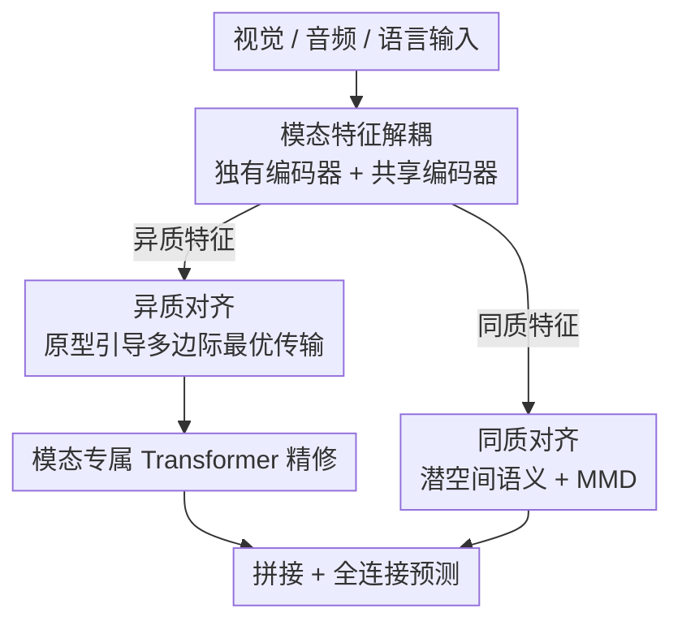

# DecAlign: Hierarchical Cross-Modal Alignment for Decoupled Multimodal Representation Learning

**会议**: ICLR2026  
**OpenReview**: [https://openreview.net/forum?id=LasUPe2UxG](https://openreview.net/forum?id=LasUPe2UxG)  
**代码**: https://taco-group.github.io/DecAlign/ （项目页）  
**领域**: 多模态VLM  
**关键词**: 多模态表示学习, 跨模态对齐, 特征解耦, 最优传输, 最大均值差异

## 一句话总结
DecAlign 把多模态特征拆成"各模态独有的异质特征"和"跨模态共享的同质特征"两路，分别用原型引导的最优传输对齐异质部分、用潜空间分布匹配 + MMD 对齐同质部分，在四个情感分析基准上稳定刷过 13 个 SOTA。

## 研究背景与动机
**领域现状**：多模态表示学习要把视觉、音频、语言这些异构模态融成统一表示，既抓住它们共享的语义，又保留各自独有的特征。主流做法是把原始多模态数据投到一个统一空间里——要么直接拼接，要么做线性变换后融合。

**现有痛点**：这种"不加区分的融合"会把模态独有的细节特征和全局共享语义搅在一起，产生**语义干扰**：某个模态的局部特征会破坏跨模态的全局关系。尤其在维度不匹配时更明显——高维、空间相关的图像特征和低维、时间相关的文本特征硬凑在一起，对齐效果很差，要么信息冗余、要么关键信息在融合中丢失。

**核心矛盾**：问题的根本在于**异质性（heterogeneity）与同质性（homogeneity）的纠缠**。模态独有的异质模式（分布、尺度、语义粒度各不相同）和跨模态共享的同质语义被绑在一起处理，导致两边都做不好——想对齐共享语义就会抹掉模态独有特征，想保留独有特征又会破坏全局一致性。

**本文目标**：把这两类特征显式解耦，再用各自合适的策略分别对齐，使得"对齐共享语义"和"保留模态独有特征"不再互相打架。

**切入角度**：作者观察到，模态独有特征虽然形态各异，但当它们指向同一个底层概念/类别时，往往携带语义上对齐的信息。所以可以引入**类别原型**作为跨模态的语义锚点，让异质特征围绕原型去对齐，而不是做不可靠又昂贵的逐点对齐。

**核心 idea**：先解耦再分层对齐——把多模态表示拆成异质/同质两路，异质路用"原型引导的多边际最优传输 + 跨模态 Transformer"做细粒度对齐，同质路用"潜空间语义匹配 + MMD 正则"做全局一致性对齐。

## 方法详解

### 整体框架
DecAlign 解决的核心问题是：多模态融合时模态独有特征和共享语义纠缠导致的语义干扰。它的整体流程是先**解耦**再**分层对齐**最后**融合预测**：给定 $M$ 个模态的输入，先用模态独有的 1D 时序卷积把所有模态对齐到相同的时序长度 $T_s$ 和维度 $d_s$，得到 $\tilde{X}_m \in \mathbb{R}^{T_s \times d_s}$；然后每个模态过一个**独有编码器** $E^{(m)}_{uni}$ 抽出异质特征 $F^{(m)}_{uni}$、过一个**共享编码器** $E_{com}$ 抽出同质特征 $F^{(m)}_{com}$。

接下来是双流对齐：异质特征走"原型引导最优传输"分支（先 GMM 建原型、再多边际最优传输对齐），同质特征走"潜空间语义对齐 + MMD 分布匹配"分支。异质特征再经过模态专属的 Transformer 做进一步精修，最后和同质特征拼接，过一个全连接层做下游预测（分类或回归）。

### 关键设计

**1. 模态特征解耦：用一个编码器拆出异质特征、另一个拆出同质特征**

针对"独有特征和共享语义纠缠"这个痛点，DecAlign 不再把原始特征一股脑投到统一空间，而是为每个模态配一个独有编码器 $E^{(m)}_{uni}$ 抽异质特征 $F^{(m)}_{uni}=E^{(m)}_{uni}(\tilde{X}_m)$，再配一个所有模态共享的编码器 $E_{com}$ 抽同质特征 $F^{(m)}_{com}=E_{com}(\tilde{X}_m)$，所有编码器输出同维度以保证兼容。为了让两路真的分得开，作者没有去建分布或算互信息（太贵），而是直接用余弦相似度做正交约束，最小化两路特征的重叠：

$$L_{dec}=\sum_{m=1}^{M}\frac{F^{(m)}_{uni}\cdot(F^{(m)}_{com})^{T}}{\|F^{(m)}_{uni}\|\,\|F^{(m)}_{com}\|}$$

这一步是后续"分而治之"对齐的前提——只有先拆开，才能对异质、同质各下不同的药。

**2. 异质对齐：原型引导的多边际最优传输，做细粒度跨模态对齐**

模态独有特征在空间结构、尺度、噪声、密度上差异巨大，逐点对齐既不可靠又昂贵。作者的思路是引入类别原型当语义锚点：先用**高斯混合模型（GMM）**对每个模态的独有特征建模，原型由各高斯分量的均值和协方差表示 $P_m=\{(\mu^1_m,\Sigma^1_m),\dots,(\mu^K_m,\Sigma^K_m)\}$，其中分量数 $K$ 设为下游任务的类别数；GMM 用标准 EM 算法拟合，软分配权重 $w^n_m(k)$ 表示样本属于第 $k$ 个分量的概率。

有了原型后，用**多边际最优传输**在所有模态的原型之间建匹配。跨模态原型匹配代价同时考虑均值距离和协方差差异：$C_{i,j}(k_i,k_j)=\|\mu^{k_i}_i-\mu^{k_j}_j\|^2+\mathrm{Tr}(\Sigma^{k_i}_i+\Sigma^{k_j}_j-2(\Sigma^{k_i}_i\Sigma^{k_j}_j)^{1/2})$，优化目标在满足边际分布约束下最小化总传输代价并加熵正则 $T^*=\arg\min_T\sum_k T(k)\cdot C(k)+\lambda\sum_k T(k)\log T(k)$。最终异质对齐损失 $L_{hete}$ 由两项组成：全局的最优传输项 $L_{OT}$（对齐各模态原型分布）和局部的原型校准项 $L_{Proto}$（把样本拉向其它模态对应原型），$L_{Proto}=\frac{1}{N}\sum_n\sum_k w^n_i(k)\|F^n_i-\mu^k_{j\neq i}\|^2$。这样同时抓住全局和局部关系，比逐点对齐更鲁棒。

**3. 同质对齐：潜空间语义匹配 + MMD 分布校正，保证共享语义一致**

同质特征虽然共享语义，但分布上仍有全局偏移和不一致。作者分两步处理。第一步**潜空间语义对齐**：把模态共享特征近似为高斯 $Z^{m_i}_{com}\sim N(\mu^{m_i}_{com},\Sigma^{m_i}_{com},\Gamma^{m_i}_{com})$，特别引入**偏度（skewness）** $\Gamma$ 来刻画分布的不对称性（捕捉非高斯的语义变化），然后对齐各模态的均值、协方差、偏度三阶统计量：$L_{sem}=\frac{1}{M(M-1)}\sum_{i<j}(\|\mu^{m_i}_{com}-\mu^{m_j}_{com}\|^2+\|\Sigma^{m_i}_{com}-\Sigma^{m_j}_{com}\|^2_F+\|\Gamma^{m_i}_{com}-\Gamma^{m_j}_{com}\|^2)$。

第二步**跨模态分布对齐**：用概率分布编码器（PDE）在潜空间编码特征分布，再用**最大均值差异（MMD）**度量跨模态分布距离——把分布映到再生核希尔伯特空间（RKHS），比较均值嵌入的差异 $L_{MMD}=\frac{2}{M(M-1)}\sum_{i<j}[\mathbb{E}[k(x,x')]+\mathbb{E}[k(y,y')]-2\mathbb{E}[k(x,y)]]$，核函数取高斯核。两步合起来 $L_{homo}=L_{sem}+L_{MMD}$，先做语义对齐再做分布校正，构成分层的同质对齐机制。这种非参数核方法不依赖先验，还能捕捉高阶统计性质，相比只对齐均值的方法更细。

**4. 模态专属 Transformer 融合与预测：对齐后再精修，兼顾共享语义和模态独有线索**

前面的对齐已经把异质特征放进语义一致的空间，但这些表示还含有丰富的模态内信息（语言的句法结构、视觉的空间布局、音频的时序模式）值得进一步精修。作者为每个模态配一个专属 Transformer 当"模态感知精修器"——因为表示空间已被对齐损失正则化，分开用 Transformer 不会破坏对齐。精修后的异质特征和同质特征拼接，过全连接层出预测。总目标为 $L_{total}=L_{task}+L_{dec}+\alpha L_{hete}+\beta L_{homo}$，其中 $L_{task}$ 是任务损失（分类用交叉熵、回归用 MSE），$\alpha,\beta$ 是两路对齐的权衡超参。

## 实验关键数据

### 主实验
在 CMU-MOSI、CMU-MOSEI、CH-SIMS、IEMOCAP 四个多模态情感/情绪数据集上，与 13 个 SOTA 比较，结果取 5 次独立运行平均：

| 数据集 | 指标 | DecAlign | 之前最好 | 说明 |
|--------|------|------|----------|------|
| CMU-MOSI | MAE↓ / Acc-2↑ / F1↑ | 0.735 / 85.75 / 85.82 | 0.744 / 83.24 / 83.55 (DMD) | Acc-2 提升约 2.5 个点 |
| CMU-MOSEI | MAE↓ / Acc-2↑ / F1↑ | 0.543 / 86.48 / 86.07 | 0.561 / 84.17 / 83.88 (DMD) | F1 提升约 2.2 个点 |
| IEMOCAP (六类) | WAcc↑ / WAF1↑ | 73.35 / 73.43 | 72.25 / 72.17 (CGGM) | 加权指标稳定领先 |
| CH-SIMS | MAE↓ / F1↑ | 0.403 / 81.85 | 0.413 / 80.41 (ReconBoost) | 中文数据集同样最优 |

DecAlign 在所有数据集、所有指标上都拿到最好或并列最好，对连续目标值的细微变化捕捉更准，离散类别区分也更清晰。

### 消融实验
在 MOSI / MOSEI 上做两组消融（满配 MOSI MAE 0.735 / F1 85.82，MOSEI MAE 0.543 / F1 86.07）：

| 配置 | MOSI MAE↓ / F1↑ | MOSEI MAE↓ / F1↑ | 说明 |
|------|------|------|------|
| 满配 | 0.735 / 85.82 | 0.543 / 86.07 | 完整模型 |
| w/o Homo | 0.747 / 84.46 | 0.562 / 84.74 | 去同质对齐，小幅掉点 |
| w/o Hete | 0.754 / 84.03 | 0.588 / 84.37 | 去异质对齐，掉点更大 |
| w/o Hete & Homo | 0.784 / 81.92 | 0.632 / 82.22 | 两路都去，大幅退化 |
| w/o MFD（全去） | 0.794 / 81.56 | 0.624 / 81.87 | 连解耦也去 |

对齐策略细分消融（Proto-OT / 跨模态 Transformer CT / 语义 Sem / MMD）显示去掉原型最优传输（w/o Proto-OT）退化最明显（MOSEI F1 降到 85.03、MAE 升到 0.624），印证细粒度异质对齐是主力。

### 关键发现
- **异质对齐贡献大于同质对齐**：去掉 Hete 的掉点（MOSEI MAE 0.543→0.588）比去掉 Homo（→0.562）更大，说明模态独有特征的干扰是融合质量的主要瓶颈。
- **解耦 + 分层对齐缺一不可**：两路全去时性能大幅退化（MOSI F1 85.82→81.92），证明"先拆开、再分别对齐"的设计是有机整体，不是简单堆模块。
- **极端情感类上更稳**：混淆矩阵显示，在 -3/+3 这类极端情感和 -2/+2 相邻类上，DecAlign 比 MulT/MISA/DMD 显著减少误判，对角线更集中。

## 亮点与洞察
- **"解耦优先"的思路很干净**：把"对齐共享语义"和"保留模态独有"这对矛盾，从"在统一空间里硬调和"变成"先物理拆成两路、再各下各的药"，从根上回避了语义干扰。这个 decouple-then-align 范式可迁移到任何模态纠缠严重的融合任务。
- **用原型 + 最优传输做异质对齐很巧**：逐点对齐异构特征又贵又不靠谱，改成"GMM 建类别原型当锚点 + 多边际 OT 在原型间匹配"，既降了复杂度又保住了类别语义结构，多边际 OT 还能一次性对齐多个模态。
- **同质对齐引入偏度（三阶统计量）**：大多数分布对齐只对均值/协方差，DecAlign 额外对齐偏度来捕捉非高斯的不对称语义变化，这是个容易被忽略但有效的细节，可借鉴到其它分布匹配场景。

## 局限与展望
- 论文主要在多模态情感/情绪分析（视觉+音频+语言）上验证，是否能推广到检索、生成、自动驾驶等更异构、更大规模的多模态场景未充分检验。
- GMM 的分量数 $K$ 直接绑定下游任务类别数，对类别数很大或无明确类别（如回归/开放域）的任务，原型机制可能退化或需要重新设计。
- 多边际最优传输在模态数 $M$ 增大时，原型组合空间会指数膨胀，论文实验只到 3 个模态，更高模态数下的可扩展性存疑。
- 引入了解耦、异质、同质三类损失 + 模态专属 Transformer，组件多、需调 $\alpha,\beta$ 等超参，工程复杂度和训练成本不低。

## 相关工作与启发
- **vs MISA / DMD（特征解耦类）**：它们也把特征拆成不变/独有或做图蒸馏来缓解模态干扰，但主要做全局对齐，忽略 token 级不一致；DecAlign 用双流分层对齐（局部原型传输 + 全局统计匹配），从局部到全局都管，细粒度融合更强。
- **vs MulT / Self-MM / PMR（Transformer 跨注意力类）**：它们假设一个共享潜空间、靠跨注意力做全局融合，强势模态容易盖过弱模态导致信息丢失；DecAlign 显式解耦异质/同质特征再分别对齐，缓解了模态主导问题。
- **vs CLIP / Uni-Code（共享表示类）**：这类靠大规模对比学习对齐到统一空间，存在过度对齐、抹掉模态独有特征的风险；DecAlign 用解耦保住模态独有性，同时用 MMD 保证语义一致，在"对齐"和"保独有"间做了更精细的取舍。

## 评分
- 新颖性: ⭐⭐⭐⭐ decouple-then-align 范式 + 原型引导多边际 OT 组合清晰，单个组件多为已有技术的巧妙拼装
- 实验充分度: ⭐⭐⭐⭐ 四数据集、13 个 SOTA、两组消融 + 混淆矩阵分析，但局限在情感分析场景
- 写作质量: ⭐⭐⭐⭐ 动机—方法—实验逻辑顺畅，公式完整，框架图清楚
- 价值: ⭐⭐⭐⭐ 解耦 + 分层对齐的设计思路对多模态融合有普适借鉴意义

<!-- RELATED:START -->

## 相关论文

- [\[ACL 2026\] CodeBind: Decoupled Representation Learning for Multimodal Alignment with Unified Compositional Codebook](../../ACL2026/multimodal_vlm/codebind_decoupled_representation_learning_for_multimodal_alignment_with_unified.md)
- [\[ICLR 2026\] SpectralGCD: Spectral Concept Selection and Cross-modal Representation Learning for Generalized Category Discovery](spectralgcd_spectral_concept_selection_and_cross-modal_representation_learning_f.md)
- [\[CVPR 2026\] Decoupled and Reusable Adaptation for Efficient Cross-Modal Transfer](../../CVPR2026/multimodal_vlm/decoupled_and_reusable_adaptation_for_efficient_cross-modal_transfer.md)
- [\[NeurIPS 2025\] On the Value of Cross-Modal Misalignment in Multimodal Representation Learning](../../NeurIPS2025/multimodal_vlm/on_the_value_of_cross-modal_misalignment_in_multimodal_representation_learning.md)
- [\[ICLR 2026\] Decoupling Primitive with Experts: Dynamic Feature Alignment for Compositional Zero-Shot Learning](decoupling_primitive_with_experts_dynamic_feature_alignment_for_compositional_ze.md)

<!-- RELATED:END -->
