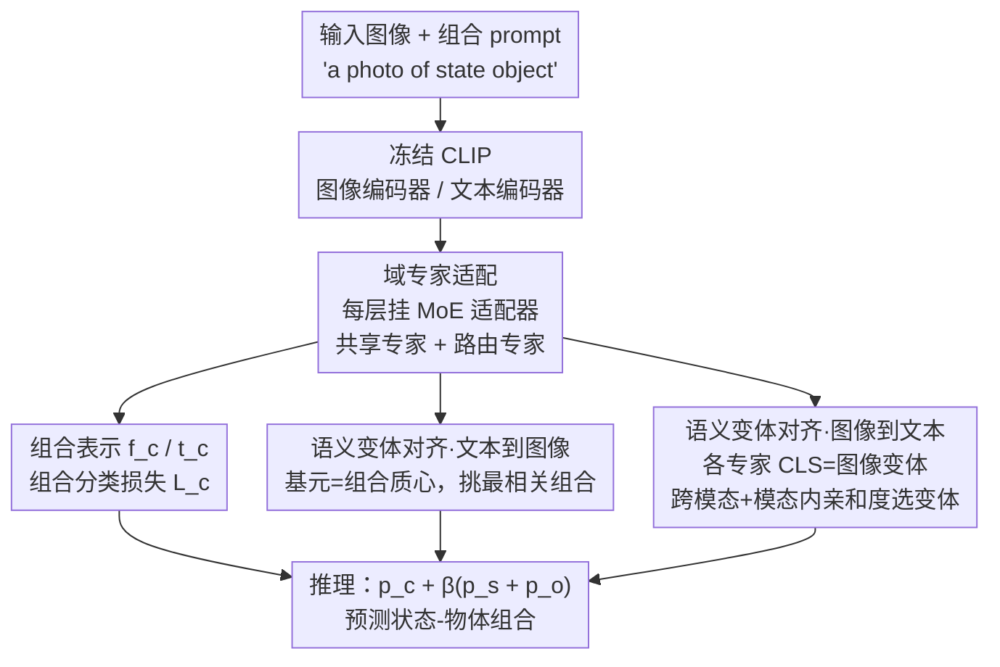

# Decoupling Primitive with Experts: Dynamic Feature Alignment for Compositional Zero-Shot Learning

**会议**: ICLR2026  
**OpenReview**: [https://openreview.net/forum?id=hUtTGobe1r](https://openreview.net/forum?id=hUtTGobe1r)
**代码**: 待确认  
**领域**: 多模态VLM / 组合零样本学习  
**关键词**: 组合零样本学习, 混合专家, CLIP, 基元解耦, 跨模态对齐

## 一句话总结
针对组合零样本学习（CZSL）中"同一个基元在不同组合里语义会变"的痛点，提出 EVA——用混合专家（MoE）适配器把基元拆成多个语义变体来学，再用语义变体对齐挑出与图像最匹配的那个变体做细粒度跨模态匹配，在三个基准的闭世界/开世界设定上都刷到 SOTA。

## 研究背景与动机
**领域现状**：组合零样本学习（Compositional Zero-Shot Learning, CZSL）要做的事是：从训练时见过的"状态-物体"组合（如 *old man*、*young dog*）里学到状态（state）和物体（object）这两类**基元**（primitive）的知识，然后去识别测试时从没见过的新组合。近两年主流做法是借 CLIP 这类预训练视觉-语言模型，用对比损失把"图像组合"和"文本组合 prompt"在嵌入空间里对齐。

**现有痛点**：这些方法几乎都给每个基元学**一个固定的原型表示**（single prototype），这个原型在所有组合语境里共享。但基元有"一词多义"（primitive polysemy）的本质——同一个 *old* 在 *old man*、*old street*、*old book* 里的视觉表现差别巨大，一个静态原型根本同时装不下这些语义变体。结果是细粒度的"基元↔组合"拓扑结构被打乱，语义被纠缠在一起，组合嵌入的质量被它底下"被压扁的基元建模"反过来拖累。

**核心矛盾**：现有工作隐含假设"基元嵌入是静态、与语境无关的固定锚点"，而真实情况是基元**语义异质、随语境而变**。这个一对多（one-to-all）的约束，是限制 CZSL 组合泛化能力（尤其开世界下基元以未见方式自由组合时）的根因。

**本文目标**：让基元特征能**动态适配**它所在组合的不同语义变体，并在此基础上做**细粒度**的图像-基元匹配，而不是把所有变体硬塞进一个原型、再做一对多的粗对齐。

**切入角度**：作者借鉴混合专家（Mixture-of-Experts, MoE）范式——MoE "把不同输入路由给专门的专家"这件事，天然契合 CZSL "基元含义随组合语境剧烈变化"的难题，每个专家可以专攻基元的一个语义侧面。作者强调这不是单纯移植一个更强的架构，而是用专家分工去**显式**应对组合学习里固有的语义多变性。

**核心 idea**：用 MoE 适配器把基元从"一个原型"解耦成"多个语义变体专家"来学（domain-expert adaption），再用"语义变体对齐"（semantic variant alignment）从这些变体里挑出与当前图像/文本最相关的那个去做匹配，从而把粗糙的一对多对齐换成细粒度的"局部到局部"对齐。

## 方法详解

### 整体框架
EVA 的骨架是冻结的 CLIP 图像编码器 $E_v$ 和文本编码器 $E_t$，在它们之上插两件事：**域专家适配（domain-expert adaption）**负责"怎么把基元学好"，**语义变体对齐（semantic variant alignment）**负责"怎么把图像和基元细粒度对上"。

具体地，图像走 $E_v$、文本组合 prompt（初始化为 *"a photo of state object"*）走 $E_t$，两条编码器的**每一层**都并行挂一个 MoE 适配器，把每个 token 动态分配给若干专家，得到高质量的图像表示 $f_c$ 和文本组合表示 $t_c$，先用一个标准的组合分类损失 $\mathcal{L}_c$ 把二者对齐。然后语义变体对齐分两路走：**文本到图像（text-to-image）**把基元文本特征看作所属组合特征的"质心"，用局部组合分布去挑最相关的个体；**图像到文本（image-to-text）**把图像编码器最后一层各专家输出的 CLS token 当作"图像特征变体"，用跨模态/模态内亲和度选出与状态/物体文本最匹配的那个变体当基元视觉特征。推理时把组合分数和状态、物体分数加权融合出最终预测。

### 关键设计

**1. 域专家适配：用 MoE 适配器把"一个基元原型"拆成多个语义专家**

这一招直接对着"单原型装不下基元多义性"的痛点。在图像和文本编码器的每一层，作者并行于前馈网络（FFN）挂一个 MoE 适配器，由一个路由器 $R$ 和多个专家 $\{E_i\}_{i=0}^{N_E}$ 组成。关键的两点设计：其一，每个专家都用轻量的 LoRA 实现（两个可训练矩阵 $A\in\mathbb{R}^{r\times d}$、$B\in\mathbb{R}^{d\times r}$，$r\ll d$），既省参数又防止在 CZSL 这种小数据集上过拟合；其二，专门指定一个**共享专家 $E_0$** 学通用知识，其余**路由专家**只学领域专属知识，避免多专家协作时的知识冗余。给定第 $j$ 层 token 嵌入 $h_j$，路由器先算 token 对各专家的亲和度并取 TopK：

$$G = \mathrm{Softmax}(\mathrm{TopK}(R(h_j))), \quad E_i = B_i A_i, \quad h_{j+1} = \sum_{i=1}^{N_e} G_i E_i(h_j) + E_0(h_j)$$

即被选中的 $K$ 个路由专家加权、再恒加上共享专家的输出。这样每个专家专攻语义相近的一类 token（如颜色这种 in-domain 知识），在 token 级别把基元学深，而不是像 Troika 那样用单一专家模块囫囵处理所有 token。整套是端到端的，比那些挂在 CLIP 后面的"后缀模块"更高效灵活。

**2. 语义变体对齐·文本到图像：把基元当组合质心，挑局部最相关的组合个体**

text-to-image 这一路解决的是"基元文本侧怎么不被一对多对齐拖累"。作者的观察是：既然组合都归属于各自的状态集和物体集，那基元特征其实可以看作组合特征的**质心**——于是不用显式维护一堆特征变体，就能间接捕获细粒度的基元语义。具体做法是：对状态 $\hat{s}$，在所有含该状态的组合里取**匹配分最高**的那个作为图像-状态匹配分

$$p_s(\hat{s}\mid x) = \max_{c_{\hat{s},o}} p_c(c_{\hat{s},o}\mid x)\cdot \tau_s$$

其中 $\tau_s>0$ 是可训练系数用来调状态概率分布；物体侧 $p_o$ 同理。这等于用"局部组合分布"去选与图像最贴的具体个体，而不是拿一个全局原型做粗匹配，再以交叉熵 $\mathcal{L}_h$（含 $\mathcal{L}_s$、$\mathcal{L}_o$）监督基元识别。

**3. 语义变体对齐·图像到文本：把各专家 CLS 当图像变体，用双重亲和度选出最匹配的那个**

image-to-text 这一路补图像侧的细粒度。由于多个专家从不同表示子空间抽语义，图像编码器**最后一层**各专家输出的 CLS token 天然就是一组**图像特征变体** $\{v_i\}_{i=0}^{N_e}$，每个描述输入图像的一个语义侧面。要从中选出最该当基元视觉特征的那个，作者设计了**双重亲和度**：跨模态亲和度 $A_s = V t_s^\top$（变体与状态文本 $t_s$ 的相似度，$t_s$ 由 prompt *"a photo of state"* 编码而来），模态内亲和度 $A_v = V f_c^\top$（变体与图像整体特征 $f_c$ 的相似度，用来排除偏离主语义太远的变体），最后综合

$$A_S = A_s + \alpha A_v, \quad f_s = \arg\max_{v_i}\, a^s_i$$

按综合分挑出状态视觉特征 $f_s$（物体 $f_o$ 同理），再算 image-to-text 的基元概率 $p^v_h$ 并以 $\mathcal{L}^v_s$、$\mathcal{L}^v_o$ 监督。注意这一路依赖标签信息，**只在训练时用**，作用是用恒定的状态/物体信息把图像表示空间在训练期"精修"得更结构化，缩小可见集与不可见集之间的鸿沟。

### 损失函数 / 训练策略
总目标把组合分类损失和两路变体对齐损失加权相加：

$$\mathcal{L} = \mathcal{L}_c + \lambda_1(\mathcal{L}_s + \mathcal{L}_o) + \lambda_2(\mathcal{L}^v_s + \mathcal{L}^v_o)$$

推理时把组合分数与状态、物体分数融合做最终组合预测：

$$\hat{c}_{s,o} = \arg\max_{c_{s,o}\in C_{test}} p_c(c_{s,o}\mid x) + \beta\big(p_s(s\mid x) + p_o(o\mid x)\big)$$

其中 $\beta$ 设为 $0.5$。

## 实验关键数据

### 主实验
在 MIT-States、UT-Zappos、C-GQA 三个数据集、闭世界与开世界两种设定上对比。下表为**闭世界**主结果（AUC / HM，越高越好），"之前 SOTA"取各数据集上最强的已有方法：

| 数据集 | 指标 | EVA(本文) | 之前SOTA | 提升 |
|--------|------|-----------|----------|------|
| MIT-States | AUC / HM | 24.0 / 41.0 | 23.8 / 40.7 (CLUSPRO) | +0.2 / +0.3 |
| UT-Zappos | AUC / HM | 50.2 / 60.2 | 46.6 / 58.5 (CLUSPRO) | +3.6 / +1.7 |
| C-GQA | AUC / HM | 18.8 / 36.9 | 15.3 / 33.3 (LOGICZSL) | +3.5 / +3.6 |

开世界设定下同样领先：UT-Zappos AUC 40.2（+0.7）、C-GQA AUC 5.6（论文 abstract 称 C-GQA 开世界 AUC 增益 +2.6%，⚠️ 具体口径以原文为准）。提升在**最大、最难**的 C-GQA 上尤其明显，说明显式建模基元语义变体在组合空间庞大时收益更大。

### 消融实验
核心组件消融（C-GQA 闭世界，AUC / HM）：

| 配置 | AUC / HM | 说明 |
|------|----------|------|
| BASELINE | 10.4 / 26.9 | 冻结 CLIP + 组合对齐 |
| + 域专家适配 | 17.2 / 35.5 | 只加 MoE 适配器 |
| + 语义变体对齐 | 12.1 / 29.8 | 只加变体对齐 |
| 域专家适配 + 语义变体对齐 | 18.8 / 36.9 | 完整 EVA |

变体对齐内部逐步消融（C-GQA，AUC）：BASELINE 17.2 → +文本到图像对齐 18.0 → +跨模态亲和度 18.5 → +模态内亲和度 18.8，两路、两种亲和度各有贡献且能叠加。

### 关键发现
- **域专家适配是主力**：单加它 AUC 从 10.4 飙到 17.2（+6.8），是单加语义变体对齐（+1.7）的数倍；但两者合起来还能再涨到 18.8，说明"先把基元学好"和"再细粒度对齐"是互补而非替代。
- **专家配置有甜点**：共享+路由专家拆成 **1+8** 最优（AUC 18.8）；去掉共享专家（0+8）、或共享专家增多（2+8）、或对半分（4+4）都更差，印证"一个共享专家学通用、其余专精"的设计；路由专家数也是 8 个最好（6 或 10 都掉点）。
- **额外正则反而有害**：在域专家适配上再加 semantic isolation 或 load balance 这类常见 MoE 正则，AUC 反而从 18.8 降到 18.5 / 18.0，说明 CZSL 这种小数据场景不宜照搬大模型 MoE 的负载均衡那套。

## 亮点与洞察
- **把 MoE 当"语义解耦器"而非"扩容器"**：常规 MoE 是用来无脑加容量，这里却是任务驱动地用专家分工去对应"基元一词多义"，每个专家专攻一个语义侧面——这个映射很自然，也是论文最"啊哈"的地方。
- **基元=组合质心的观察很巧**：text-to-image 这一路不用显式维护一堆变体，靠"组合归属于状态/物体集、基元即质心"就间接拿到细粒度基元特征，省事又自洽。
- **LoRA 化的轻量专家**：每个专家只是一对低秩矩阵，既让多专家在小数据集上不过拟合，又保持端到端高效，可直接迁移到其他"想用 MoE 但数据不多"的微调场景。
- **训练-only 的图像到文本对齐**：用标签信息在训练期精修图像表示空间、推理时丢掉，是一种"用监督把表示空间整形、不增加推理负担"的可复用 trick。

## 局限与展望
- 方法强依赖冻结 CLIP 的表示质量，CLIP 没覆盖好的状态/物体（如非常细粒度或长尾的视觉概念）可能受限于基础表示而非本文模块。
- 专家数、TopK、$\alpha$/$\lambda_1$/$\lambda_2$/$\beta$ 等超参较多，消融显示对专家配置敏感（1+8 是甜点），跨数据集的最优配置是否稳定、调参成本如何，论文着墨不多。
- image-to-text 对齐只在训练用、需要标签，开世界里这部分监督信号对"完全未见基元"能泛化到什么程度，仍是值得深究的点。
- 共享+路由的专家划分目前是人为指定（一个共享），是否能让模型自适应决定共享/专精比例，是一个自然的改进方向。

## 相关工作与启发
- **vs CSP / Troika / GIPCOL（单原型路线）**：CSP 给每个基元学一个可学 prompt、Troika 用单一跨模态牵引模块、GIPCOL 用图 prompt 但只盯组合级关系——它们都默认基元是静态单原型；EVA 用 MoE 把基元拆成多个语义变体专家，在 token 级把基元学深，直接打在"单原型装不下多义性"上。
- **vs CLUSPRO / LOGICZSL（近期 SOTA）**：二者在 MIT-States/UT-Zappos/C-GQA 上是此前最强，EVA 在三者上 AUC 全面超出，且在最大的 C-GQA 上优势最大，说明"显式建模基元语义变体"在组合空间越大越值钱。
- **vs 通用 MoE / 概念表示学习（Mixtral、CLIP/BLIP/LLaVA）**：通用 MoE 做的是动态 token 路由扩容、视觉概念学习靠文本监督学通用特征；EVA 不同在于用**语义变体的监督**而非单纯文本监督来增强基元表达力，目标是跨模态的细粒度基元对齐。

## 评分
- 新颖性: ⭐⭐⭐⭐ 首次把 MoE 作为"基元语义解耦器"引入 CZSL，动机扣题、不是简单移植
- 实验充分度: ⭐⭐⭐⭐ 三数据集×闭/开世界全覆盖，组件/专家配置/亲和度消融详尽
- 写作质量: ⭐⭐⭐⭐ 动机—方法—消融逻辑清晰，公式完整，图示到位
- 价值: ⭐⭐⭐⭐ 在三基准刷新 SOTA，轻量 LoRA 专家 + 变体对齐的范式对小数据 MoE 微调有迁移价值

<!-- RELATED:START -->

## 相关论文

- [\[CVPR 2026\] FlowComposer: Composable Flows for Compositional Zero-Shot Learning](../../CVPR2026/multimodal_vlm/flowcomposer_composable_flows_for_compositional_zeroshot_learning.md)
- [\[CVPR 2026\] Bridging the Modality Gap in Compositional Zero-Shot Learning via Sparse Alignment and Unimodal Memory Bank](../../CVPR2026/multimodal_vlm/bridging_the_modality_gap_in_compositional_zero-shot_learning_via_sparse_alignme.md)
- [\[NeurIPS 2025\] TOMCAT: Test-time Comprehensive Knowledge Accumulation for Compositional Zero-Shot Learning](../../NeurIPS2025/multimodal_vlm/tomcat_test-time_comprehensive_knowledge_accumulation_for_compositional_zero-sho.md)
- [\[ICLR 2026\] Reversible Primitive–Composition Alignment for Continual Vision–Language Learning](reversible_primitivecomposition_alignment_for_continual_visionlanguage_learning.md)
- [\[ICLR 2026\] Memory-Free Continual Learning with Null Space Adaptation for Zero-Shot Vision-Language Models](memory-free_continual_learning_with_null_space_adaptation_for_zero-shot_vision-l.md)

<!-- RELATED:END -->
