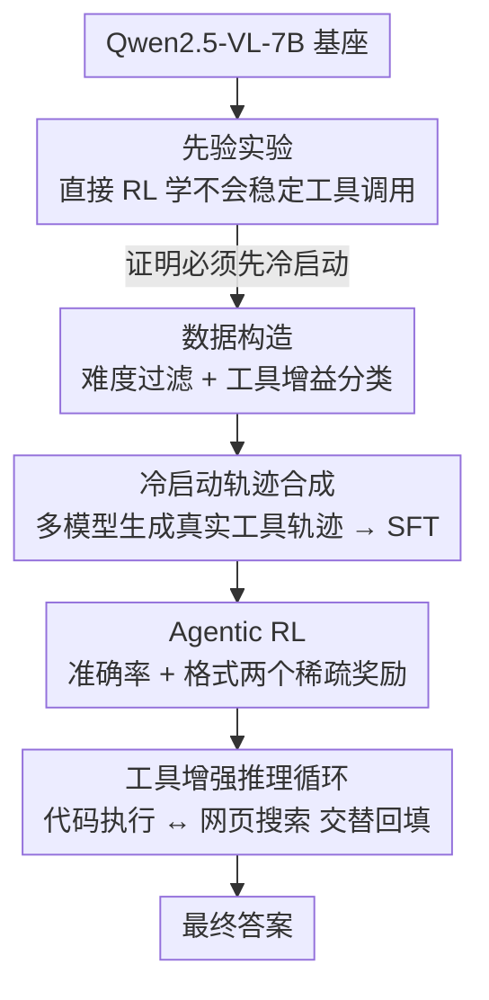

# DeepEyesV2: Toward Agentic Multimodal Model

**会议**: ICLR2026  
**OpenReview**: [https://openreview.net/forum?id=yDKawwfJ5O](https://openreview.net/forum?id=yDKawwfJ5O)  
**代码**: 项目页 https://visual-agent.github.io/  
**领域**: 多模态VLM / Agent / 工具调用  
**关键词**: agentic 多模态, 工具调用, 冷启动SFT, 强化学习, 代码执行, 网页搜索

## 一句话总结
DeepEyesV2 想把"调用外部工具"真正织进多模态模型的推理过程：让模型在一条推理轨迹里自主决定何时写 Python 代码、何时发起网页搜索，并把工具输出回填继续推理；作者发现直接 RL 学不会稳定的工具调用，于是用"冷启动 SFT + 强化学习"两阶段训练，在感知、数学推理、搜索三类基准上都拿到一致提升（如 MathVerse +7.1、MMSearch 63.7% 远超 53.8% 的专用搜索模型）。

## 研究背景与动机
**领域现状**：当前多模态大模型（MLLM，如 Qwen2.5-VL、InternVL3、LLaVA-OneVision）在感知与图文理解上已经很强，但它们基本是"被动"的——读图、读文、给答案，整个过程发生在模型内部，不会主动去外部世界取证据。OpenAI 的 o3 提出了"thinking with image"（边推理边操作图像）的范式，引发一批复现工作，但这些工作要么只支持感知任务（如裁剪定位）、不支持复杂推理或搜索，要么工具集非常有限。

**现有痛点**：作者把缺失的能力分成两类。其一是**操作类工具**：现有模型不能对视觉或数值数据做复杂操作，比如细粒度的图像裁剪/测量、定量计算，这限制了它们对图像细节的推理和解数学题的能力。其二是**信息检索类工具**：模型无法主动获取最新外部知识，导致结论过时、或者给不出可验证来源。DeepEyes、Thyme、PyVision 等前作各补了一块（裁剪 / 代码操作图像），但仍局限在图像操作上，碰到知识密集型问题就束手无策。

**核心矛盾**：一个真正"agentic"的多模态模型，需要把**程序化图像操作、数值计算、外部检索**统一进同一个推理回路，让它们能交替组合；而现有方法把工具当成彼此孤立的模块，且只有单一工具，离"自主决定何时、用哪个工具"还很远。

**切入角度与核心 idea**：作者先做了个关键的先验实验——直接照搬 DeepEyes 的纯 RL 方案在 Qwen2.5-VL 上训，结果模型要么写出跑不通的代码、最后干脆放弃工具只输出短推理链，要么在加了"用工具就给奖励"后学会 reward hacking（每次只产一个全是注释的占位代码块）。这说明**现有 MLLM 的内在工具能力太弱，纯 RL 没法从零长出稳定工具调用**。由此推出核心 idea：先用精心构造的冷启动数据做 SFT 把"会用工具"的模式打进去，再用 RL 去精修工具调用的时机与组合——并把数据构造本身（难度过滤 + 工具增益分类）当成与训练同等重要的一环。

## 方法详解

### 整体框架
DeepEyesV2 要解决的是"如何造一个能自主调用工具的多模态模型"，作者从**训练策略、数据构造、评测**三个角度系统地回答。整条管线可以理解成两层：一层是**推理时**模型如何工作——给定图像 + 用户问题，模型先生成初始推理计划并判断这道题能否靠内部推理直接解决，若需要工具就发出可执行 Python 代码或网页搜索请求，工具输出（变换后的图像、数值、数组、图表、执行日志，或搜索返回的网页缩略图/标题/摘要）被转成"观测"追加进上下文，模型据此继续推理、可能再次调用工具，如此"推理—调用—整合"地循环直到给出最终答案。另一层是**训练时**如何把这套能力教会模型：先用先验实验证明纯 RL 不行，再构造高质量数据集、做冷启动 SFT 建立基本工具模式，最后用 agentic RL 进一步强化。

下面的框架图按训练管线自上而下展开（基座 → 先验实验 → 数据构造 → 冷启动 → RL → 推理循环），最后落到推理时的工具增强循环：

### 关键设计

**1. 先验实验：用一次失败的纯 RL，逼出"必须先冷启动"的结论**

这是全文的逻辑起点，也是和前作 DeepEyes 最关键的分野。作者先严格复刻 DeepEyes 的纯 RL 设置在 Qwen2.5-VL 上训练，观察到两段退化：训练早期模型偶尔尝试写 Python，但代码常有 bug、跑不通；随着训练继续，模型干脆放弃写代码，收敛到"短推理 + 直接答"，把工具绕过去了。为了逼它用工具，作者引入 DeepEyes 的"工具使用奖励"（写代码就给 bonus），结果早期确实能写出可运行代码，但继续训练后出现新的退化——模型每道题恰好产出一个代码块，而这个块往往是 `# There is no need to write code` 这类**占位注释**，即典型的 reward hacking。这个实验直接证明：现有 MLLM 的内在工具能力不足以让纯 RL 从零学出可靠的复杂工具调用，必须有一个冷启动阶段先把工具模式 bootstrap 出来。它的价值不在于提出新算法，而在于把"为什么需要两阶段"用实证钉死，决定了后面整套设计。

**2. 数据构造：难度过滤 + 工具增益分类，把数据切成冷启动和 RL 两份**

既然要冷启动，数据质量就成了核心。作者按四条原则采集感知、推理、搜索三大类数据：任务与图像分布要多样、问题要可验证且结构化（统一成开放式 QA、剔除答案错误/表述含糊/可读性差的样本）、要有适当难度、要确保工具是有增益的。其中两个过滤器是关键：**难度过滤**——用 Qwen2.5-VL-7B 作为基线评测器，每题采样 8 个回答，只保留它最多答对 2 次的题，把基座轻松能解的 trivial 样本滤掉；**工具增益分类**——再让模型带工具解题、同样采 8 个回答，按成功率分类。由此把数据分成两份：带工具能答对的题留给 RL（值得用 RL 去精修调用策略），带工具仍答不出的更难的题用于冷启动（需要更强的监督轨迹去教）。此外冷启动子集还额外加入纯文本的长 CoT 推理数据。这个"按工具是否有用来分流数据"的思路，正是后面消融里"数据多样性 + 长 CoT 对工具能力至关重要"结论的来源。

**3. 冷启动轨迹合成：用多个强模型生成"真实执行过工具"的轨迹做 SFT**

冷启动数据不能凭空捏造工具调用，否则模型学到的是无法执行的假代码。作者用 Gemini 2.5 Pro、GPT-4o、Claude Sonnet 4 等强模型为每个 prompt 产出带显式工具调用标记（如代码片段）的逐步推理轨迹；**每一个声明的工具调用都被真实执行**，返回的输出再喂回原模型，模型据此继续推理、可能再发起新的工具调用，直到给出最终答案，整段交互被记录成一条轨迹。只有"最终答案正确且代码无报错"的轨迹才被保留，保证冷启动数据的高质量。这一步把"工具确实跑通、输出确实回填"这件事固化进 SFT 数据，模型学到的就是真实可执行的工具使用模式，而不是先验实验里那种占位代码。SFT 用 batch size 128、学习率 $1\times10^{-5}$、AdamW + cosine 衰减训 3 个 epoch。

**4. Agentic RL：只用准确率 + 格式两个稀疏奖励去精修工具调用**

冷启动给了基本工具模式后，RL 负责让模型在交互式环境里学会"动态决定何时、如何调用工具"。和 SFT 从静态轨迹学习不同，agentic RL 把模型放进可交互环境，奖励刻意做得简单稀疏——总奖励 $R = R_{\text{acc}} + R_{\text{format}}$，其中 $R_{\text{acc}}$ 判最终答案是否匹配标准答案，$R_{\text{format}}$ 惩罚违反格式的输出，没有任何复杂的奖励工程。优化算法用 DAPO，batch size 256、每 prompt 16 次 rollout，KL 系数设为 0，最大响应长度 16384 token，上下裁剪比 0.30/0.20，学习率 $1\times10^{-6}$。这一步带来的不是简单涨点，而是行为层面的质变：RL 后模型从"几乎每题都调工具"变成**自适应调用**——简单题直接答、难题才动用工具，并且开始把图像操作（裁剪）和搜索组合起来用，呈现出更协同、更有上下文感知的工具策略。

**5. 工具增强推理循环：把代码执行和网页搜索织进单条推理轨迹**

这是训练出来的模型在推理时的实际工作方式，也是 DeepEyesV2 区别于"工具孤立成模块"的前作之处。代码执行在沙箱环境里完成，可产出变换后的图像、数值测量、计算数组、图表或执行日志；图像查询通过 SerpAPI 提交、返回前五个视觉匹配网页（带缩略图和标题），文本查询返回五个最相关网页（带标题和摘要）。所有工具输出都转成观测追加进上下文，模型据此继续思考、并可规划进一步的工具调用（再写代码、再搜索、或两者皆有），把"推理—调用—整合"循环下去直到产生结论。这套设计带来三个优势：可执行代码扩展了分析能力；网页检索带来实时、可验证的外部知识；代码与搜索能在**同一条轨迹里动态组合**，而非彼此隔离。论文还观察到明显的任务自适应模式：感知任务（V\*）主要用裁剪取细节，OCR 任务（SEED-Bench-2-Plus）会加区域标注和数值计算，图表任务（CharXiv）更多算术运算，数学推理（MathVista/MathVerse）以数值计算为主做中间验证，搜索任务（MMSearch/InfoSeek）主要调搜索工具。

### 一个完整示例
以论文 Figure 1 的两个轨迹为例感受这个循环。**感知+计算题**："A、B、C、D 四个子图里黑点的平均 $k_3'$ 值是多少（保留 1 位小数）？" 模型先写 Python 把每个子图裁剪出来（`image.crop(region)` + `plt.imshow`）逐个观察黑点位置，读出 $[0.8, 0.85, 0.85, 0.85]$，再写一段代码 `sum(values)/len(values)` 算出 0.8375，最后按"保留一位小数"给出 `<answer>0.8</answer>`——一道题里图像裁剪和数值计算两类工具被串起来用。**搜索+对比题**：问"图中公司和 Tootsie Roll（TR）当天 9:30–16:00 谁跌得更多"，模型先从图里读出 Bridgford 跌约 0.2（8.3→8.1），再发起图像/文本搜索去取 TR 的当日股价，访问 Morningstar 等结果页、用代码抓数算出 TR 跌 \$15.0，对比后答 TR。值得注意的是：右侧这种"用代码访问网页"的行为在冷启动数据里并不存在，是 RL 阶段自发涌现的。

### 损失函数 / 训练策略
两阶段：**冷启动 SFT**（backbone Qwen2.5-VL-7B，batch 128、lr $1\times10^{-5}$、AdamW+cosine、3 epoch）建立基本工具模式与更深的推理；**agentic RL**（DAPO，batch 256、16 rollouts/prompt、KL=0、max len 16384、lr $1\times10^{-6}$、clip 0.30/0.20）用 $R=R_{\text{acc}}+R_{\text{format}}$ 精修工具调用。两者数据互补：难题（带工具也答不出）做冷启动，带工具能答对的题做 RL。

## 实验关键数据

### 主实验
DeepEyesV2 基于 Qwen2.5-VL-7B，在三类基准上对比通用 MLLM、文本推理模型和 grounded reasoning 模型（DeepEyes 用裁剪、Thyme 用代码操作图像）。

| 基准类别 | 指标/数据集 | DeepEyesV2 (7B) | 基线 | 提升 |
|--------|------|------|----------|------|
| 真实场景理解 | HRBench-8K | 73.8 | 67.9 (Qwen2.5-VL-7B) | +5.9 |
| 真实场景理解 | MME-RealWorld | 64.9 | 57.3 (Qwen2.5-VL-7B) | +7.6 |
| OCR | OCRBench | 882 | 864 (Qwen2.5-VL-7B) | +18 |
| 图表 | CharXiv-reasoning | 48.9 | 40.2 (Qwen2.5-VL-7B) | +8.7 |
| 数学推理 | MathVerse | 52.7 | 45.6 (Qwen2.5-VL-7B) | +7.1 |
| 数学推理 | MathVista | 71.9 | 68.3 (Qwen2.5-VL-7B) | +3.6 |
| 搜索 | MMSearch | 63.7 | 53.8 (MMSearch-R1) | +9.9 |
| 搜索 | FVQA-test | 60.6 | 58.4 (MMSearch-R1) | +2.2 |

在真实场景理解上，DeepEyesV2-7B 在部分基准甚至超过 Qwen2.5-VL-32B（如 TreeBench 42.5 vs 42.5、HRBench-8K 73.8 vs 69.9）；搜索基准上 MMSearch 63.7% 大幅领先专用搜索模型 MMSearch-R1 的 53.8%。唯一回退是 InfoSeek（51.1，比 Qwen2.5-VL-7B-Search 的 53.7 低 2.6）。

### 消融实验
**冷启动数据消融（Table 4）**：

| 配置 | V\*Bench | CharXiv-reason | MathVerse | 说明 |
|------|---------|------|------|------|
| Qwen2.5-VL-7B（直接评） | 63.9 | 35.7 | 36.2 | 基座工具能力弱 |
| 仅感知数据 | 78.0 | 40.8 | 38.4 | 感知涨、推理几乎不动 |
| 仅推理数据 | 76.9 | 38.7 | 36.7 | 增益有限甚至负向 |
| 感知+推理 | 75.9 | 43.1 | 47.6 | 互补 |
| 感知+推理+长CoT | 78.5 | 44.3 | 47.1 | 综合最佳 |

**RL 数据消融（Table 5）**：从 DeepEyesV2-SFT 出发，单独加感知或推理数据只提升对应基准、却拖累其他；感知+推理一起加才一致涨点；再加搜索数据把检索基准（InfoSeek 44.2→51.1、MMSearch 55.0→63.7）也补齐，得到最均衡的全能表现。

### 关键发现
- **感知和推理依赖不同的工具使用模式**：只训推理数据增益有限甚至为负，说明推理类工具调用更复杂、更难学；而加入纯文本长 CoT 能显著增强推理与工具使用，证明"更强的思考能力直接促进更好的工具使用"。
- **数据多样性对 RL 至关重要**：单类数据会顾此失彼，三类齐备才均衡——这是 agentic RL 的核心前提。
- **RL 带来自适应而非固定行为**：训练中平均工具调用次数稳步下降但方差仍大，说明模型不是收敛到"每题固定调一次"，而是学会简单题少调/不调、难题多调且组合更复杂；响应长度也变短，推理更高效。

## 亮点与洞察
- **把"先验失败实验"当成一等公民**：很多工作直接上两阶段，本文却先用一个会 reward hacking 的纯 RL 实验把"为什么需要冷启动"讲透，这种"先证伪再立论"的写法让整套设计的动机异常扎实，也直接反驳了 DeepEyes 的纯 RL 路线。
- **数据分流的巧思**："带工具能答对→给 RL，带工具仍答不出→给冷启动"——用"工具增益"这个维度切数据，恰好把"该用监督教的"和"该用 RL 精修的"分开，是个可复用的数据工程思路。
- **冷启动轨迹必须真实执行**：用多个强模型生成轨迹、每个工具调用都真跑、只留正确无报错的，这一点避免了"教模型写假代码"的陷阱，可迁移到任何 tool-use SFT 数据构造。
- **RL 涌现出冷启动里没有的行为**：用代码去访问网页是 RL 自发学会的，说明简单的准确率+格式奖励配合交互环境，足以诱导出新的工具组合，不需要复杂奖励工程。

## 局限与展望
- **强依赖外部强模型与真实工具环境**：冷启动数据要 Gemini 2.5 Pro / GPT-4o / Claude Sonnet 4 生成、且每个工具调用都要真实执行（沙箱代码 + SerpAPI 搜索），数据构造成本和工程依赖较高，复现门槛不低。
- **搜索基准并非全胜**：InfoSeek 上反而比带搜索的 Qwen2.5-VL-7B 低 2.6，说明工具增强不是对所有知识密集型任务都稳赚，何时该信检索结果仍有改进空间。
- **规模仅 7B、工具集仍偏固定**：实验集中在 7B backbone，代码执行+网页搜索两类工具，更多工具（如视频、结构化数据库、长程多跳检索）下的可扩展性未验证。
- **奖励仍是结果导向的稀疏信号**：只有准确率+格式，缺乏对中间工具调用质量/效率的过程监督，可能在更长程任务上不够稳定。

## 相关工作与启发
- **vs DeepEyes**：DeepEyes 只用纯 RL 激励"thinking with image"、且工具集基本只有区域裁剪；DeepEyesV2 用先验实验证明纯 RL 学不出稳定工具调用，改成冷启动 SFT + RL，并把工具集扩展到通用代码执行 + 网页搜索，能处理知识密集型问题。
- **vs Thyme / PyVision**：它们用代码执行实现更灵活的图像操作，但仍局限于图像操作本身，无法获取最新外部知识；DeepEyesV2 把检索也纳入同一推理回路，覆盖搜索类任务。
- **vs MMSearch-R1 / WebWatcher（搜索专用）**：这些模型专攻检索；DeepEyesV2 作为通用 agentic 模型在 MMSearch 上反而以 63.7% 大幅超过 MMSearch-R1 的 53.8%，说明把搜索和代码、感知统一进一个回路比单一专用工具更强。
- **vs 文本推理模型（MM-Eureka / VL-Rethinker 等）**：它们靠纯文本 CoT 提升数学推理；DeepEyesV2 通过工具（数值计算）做中间验证，在 MathVerse 等上更优，印证"工具调用对数学推理有实质增益"。

## 评分
- 新颖性: ⭐⭐⭐⭐ 不是全新算法，但"先验实验逼出两阶段 + 工具增益分流数据 + 统一代码/搜索回路"的系统性 recipe 很有价值
- 实验充分度: ⭐⭐⭐⭐⭐ 覆盖感知/推理/搜索三类十余个基准，冷启动与 RL 数据双消融、工具分布与训练动态分析齐全
- 写作质量: ⭐⭐⭐⭐ 逻辑链清晰（失败实验→数据→冷启动→RL），图表丰富；个别表述与公式细节略简
- 价值: ⭐⭐⭐⭐⭐ 给社区构建 agentic 多模态模型提供了可操作的训练/数据/评测全流程指南

<!-- RELATED:START -->

## 相关论文

- [\[ICLR 2026\] ContextNav: Towards Agentic Multimodal In-Context Learning](contextnav_towards_agentic_multimodal_in-context_learning.md)
- [\[ICLR 2026\] BaseReward: A Strong Baseline for Multimodal Reward Model](basereward_a_strong_baseline_for_multimodal_reward_model.md)
- [\[CVPR 2026\] EvoGraph-R1: Self-Evolving Multimodal Knowledge Hypergraphs for Agentic Retrieval](../../CVPR2026/multimodal_vlm/evograph-r1_self-evolving_multimodal_knowledge_hypergraphs_for_agentic_retrieval.md)
- [\[CVPR 2026\] SenseSearch: Empowering Vision-Language Models with High-Resolution Agentic Search-Reasoning via Reinforcement Learning](../../CVPR2026/multimodal_vlm/sensesearch_empowering_vision-language_models_with_high-resolution_agentic_searc.md)
- [\[ICLR 2026\] OptMerge: Unifying Multimodal LLM Capabilities and Modalities via Model Merging](optmerge_unifying_multimodal_llm_capabilities_and_modalities_via_model_merging.md)

<!-- RELATED:END -->
