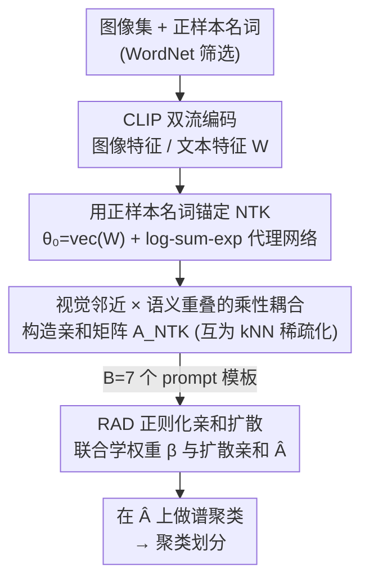

# Delving into Spectral Clustering with Vision-Language Representations

**会议**: ICLR2026  
**OpenReview**: [https://openreview.net/forum?id=s1ea8y8VUL](https://openreview.net/forum?id=s1ea8y8VUL)  
**代码**: 待确认（论文称在补充材料提供源码）  
**领域**: 多模态VLM / 无监督聚类  
**关键词**: 谱聚类, 神经正切核, 视觉语言模型, 亲和矩阵, CLIP

## 一句话总结
这篇论文把谱聚类从只看图像的单模态范式推进到多模态：用 CLIP 文本端的"正样本名词"去锚定一个神经正切核（NTK），让两张图的亲和度变成"视觉邻近 × 语义重叠"的乘积，从而天然强化块对角结构，再用一个正则化亲和扩散机制自适应集成多个 prompt 的亲和矩阵，在 16 个基准上大幅超越此前 SOTA（如 STL-10 98.3% ACC、ImageNet-Dogs 84.9% ACC）。

## 研究背景与动机
**领域现状**：谱聚类（spectral clustering, SC）把聚类转写成图割问题——样本是节点、成对亲和度是边权，再用图拉普拉斯矩阵 $L = I_M - D^{-1/2}AD^{-1/2}$ 的最小 $K$ 个特征向量得到低维嵌入并划分。它能刻画非线性的成对关系，效果好坏几乎完全取决于亲和矩阵 $A$ 的质量。但绝大多数 SC 方法只用视觉特征。

**现有痛点**：纯视觉亲和有一个硬伤——当两张语义完全不同的图在视觉上长得像（比如不同犬种、纹理相近的不同类别），它们的视觉距离很近，亲和图就会把它们错连在一起，块对角结构被污染，聚类质量下降。CLIP 这类视觉语言预训练模型把图文映射到同一个超球面嵌入空间，理论上能补上"语义"这一维信息，但怎么把文本语义真正用进亲和矩阵的构造里，一直没有一个有原则的框架。

**核心矛盾**：作者用实验点破了一个反直觉的事实——光把文本"塞进特征层"是不够的。他们把 TAC（一个图文特征拼合的方法）的特征拿来做 RBF 核 + 谱聚类，记作 TAC(SC)，结果发现它和 TAC(KMeans) 几乎打平。也就是说，仅仅在特征层面融合图文，并不能引导出更好的亲和图。问题被精炼成一句话：**如何在构造亲和矩阵 $A$ 时，把文本语义和视觉相似性真正有机地结合起来？**

**切入角度**：作者换了一个全新的视角——神经正切核（Neural Tangent Kernel, NTK）。NTK 度量的不是两个输入在输入空间里的几何距离，而是它们通过一个代理网络的梯度在函数空间里如何相互作用，是一种"高阶亲和"。关键洞察是：如果用 CLIP 文本端的语义特征去**锚定**这个 NTK 的初始参数，那么核值就会同时编码"视觉接近"和"语义一致"。

**核心 idea**：把代理网络的初始权重设成"正样本名词"的文本特征，对图像特征求 NTK——得到的亲和度恰好是视觉邻近与语义重叠的**乘性耦合**，自动放大同簇连接、压制跨簇噪声。

## 方法详解

### 整体框架
方法叫 **Neural Tangent Kernel Spectral Clustering（NTKSC）**。输入是一批无标签图像和一组从 WordNet 等"野生"词库里筛出的正样本名词（沿用 TAC 的筛选结果，这些名词语义上贴近图像内容，充当缺失类名的语义锚点）；输出是聚类划分。整条流水线分两段：先用 NTK 把图文语义注入亲和矩阵，再用正则化亲和扩散把多个 prompt 的亲和矩阵集成成一个鲁棒的 $\hat{A}$，最后在 $\hat{A}$ 上跑标准谱聚类。

### 关键设计

**1. 用正样本名词锚定 NTK：把文本语义注入亲和度**

痛点是"文本怎么进亲和矩阵"。作者的做法是先用 CLIP 文本编码器把 $N$ 个正样本名词编成特征矩阵 $W = [w_1, \dots, w_N] \in \mathbb{R}^{d\times N}$，其中 $w_i = f_T(\Delta(\hat{c}_i))$（$\Delta$ 是 prompt 模板）。然后把 NTK 代理网络的初始参数直接设成这些文本特征：$\theta_0 = \mathrm{vec}(W)$。由于 CLIP 图文已经跨模态对齐，这个初始化让梯度 $\partial g_{\theta_0}(z)/\partial \theta_0$ 能捕捉"图像 $z$ 在功能上和各个正样本名词如何互动"，相当于把 CLIP 学到的文本语义结构注进了 NTK。

代理网络 $g_{\theta_0}$ 不是随便选的，作者刻意设计成 log-sum-exp 形式：
$$g_{\theta_0}\big(f_X(x_i)\big) = \log \sum_{k=1}^{N} e^{\,w_k^\top f_X(x_i)/\tau}.$$
之所以选这个形式，是因为它求 NTK 后能解析地分解出视觉项和语义项（见设计 2），从而带来可证明的块结构。这一步把"语义锚点"从一个模糊概念，落成了一个具体可微的网络初始化。

**2. 视觉邻近 × 语义重叠的乘性耦合：自然强化块对角**

把 log-sum-exp 代理网络代入 NTK 定义，作者推出了一个干净的闭式：
$$K_{\theta_0}\big(f_X(x_i), f_X(x_j)\big) = \frac{1}{\tau^2}\underbrace{f_X(x_i)^\top f_X(x_j)}_{U_{ij}}\cdot \underbrace{\Big(\sum_{k=1}^{N} s_i[k]\,s_j[k]\Big)}_{V_{ij}},$$
其中 $s_i[k] = \mathrm{softmax}_k(W^\top f_X(x_i)/\tau)$ 是图像 $x_i$ 对各正样本名词的归一化对齐分布，温度 $\tau$ 很小（论文取 $0.04$），所以 $s_i$ 高度尖锐、几乎是 one-hot 式的。

这个式子的精妙之处在于它是**乘积**而非相加：$U_{ij}$ 是 CLIP 空间里的视觉邻近，$V_{ij}$ 是两张图语义分布的重叠度。同簇图像两项同时大（视觉近 + 都对齐到同一批名词），亲和被强烈放大，把对角块填满；跨簇图像即使视觉上有点像（$U_{ij}$ 中等），它们的 softmax 会集中到不同的名词子集，$V_{ij}$ 趋近于零，于是乘起来把跨簇亲和压下去。这正好对症"视觉像但语义不同"的痛点——光靠视觉不足以连边，必须语义也对得上。最终得到的亲和矩阵 $A_{NTK}$ 还做了互为 $q$ 近邻（$q=30$）的稀疏化：只有 $x_i$ 在 $x_j$ 的 top-$q$ 邻居里、且反过来也成立时才保留边。理论上这个乘性结构会锐化块对角，可视化（ImageNet-Dogs 上 NMI 从 CLIP 的 72.8% → 本文 82.4%）也确认了它的块对角比 RBF 核和 TAC 特征都更干净。

**3. RAD 正则化亲和扩散：自适应集成多 prompt 亲和**

单个 prompt 模板（如 "a photo of a {}"）构出的亲和矩阵有偏，不同模板各有所长。作者用 $B=7$ 个模板各构一个 $A_{NTK}^{(b)}$，问题变成怎么把它们集成。最简单的等权平均忽略了矩阵间的相关性。作者把"学集成权重"和"学扩散后的亲和"写成一个统一优化（式 9）：
$$\min_{\beta,\hat{A}} \sum_{b=1}^{B}\beta[b]\,\ell(\hat{A}, A_{NTK}^{(b)}) + \mu\|\hat{A}-E\|_F^2 + \frac{\lambda}{2}\|\beta\|_2^2,\quad \text{s.t. } 0\le\beta[b]\le1,\ \sum_b \beta[b]=1,$$
其中 $\ell(\cdot)$ 是亲和扩散过程的目标值（衡量 $\hat{A}$ 在每个 $A^{(b)}$ 诱导的流形几何上是否光滑），$\mu\|\hat{A}-E\|_F^2$ 用一个正定矩阵 $E$（实践中取 $E=I_M$）防止 $\hat{A}$ 被过度平滑到所有行几乎一样，$\lambda$ 项正则化权重 $\beta$。

由于目标同时依赖 $\beta$ 和 $\hat{A}$，作者交替求两个子问题：**固定 $\beta$ 优化 $\hat{A}$** 有闭式解（涉及 $M^2\times M^2$ 矩阵求逆，不可行，于是改用收敛性可证的不动点迭代 $\hat{A}\leftarrow \sum_b \frac{\beta[b]}{\mu+1}S^{(b)}\hat{A}S^{(b)\top} + \frac{\mu}{\mu+1}E$，$S^{(b)}$ 是行归一化的 $A^{(b)}_{NTK}$）；**固定 $\hat{A}$ 优化 $\beta$** 是一个 Lasso 形式，用坐标下降高效求解。每个子问题都取到最优解，所以式 9 的目标单调下降、保证收敛（实验里约 30 步内收敛）。最后在集成出的 $\hat{A}$ 上做谱聚类得到划分。

### 损失函数 / 训练策略
方法本质上是无训练的（CLIP 编码器冻结），核心计算是亲和矩阵构造 + RAD 的交替优化。超参全数据集统一：$\tau=0.04$、$q=30$、$\mu=0.1$、$\lambda=10$，默认骨干 CLIP ViT-B/32 图像端 + Transformer 文本端，正样本名词沿用 TAC 从 WordNet 筛选的结果（在训练 split 筛选、测试 split 评估）。

## 实验关键数据

### 主实验
在 5 个经典数据集上，本文在 ACC/ARI 等指标上整体领先 TAC 与 zero-shot CLIP，ImageNet-Dogs 上 ACC 提升 9.8%、ARI 提升 7.8%（CIFAR-10 上略输给 SIC，因为 SIC 用了更多可训练参数和更复杂训练策略）。

| 数据集 | 指标 | 本文 | TAC(SC) | zero-shot CLIP |
|--------|------|------|---------|----------------|
| STL-10 | ACC | 98.3 | 94.3 | 97.1 |
| CIFAR-10 | ACC | 92.0 | 90.3 | 90.0 |
| ImageNet-Dogs | ACC | 84.9 | 75.8 | 72.8 |
| ImageNet-Dogs | NMI | 82.4 | 75.3 | 73.5 |

在 3 个更有挑战的数据集（DTD / UCF-101 / ImageNet-1K）上优势更明显，平均 ACC 把 TAC 拉开一大截：

| 数据集 | 指标 | 本文 | TAC(SC) | TAC(KMeans) |
|--------|------|------|---------|-------------|
| DTD | ACC | 52.0 | 44.0 | 45.9 |
| UCF-101 | ACC | 67.9 | 60.0 | 61.3 |
| ImageNet-1K | ACC | 56.3 | 49.1 | 48.9 |
| 三者平均 | ACC | 58.7 | 51.0 | 52.0 |

UCF-101 上 ARI 比 TAC 高 7.0%、ACC 高 6.9%。在域偏移（ImageNet-C/V2/S）和细粒度（Aircraft/Food/Flowers/Pets/Cars）场景下同样稳定领先 TAC，如 Pets ACC +5.1%、ImageNet-Sketch ACC +5.3%。

### 消融实验

| 配置 | 关键指标 | 说明 |
|------|---------|------|
| 默认 ViT-B/32 | ImageNet-Dogs ACC 84.9 | 完整方法 |
| 换 ViT-B/16 | STL-10 ACC 99.0 / DTD ACC 55.8 | 骨干更强→性能更高，且始终超 TAC |
| 换 ViT-L/14 | STL-10 ACC 99.5 / CIFAR-10 ACC 96.6 | 进一步提升，泛化性好 |
| 变 $\tau$ / $q$ | 性能曲线 | 过大或过小都不好，存在适中区间 |
| 变 $\mu$ / $\lambda$ | 性能曲线平稳 | 在较宽范围内稳定，对权重超参不敏感 |

### 关键发现
- **乘性耦合是性能来源**：亲和矩阵可视化显示本文的块对角结构最锐利（同块密集、跨块趋零），直接对应聚类提升；这验证了"视觉 × 语义"相乘而非相加的设计动机。
- **特征层融合 ≠ 亲和层融合**：TAC(SC) ≈ TAC(KMeans) 这个对照说明，把文本塞进特征不会自动产生更好的亲和图，必须在亲和构造层面动手。
- **RAD 收敛快**：式 9 的目标值约 30 步内收敛，且 NMI 随迭代单调上升，集成多 prompt 比等权平均更鲁棒。
- **对超参不敏感**：$\mu$、$\lambda$ 在宽范围内稳定，便于跨数据集统一配置。

## 亮点与洞察
- **NTK 当亲和度量是个新角度**：用文本特征锚定代理网络初始权重，把"语义对齐"自然编码进核函数，比起在特征层拼接图文要更有原则——核值天然分解出视觉项和语义项。
- **乘性耦合的可解释性强**：$U_{ij}\cdot V_{ij}$ 这一形式让"为什么能压跨簇噪声"一目了然——语义分布不重叠时 $V_{ij}\to 0$ 直接掐断错连，这个 trick 可迁移到任何需要"双条件同时满足才连边"的图构造任务。
- **log-sum-exp 代理是为推导服务的**：选这个网络形式不是凑的，而是为了让 NTK 求出闭式、并能做块结构的理论证明，体现了"设计服从可分析性"的思路。
- **统一优化集成多视图亲和**：把集成权重学习和扩散亲和学习写进同一个目标、交替闭式求解，是一个可复用的多图融合范式。

## 局限与展望
- **依赖 CLIP 与正样本名词质量**：方法建立在 CLIP 图文对齐和 TAC 筛选的正样本名词之上，若目标域 CLIP 覆盖差、或词库里没有合适名词，语义项 $V_{ij}$ 就会失真。
- **域偏移下仍掉点**：作者承认在 ImageNet-C/V2/S 上本文和 TAC 都明显下降（虽然本文更鲁棒），说明跨域聚类仍是开放难题。
- **$M^2\times M^2$ 的扩散计算**：RAD 涉及 Kronecker 积与大矩阵不动点迭代，虽然用迭代解法规避了直接求逆，但在超大规模数据集上的可扩展性需要进一步验证。
- **与同作者 GradNorm 的关系**：在部分经典数据集上 GradNorm 反而略优，本文优势主要体现在更难/更大的数据集；两条线如何统一、各自适用边界在哪，值得后续厘清。

## 相关工作与启发
- **vs TAC（Li et al. 2024）**：TAC 把图文特征做拼合/集中（concentration）来增强特征判别性，本文证明这在亲和层面收益有限；本文转而用 NTK 在亲和构造阶段融合语义，UCF-101 等难数据集上大幅领先。
- **vs SIC（Cai et al. 2023）**：SIC 用文本语义增强图像伪标签、在图像空间和语义空间做一致性学习，本质是把图像嵌入拉近语义嵌入；本文不动嵌入，而是改造成对亲和度量。
- **vs 深度谱聚类（SpectralNet 等）**：传统深度谱聚类聚焦单模态、且常需训练网络重构给定亲和矩阵；本文是无训练的多模态亲和构造，把"亲和矩阵从哪来"这一最关键环节用 NTK + 文本语义重新作答。

## 评分
- 新颖性: ⭐⭐⭐⭐⭐ 首次把 NTK 当作多模态亲和度量、并给出视觉×语义乘性耦合的闭式与块结构分析，角度新颖。
- 实验充分度: ⭐⭐⭐⭐⭐ 16 个基准覆盖经典/大规模/细粒度/域偏移，含多骨干与超参消融，证据扎实。
- 写作质量: ⭐⭐⭐⭐ 推导清晰、动机用对照实验点破，但部分关键证明放在附录、正文略密。
- 价值: ⭐⭐⭐⭐ 给"如何把文本语义用进无监督聚类"提供了一个有原则且可解释的范式，实用性强。

<!-- RELATED:START -->

## 相关论文

- [\[CVPR 2026\] Multi-Hierarchical Contrastive Spectral Fusion for Multi-View Clustering](../../CVPR2026/multimodal_vlm/multi-hierarchical_contrastive_spectral_fusion_for_multi-view_clustering.md)
- [\[CVPR 2026\] Proxy3D: Efficient 3D Representations for Vision-Language Models via Semantic Clustering and Alignment](../../CVPR2026/multimodal_vlm/proxy3d_efficient_3d_representations_for_vision-language_models_via_semantic_clu.md)
- [\[ICLR 2026\] Calibrated Information Bottleneck for Trusted Multi-modal Clustering](calibrated_information_bottleneck_for_trusted_multi-modal_clustering.md)
- [\[ICLR 2026\] SpectralGCD: Spectral Concept Selection and Cross-modal Representation Learning for Generalized Category Discovery](spectralgcd_spectral_concept_selection_and_cross-modal_representation_learning_f.md)
- [\[ICLR 2026\] FLARE: Fully Integration of Vision-Language Representations for Deep Cross-Modal Understanding](flare_fully_integration_of_vision-language_representations_for_deep_cross-modal_.md)

<!-- RELATED:END -->
