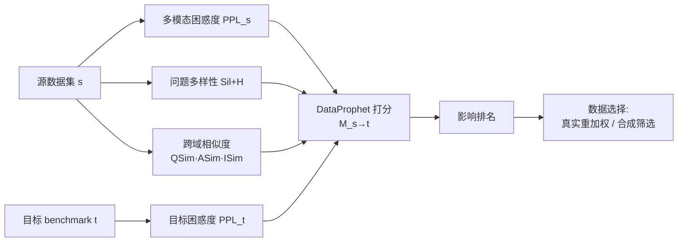

# DataProphet: Demystifying Supervision Data Generalization in Multimodal LLMs

**会议**: ICLR 2026  
**OpenReview**: [https://openreview.net/forum?id=iYMZKz5BGz](https://openreview.net/forum?id=iYMZKz5BGz)  
**代码**: [https://dataprophet26.github.io/](https://dataprophet26.github.io/)  
**领域**: 多模态 / 数据选择 / MLLM 指令微调  
**关键词**: 数据影响预测, 训练数据选择, 多模态困惑度, 跨域迁移, training-free  

## 一句话总结
本文系统揭示了「直觉上相似的训练数据更有帮助」这一常识在多模态 LLM 上并不可靠，并提出无需训练的指标 DataProphet，用多模态困惑度、跨域相似度与问题多样性三因子的乘积，在训练前就能高精度预测某个监督数据集对目标 benchmark 的影响排名（Kendall's τ 达 86%），进而指导数据选择，效果超过需要训练的 SoTA 方法甚至接近 oracle。

## 研究背景与动机
**领域现状**：训练数据被公认是决定 MLLM 性能最关键的因素之一。面对海量多模态监督数据，业界惯例是按「直觉上的任务相似度」来挑数据——比如要提升图表理解能力，就优先选 OCR / text-rich 类数据，因为它们都涉及读取图中的文字和数字。

**现有痛点**：现有的数据选择方法（如 ICONS）大多依赖梯度影响、需要实际训练后才能打分，本质上是「先训练再筛掉无用/冗余/低质数据」，计算昂贵且无法在训练前给出预判。而「任务相似度→迁移收益」这条直觉链条到底有多可靠，从没有人系统验证过。

**核心矛盾**：作者用 14 个覆盖 7 类任务（OCR、图表、文档、通用 VQA、空间推理、计数、地图）的视觉-语言数据集，对 InternVL3-2B 做单源微调的 14×14 全矩阵实验，结果直接打脸直觉：训练 OCR 数据对**空间推理**（+12.86%）的提升竟然大于对**图表**任务（+5.61%）的提升；数据影响**不对称**（s→t ≠ t→s）；而且**同一任务类别内的数据集并不互相帮助最多**——影响由具体数据集决定，而非任务大类。

**本文目标**：能否在**任何训练发生之前**，就预测一个训练集 $D_i$ 对目标 benchmark $T_j$ 的影响（用相对性能变化衡量）？

**核心 idea**：**【训练前预测影响】** 抛弃「任务相似度」的表层启发式，转而从 perplexity、相似度、多样性等更底层的信号里找出真正决定迁移的因子，组合成一个 training-free 指标 DataProphet，用它的打分排名去逼近真实训练后的收益排名。

## 方法详解

### 整体框架
方法分两步：先做一轮「数据影响全矩阵」分析实验，确立「直觉相似度不可靠、影响由数据集而非任务决定」这一动机；再据此设计 DataProphet 指标——它把源数据的多模态困惑度、源-目标跨模态相似度、源数据问题多样性三类信号相乘，并用目标数据的困惑度归一化，得到一个 $M(s\to t)$ 影响打分；最后用这个打分驱动两种下游场景：真实数据重加权与合成数据筛选。

### 关键设计

**1. 多模态困惑度：度量「源数据有多挑战、目标有多难」** 作者借鉴 LLM 预训练里用 perplexity 做数据质量估计的思路，假设「对基座模型越有挑战性的源数据，越能带来能力提升」。给定答案 token 序列 $A=(a_1,\dots,a_T)$ 和基座 MLLM $p_\theta$，在数据集 $D$ 上的多模态困惑度定义为

$$\mathrm{PPL}(D) = \exp\!\Big(-\,\mathbb{E}_{(I,Q,A)\sim D}\,\mathbb{E}_{t\sim[T]}\,\log p_\theta\big(a_t \mid I, \tau_Q(Q), a_{<t}\big)\Big)$$

它同时出现在分子（源数据 $\mathrm{PPL}(s)$，越难越值得学）和分母（目标数据 $\mathrm{PPL}(t)$，目标越难越能放大收益空间）。单用困惑度做预测，$\tau_{\mathrm{Tgt}}$ 只有 0.274，说明它必要但不充分；但消融时去掉它，τ 从 0.86 暴跌到 0.49，是全指标里贡献最大的单因子。

**2. 跨域相似度：问题、答案、图像三路分别对齐** 直觉是源数据在模型 embedding 空间里越像目标，就越接近在目标域分布上学习。作者用基座 MLLM 的**冻结编码器**，对 question / answer / image 三个字段分别编码、做 ℓ2 归一化，再取从 $D$ 和 $T$ 独立采样样本间的期望余弦相似度，得到 $\mathrm{QSim}$、$\mathrm{ASim}$、$\mathrm{ISim}$。一个反直觉的小发现是：把问题和答案拼在一起编码成 QASim，反而比分开编码差 6% τ，所以坚持三路分离。其中图像相似度尤其关键（去掉后 τ 掉到 0.625），印证视觉对齐在多模态迁移里不可替代。

**3. 源数据问题多样性：silhouette + 熵双重度量覆盖度** 若源数据的问题足够多样，微调它更可能让模型学到可泛化的技能。作者为每个源样本问题 $u$ 构造 embedding $z_u$，用 K-means（K=10）聚类，再算 silhouette 系数衡量簇内紧凑、簇间分离

$$\mathrm{Sil} = \mathbb{E}_{u\sim U}\Big[\frac{b(u)-a(u)}{\max\{a(u),\,b(u)\}}\Big]$$

其中 $a(u)$ 是平均簇内距离、$b(u)$ 是到最近其他簇的平均距离；再用归一化熵 $H=-(\log K)^{-1}\sum_k \pi_k\log\pi_k$ 衡量簇分布是否均衡。最终多样性取 $\mathrm{Sil}+H$，值越大代表覆盖越广、簇越均衡分离。

**4. 乘积式组合：任一因子薄弱就整体降权** 三类因子合成最终 DataProphet 指标

$$M(s\to t) = \mathrm{QSim}\cdot\mathrm{ASim}\cdot\mathrm{ISim}\cdot \mathrm{PPL}(s)\cdot \frac{\big(\mathrm{Sil}+H\big)}{\mathrm{PPL}(t)}$$

采用**乘积形式**而非加权和，是因为成功迁移要求文本、视觉、对基座的难度、问题覆盖度**同时**对齐，任何一项弱都应拉低总分——乘法天然实现这种「短板效应」。在合成数据逐点打分的场景里，作者用去掉多样性项的简化版 $M(\text{syn}_d\to T)=\mathrm{QSim}\cdot\mathrm{ASim}\cdot\mathrm{ISim}\cdot\mathrm{PPL}(\text{Syn}_D)/\mathrm{PPL}(T)$，因为单条数据谈不上多样性。值得一提的是，作者还试过问题难度、模型对图像/问题的熟悉度、答案长度等启发式，全部无效（加答案长度反而让 τ 降 0.15），只有这三大因子稳定有效。

## 实验关键数据

### 影响预测主结果（Kendall's τ）
对 14 个数据集两两计算，得到 14×14=196 个打分。给定目标 t 排所有源数据集（衡量 $\Delta_{s\to t}$）得 $\tau_{\mathrm{Tgt}}$，给定源 s 排所有目标（衡量 $\Delta_{t\to s}$）得 $\tau_{\mathrm{Src}}$。

| 评估方向 | 平均 Kendall's τ |
|---|---|
| τ_Tgt（预测源数据贡献排名） | 0.863 |
| τ_Src（预测一个源影响各目标） | 0.857 |
| 综合 τ | ≈ 0.86 |

预测排名与真实训练后收益排名强相关，证明训练前即可高精度预判数据影响。

### 消融实验（去掉单个因子后的 τ）

| 变体 | Kendall's τ |
|---|---|
| 完整 DataProphet | 0.860 |
| w/o 答案相似度 | 0.810 |
| w/o 问题相似度 | 0.778 |
| w/o 多样性 (Sil & H) | 0.659 |
| w/o 图像相似度 | 0.625 |
| w/o 困惑度 | 0.487 |

困惑度是最强单因子（去掉掉到 0.49），图像相似度与多样性次之，文本相似度贡献相对边际。

### 数据选择主结果（固定 280K 预算，14 benchmark 平均）

| 设定 | Uniform | ICONS (SoTA, 需训练) | Oracle (gold) | DataProphet |
|---|---|---|---|---|
| 真实数据重加权 | 67.6 | 69.6 | 70.8 | **71.0** |
| 合成数据筛选 | 55.1 | 60.8 | — | **62.0** |

真实数据上比 uniform +3.4%、比 ICONS +1.4%，甚至比 oracle 还高 +0.2%；合成数据上比 uniform +6.9%、比 ICONS +1.2%。RL 后训练数据选择（表 4）同样有效：真实 RL 数据 +3.8%、合成 RL 数据 +2.0%。

### 关键发现
- 直觉的任务相似度是性能影响的**糟糕预测器**；影响由**具体数据集**而非任务大类决定，且**不对称**。
- 训练前的轻量指标竟能逼近甚至超过 oracle（基于真实训练表现）的选择，说明影响在很大程度上是「可预测的」。

## 亮点与洞察
- **反直觉但扎实**：用 14×14 全矩阵实验把「任务相似度有用」这一常识系统证伪，结论有说服力。
- **训练前可预测**：DataProphet 完全 training-free，却能在数据选择上打平甚至超过需要梯度信号的 SoTA，性价比极高。
- **乘积式短板设计**：用乘法强制四类对齐同时满足，物理直觉清晰，比简单加权更符合「迁移需全方位匹配」。
- **困惑度的双向用法**：同一指标在分子（源难度）与分母（目标难度）扮演不同角色，巧妙刻画了「学习头部空间 × 提升空间」。

## 局限与展望
- 分析与验证主要在 InternVL3-2B 单一基座、14 个 VQA 数据集上完成，更大模型、更多模态任务下的可迁移性待验证。
- 指标依赖基座模型自身的编码器与困惑度，若基座能力本身偏弱或编码器表征不佳，相似度/困惑度信号可能失真。
- 多样性项的聚类（K-means, K=10）与 silhouette 估计对超参与采样规模敏感，鲁棒性需进一步考察。
- 三因子是经验筛选得到的（多种启发式被证无效），缺乏理论上「为什么恰是这三者」的解释。

## 相关工作与启发
本文延续了 LLM 数据选择领域用 perplexity（Marion et al. 2023）、任务难度、问题多样性（Wang et al. 2024a）做数据质量估计的思路，并首次把它们系统迁移到多模态设置。相比 ICONS（Wu et al. 2025）等基于梯度影响、需要训练的 SoTA 数据选择方法，DataProphet 的最大启发在于：**在多模态场景下，训练前的轻量信号组合就足以预测数据影响**，这为大规模数据混合配比、合成数据筛选提供了一条便宜且可解释的路径。其「任务相似度不可靠、影响由数据集决定」的发现，也提醒后续工作在设计数据 curation 策略时不要轻信表层任务标签。

## 评分
- **新颖性**: ⭐⭐⭐⭐ 把「训练前预测数据影响」问题首次系统引入 MLLM，反直觉发现 + training-free 指标都有原创性。
- **实验充分度**: ⭐⭐⭐⭐ 14×14 全矩阵分析 + 真实/合成/RL 三种选择设定 + 完整消融，覆盖面扎实；但基座与任务范围偏窄。
- **写作质量**: ⭐⭐⭐⭐ 动机—发现—方法—验证逻辑清晰，图 1/图 2 把反直觉结论讲得直观。
- **价值**: ⭐⭐⭐⭐ 提供了低成本、可解释的数据选择工具，对 MLLM 指令微调的数据配比有直接实用价值。

<!-- RELATED:START -->

## 相关论文

- [\[ACL 2025\] Exploring Compositional Generalization of Multimodal LLMs for Medical Imaging](../../ACL2025/multimodal_vlm/exploring_compositional_generalization_of_multimodal_llms_for_medical_imaging.md)
- [\[ICLR 2026\] WorldSense: Evaluating Real-World Omnimodal Understanding for Multimodal LLMs](worldsense_evaluating_real-world_omnimodal_understanding_for_multimodal_llms.md)
- [\[CVPR 2026\] Towards Multimodal Domain Generalization with Few Labels](../../CVPR2026/multimodal_vlm/towards_multimodal_domain_generalization_with_few_labels.md)
- [\[ICLR 2026\] On the Generalization Capacities of MLLMs for Spatial Intelligence](on_the_generalization_capacities_of_mllms_for_spatial_intelligence.md)
- [\[ICLR 2026\] MotionSight: Boosting Fine-Grained Motion Understanding in Multimodal LLMs](motionsight_boosting_fine-grained_motion_understanding_in_multimodal_llms.md)

<!-- RELATED:END -->
