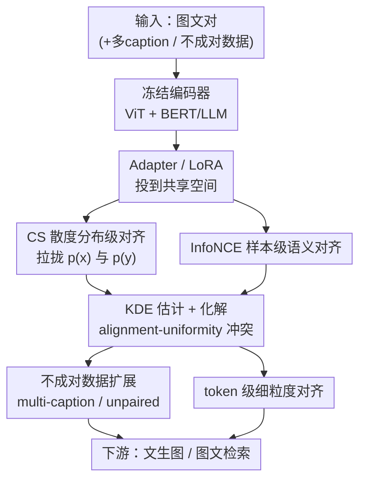

# Distributional Vision-Language Alignment by Cauchy-Schwarz Divergence

**会议**: ICLR2026  
**OpenReview**: [https://openreview.net/forum?id=UUAjF4xL0e](https://openreview.net/forum?id=UUAjF4xL0e)  
**代码**: 待确认  
**领域**: 多模态VLM / 视觉-语言对齐 / 表示学习  
**关键词**: 视觉-语言对齐, Cauchy-Schwarz 散度, 分布对齐, 模态鸿沟, InfoNCE

## 一句话总结
针对 CLIP 用 InfoNCE 做视觉-语言对齐时残留的"模态鸿沟"，本文提出 CS-Aligner：在最大化互信息的基础上额外用 Cauchy-Schwarz（CS）散度拉近图、文两个**特征分布**，既补齐了 InfoNCE 只对齐成对样本、忽略整体分布的短板，又自然化解了 InfoNCE 内部 alignment 与 uniformity 的冲突，在文生图（FID）与图文检索上都明显超过 Eclipse、Long-CLIP、LLM2CLIP 等对齐方法。

## 研究背景与动机
**领域现状**：视觉-语言对齐把成对的图、文映射到共享特征空间，是文生图、跨模态检索等下游任务的基础。主流做法以 CLIP 为代表，用 InfoNCE（对比损失）最大化成对图文表示之间的互信息，靠正负样本的相对相似度学到语义对应关系。

**现有痛点**：CLIP 及其变体始终存在一个顽固的"模态鸿沟"（modality gap）——文本与图像的嵌入在共享空间里整体分离、各自聚成一团，TSNE 可视化里两簇明显错开。已有缓解手段（投影模块 + 余弦相似度、geodesic mixup，或 DALL-E 2 / Eclipse 这类用扩散 prior、$\ell_2$ 损失把文本嵌入映射到图像空间的 prior adapter）都是**逐样本**对齐，重度依赖精心配好的图文对，能捕语义却对不齐整体分布，对不成对、有噪声的真实数据也不友好。

**核心矛盾**：作者指出问题出在 InfoNCE 本身的两个理论缺陷。其一，**互信息不足以对齐分布**：互信息只衡量两个随机变量的统计相关性，两个分布可以高度相关（高 MI）但在空间上离得很远（高散度），如它给的 toy example——光最大化 MI 并不能保证 $p(x)$ 与 $p(y)$ 这两个分布靠拢。其二，**InfoNCE 内部自相矛盾**：按 Wang & Isola 的分解 $\mathcal{L}_{\text{InfoNCE}}\approx\mathcal{L}_{\text{align}}+\mathcal{L}_{\text{uniform}}$，做泰勒展开后 uniformity 项约等于 $-t\,\mathbb{E}_{(x,y)\sim p_{\text{pair}}+p_{\text{unpair}}}[\lVert x-y\rVert_2^2]$，与 alignment 项 $\mathbb{E}_{(x,y)\sim p_{\text{pair}}}[\lVert x-y\rVert_2^\alpha]$ 方向相反，当 $t=1$ 时正样本的对齐贡献几乎被抵消，只剩负样本起作用，最终把模态推开、制造鸿沟。

**本文目标**：在保留 InfoNCE 捕语义能力的同时，显式地把两个模态的**整体分布**拉到一起，并消解 alignment–uniformity 的内耗。

**切入角度**：与其再优化互信息，不如直接补一个**分布距离**度量。作者选择 Cauchy-Schwarz 散度——它对称、不需要假设分布形式、即使两分布初始支撑几乎不重叠也能稳健估计，天然适配"两簇离得很远"的多模态场景；更妙的是它能写成 RKHS 里分布均值嵌入的余弦相似度，和 InfoNCE 的样本级余弦相似度形成"分布级 + 样本级"的双层互补，而其它散度（KL、MMD 等）做不到这种无冲突协同。

**核心 idea**：在 InfoNCE 之外加一项 CS 散度做分布级对齐——$\min\,-I(x;y)+\lambda D_{\text{CS}}(p(x),p(y))$，同时对齐成对语义与整体分布。

## 方法详解

### 整体框架
CS-Aligner 走的是**参数高效微调**路线：冻结预训练的图像编码器（ViT）和文本编码器（BERT / LLM），只在其上加轻量 Adapter（或往文本编码器插 LoRA 低秩矩阵），把图、文嵌入投到共享空间。训练时用一个联合目标优化这些 adapter：InfoNCE 负责样本级语义对齐，CS 散度负责把两个模态的特征分布整体拉拢。对齐完成后，文本 adapter 可直接接 unCLIP 式解码器（Karlo / Kandinsky / SD-unCLIP）做文生图，无需额外 prior 模块或多步扩散；多模态 adapter 则用于图文检索。

整个方法的核心目标函数是
$$\min\;-I(x;y)+\lambda D_{\text{CS}}(p(x),p(y)),$$
其中第一项用 InfoNCE 估计、第二项用核密度估计（KDE）算 CS 散度，$\lambda$ 平衡两者。在这个主干上，作者进一步把 CS 散度的"分布"特性挖出两个扩展——对不成对数据的对齐、对 token 级的细粒度对齐。

### 关键设计

**1. CS 散度分布级对齐：补上 InfoNCE 缺失的"整体分布"维度**

这一项针对的是"互信息不足以对齐分布"的痛点——光让图文高度相关，两簇特征仍可能整体错开。作者在目标里加入 CS 散度 $D_{\text{CS}}(p(x),p(y))$，它定义为
$$D_{\text{CS}}(p;q)=-\log\frac{\left(\int p(\omega)q(\omega)\,d\omega\right)^2}{\int p(\omega)^2 d\omega\int q(\omega)^2 d\omega},$$
满足 $0\le D_{\text{CS}}<\infty$，当且仅当 $p=q$ 时为零。它对称、有界、不假设分布的参数形式，因此能稳健衡量任意两个表示分布的距离。在 RKHS 视角下，用特征映射 $\phi$ 的均值嵌入 $\mu_x,\mu_y$ 可把 CS 散度写成 $\hat D_{\text{CS}}=-2\log\,\mathrm{sim}(\mu_x,\mu_y)$，即**分布均值在 RKHS 里的余弦相似度**；而 InfoNCE 衡量的是**成对样本的余弦相似度**。二者一个看分布、一个看样本，构成互补的双层对齐——这正是作者反复强调"CS 散度与 InfoNCE 互补、协同"的来源，也是它优于单纯逐样本对齐的根本。

**2. KDE 非参数估计与 alignment–uniformity 冲突的化解：让两项目标不再互相拆台**

CS 散度的好处不止"补分布"，更关键的是它能消掉 InfoNCE 内部的内耗。作者用非参数 KDE 估计 CS 散度，给定样本 $\{x_i\}_{i=1}^M\sim p(x)$、$\{y_j\}_{j=1}^N\sim p(y)$，经验估计量为
$$\hat D_{\text{CS}}=\log\Big(\tfrac{1}{M^2}\textstyle\sum_{i,j}\kappa(x_i,x_j)\Big)+\log\Big(\tfrac{1}{N^2}\textstyle\sum_{i,j}\kappa(y_i,y_j)\Big)-2\log\Big(\tfrac{1}{MN}\textstyle\sum_{i,j}\kappa(x_i,y_j)\Big),$$
其中 $\kappa$ 取高斯核 $\kappa_\sigma(x,y)=\exp(-\lVert x-y\rVert_2^2/2\sigma^2)$，整个估计量对称、可微、计算高效；第三个交叉项只有当两分布完全不重叠（$\mathbb{E}[\kappa(x,y)]\to0$）时才发散，因此只要有非零重叠估计就稳定有效，恰好覆盖多模态"支撑有限重叠"的场景。把高斯核版的 CS 散度与 InfoNCE 的 alignment/uniformity 合并、令 $\lambda=1$，整个目标会重排成"对齐项 + **各模态各自内部**的 uniformity 项"：CS 散度带来的是 $x$ 内部、$y$ 内部各自分散（鼓励同模态内表示散开），而不是像原始 InfoNCE 那样跨模态地推开正样本。于是 alignment 与 uniformity 不再冲突——这是 CS 散度区别于 KL、MMD 等其它散度的独特性质。

**3. 不成对数据扩展：把"分布对齐"用到没有配对标注的数据上**

InfoNCE 那一项（互信息估计）必须要成对数据 $\{(x_i,y_i)\}$，但 CS 散度的 KDE 估计量里 $\{x_i\}_{i=1}^M$ 与 $\{y_j\}_{j=1}^N$ 可以相互独立、甚至 $M\ne N$，天然吃得下不成对数据且不增计算。作者据此给出两类用法：(a) **一图多 caption**——MSCOCO 里一张图常配 5 句描述，逐样本方法没法同时利用多句，而 CS 散度项可把多句一起塞进分布估计；(b) **完全不成对的图、文**——独立采样的图像集和文本集也能参与分布对齐。实验显示，用 40K 成对 + 80K 不成对训练，效果反超 80K 全成对，说明分布信息确实能从廉价的不成对数据里榨出对齐增益。

**4. token 级细粒度对齐：把每个样本的 token 当作一个分布对齐**

CLIP 类方法只对齐图、文的 "CLS" token，丢掉了细粒度对应。作者把单张图的 $V$ 个视觉 token 视作一个 token 分布 $p(x_i)$、单句文本的 $L$ 个文本 token 视作 $p(y_i)$，在样本内部对这两个 token 分布算 CS 散度，得到内部 token 对齐损失
$$\mathcal{L}_{\text{token}}=\frac{1}{B}\sum_{i=1}^{B}\hat D_{\text{CS}}(p(x_i);p(y_i)).$$
由于一般 $V\ne L$、视觉 token 与文本 token 没有直接配对，InfoNCE 在这里根本用不了，而分布式的 CS 散度可以对齐全部 token，捕捉更细的跨模态细节。消融里加上 token 对齐把 FID 从 12.62 降到 12.14，且生成图的细节更准。

### 损失函数 / 训练策略
总目标即 $-I(x;y)+\lambda D_{\text{CS}}(p(x),p(y))$：InfoNCE 估互信息 + KDE 估 CS 散度，$\lambda$ 平衡两项（$\lambda=1$ 时恰好对应无冲突的 alignment–uniformity 分解）。仅训练 Adapter（轻量 Transformer，投到共享空间）或 LoRA（低秩维度 8，插到 CLIP 文本编码器各层），骨干编码器全程冻结。文生图在 MSCOCO / CC3M / CC12M / LAION-HighRes-5M 上训练，用 FID 评估（FID 本身就度量分布距离，特别契合"模态对齐"这一目标）。

## 实验关键数据

### 主实验
文生图（MSCOCO 30K 验证集，FID↓）：CS-Aligner 只在 0.08M 的 MSCOCO 上训 adapter，就超过了在上亿样本上训练的大规模扩散方法，也明显优于同规模对齐方法 Eclipse、IB。

| 方法 | 训练数据量 (M) | FID↓ |
|------|------|------|
| SD v2.1（大规模） | 2000 | 14.51 |
| DALL-E2（大规模） | 250 | 10.65 |
| Eclipse + Kandinsky decoder | 0.08 | 16.53 |
| **Ours + Kandinsky decoder** | 0.08 | **12.62** |
| Eclipse + Karlo decoder | 0.08 | 23.67 |
| **Ours + Karlo decoder** | 0.08 | **11.27** |
| **Ours + SD-unclip decoder** | 0.08 | **10.88** |

不同训练数据下与 Eclipse 对比（FID↓），CS-Aligner 全面领先：

| 方法 | CC3M | CC12M | LAION-HighRes 5M |
|------|------|------|------|
| Eclipse | 26.73 | 26.98 | 19.16 |
| **Ours** | **22.88** | **22.72** | **14.79** |

图文检索（I2T / T2I，召回率↑，CC3M 上对齐 CLIP ViT-L/14 与 Llama 3-8B）：

| 方法 | Flickr30k I2T/T2I | Urban-1k I2T/T2I | DOCCI I2T/T2I | 平均 I2T/T2I |
|------|------|------|------|------|
| Long-CLIP | 90.0 / 76.2 | 82.5 / 86.1 | 66.5 / 78.6 | 79.7 / 80.3 |
| LLM2CLIP-3M | 89.6 / 77.3 | 87.1 / 91.1 | 84.9 / 87.8 | 87.2 / 85.4 |
| **Ours-3M** | **91.8 / 81.0** | **87.6 / 92.2** | **86.6 / 89.1** | **88.7 / 87.4** |

### 消融实验

| 配置 | FID↓ / 说明 | 结论 |
|------|------|------|
| w/o token 对齐 | 12.62 | 基础 CS-Aligner（Kandinsky） |
| w/ token 对齐 | 12.14 | token 级对齐进一步降 FID、细节更准 |
| Adapter（Kandinsky, 34M） | 12.62 | adapter 路线 |
| LoRA（Kandinsky, 6M） | 13.52 | 参数少 5 倍多，结果可比 |
| LoRA（Karlo, 1.3M） | 15.63 | 极少参数仍可对齐 |
| 80K 成对 | （图 5b 基线） | 标准成对训练 |
| 40K 成对 | 低于 80K | 数据减半性能下降 |
| 40K 成对 + 80K 不成对 | 反超 80K 成对 | 不成对数据带来分布信息增益 |

### 关键发现
- **分布信息是关键**：在每一种训练数据上，加了 CS 散度的分布对齐都稳定优于只做逐样本对齐的 Eclipse，验证"模态分布信息"对鲁棒对齐的重要性。
- **不成对数据有真实增益**：40K 成对 + 80K 不成对反超 80K 全成对，说明 CS 散度确实把不成对数据的分布信息利用了起来。
- **token 对齐补细粒度**：FID 12.62→12.14，且定性上细节更准，印证了 token 分布对齐捕捉细粒度对应的价值。
- **参数高效且稳健**：LoRA 仅 1.3M–6M 参数即得到与 33M–34M adapter 可比的结果，方法对适配方式不敏感。

## 亮点与洞察
- **把"散度"和"互信息"摆到互补位置**：分布级（RKHS 均值嵌入余弦相似度）+ 样本级（InfoNCE 样本余弦相似度）的双层对齐视角很优雅，一句 $\hat D_{\text{CS}}=-2\log\mathrm{sim}(\mu_x,\mu_y)$ 就把两者统一了。
- **CS 散度恰好化解 alignment–uniformity 冲突**：它带来的 uniformity 是"各模态内部分散"，而非 InfoNCE 那种"跨模态推开正样本"，这个性质是 KL/MMD 等散度不具备的，也是选 CS 散度而非随便一个分布距离的真正理由。
- **不成对 / 多 caption / token 三个扩展都来自同一性质**：CS 散度的 KDE 估计不要求两组样本配对、不要求等量，于是"一图多句""完全不成对""token 当分布"三种以往用不上的数据形态都被同一把钥匙打开，思路统一且可迁移到其它需要分布对齐的多模态任务。
- **用生成 FID 当对齐探针**：FID 本身度量分布距离，拿它评模态对齐而非单纯评画质，是一个贴合目标的评测选择。

## 局限与展望
- 论文把文生图/检索当作"对齐能力的代理指标"，CS-Aligner 主要在**对齐**层面发力，并不替换或改进生成解码器本身；最终画质仍受所接 unCLIP 解码器上限约束。
- CS 散度的 KDE 估计依赖核宽 $\sigma$（及温度 $t$）这类超参，论文未充分展开其敏感性；高斯核在高维表示上的带宽选择可能影响估计稳定性。
- token 级对齐把每个样本的 token 集当独立分布，batch 内逐样本算 CS 散度，token 数大时的计算开销与对长序列的扩展性还需更系统的评估。
- 不成对数据的增益在 MSCOCO 同源场景下验证，跨域、强噪声的真实不成对数据上能否同样稳健，留待进一步检验。

## 相关工作与启发
- **vs CLIP / InfoNCE**：CLIP 用 InfoNCE 最大化互信息做逐样本对齐，但忽略整体分布且内部 alignment–uniformity 冲突，残留模态鸿沟；本文加 CS 散度补分布对齐并化解冲突，要求成对数据的限制也被 CS 散度的不成对扩展放宽。
- **vs Eclipse / IB（小规模对齐）**：Eclipse 用 $\ell_2$ 训练 prior adapter、IB 走信息瓶颈，都是逐样本对齐；CS-Aligner 在相同 adapter、相同数据下靠分布对齐稳定领先（如 Karlo 解码器 FID 11.27 vs 23.67）。
- **vs Long-CLIP / LLM2CLIP（检索）**：二者仍是纯 InfoNCE 路线；本文在对齐 CLIP 与 Llama 3-8B 的检索任务上平均 I2T/T2I 全面更高，且展示了把异构文本编码器（LLM）与 CLIP 图像编码器对齐的灵活性。
- **vs 其它分布散度（KL / MMD）**：作者论证只有 CS 散度能与 InfoNCE 无冲突协同（带来同模态内部 uniformity 而非跨模态排斥），这是方法选型的核心依据。

## 评分
- 新颖性: ⭐⭐⭐⭐⭐ 把 CS 散度引入视觉-语言对齐，并从理论上说明它如何同时补分布、化解 InfoNCE 内耗，角度新且自洽。
- 实验充分度: ⭐⭐⭐⭐ 覆盖文生图（多解码器/多数据集）、检索、多 caption、不成对、token、adapter/LoRA 多维消融；但散度对比、核宽敏感性多放在附录。
- 写作质量: ⭐⭐⭐⭐⭐ 从 InfoNCE 两个缺陷推导到 CS 散度的引入，逻辑链与公式衔接清晰。
- 价值: ⭐⭐⭐⭐ 提供了一个即插、参数高效、能吃不成对数据的对齐损失，对多模态对齐与文生图都有实用价值。

<!-- RELATED:START -->

## 相关论文

- [\[NeurIPS 2025\] DOTA: DistributiOnal Test-time Adaptation of Vision-Language Models](../../NeurIPS2025/multimodal_vlm/dota_distributional_testtime_adaptation_of_visionlanguage_mo.md)
- [\[ICLR 2026\] Unified Vision-Language Modeling via Concept Space Alignment](unified_vision-language_modeling_via_concept_space_alignment.md)
- [\[ICLR 2026\] Reversible Primitive–Composition Alignment for Continual Vision–Language Learning](reversible_primitivecomposition_alignment_for_continual_visionlanguage_learning.md)
- [\[ICML 2026\] DIVA: Harnessing the Representation Divergence in Unified Multimodal Models for Mutual Reinforcement](../../ICML2026/multimodal_vlm/diva_harnessing_the_representation_divergence_in_unified_multimodal_models_for_m.md)
- [\[CVPR 2026\] GaussianVision: Vision-Language Alignment from Compressed Image Representations using 2D Gaussian Splatting](../../CVPR2026/multimodal_vlm/gaussianvision_vision-language_alignment_from_compressed_image_representations_u.md)

<!-- RELATED:END -->
