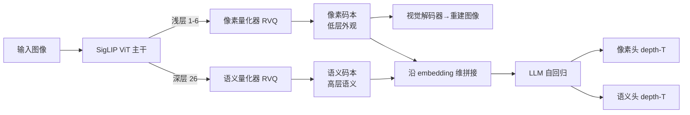

# DualToken: Towards Unifying Visual Understanding and Generation with Dual Visual Vocabularies

**会议**: ICLR 2026  
**OpenReview**: [https://openreview.net/forum?id=BpgCOFefcE](https://openreview.net/forum?id=BpgCOFefcE)  
**代码**: 项目页见论文（Project page available）  
**领域**: 多模态 / 统一视觉理解与生成  
**关键词**: 统一视觉 Tokenizer, 双视觉码本, 自回归多模态, SigLIP, 残差量化  

## 一句话总结
DualToken 把"理解要语义、生成要像素"这对天然冲突的目标，沿 ViT 的浅层/深层结构解耦开来——浅层学重建得到像素码本、深层学语义得到语义码本，在单一 tokenizer 里同时拿到 0.25 rFID 和 82.0% 零样本精度，并让一个纯自回归 MLLM 同时把图看懂和画好。

## 研究背景与动机

**领域现状**：把视觉理解和生成统一进 LLM 的纯自回归（AR）范式，比"LLM 外接扩散模块"更简洁、端到端。Chameleon、Emu3 等证明了可行性：图像先被 tokenizer 离散成 visual token，与文本 token 交错成多模态序列，用 next-token prediction 统一建模。

**现有痛点**：纯 AR 路线的视觉理解能力明显弱于专用 MLLM。根因在视觉表征——传统 VQ-VAE 只为重建优化，token 保留低层外观却缺高层语义；而理解任务依赖的 CLIP/SigLIP 编码器经文本对齐天生编码高层语义，却很难解码回像素空间做生成。

**核心矛盾**：一个直觉做法是把 CLIP 特征量化后再训一个解码器做重建（VILA-U 路线），但**重建目标和语义目标直接塞进同一个码本会互相打架**：重建出现严重扭曲模糊，零样本分类、图文检索等语义指标也明显下滑（如直接合并后零样本从 83.2 掉到 72.3、rFID 高达 3.86）。

**本文目标**：在**单一 tokenizer、单一连贯 token 空间**内同时支撑理解与生成，既不外挂两个异构编码器，又不让两个目标互相拖累。

**核心 idea**：**分而治之的双视觉词表**——不强迫一个码本同时背下外观和语义，而是借鉴人类视觉系统的层级结构，把 ViT 按层间余弦相似度切成浅/中/深三段，**让浅层特征负责重建、深层特征负责语义**，从而在统一架构里自然导出一个像素码本和一个语义码本。

## 方法详解

### 整体框架
DualToken 分两层：一是**统一视觉 tokenizer**，用一个 SigLIP 主干同时产出像素码本（浅层）与语义码本（深层）；二是**统一 MLLM 架构**，把双码本 token 沿 embedding 维拼接后送进 LLM，用残差深度 Transformer 的"像素头 + 语义头"做自回归预测。关键洞察来自一个观察实验：SigLIP 浅层按颜色纹理聚类、深层按语义聚类，恰好对应生成与理解两类下游需求。

### 关键设计

**1. 层级解耦的双目标监督：让浅层背重建、深层背语义。** 本文先验证一个长期被假设却没被正式证明的论断——在 LLaVA-1.5 框架下把视觉编码器换成纯重建训练的编码器，理解指标（MMB、MME、SEED）断崖式下跌，证明高层语义对 MLLM 推理比低层感知更关键。但要在同一模型里既理解又生成，又必须能解码回像素。DualToken 的破局点是按层间余弦相似度把 ViT 切段（亮方块出现在 1–7 层和 8–17 层），观察到浅层按纹理颜色聚类、深层按语义聚类，于是把**重建损失只施加到浅层（1–6 层）、语义损失只施加到深层（第 26 层）**。语义损失约束最终层特征 $F$ 不偏离其预训练初值 $F_0$：$\mathcal{L}_{sem} = -\cos(F, F_0) + \|F - F_0\|_2^2$，无需额外对比学习阶段就能保住语义；重建损失则是像素 L2 + LPIPS + 对抗损失之和：$\mathcal{L}_{recon} = \|\hat{x}-x\|_2^2 + \lambda_p \mathcal{L}_{LPIPS}(\hat{x},x) + \lambda_g \mathcal{L}_{G}(\hat{x})$。消融表证明：浅层加重建（实验 c）和"浅层重建 + 深层语义"（实验 d）的 rFID 几乎一致（0.29 vs 0.25），说明深层加语义监督不会污染浅层重建，冲突被真正化解。

**2. 双码本的分离式残差量化。** 浅层与深层特征**各自独立**经残差向量量化（RVQ，沿用 RQ-VAE）离散化，得到像素码本与语义码本两套词表，而非 TokenFlow 那样用"共享映射"硬凑一个共享 ID。为让编码器输出贴近码本条目，对每个量化器加 VQ commitment 损失 $\mathcal{L}_c = \|z - \text{quantize}(z)\|_2^2$。总损失是三项加权和：$\mathcal{L}_{total} = \lambda_1 \mathcal{L}_{recon} + \lambda_2 \mathcal{L}_{sem} + \lambda_3 (\mathcal{L}_{c1} + \mathcal{L}_{c2})$。本文论证这比 TokenFlow 的共享映射更优——共享 ID 对语义和纹理都未必是最优匹配，反而两边都引入额外损失；分离码本则让两类视觉信息各得其所。

**3. 双 token 进 MLLM：拼接式输入 + 双头深度 Transformer 输出。** 像素 token 与语义 token 先各过一个 2 层 MLP 投影对齐 LLM 维度，再**沿 embedding 维拼接成统一视觉 token**（不增加序列长度），与文本 token 交错构成多模态序列做 next-token prediction。由于 RVQ 在每个视觉位置堆叠了深度残差码，输出侧为像素和语义各设一个独立视觉头（pixel head / semantic head），均由 3 层深度 Transformer 构成。给定位置 $p$ 的 LLM 隐状态 $h_p$，深度 Transformer 自回归预测 $D$ 个残差 token，深度 $d$ 的输入为前 $d-1$ 个 token 嵌入之和 $I_{pd} = \sum_{d'=1}^{d-1} e(r_{pd'})$（$d=1$ 时 $I_{p1}=h_p$）。视觉位置的对数似然同时累加两套码本：$P_i = \sum_{d=1}^{D}[\log P(y_{id}|y_{i,<d}) + \log P(z_{id}|z_{i,<d})]$。这一设计带来双向增益：像素 token 不只用于生成，其细粒度低层特征还增强了理解；语义 token 不只用于理解，还在自回归生成时充当正向监督，让生成图像语义更对齐。

## 实验关键数据

### 主实验（Tokenizer：语义 vs 重建，与 SOTA 对比）

| 方法 | Zero-Shot↑ | T2I R@1↑ | I2T R@1↑ | rFID↓ | PSNR↑ | SSIM↑ |
|------|-----------|----------|----------|-------|-------|-------|
| SigLIP-So/14-384（纯语义） | 83.2 | 21.7 | 21.6 | ✗ | ✗ | ✗ |
| SBER-MoVQGAN（纯重建） | ✗ | ✗ | ✗ | 0.68 | 27.04 | 0.741 |
| VILA-U (So/14-384) | 78.0 | - | - | 1.25 | - | - |
| UniTok | 78.6 | - | - | 0.38 | 25.34 | - |
| **DualToken (So/14-384)** | **82.0** | 21.5 | 21.6 | **0.25** | **28.69** | **0.744** |

DualToken 在零样本精度上逼近纯语义 SigLIP、在 rFID 上超过专用重建模型，同时碾压 VILA-U（理解 +、重建无扭曲），且只用了 VILA-U 约 **10% 的预训练数据**。

### 消融（层级解耦化解冲突，SigLIP-So/14-384）

| # | 学习目标（层） | Zero-Shot↑ | rFID↓ | PSNR↑ | SSIM↑ |
|---|---------------|-----------|-------|-------|-------|
| (a) | Recon.(26)+Sem.(26) 同层硬合 | 72.3 | 3.86 | 12.64 | 0.574 |
| (b) | Recon.(26) only | ✗ | 0.27 | 27.88 | 0.722 |
| (c) | Recon.(6) only | ✗ | 0.29 | 28.12 | 0.745 |
| (d) | **Recon.(6)+Sem.(26)（本文）** | **82.0** | **0.25** | **28.69** | **0.744** |

(a) vs (d) 是核心证据：同层硬合两目标重建崩坏（rFID 3.86）、语义大跌（72.3）；层级解耦后两项指标都回到最优。

### 理解任务（LLaVA-1.5 框架，10 个 benchmark 均值）

| 视觉编码器 | MMB | MME | SEED | POPE | OCRB | AVG |
|-----------|-----|-----|------|------|------|-----|
| SigLIP-L/16-256（连续） | 60.9 | 62.9 | 56.4 | 80.3 | 26.3 | 52.8 |
| VILA-U | 55.3 | 53.8 | 51.2 | 78.2 | 23.8 | 48.1 |
| DualToken（仅语义） | 59.8 | 63.0 | 56.2 | 79.4 | 24.6 | 52.2 |
| **DualToken（语义+像素）** | **61.3** | **64.6** | **57.2** | **83.0** | **29.2** | **53.9** |

### 关键发现
- **双码本化解冲突**：层级解耦同时拿下重建与语义 SOTA，且仅用 VILA-U 10% 数据。
- **统一架构 > 拼两个异构编码器**：DualToken 作为单一架构胜过直接拼 VQGAN+CLIP 的方案，更简洁也更强。
- **双 token 互相促进**：像素 token 给理解补低层细节（语义+像素均值 53.9 > 仅语义 52.2），语义 token 给生成当正向监督（GenAI-Bench 相对 VILA-U +13%）。

## 亮点与洞察
- **把"该用哪种特征"的问题转译成"该用 ViT 的哪一层"**，从机理上而非靠 loss 配比硬调来化解冲突，优雅且可解释。
- 先用 LLaVA-1.5 控制实验**正式验证了"语义特征对 MLLM 理解比感知特征更关键"**这个长期默认却没人证过的论断，立论扎实。
- 拼接式双 token **不增加序列长度**，工程上对 AR 序列友好，避免了 token 翻倍的算力代价。

## 局限与展望
- 浅/深层划分依赖对特定 SigLIP 主干的余弦相似度分析（1–6 层重建、26 层语义），换主干需重新定位层段，自动化程度有限。
- 评测集中在 ImageNet 重建/零样本与常见理解 benchmark，对复杂长文本生成图、细粒度可控生成等更难场景的覆盖有待扩展。
- 仍是两套独立码本 + 两个视觉头，相比真正单一词表的文本 tokenizer，统一度还有提升空间。

## 相关工作与启发
- **VILA-U / MUSE-VL**：单码本联合训重建+语义，因目标冲突两边都不够好——本文的反面教材与主要对标。
- **TokenFlow**：用分离码本 + 共享映射，但依赖异构双塔且共享 ID 非最优匹配；DualToken 用统一主干 + 分离量化避开这两点。
- **FQGAN**：提出分治式码本分解思想，为本文"双视觉词表"提供理论支撑。
- **RQ-VAE**：残差量化与深度 Transformer 头的来源，被本文复用为双头输出结构。

## 评分
- **新颖性**: ⭐⭐⭐⭐ — "按 ViT 层级解耦重建与语义"的视角新颖且自洽，把冲突问题转成结构问题。
- **实验充分度**: ⭐⭐⭐⭐ — tokenizer/理解/生成三线齐全，消融精准切中冲突机理，且强调 10% 数据量优势。
- **写作质量**: ⭐⭐⭐⭐ — 动机—验证—方法—消融链条清晰，图表（Fig.2/3/4）有效支撑论证。
- **价值**: ⭐⭐⭐⭐ — 为纯 AR 统一视觉-语言模型提供了实用的 tokenizer 方案，对后续统一多模态工作有直接借鉴意义。

<!-- RELATED:START -->

## 相关论文

- [\[ICLR 2026\] OmniVideoBench: Towards Audio-Visual Understanding Evaluation for Omni MLLMs](omnivideobench_towards_audio-visual_understanding_evaluation_for_omni_mllms.md)
- [\[ICLR 2026\] RAVENEA: A Benchmark for Multimodal Retrieval-Augmented Visual Culture Understanding](ravenea_a_benchmark_for_multimodal_retrieval-augmented_visual_culture_understand.md)
- [\[ICLR 2026\] K-Sort Eval: Efficient Preference Evaluation for Visual Generation via Corrected VLM-as-a-Judge](k-sort_eval_efficient_preference_evaluation_for_visual_generation_via_corrected_.md)
- [\[CVPR 2026\] Boosting Visual Reprogramming for CLIP with Dual Granularity Alignment](../../CVPR2026/multimodal_vlm/boosting_visual_reprogramming_for_clip_with_dual_granularity_alignment.md)
- [\[ICLR 2026\] ERGO: Efficient High-Resolution Visual Understanding for Vision-Language Models](ergo_efficient_high-resolution_visual_understanding_for_vision-language_models.md)

<!-- RELATED:END -->
