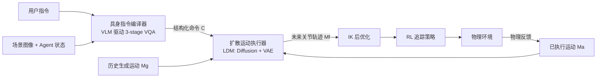

# Endowing GPT-4 with a Humanoid Body: Building the Bridge Between Off-the-Shelf VLMs and the Physical World

**会议**: ICLR 2026  
**OpenReview**: [https://openreview.net/forum?id=aQWSEjcN9V](https://openreview.net/forum?id=aQWSEjcN9V)  
**代码**: [Shadow-Dream/BiBo](https://github.com/Shadow-Dream/BiBo)  
**领域**: multimodal_vlm  
**关键词**: 具身智能、人形体代理、视觉语言模型、运动扩散、人场景交互

## 一句话总结

BiBo 框架通过"具身指令编译器 + 扩散运动执行器"两级结构，让 GPT-4 等现成 VLM 无需任何微调就能控制人形体代理完成复杂物理场景交互，单次任务成功率达 90.2%。

## 研究背景与动机

**领域现状**：人形体代理（Humanoid Agent）在场景感知与交互领域已有大量研究，现有方案主要分两类：一是收集大规模人-场景交互数据后训练专用模型（UniHSI、HumanVLA、TokenHSI）；二是用文本引导扩散模型生成动作序列再由 RL 追踪策略执行（CLoSD）。

**现有痛点**：专用训练路线因人形体结构复杂、物理世界多样，数据收集成本极高；扩散追踪路线在物理反馈处理上存在生成序列与已执行序列之间的不连续跳变（jitter），且缺少开放世界的语义规划能力。

**核心矛盾**：现成 VLM（GPT-4、Gemini 等）具备强大的开放世界推理能力，却与低层电机控制之间存在语义鸿沟——VLM 输出的是自然语言，而人形体需要精确的关节轨迹。

**本文目标**：不修改 VLM 权重，构建一套将 VLM 高层推理与人形体低层控制桥接起来的框架，复用 VLM 的泛化能力来减少数据收集成本。

**核心 idea**：类比计算机体系中"编译器→汇编器"的两级抽象，设计"具身指令编译器（Instruction Compiler）→扩散运动执行器（Motion Diffusion Executor）"：编译器将自然语言指令编译为结构化执行命令，执行器将命令翻译为连续物理动作序列，同时通过 LDM 融合物理反馈实现平滑过渡。

## 方法详解

### 整体框架

BiBo 由两个串联模块构成：**具身指令编译器**将用户高层指令（如"坐下休息"）与场景图像、Agent 状态联合输入给 VLM，输出结构化执行命令 $C = \{c, l, f, J\}$（动作描述 $c$、位置 $l \in \mathbb{R}^2$、朝向 $f$、关节目标集合 $J$）；**扩散运动执行器**接收命令 $C$ 并在物理环境中持续生成未来关节轨迹，通过 LDM 将已执行运动 $M_a$ 与上一帧生成运动 $M_g$ 联合解码，保持时序连续性。

### 关键设计

**1. 粗到细 VQA 三段式编译：将 VLM 视觉推理分解为属性分析→姿态推理→关节定位**

编译器将高层指令翻译为精确命令分为三步：①**基本属性分析**：VLM 结合场景图像与 Agent 状态，通过 5 路并行投票（Majority Voting）确定下一动作的运动描述 $c$、锚定目标物体 $o$ 及关键关节集合 $J$；②**位姿推理**：直接预测坐标对 VLM 困难，故将位置/朝向转化为图像标签识别任务——在锚定物体周围放置位置标签，VLM 从中选择标签，规避数值生成误差；③**关节目标生成**：在目标物体图像上铺 8×8 标签网格，VLM 选择关节目标点并从预定义方向集（上/下/前/后/向物体中心等）给出相对偏移，降低生成难度。这一设计将 VLM 的开放世界推理能力精确映射到结构化的人形体控制参数上。

**2. 基于 LDM 的双流融合执行器：用因果解码同时保证平滑性与物理感知**

扩散阶段以已执行运动的隐变量 $S_a = \text{Encoder}(M_a)$ 为条件，引导扩散过程感知物理反馈（碰撞、外力），生成未来隐变量 $S_f$。VAE 解码阶段将上一帧生成运动隐变量 $S_g$ 与 $S_f$ **拼接**后用 **因果自注意力（Causal Self-Attention）** 联合解码：

$$[M'_g : M_f] = \text{Decoder}([S_g : S_f])$$

因果机制保证 $M'_g = \text{Decoder}(S_g) \approx M_g$，因此 $M_f$ 与 $M_g$ 自然连续。相比单独使用已执行运动（引起跳变）或单独使用生成运动（忽视物理反馈），双流融合同时解决了两个问题。

**3. IK 后优化与 RL 追踪策略：精准关节控制的最后一公里**

扩散执行器输出的是关节轨迹的隐变量解码结果，执行前先经过**逆运动学（IK）后优化**将关节目标从命令 $J$ 精确对齐到生成轨迹，再由预训练的 RL 追踪策略驱动实际关节跟随。消融实验表明 IK 对精确接触类任务（Touch、Lift）贡献尤为显著——去掉 IK 后 Touch 成功率从 86.05% 降至 48.94%，Lift 从 65.42% 降至 6.80%。

## 实验关键数据

### 主实验

**任务成功率对比（随机生成场景，Tab. 1）**

| 任务/方法 | UniHSI | HumanVLA | TokenHSI | CLoSD | **BiBo (ours)** |
|-----------|--------|----------|----------|-------|-----------------|
| Reach ↑   | 93.28  | 56.58    | 94.55    | 85.83 | **99.18**       |
| Watch ↑   | -      | -        | -        | 87.76 | **99.62**       |
| Sit ↑     | 81.03  | -        | 72.95    | 76.99 | **95.84**       |
| Sleep ↑   | 85.11  | -        | 33.33    | 34.67 | **94.89**       |
| Touch ↑   | 69.62  | -        | -        | 42.55 | **86.05**       |
| Lift ↑    | -      | 44.90    | 48.19    | 7.71  | **65.42**       |
| 单任务均值↑ | -     | -        | -        | -     | **90.2%**       |
| 复合(Hard)↑| -     | -        | -        | 2.38  | **27.78**       |

注：其他方法使用 GT 规划，BiBo 在线规划，两者性能差距仅 4.38%。

**文本引导运动质量（HumanML3D，Tab. 3）**

| 方法 | FID↓ | R.P.@1↑ | 任意长度 | 物理合理 |
|------|------|---------|---------|---------|
| CLoSD | 2.861 | 0.367 | ✓ | ✓ |
| MotionLCM | 0.072 | 0.510 | ✗ | ✗ |
| **BiBo** | **0.076** | **0.542** | ✓ | ✗ |
| **BiBo (Phy.)** | 1.883 | 0.411 | ✓ | ✓ |

BiBo 非物理模式 FID 仅 0.076，较 CLoSD 改善 63.8%；物理模式 R.P.@1 较 CLoSD 提升约 11.8%（相对 +44.7 pp）。

**关节控制精度 MAE（Tab. 4）**

| 方法 | Head↓ | Hand↓ | Foot↓ |
|------|-------|-------|-------|
| DiP (CLoSD) | 0.0663 | 0.0830 | 0.0540 |
| MotionLCM | 0.0952 | 0.1470 | 0.0955 |
| **BiBo** | **0.0310** | **0.0571** | **0.0335** |

BiBo 全身关节控制误差显著最低，Hand MAE 相比 DiP 降低约 31%。

### 消融实验

| 配置 | Sit↑ | Touch↑ | Lift↑ | 说明 |
|------|------|--------|-------|------|
| w/o Voting | 91.13 | 85.82 | 59.75 | 多数投票提升稳定性 |
| w/o Label | 48.59 | 64.89 | 58.73 | 图像标签对位姿推理至关重要 |
| w/o Act. (执行流) | 84.18 | 81.80 | 28.34 | 去掉物理反馈导致 Lift 骤降 |
| w/o Gen. (生成流) | 95.62 | 84.40 | 56.58 | 去掉历史生成流影响连续性 |
| w/o IK | 95.96 | 48.94 | 6.80 | IK 对精确接触任务关键 |
| **BiBo (full)** | **95.84** | **86.05** | **65.42** | 所有设计均有贡献 |

平均关节加速度（连续性指标）：BiBo 0.0379 m²/s²，CLoSD 0.0610，w/o LDM 0.0879，验证了 LDM+因果解码对平滑性的贡献。

### 关键发现

- 图像标签替代坐标数值是编译器精度的最大贡献项（去掉后 Sit 从 95.84% 跌至 48.59%）
- 双流融合（Act.+Gen.）是平衡物理感知与运动平滑的唯一有效路径
- IK 后优化对精确接触任务（Touch/Lift）是不可或缺的最后一公里
- 用户研究中 BiBo 在 30 名志愿者评测中获得 77/150 偏好票，显著优于 MotionLCM（53）和 CLoSD（20）

## 亮点与洞察

- **无需微调复用 VLM**：BiBo 将 GPT-4o 视为黑盒，仅通过精心设计的提示链（3 阶段 VQA）挖掘其视觉推理能力，为"即插即用"嵌入新型 VLM 提供了清晰接口
- **编译器-汇编器类比**：将 CPU 体系结构的抽象层次引入具身智能，为"自然语言→动作"的层次化翻译提供了新的设计范式
- **LDM 的新颖应用**：将已执行运动和历史生成运动双流喂入 LDM，解决了此前扩散追踪方案长期存在的"物理感知与运动连续性不可兼得"矛盾
- 在线规划（无 GT Plan）与 GT Plan 的成功率差距仅 4.38%，证明 VLM 的规划能力足够实用

## 局限与展望

- 运动扩散执行器在 HumanML3D 上训练，数据规模有限，泛化能力受约束；更大规模运动数据集（如 Motion-X、LINGO）有望进一步提升
- 执行器通过历史运动感知物理反馈，但未显式建模场景几何（高度图、点云等），复杂接触场景（如攀爬、翻滚）处理能力不足
- 当前仅支持人-场景交互，手-物体交互和人-人交互尚未覆盖
- 物理模式（Phy.）的 FID 从 0.076 上升至 1.883，说明引入物理约束后运动真实感有所下降

## 相关工作与启发

- **vs UniHSI / TokenHSI**：基于接触语义的 HSI 方法依赖预定义接触图，泛化能力受场景类型约束；BiBo 以 VLM 取代接触图设计，开放世界适应性更强
- **vs CLoSD**：CLoSD 是最接近 BiBo 的扩散追踪方案，但其单一"从已执行运动延伸"导致连续性差；BiBo 的双流 LDM 设计完整解决了这一问题，且额外获得了 VLM 的规划能力
- **vs HumanVLA**：HumanVLA 采用视觉-语言-动作（VLA）端到端范式，对初始姿态对齐要求高；BiBo 的模块化设计对初始状态鲁棒性更好
- **对具身 LLM/VLM 研究的启发**：结构化中间表示（$C = \{c, l, f, J\}$）是将 VLM 输出与低层执行对齐的关键桥梁，可推广到机器人臂/轮式平台等更多具身形态

## 评分

- 新颖性: ⭐⭐⭐⭐ 编译器-汇编器类比框架 + LDM 双流融合均为原创设计，整体思路清晰新颖
- 实验充分度: ⭐⭐⭐⭐ 覆盖任务成功率、运动质量、控制精度、消融、用户研究多维度，随机场景评测设计严谨
- 写作质量: ⭐⭐⭐⭐ 逻辑清晰，类比直观，图文配合好，公式推导完备
- 价值: ⭐⭐⭐⭐ 为"无微调 VLM 控制具身体"提供了完整可复现方案，对具身 AI 社区有较高参考价值

<!-- RELATED:START -->

## 相关论文

- [\[ICLR 2026\] Enhancing Geometric Perception in VLMs via Translator-Guided Reinforcement Learning](enhancing_geometric_perception_in_vlms_via_translator-guided_reinforcement_learn.md)
- [\[ICLR 2026\] Teaching VLMs to Admit Uncertainty in OCR from Lossy Visual Inputs](teaching_vlms_to_admit_uncertainty_in_ocr_from_lossy_visual_inputs.md)
- [\[CVPR 2026\] PhyCritic: Multimodal Critic Models for Physical AI](../../CVPR2026/multimodal_vlm/phycritic_multimodal_critic_models_for_physical_ai.md)
- [\[CVPR 2026\] VCU-Bridge: Hierarchical Visual Connotation Understanding via Semantic Bridging](../../CVPR2026/multimodal_vlm/vcu-bridge_hierarchical_visual_connotation_understanding_via_semantic_bridging.md)
- [\[CVPR 2026\] Benchmarking Single-Factor Physical Video-to-Audio Generation](../../CVPR2026/multimodal_vlm/benchmarking_single-factor_physical_video-to-audio_generation.md)

<!-- RELATED:END -->
