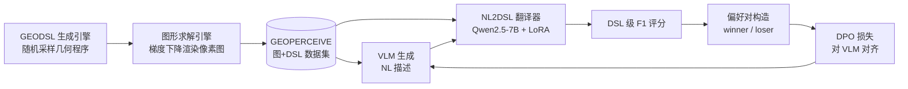

# Enhancing Geometric Perception in VLMs via Translator-Guided Reinforcement Learning

**会议**: ICLR 2026  
**代码**: https://github.com/Longin-Yu/GeoPerceive  
**领域**: multimodal_vlm  
**关键词**: 几何感知、视觉语言模型、领域特定语言、强化学习、DPO

## 一句话总结

提出 GEOPERCEIVE 基准（基于无歧义 DSL 的几何感知评测）和 GEODPO 框架（译者引导的强化学习），使 VLM 在保持自然语言输出的前提下，通过 NL→DSL 翻译器计算细粒度奖励信号，大幅提升几何图形感知与下游推理能力。

## 研究背景与动机

**领域现状**：几何问题求解（GPS）是多模态 VLM 的重要应用场景，当前主流方法以端到端方式对图形和文本进行联合推理，并用最终答案准确率衡量模型能力。然而即便是 GPT-o3、Qwen3-235B 等最强模型，也会将"相切"误判为"相交"、漏掉关键交点等基础感知错误。

**现有痛点**：一方面，现有 GPS 基准（MathVista、GeoQA 等）将感知错误与推理错误混杂，无法独立评估几何感知能力；另一方面，AlphaGeometry、Inter-GPS 等已有 DSL 均存在"一图多程序"歧义，同一图形可对应多条语义等价的 DSL，导致无法做精确的程序级评测。此外，直接在 DSL 上做监督微调（SFT）面临排列等价爆炸问题，且易使模型偏离预训练的自然语言分布。

**核心矛盾**：需要一套既无歧义、又可大规模自动生成的几何感知评测与训练体系，同时需要一种能绕开 SFT 局限、利用细粒度 DSL 级奖励对 VLM 进行对齐的训练范式。

**本文目标**：独立测量并提升 VLM 对点、线、圆等几何基元及其空间关系的感知能力，而非端到端优化最终答案。

**核心 idea**：设计规范化 DSL（GEODSL）作为几何图形的唯一形式表示；用"VLM 生成自然语言描述 → NL2DSL 翻译器将描述转回 DSL → 与真值 DSL 计算 F1 得分"的链路作为奖励函数，以 DPO 对 VLM 进行偏好对齐，让模型始终在自然语言空间输出，同时受到 DSL 级细粒度监督。

## 方法详解

### 整体框架

GEODPO 系统由三个组件协同工作：GEOPERCEIVE 数据引擎负责自动生成 (图, DSL) 数据对；NL2DSL 翻译器在合成语料上训练，将 VLM 的自然语言输出映射回 DSL；DPO 训练器利用翻译器打出的细粒度分数构造偏好对，对 VLM 做强化对齐。

### 关键设计

**1. GEODSL：无歧义的规范化几何 DSL**  
现有 DSL（AlphaGeometry、Inter-GPS 等）均存在"一图多程序"问题——同一几何关系可用不同构造顺序表达，导致评测时真值不唯一。GEODSL 采用描述性（relational）而非构造性（constructive）语句，将图形表示为四元组 G = ⟨P, L, C, R⟩（点集、线集、圆集、约束集），且点–曲线的关联关系内嵌于曲线声明中，保证每张图对应唯一 DSL 程序。图形复杂度可控：程序长度与元素数量线性增长，便于训练稳定化。

**2. GEOPERCEIVE 评测指标：基于匈牙利匹配的加权 F1**  
给定真值 G 与预测 Ĝ，对每类基元（点/线/圆/约束）分别构造相似度矩阵，通过匈牙利算法求最大权二分匹配，计算该类 F1；四类 F1 均等权重加权得到最终 Score(G, Ĝ)。相比序列级匹配，此评测对排列等价程序天然鲁棒，不会因元素顺序不同而给出不同分数。

**3. 梯度下降图形求解引擎**  
给定 GEODSL 程序，引擎将几何基元参数化（点坐标、线系数、圆心+半径），将所有几何约束转化为损失函数（如点在线上的距离平方），并叠加密度惩罚、分布惩罚、尺度/边界惩罚等视觉合理性正则项，通过 PyTorch 迭代优化渲染像素图。相比 SymPy 等符号求解器，基于梯度的方法易于扩展新类型约束，且实现框架自包含。

**4. 翻译器引导的 DPO 偏好对齐**  
核心思路是：VLM 不学着直接输出 DSL（避免分布漂移与排列爆炸），而是保持自然语言输出，由单独训练的 NL2DSL 翻译器（Qwen2.5-7B + LoRA，rank=4）将 NL 描述映射回 DSL 并评分。对每张训练图，从参考 VLM 采样 $N_\text{samples}=10$ 条 NL 描述，按翻译后的 DSL 得分排序，取前半段为 winner、后半段为 loser，要求分差 $\delta_\text{min}=0.3$ 以筛除信息量不足的对，随后使用标准 DPO 损失：
$$\mathcal{L}_\text{DPO} = -\mathbb{E}\left[\log\sigma\!\left(\beta\log\frac{\pi_\theta(S_w|D)}{\pi_\text{ref}(S_w|D)} - \beta\log\frac{\pi_\theta(S_l|D)}{\pi_\text{ref}(S_l|D)}\right)\right]$$
对 VLM 进行偏好对齐，使模型趋向生成几何精确的自然语言描述。

## 实验关键数据

### 主实验（GEOPERCEIVE Main-test，域内感知）

| 模型 | 方法 | Overall Score | Δ vs Raw |
|------|------|--------------|----------|
| Qwen2.5-VL 7B | Raw | 57.96 | — |
| Qwen2.5-VL 7B | SFT | 64.02 | +10.46% |
| Qwen2.5-VL 7B | **GEODPO** | **66.19** | **+14.2%** |
| InternVL3 8B | Raw | 58.44 | — |
| InternVL3 8B | SFT | 62.71 | +7.31% |
| InternVL3 8B | **GEODPO** | **67.41** | **+15.35%** |
| LLaVA-Next 7B | Raw | 41.01 | — |
| LLaVA-Next 7B | SFT | 51.10 | +24.60% |
| LLaVA-Next 7B | **GEODPO** | **51.86** | **+26.46%** |

### OOD 与下游推理

| 数据集 | 模型 | Raw | GEODPO | Δ |
|--------|------|-----|--------|---|
| GEOPERCEIVE-OOD（感知） | Qwen2.5-VL 7B | 58.14 | 60.28 | +3.68% |
| GEOPERCEIVE-OOD（感知） | InternVL3 8B | 58.74 | 60.91 | +3.69% |
| MathVista 几何子集（推理） | Qwen2.5-VL 7B | — | — | +39.0%（paper 综合报告） |

### NL2DSL 翻译器精度（GEOPERCEIVE Translator-test）

| 迭代次数 | 有效率 | Overall F1 | 点 F1 | 线 F1 | 圆 F1 | 约束 F1 |
|---------|--------|-----------|-------|-------|-------|---------|
| 1 | 100% | 94.2 | 97.8 | 98.0 | 85.1 | 95.9 |
| 3 | 100% | 87.4 | 94.7 | 93.3 | 71.7 | 89.8 |
| 整体均值 | 100% | 89.2 | 96.1 | 95.2 | 74.6 | 90.8 |

### 关键发现

- SFT 在 Constraint 类别上会出现性能**下降**（InternVL3 约束类 F1 下降 6.32%），而 GEODPO 在该类上稳定提升 +9.9%～+19.27%，说明 GEODPO 对"脆弱"约束关系有更稳健的提升。
- SFT 在 OOD 集合上几乎无收益（+0.46% 甚至 −0.29%），GEODPO 保持一致正增益，表明 RL 偏好对齐具有更强泛化能力。
- 翻译器在几何复杂度提升时（迭代 4～5）圆与约束类 F1 下降较大，是当前方法的主要性能瓶颈。

## 亮点与洞察

- **解耦感知与推理**：通过独立的感知基准，首次将"VLM 看不清图"与"VLM 推不对题"区分开来，为多模态模型诊断提供了新工具。
- **译者作为奖励桥梁**：利用 NL→DSL 翻译器将结构化形式评分"嫁接"到自然语言输出上，避免了直接 DSL 输出导致的分布漂移，是一种通用的"跨模态奖励注入"思路，可扩展到化学结构、代码等其他有形式语言的感知任务。
- **自动化数据管线**：生成引擎 + 求解引擎完全无需人工标注，可以按需生成任意复杂度的几何图形，大幅降低数据成本，为后续大规模预训练提供可能。
- **SFT 负迁移现象**：在约束类别上 SFT 反而下降的观察，对"任何任务都适合 SFT"的惯性认知提出了警示。

## 局限与展望

- 翻译器在高复杂度图形（圆与约束较多）上 F1 下降明显，直接制约了奖励信号质量，未来可引入更强翻译器或直接用 VLM 作为翻译器。
- GEODSL 目前覆盖标准欧式构型，对非标准几何（射影几何、坐标几何带数值等）尚无支持，限制了跨领域迁移。
- OOD 数据仅 100 条（10 名研究生手工标注），统计结论的置信区间有待进一步验证。
- DPO 范式对采样数量 $N_\text{samples}$ 较敏感，计算开销（每张图采 10 次）在大规模训练中可能成为瓶颈。

## 相关工作与启发

- **vs SFT on DSL**：直接 SFT 到 DSL 输出面临两大挑战——排列等价爆炸（多条 DSL 语义等价）和分布漂移（脱离 NL 预训练流形）。GEODPO 通过保持 NL 输出 + 外部翻译器评分绕开这两个问题。
- **vs AlphaGeometry / Inter-GPS**：这些 DSL 存在"一图多程序"歧义，GEODPO 用规范化的 GEODSL 解决了精确评测的基础问题。
- **vs MathVista / GeoQA（端到端基准）**：现有基准只看最终答案，GEODPO 揭示了感知错误是独立瓶颈，两类误差需分开处理。
- **vs RLVR（Verifiable Reward）**：与数学推理领域"答案验证作为奖励"的趋势一脉相承，本文将"DSL 级结构匹配"作为可验证奖励，是该范式在几何感知方向的应用拓展。

## 评分

- 新颖性: ⭐⭐⭐⭐ 无歧义 DSL + 译者奖励桥梁的组合设计较新颖，填补了几何感知独立评测的空白
- 实验充分度: ⭐⭐⭐⭐ 三个模型系列、域内+OOD+下游推理全面对比，消融分析到位
- 写作质量: ⭐⭐⭐⭐ 问题定义清晰，贡献边界明确，图表丰富
- 价值: ⭐⭐⭐⭐ 感知-推理解耦框架与译者引导奖励思路对多模态模型训练有较强启发

<!-- RELATED:START -->

## 相关论文

- [\[ICLR 2026\] MMDuet2: Enhancing Proactive Interaction of Video MLLMs with Multi-Turn Reinforcement Learning](mmduet2_enhancing_proactive_interaction_of_video_mllms_with_multi-turn_reinforce.md)
- [\[CVPR 2026\] GeoTikzBridge: Advancing Multimodal Code Generation for Geometric Perception and Reasoning](../../CVPR2026/multimodal_vlm/geotikzbridge_advancing_multimodal_code_generation_for_geometric_perception_and_.md)
- [\[ICLR 2026\] Breaking the SFT Plateau: Multimodal Structured Reinforcement Learning for Chart-to-Code Generation](breaking_the_sft_plateau_multimodal_structured_reinforcement_learning_for_chart-.md)
- [\[ICML 2026\] ACTIVE-o3: Empowering MLLMs with Active Perception via Pure Reinforcement Learning](../../ICML2026/multimodal_vlm/active-o3_empowering_mllms_with_active_perception_via_pure_reinforcement_learnin.md)
- [\[ICLR 2026\] GuirlVG: Incentivize GUI Visual Grounding via Empirical Exploration on Reinforcement Learning](guirlvg_incentivize_gui_visual_grounding_via_empirical_exploration_on_reinforcem.md)

<!-- RELATED:END -->
