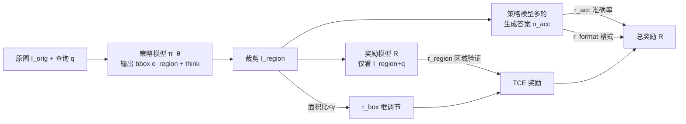

# ERGO: Efficient High-Resolution Visual Understanding for Vision-Language Models

**会议**: ICLR 2026  
**OpenReview**: [https://openreview.net/forum?id=ehKzPoOReW](https://openreview.net/forum?id=ehKzPoOReW)  
**代码**: [github.com/nota-github/ERGO](https://github.com/nota-github/ERGO)  
**领域**: 多模态VLM  
**关键词**: 高分辨率理解, coarse-to-fine, thinking with images, 强化学习, 视觉token效率

## 一句话总结
ERGO 用一套面向"效率"设计的 RL 奖励（区域验证奖励 + 框尺寸调节奖励），让 LVLM 在低分辨率粗看图上做"推理驱动的感知"——即使目标物体被降采样到看不清，也能借上下文线索定位到正确区域再放大重编码，在 V* 上比 Qwen2.5-VL-7B 高 4.7 分却只用 23% 的视觉 token、推理快 3 倍。

## 研究背景与动机
**领域现状**：高分辨率图像理解对真实场景的 LVLM 至关重要，近期 RL 后训练催生了"thinking with images"范式——模型不只用文本推理，还能裁剪高保真子图、输出 bounding box 坐标在视觉模态内推理，从而抓住细粒度细节。

**现有痛点**：高分辨率输入意味着海量视觉 token，算力开销极高。一个直接的省钱思路是 two-stage "coarse-to-fine"：先用降采样的粗图定位任务相关区域，再只把这些区域按原分辨率裁出来重编码。但现有方法（DeepEyes、PixelReasoner 等）都是"perception-driven reasoning"——先精确定位清晰可见的目标再推理，训练时几乎不接触降采样输入，一旦降采样后目标物体变得模糊不可辨，第一阶段就直接定位失败。

**核心矛盾**：粗看图省 token，但目标在粗图里"看不清"；要看清又得保留全部 token，省不下来。关键在于——能否在只有粗糙视觉线索时仍鲁棒地找到信息区域。

**本文目标**：训练目标显式对齐"视觉处理效率"，让模型学会在低分辨率、目标不可辨的输入下也能定位到正确区域。

**核心 idea**：把范式从"perception-driven reasoning"翻转为"reasoning-driven perception"——用多模态上下文（如"吸管通常在桌上的咖啡杯旁边"）推断该往哪看，并能容忍感知不确定性、适当扩大裁剪区域以覆盖模糊地带；这一切由专门设计的 RL 奖励来诱导。

## 方法详解

### 整体框架
ERGO 是基于 GRPO 的 RL 后训练 pipeline，策略模型 $\pi_\theta$（Qwen2.5-VL-7B）走一个两阶段多轮流程：① 给定原图 $I_{orig}$ 和查询 $q$，模型先输出候选 bounding box 坐标 $o_{region}$ 和思考轨迹；② 按坐标从原图裁出 $I_{region}=\text{crop}(I_{orig}, o_{region})$；③ 模型在多轮条件下结合历史交互与裁剪区域生成最终答案 $o_{acc}$。核心创新全在奖励设计——用一个冻结的 Qwen2.5-VL-72B 作奖励模型，专门为 coarse-to-fine 视觉接地推理量身定制奖励。

### 关键设计
**1. 区域验证奖励（Region-verification reward）：让裁剪区域"自给自足"。** 多数 thinking-with-images 方法把原图也喂给奖励模型 $R(\cdot|I_{orig}, I_{region}, q)$，但作者指出这是次优的——奖励模型会偷看原图、给查询额外提示，从而削弱"裁剪区域单独就够用"的目标。在 coarse-to-fine 场景下尤其致命，因为低分辨率原图本就线索稀少。ERGO 把奖励模型的输入只留下裁剪区域和查询：$o_{RM}\sim R(\cdot|I_{region}, q)$，$r_{region}=\mathbb{1}[\text{match}(o_{RM}, o_{GT})]$。这把"定位最优区域"这个复杂任务，转化为"用单张裁剪图答对问题"这个简单任务，逼着策略模型挑出真正信息充分的区域，且不需要额外标注。

**2. 框调节奖励（Box adjustment reward）：防止退化成"整图当裁剪"。** 只有区域奖励时，模型早期会走捷径——永远选整张图（整图必然自给自足，区域奖励满分），但这就完全失去了效率。于是用一个阶跃函数惩罚过大裁剪：$r_{box}=\mathbb{1}\left[\frac{\text{Area}(I_{region})}{\text{Area}(I_{orig})}\le\gamma\right]$。$\gamma$ 取值很关键——太低会逼出退化解，太高又失去灵活性。作者统计了 TreeVGR/VisCoT/V*/VGR 等数据集发现大多数 GT 区域占整图不到 60%，据此设 $\gamma=0.6$。

**3. TCE 奖励组合 + 常规奖励。** 把区域奖励与框调节奖励组合成主奖励 $r_{TCE}=\alpha\cdot r_{region}+\beta\cdot r_{box}$（$\alpha=1, \beta=0.5$，称为 reward weighting）。但 TCE 只间接促进答对，于是再补两个常规奖励：准确率奖励 $r_{acc}=\mathbb{1}[\text{match}(o_{acc}, o_{GT})]$ 直接优化答题正确性；格式奖励 $r_{format}$ 强制 `<think>`、`<answer>`、`<zoom>` 标签规范。最终总奖励 $R=r_{TCE}+r_{acc}+r_{format}$，用 GRPO 优化。

## 实验关键数据

### 主实验
基于 Qwen2.5-VL-7B-Instruct（策略）+ Qwen2.5-VL-72B-Instruct（冻结奖励），4×H100 训练，6 个高分辨率 VQA 基准平均分（Average）：

| 基准 | 像素约束 | 本文 ERGO | SOTA baseline | Δ |
|------|------|------|------|---|
| 6基准平均 | 1280×28×28 | **58.4** | MGPO 52.6 | +5.8 |
| 6基准平均 | 640×28×28 | **55.2** | TreeVGR 49.2 | +6.0 |
| V* | 1280×28×28 | **83.8** | MiniO3 81.2 | +2.6 |
| V* (vs 原模型16384约束) | 640 | 81.7 | Qwen2.5-VL-7B 77.0 | +4.7 |

### 消融实验
奖励设计消融（6 基准平均）：

| 配置 | 平均分 | 说明 |
|------|------|------|
| Qwen2.5-VL-7B | 52.4 | 基线 |
| A: 仅 r_acc | 53.5 | 只用准确率奖励 |
| B: 仅 r_region | 51.4 | 只用区域验证奖励 |
| C: +框调节奖励 | 54.9 | 加 r_box 防退化 |
| D: +reward weighting | 55.3 | α/β 加权 |
| E: ERGO(全) | **58.4** | 再加格式奖励等完整组件 |

奖励权重 $(\alpha,\beta)$ 消融：(1.0, 0.5) 取 58.4 为最优，优于 (1.0,1.0)=56.2、(0.5,0.25)=56.8、(1.0,2.0)=54.3。

### 关键发现
- **效率收益显著**：V* 上 640×28×28 时仅 1025 个视觉 token（原模型 16384 约束下 4471 个），推理延迟 1.61s vs 原模型 4.89s，约 3× 加速且单次工具调用即可。
- **Pareto 最优**：ERGO 在 640 约束下用比别人 1280 约束还少的 token 反超所有 baseline。
- **上下文鲁棒性（目标遮挡实验）**：当目标物体被黑框完全遮盖时，ERGO 的 Target Coverage Score 仍最高，证明它真的在用周边视觉/文本上下文而非死记目标外观。
- **无偏框预测**：固定 $\gamma$ 并未把模型偏向固定大小——在物体占满全帧的 MMVP 上预测大框、在物体很小的 MME-RWL 上预测小框，自适应数据特性。
- **不损伤通用能力**：在 CV-Bench/MMVP/Hallusion/POPE/MMBench/AI2D/ChartQA 等常规基准上 ERGO 基本持平或提升（如 CVBench-3D 73.0→80.3，Hallusion 47.1→52.3）。

## 亮点与洞察
- **把"奖励模型输入"作为设计变量**：去掉原图、只给裁剪区域，这个看似减法的改动恰恰是逼出"自给自足裁剪"的杠杆，思路干净有力。
- **范式翻转有据可循**：Motivation 里 Table 1 先证明"附加 GT 高分辨率子图不掉点"，再证明现有模型在低分辨率下定位失败，逻辑闭环地论证了 reasoning-driven perception 的必要性。
- **效率目标直接进训练目标**：不是事后剪 token，而是从奖励就对齐 token 预算，测试时还能灵活调像素约束。

## 局限与展望
- 依赖一个 72B 的冻结奖励模型参与训练，训练成本和复现门槛较高。
- $\gamma=0.6$ 来自数据集统计，跨域（如目标普遍占满全帧的任务）可能需要重新校准。
- 主打单次工具调用追求效率，对需要多步迭代放大的极端高分辨率/多目标场景，单轮裁剪是否够用还需更多验证。
- 奖励是 0/1 硬匹配（match GT answer），对开放式/长答案任务的可扩展性未充分探讨。

## 相关工作与启发
- **vs DeepEyes / PixelReasoner**：同属 thinking-with-images，但它们是 perception-driven、需要目标清晰可见，降采样后第一阶段就崩；ERGO 用 reasoning-driven perception 在模糊输入下靠上下文取胜。
- **vs VisionThink**：VisionThink 只决定"是否要处理整张高分辨率图"、不选子区域；ERGO 主动裁剪任务相关子区域，token 利用更精细。
- **vs MGPO**：MGPO 也走多轮但单推理阶段；ERGO 的两阶段 + 自给自足奖励带来更高准确率与更省 token。
- **vs TreeVGR**：TreeVGR 只在 bbox 坐标上做纯文本推理、不做视觉重编码，天然不兼容 coarse-to-fine；ERGO 真正重编码裁剪区域。

## 评分
- 新颖性: ⭐⭐⭐⭐ "reasoning-driven perception"的范式翻转加"只喂裁剪区域给奖励模型"的设计角度新颖，是该任务首个明确论证上下文推理价值的工作。
- 实验充分度: ⭐⭐⭐⭐⭐ 6 个高分辨率基准 + 8 个常规基准、token/延迟对比、奖励消融、权重消融、遮挡鲁棒性与无偏框分析齐全。
- 写作质量: ⭐⭐⭐⭐ Motivation→Method→Analysis 逻辑严密，图表（Fig.1 对比、Pareto 图）直观有力。
- 价值: ⭐⭐⭐⭐⭐ 同时拿下更高精度 + 3× 加速 + 23% token，对真实部署的高分辨率 LVLM 极具实用价值，代码开源。

<!-- RELATED:START -->

## 相关论文

- [\[ECCV 2024\] FlexAttention for Efficient High-Resolution Vision-Language Models](../../ECCV2024/multimodal_vlm/flexattention_for_efficient_high-resolution_vision-language_models.md)
- [\[CVPR 2026\] SenseSearch: Empowering Vision-Language Models with High-Resolution Agentic Search-Reasoning via Reinforcement Learning](../../CVPR2026/multimodal_vlm/sensesearch_empowering_vision-language_models_with_high-resolution_agentic_searc.md)
- [\[ICLR 2026\] Shuffle-R1: Efficient RL Framework for Multimodal Large Language Models via Data-centric Dynamic Shuffle](shuffle-r1_efficient_rl_framework_for_multimodal_large_language_models_via_data-.md)
- [\[ICLR 2026\] One Patch Doesn't Fit All: Adaptive Patching for Native-Resolution Multimodal Large Language Models](one_patch_doesnt_fit_all_adaptive_patching_for_native-resolution_multimodal_larg.md)
- [\[ICLR 2026\] Reading Images Like Texts: Sequential Image Understanding in Vision-Language Models](reading_images_like_texts_sequential_image_understanding_in_vision-language_mode.md)

<!-- RELATED:END -->
