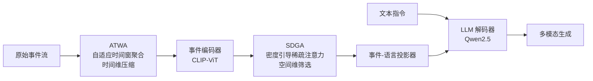

# EventFlash: Towards Efficient MLLMs for Event-Based Vision

**会议**: ICLR 2026  
**OpenReview**: [https://openreview.net/forum?id=QuvGqzLwf6](https://openreview.net/forum?id=QuvGqzLwf6)  
**代码**: [https://github.com/XduSyL/EventFlash](https://github.com/XduSyL/EventFlash)  
**领域**: 多模态大模型 / 事件相机视觉  
**关键词**: 事件相机, 多模态大模型, 时空 token 稀疏化, 长序列理解, 课程学习  

## 一句话总结
EventFlash 利用事件流天然的时空稀疏性，设计自适应时间窗聚合与密度引导注意力两个 token 稀疏化模块，把事件 MLLM 的推理吞吐提升 12.4×，并把可处理的事件 bin 数从 EventGPT 的 5 个扩展到 1000 个。

## 研究背景与动机
**领域现状**：事件相机（event camera）以微秒级时间分辨率、高动态范围异步输出像素亮度变化，天然适合高速运动和弱光场景。把 MLLM 扩展到事件视觉的主流做法，是先把事件流转成稠密的、类图像的表示，再喂给 LLaVA / Qwen 之类的现成模型（如 EventGPT、EventVL、LLaFEA）。

**现有痛点**：这种"稠密化"范式完全无视了事件流的时空稀疏本质——事件流里大量像素位置根本没有事件，强行铺成稠密 token 会引入海量冗余。后果有两个：一是计算开销巨大，二是严重限制了能处理的事件序列长度（EventGPT 只能吃 5 个 bin，等于只能看"一瞬间"，无法做长程理解）。

**核心矛盾**：事件流的冗余来源和视频不同。视频冗余主要来自规则 patch 网格上的空间重复，而事件流是不规则分布、密度差异极大的稀疏时空点，冗余来自不均匀的时间采样。所以现成的视频 token 稀疏化方法搬过来既贵又不管用。

**本文目标**：不追求把推理精度刷到最高，而是专门解决高效 MLLM 的三个挑战——(i) **时间低效**：微秒分辨率在长时段下产生天量 token；(ii) **空间低效**：稀疏性导致大量空 token 还被均匀分配注意力；(iii) **数据缺口**：现有指令数据集不公开、场景单一、序列短。

**核心 idea**：`密度感知的时空 token 稀疏化`——在时间维用自适应窗口聚合压缩 token，在空间维用密度引导注意力筛掉空/低密度区域，再配合一个从短到长的课程学习策略和自建的 50 万条指令大数据集 EventMind。

## 方法详解

### 整体框架
EventFlash 是一条端到端的事件 MLLM 流水线，由五个模块串成：原始事件流先经 **自适应时间窗聚合（ATWA）** 把连续流切成细 bin 并按相似度/密度自适应合并，压缩后的 bin 送入 **事件编码器**（CLIP-ViT）提语义嵌入；并行地，**密度引导稀疏注意力（SDGA）** 在空间维筛选有信息的 token、压制空白区；随后 **事件-语言投影器** 把事件 token 对齐到文本空间，最终与文本 token 一起交给 **LLM 解码器**（Qwen2.5）做生成。整套系统再用一个短→长的三阶段课程学习训练。

### 关键设计

**1. 自适应时间窗聚合（ATWA）：用两级密度引导合并压掉时间冗余。** 微秒级事件流会炸出天量时间 token，ATWA 分两级把它们压缩还保住运动动态。第一级做"密度引导的物理合并"：把事件流切成细 bin，每个 bin 当作一个带极性的时空点过程，用强度函数 $\lambda_B(x,y,t,p)=\sum_{e_n\in B} f(p_n)\cdot \exp\!\big(-\frac{(x-x_n)^2}{2\sigma_x^2}-\frac{(y-y_n)^2}{2\sigma_y^2}-\frac{(t-t_n)^2}{2\sigma_t^2}\big)$ 刻画，相邻 bin 的距离取强度差的范数 $D(B_i,B_{i+1})=\lVert\lambda_{B_i}-\lambda_{B_{i+1}}\rVert_2$，距离低于阈值 $\tau$ 就迭代合并成 meta 窗口。第二级做"语义感知合并"：每个窗口过 ViT 取 CLS token $z_i$，相邻窗口算余弦相似度 $S_i=\frac{z_i^\top z_{i+1}}{\lVert z_i\rVert\lVert z_{i+1}\rVert}$，再引入归一化密度因子 $r_i$ 算出最终合并分数 $A_i=S_i\cdot\exp(-\alpha\cdot r_i)$——语义越相似、密度越低的窗口越容易被合并。这样既保留了关键时间线索，又把序列长度大幅压缩。

**2. 密度引导稀疏注意力（SDGA）：让注意力听密度的话，砍掉空白 token。** 时间压完后空间维仍有冗余，因为事件在传感器平面上分布极不均匀。SDGA 对每个聚合后的 bin 用 ViT 取 patch 级特征 $\{x_j\}$ 走标准多头注意力 $\text{Attention}(Q,K,V)=\text{softmax}(\frac{QK^\top}{\sqrt{d_k}})V$，但在算注意力分数时额外注入密度信号：每个 token 区域的事件密度 $D_j$ 经一个"线性+GELU"的密度编码单元变成软调制信号 $f(D_j)=\text{GELU}(\text{Linear}(D_j))$，直接加到注意力分数上 $\tilde A_{ij}=\frac{Q_iK_j^\top}{\sqrt{d_k}}+f(D_j)$，使模型偏向更密、更重要的区域。最后用 Token Selector 对聚合后的响应排序、丢掉低重要度 token：$\hat x_i=\text{TokenSelector}\big(\sum_j \text{softmax}(\tilde A_{ij})\cdot V_j\big)$。语义相关性 × 事件密度双判据，让空间 token 既紧凑又不丢关键细节。

**3. 短到长课程学习：从对齐到长程推理逐步加码。** 不同于 EventVL/EventGPT 那种"按模块分阶段"训练，EventFlash 按事件时长从短到长渐进。Stage 1 只训事件-语言对齐模块（学习率 $2\times10^{-3}$、batch 64），用 20 万条 0–50 ms 短序列配简单场景描述建立基础跨模态理解；Stage 2 解冻全部参数（学习率 $2\times10^{-5}$），用 11 万条 50–5000 ms 中等序列学复杂动作和事件 QA；Stage 3 再用 19 万条 5000–20000 ms 长序列做丰富场景描述与开放式生成。这种平滑的难度爬升让模型从"会对齐"长成"能做长程推理"。

**4. EventMind 数据集：补上长序列、多场景的指令数据缺口。** 为支撑课程训练，作者自建了 50 万条指令、覆盖 7 类任务的大规模事件数据集。原始事件来自真实采集（DSEC、N-ImageNet、HARDVS、E2VID）和合成（用 V2E 模拟器把 Kinetics-700、UCF-101 等视频转成事件流，转换前先用 GPT-4o 按 caption 过滤低质视频）。文本指令分两条路：有标注的用 GPT-4o 精炼去掉纹理/颜色等静态属性以贴合事件流，无标注的用 Qwen-VL-Max 从视频自动生成，再由多人团队人工质检。数据按 0–50 ms / 50–5000 ms / 5000–20000 ms 三档时长对齐课程三阶段。

## 实验关键数据

### 主实验表格
在自建 EventMind 与 EventChat-Sub 上对比视频 MLLM 和事件 MLLM（节选）：

| 模型 | 参数 | Max Bins | 吞吐(Token/s) | GDC | FGQA | HAQA | MCQA |
|------|------|----------|---------------|-----|------|------|------|
| Qwen2.5-VL | 3B | 768 | – | 20.6 | 41.7 | 23.8 | 34.6 |
| VideoChat2-Flash | 7B | 1000 | – | 36.2 | 41.9 | 18.9 | 48.2 |
| EventGPT-7B | 7B | 5 | 42.2 | – | – | – | – |
| EventFlash-Zero | 3B | 1000 | 2.3 | 45.3 | 60.4 | 85.0 | 58.2 |
| **EventFlash-3B** | 3B | 1000 | **28.5** | 46.8 | 61.1 | 84.9 | 60.0 |
| **EventFlash-7B** | 7B | 1000 | 24.0 | **52.3** | **64.2** | **87.6** | **63.1** |

EventFlash 在全部四项任务上超过所有视频 MLLM 和 EventGPT；相比 EventGPT 的 5 bin，能处理 1000 bin（200× 容量），3B 版吞吐 28.5 Token/s 比无稀疏的 EventFlash-Zero（2.3）快 **12.4×**。

### 消融实验表格
组件消融（S=空间稀疏，T=时间稀疏）：

| 模型 | S | T | Token/s | GDC | FGQA | HAQA | MCQA |
|------|---|---|---------|-----|------|------|------|
| Baseline | ✗ | ✗ | 2.3 | 45.3 | 60.4 | 85.0 | 58.2 |
| A | ✓ | ✗ | 5.3 (2.3×) | 46.3 | 61.2 | 85.1 | 59.6 |
| B | ✗ | ✓ | 14.0 (6.1×) | 47.1 | 60.6 | 83.8 | 60.3 |
| Ours | ✓ | ✓ | 28.5 (12.4×) | 46.8 | 61.1 | 84.9 | 60.0 |

聚合间隔的影响：10 ms 是精度/效率拐点（28.5 Token/s），5 ms 太细吞吐降到 15.8，20/30 ms 吞吐升到 52.6/63.3 但 GDC、HAQA 明显掉点。密度因子 $\alpha$ 在 0.1–0.4 间精度稳定。

### 关键发现
- 时间稀疏贡献的加速（6.1×）远大于空间稀疏（2.3×），两者叠加得 12.4×——时间冗余是事件流的主要瓶颈。
- 大幅压缩 token 后四项精度基本不掉甚至略升，说明被砍掉的确实是冗余而非有效信息。
- 在子弹击碎玩偶（高速）和夜间街道（弱光）这类帧相机会失效的极端场景，EventFlash 仍能给出细粒度准确描述。

## 亮点与洞察
- **抓住"事件流冗余 ≠ 视频冗余"这个根本差异**，把稀疏化建立在事件密度上而非规则网格上，是方法成立的关键洞察。
- **把物理强度建模（时空点过程）和语义相似度（CLS token）两级结合**做时间合并，既尊重事件的物理特性又利用了编码器语义，比单纯按帧合并更合理。
- **效率优先而非精度优先的定位很务实**：长程事件理解（1000 bin）本身就是 EventGPT 这类方法做不到的，把吞吐和序列长度当一等目标，打开了监控、自动驾驶等真实长序列应用。
- 顺手贡献了一个 50 万条、7 任务、覆盖短中长序列的公开数据集，对事件 MLLM 社区是稀缺基础设施。

## 局限与展望
- 评测主要在自建 EventMind 上，虽也报了 EventChat-Sub，但缺少更多第三方独立基准，自建数据 + 自建评测的组合让绝对数值的可比性打折扣。
- 开放式任务（GDC、FGQA）用 GPT-4o 当 LLM-Judge，评分本身带模型偏差。
- 7B 版吞吐（24.0）反而低于 3B 版（28.5），稀疏化收益与模型规模的关系没充分讨论。
- 合成事件靠 V2E 从视频模拟，与真实事件相机的噪声/触发特性仍有 gap，可能影响真实部署泛化。

## 相关工作与启发
- **事件 MLLM**：EventGPT（首个事件 MLLM，稠密 token）、EventVL（RGB+事件融合）、LLaFEA（帧-事件区域级 grounding）；EventFlash 的差异是把"稀疏性"当成一等公民而非负担。
- **MLLM token 稀疏化**：CLIP 视觉 token 冗余、视频领域的各类 token 压缩方法，但都假设规则网格冗余；本文指出对不规则事件流需重新设计稀疏化。
- **启发**：当输入模态有强结构先验（这里是时空稀疏）时，与其套用现成的稠密化管线，不如把先验直接编进 token 设计——"密度引导"这一思路可迁移到点云、雷达等其他稀疏模态的 MLLM。

## 评分
- **新颖性**: ⭐⭐⭐⭐ 把事件流稀疏性系统地编进时空 token 稀疏化（物理强度 + 语义 + 密度三判据），定位清晰、切入点扎实，虽各子模块借鉴成熟思路但组合针对事件流是新的。
- **实验充分度**: ⭐⭐⭐⭐ 主实验跨 3B/7B、对比视频与事件 MLLM，消融覆盖组件/聚合间隔/密度因子；扣分在过度依赖自建数据与 GPT-4o 评测。
- **写作质量**: ⭐⭐⭐⭐ 三个挑战→三个模块的对应关系清晰，公式与流水线图完整，故事线连贯。
- **价值**: ⭐⭐⭐⭐ 解决了事件 MLLM 长序列理解的真实瓶颈（5 bin→1000 bin、12.4× 吞吐），加上公开数据集，对事件视觉社区有实际推动力。

<!-- RELATED:START -->

## 相关论文

- [\[CVPR 2026\] Parameter-Efficient Adaptation for MLLMs via Implicit Modality Decomposition](../../CVPR2026/multimodal_vlm/parameter-efficient_adaptation_for_mllms_via_implicit_modality_decomposition.md)
- [\[CVPR 2026\] RE-VLM: Event-Augmented Vision-Language Model for Scene Understanding](../../CVPR2026/multimodal_vlm/re-vlm_event-augmented_vision-language_model_for_scene_understanding.md)
- [\[CVPR 2026\] Learning to See through Illumination Extremes with Event Streaming in Multimodal Large Language Models](../../CVPR2026/multimodal_vlm/learning_to_see_through_illumination_extremes_with_event_streaming_in_multimodal.md)
- [\[ICLR 2026\] ERGO: Efficient High-Resolution Visual Understanding for Vision-Language Models](ergo_efficient_high-resolution_visual_understanding_for_vision-language_models.md)
- [\[ICLR 2026\] Efficient Discriminative Joint Encoders for Large Scale Vision-Language Re-ranking](efficient_discriminative_joint_encoders_for_large_scale_vision-language_rerankin.md)

<!-- RELATED:END -->
