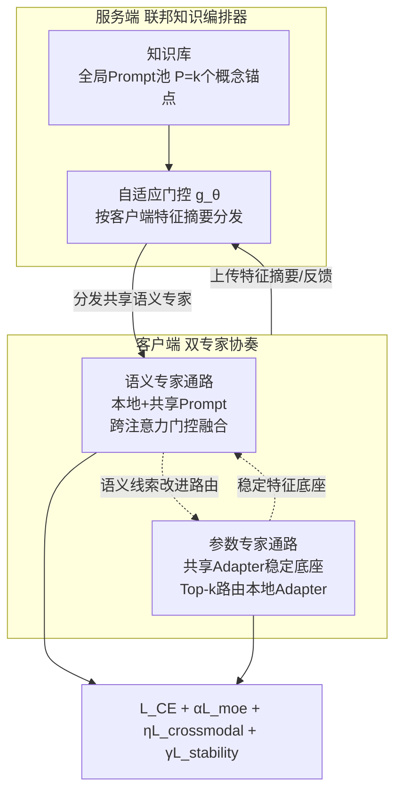

# Fed-Duet: Dual Expert-Orchestrated Framework for Continual Federated Vision-Language Learning

**会议**: ICLR 2026  
**OpenReview**: [https://openreview.net/forum?id=Jk8g1OxyZY](https://openreview.net/forum?id=Jk8g1OxyZY)  
**代码**: 已开源（论文标注 FedDuet）  
**领域**: 多模态 VLM / 联邦持续学习  
**关键词**: 联邦持续学习, CLIP, 视觉语言模型, Mixture-of-Experts, 参数高效微调, 灾难性遗忘  

## 一句话总结
Fed-Duet 把联邦持续学习里的 VLM 适配拆成"语义专家（prompt）+ 参数专家（adapter）"两条互补通路，由服务端知识编排器自适应分发共享语义专家、客户端用跨注意力门控融合本地/共享专家，配合路由一致性损失和专家稳定性损失，在非 IID + 任务流式演化场景下同时缓解遗忘并保住跨模态对齐。

## 研究背景与动机
- **领域现状**：CLIP 这类预训练 VLM 给联邦学习（FL）带来了强多模态表征能力，但模型太大、全量微调通信成本爆炸，于是社区普遍用参数高效微调（PEFT，prompt-tuning / adapter-tuning）只训练并传输一小撮参数。
- **现有痛点**：现实边缘环境里任务是**持续演化的流式数据**且客户端**非 IID**，这就进入联邦持续学习（FCL）范式。但现有方案两头都不讨好——传统 FCL 方法是单模态设计、依赖全模型更新，既算不动又会破坏 CLIP 的跨模态对齐；而把单一 PEFT 策略搬到 FCL，又会出问题。
- **核心矛盾**：(1) **适配失衡**——只用高层 prompt 抓不住客户端细粒度特性，只用底层 adapter 又削弱全局语义一致性；(2) **跨模态错位**——把稀疏异构的 PEFT 更新跨客户端聚合，会扰乱 VLM 内在的图文对齐。已有 MoE-for-FCL 工作（如 MoAFCL）只在服务端 adapter 上做 MoE，忽视了语义引导。
- **本文目标**：设计一个编排式框架，同时治"适配失衡"和"跨模态错位"，在高效通信前提下做到持续适配不遗忘。
- **核心 idea**：**双专家协奏（Dual-Expert Duet）**——把语义对齐（prompt 专家）和参数化特征变换（adapter 专家）解耦成两条互补通路，由服务端编排器统一调度，并用两个辅助损失分别守住对齐和抗遗忘。

## 方法详解

### 整体框架
Fed-Duet 由两个协同模块构成：**服务端的联邦知识编排器（Federated Knowledge Orchestrator）**负责知识协调，用全局知识库 + 自适应门控按客户端特征分发定制的共享语义专家；**客户端的双专家协奏（Dual-Expert Duet）**用两条并行通路解决适配失衡——语义通路用跨注意力门控融合本地与共享 prompt 提供语义引导，参数通路微调 adapter 做细粒度特征专精。整套架构额外由跨模态损失和稳定性损失约束，护住对齐、抗遗忘。

### 关键设计

**1. 联邦知识编排器：把服务器从"聚合器"升级成"知识调度员"。** 全局 Prompt 池 $P=\{p_1,\dots,p_K\}$ 不做随机初始化，而是对大词表（如 ImageNet-1k 类名）的词嵌入做 K-Means 聚类得到 $K$ 个概念锚点 $\{c_1,\dots,c_K\}$，每个 prompt 用模板"a photo of [CLS]"构造、把可学习 [CLS] token 直接用对应质心 $c_k$ 初始化，从一开始就让知识库语义多样且有语言结构。分发上引入自适应门控网络 $g_\theta$，它根据客户端**保隐私的特征摘要** $\tilde f_c$（批平均得到的全局统计量，不暴露单条数据）来挑最优专家下发，由损失加权 BCE 优化：$L_{gate}=\sum_{c\in S_r} w_c\cdot \ell_{BCE}(g_\theta(\tilde f_c), y_c)$，权重 $w_c=1/(L^{final}_c+\epsilon)$ 让产生更低客户端损失的专家选择被优先学习——服务器因此学会"分发最有效的知识"，且实验证明这套摘要机制在差分隐私噪声注入下仍稳健。

**2. 双专家协奏：语义与参数解耦的两条互补通路。** 语义通路把可学习 prompt 当作语义专家，用双流跨注意力同时关注捕捉客户端特性的**本地语义专家**和服务器下发的**共享语义专家**，两路各出 logits 后按样本加权融合：$Logits_{final}=\lambda\cdot logits_{local}+(1-\lambda)\cdot logits_{shared}$，从而逐样本动态平衡个性化与共享引导。参数通路则补上 prompt 不具备的"直接变换内部特征"能力——共享 Adapter 始终激活提供稳定可泛化的特征底座，本地 Adapter 经 Top-k 路由按需激活做高效个性化。两条通路形成双向增益：参数通路稳定的特征底座让语义引导更精准，精炼后的语义信号又给参数专家提供更清晰的路由线索。

**3. 渐进式解耦优化：先稳后精，化解通路间优化冲突。** 为兑现上面的双向协同，训练分阶段进行——**先单独训练参数专家**建立稳定特征基础，**再冻结它们去训练语义专家**提供精确语义引导。这个渐进调度保证"稳定参数底座赋能语义引导，语义引导反过来改进后续参数专精"，避免两类专家同时更新时互相干扰。

**4. 协同多目标损失：一条对齐、一条抗遗忘。** 客户端总损失 $L_{client}=L_{CE}+\alpha L_{moe}+\eta L_{cross\,modal}+\gamma L_{stability}$。其中**路由一致性损失** $L_{cross\,modal}$ 借鉴 CLIP 对比目标，约束图像与其配对文本的专家路由保持一致：$L_{cross\,modal}=\tfrac{1}{2}\big(CE(S/\tau, y)+CE(S^\top/\tau, y)\big)$（$S$ 是 batch 内图文路由分布算出的相似度矩阵，$\tau$ 控温），用对称交叉熵把专家引向模态不变表征，治标准 MoE 层破坏图文对齐的毛病。**专家稳定性损失** $L_{stability}=D_{KL}(p^{(t)}\Vert \bar p^{(t-1)})$ 则像对路由策略做知识蒸馏，把当前任务路由分布 $p^{(t)}$ 拉近历史策略 $\bar p^{(t-1)}$（按层用指数滑动平均维护），在专家层面抗遗忘。

## 实验关键数据

### 主实验表格
CIFAR-100 / Tiny-ImageNet 上的类增量（T=5/10）、不同非 IID 程度（Dirichlet β）平均/末任务准确率（节选）：

| 数据集 | 方法 | IID T=10 Avg | β=0.1 T=10 Avg | β=0.1 T=10 Last |
|---|---|---|---|---|
| CIFAR-100 | FedKNOW | 79.27 | 77.55 | 72.16 |
| CIFAR-100 | pFedMoAP | 76.80 | 58.46 | 50.61 |
| CIFAR-100 | MoAFCL | 77.72 | 68.47 | 60.73 |
| CIFAR-100 | **Fed-Duet** | **86.22** | **84.22** | **75.88** |
| Tiny-ImageNet | FedKNOW | 77.68 | 75.68 | 70.18 |
| Tiny-ImageNet | MoAFCL | 74.17 | 66.84 | 59.33 |
| Tiny-ImageNet | **Fed-Duet** | **83.52** | **81.56** | **73.57** |

DomainNet 域增量（域泛化）：

| 方法 | Avg Acc ↑ | Last Acc ↑ |
|---|---|---|
| FedCLIP | 62.83 | 60.04 |
| pFedMoAP | 59.98 | 56.35 |
| MoAFCL | 60.92 | 52.52 |
| **Fed-Duet** | **68.47** | **66.05** |

### 消融实验表格
核心组件消融（Avg Acc / Forgetting）：

| 变体 | Avg Acc ↑ | Forget ↓ |
|---|---|---|
| Base-w/o PE（只语义专家） | 64.34 | 11.89 |
| Base-w/o SE（只参数专家） | 70.64 | 8.89 |
| Base（双专家） | 77.96 | 9.22 |
| Base + L_crossmodal | 79.09 | 8.96 |
| Base + L_stability | 79.46 | 8.02 |
| **Full** | **80.43** | **7.82** |

### 关键发现
- **绝对精度领先**：CIFAR-100（β=0.1, T=10）比最强基线 FedKNOW 高 6.67%。
- **抗异构极稳**：严重非 IID 下 pFedMoAP 掉 24%，Fed-Duet 仅掉约 2%。
- **跨模态对齐数量级提升**：基线对齐分常年卡在 ~0.06，Fed-Duet 达 0.2003（3× 提升）；I2T R@1 +13.16%、T2I R@1 +6.20%。
- **隐私兼容**：高噪声差分隐私（σ=10）下精度退化 <0.3%；梯度重建攻击下 SSIM≈0.01、PSNR<9 dB，特征聚合本身即提供主防护。
- **消融印证**：只语义/只参数都次优，双专家协同显著提分；两个辅助损失一治遗忘、一提对齐，叠加后同时拿到最高精度和最低遗忘。

## 亮点与洞察
- **"语义 prompt + 参数 adapter"双专家解耦**精准对应了 FCL-VLM 的两类需求（全局语义一致 vs. 客户端细粒度特化），比单一 PEFT 或纯 MoE-adapter 更对症。
- **路由一致性损失**是一个巧思：MoE 路由本来会割裂图文对齐，作者反过来用 CLIP 式对称对比目标去约束图、文路由分布一致，把"对齐"这个 VLM 命脉做成可监督的正则。
- **渐进解耦优化**用训练调度而非更复杂结构来化解多目标冲突，工程上轻量好落地。
- 服务端从聚合器升级成"知识编排器"，配合 K-Means 概念锚点初始化，让全局 prompt 池自带语义先验，是个可复用的设计模式。

## 局限与展望
- 实验只在 1 server + 5 client 的小规模联邦系统上验证，大规模客户端、客户端掉线/异步等真实联邦动态未充分检验。
- 评测基准仍以分类型 CL（CIFAR-100 / Tiny-ImageNet / DomainNet）为主，未覆盖更复杂的多模态下游任务（检索、VQA、caption 的持续学习）。
- 引入了多个超参（λ、α、η、γ、τ、Top-k、专家数 K）和分阶段训练，调参与稳定性成本未详细讨论。
- 隐私结论基于梯度重建攻击与 DP 噪声实验，缺少更强威胁模型（成员推断、属性推断）下的系统评估。

## 相关工作与启发
- **联邦 VLM / PEFT**：PromptFL、pFedPrompt（联邦 prompt-tuning）、FedCLIP（联邦 adapter）、CLIP2FL，多聚焦静态 FL，Fed-Duet 把它们推进到持续、非平稳的 FCL。
- **联邦持续学习**：FedWeIT（参数级转移）、FedKNOW（梯度级）、Fed-CPrompt（轻量 prompt + 对比损失），但都是单模态设计，难护跨模态对齐。
- **MoE 用于 CL/FCL**：Switch Transformer、MoE-Adapters for CL、MoAFCL（仅服务端 adapter MoE）。Fed-Duet 的差异化在于同时统一"语义引导 + 参数专精"两类专家并做联邦编排。
- **启发**：把"对齐约束"显式写进路由层的损失，是将基础模型固有归纳偏置迁移到下游持续学习的通用思路，可推广到其他多模态 MoE 微调场景。

## 评分
- **新颖性**: ⭐⭐⭐⭐ 首次把联邦持续 VLM 适配显式拆成语义/参数双专家并联邦编排，路由一致性损失把跨模态对齐做成可监督正则，组合新颖。
- **实验充分度**: ⭐⭐⭐⭐ 三基准 × 多非 IID 程度 × 域增量 + 跨模态对齐/检索 + 隐私鲁棒性 + 组件/损失消融，较全面；但联邦规模偏小、下游任务类型单一。
- **写作质量**: ⭐⭐⭐⭐ 动机—矛盾—方法逻辑清晰，图表完整，公式与损失定义明确。
- **价值**: ⭐⭐⭐⭐ 给"边缘端持续适配大型 VLM"提供了可落地的高效框架，对联邦多模态方向有实用与方法论双重参考价值。

<!-- RELATED:START -->

## 相关论文

- [\[ICLR 2026\] Enhanced Continual Learning of Vision-Language Models with Model Fusion](enhanced_continual_learning_of_vision-language_models_with_model_fusion.md)
- [\[ICLR 2026\] Reversible Primitive–Composition Alignment for Continual Vision–Language Learning](reversible_primitivecomposition_alignment_for_continual_visionlanguage_learning.md)
- [\[ECCV 2024\] Select and Distill: Selective Dual-Teacher Knowledge Transfer for Continual Learning on Vision-Language Models](../../ECCV2024/multimodal_vlm/select_and_distill_selective_dual-teacher_knowledge_transfer_for_continual_learn.md)
- [\[ICLR 2026\] pFedMMA: Personalized Federated Fine-Tuning with Multi-Modal Adapter for Vision-Language Models](pfedmma_personalized_federated_fine-tuning_with_multi-modal_adapter_for_vision-l.md)
- [\[ICLR 2026\] Memory-Free Continual Learning with Null Space Adaptation for Zero-Shot Vision-Language Models](memory-free_continual_learning_with_null_space_adaptation_for_zero-shot_vision-l.md)

<!-- RELATED:END -->
