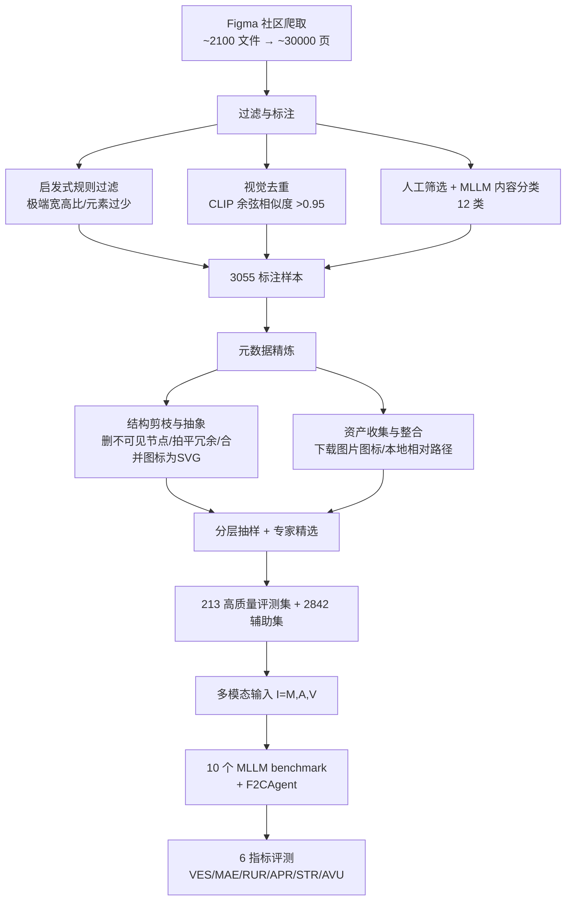

# Figma2Code: Automating Multimodal Design to Code in the Wild

**会议**: ICLR 2026  
**OpenReview**: [https://openreview.net/forum?id=CaXZB6bI31](https://openreview.net/forum?id=CaXZB6bI31)  
**代码**: GitHub + Hugging Face（论文中提供，地址待确认）  
**领域**: 多模态 / Design-to-Code / UI 代码生成  
**关键词**: Figma2Code, 多模态设计转代码, MLLM, UI 代码生成, Benchmark, Figma 元数据  

## 一句话总结
本文提出 **Figma2Code** 这一新任务和数据集，把"设计转代码"从只看截图的图像单模态，推进到包含 Figma 元数据 + 设计资产 + 截图的真实多模态场景，并配套一套同时衡量**视觉保真度、布局响应性、代码可维护性**的评测框架，系统揭示了当前 MLLM 在保真度与代码质量之间难以两全的核心矛盾。

## 研究背景与动机
**领域现状**：前端开发占软件工程的很大比重，把设计稿翻译成生产级 UI 代码长期是高成本、重复劳动的工作。随着 MLLM 兴起，"全自动 design-to-code"从概念走向可行，已有 Design2Code、WebCode2M、IW-Bench 等一批数据集和基准。

**现有痛点**：几乎所有前作（Design2Code、CC-HARD 等）都只用**设计图像**作为输入，本质上是 screenshot-to-code——模型必须仅凭一张图去**推断**图标、层级、样式、布局这些复杂 UI 细节，而背景图、按钮图标等关键资产在图像里根本缺失，导致生成代码质量退化。但在真实开发流程里，设计稿并不是孤立的图片，而是以 **Figma 文件**交付的，里面天然带着层级、布局、样式的元数据（JSON）和图标、背景图等资产。

**核心矛盾**：图像单模态评测无法反映工业级真实工作流，**丰富的多模态信息被白白丢弃**，使得 benchmark 与产业落地之间存在巨大鸿沟。

**本文目标**：把 design-to-code 重新定义为一个贴近真实工作流、贴近工业的**多模态**任务，并提供高质量数据 + 全面评测来衡量"离工业级可用还差多远"。

**核心 idea**：
- **任务重定义（in the wild）**：输入不再是单张截图，而是 Figma 设计产物三元组 $I=(M, A, V)$——JSON 元数据 $M$、设计资产集合 $A$、渲染截图 $V$。
- **多维评测**：第一个不只看视觉相似度，还系统量化**响应性**和**可维护性**的 design-to-code 基准。
- **关键发现**：Figma 元数据能显著提升视觉保真度，却也因模型"照搬绝对坐标和原始视觉属性"而损害响应性与可维护性。

## 方法详解

### 整体框架
本文的"方法"主体是**数据集构建管线 + 评测框架**，外加一个初步的 agentic baseline。数据侧用四阶段管线（原始采集 → 过滤标注 → 元数据精炼 → 数据划分）从 Figma 社区蒸馏出 3,055 个标注样本，再分层抽样精选出 213 个高质量评测样本；评测侧设计了覆盖三大目标（视觉保真 / 响应性 / 可维护性）的 6 个无参考指标；最后用 F2CAgent（ReAct 式 agent）探索性地给出超越直接 prompting 的方案。

### 关键设计

**1. 任务的多模态形式化：从单图推断到三元组输入。** 不同于以往只依赖视觉的 design-to-code，Figma2Code 把输入定义为 $I=(M, A, V)$，其中 $M$ 是描述 UI 元素层级与属性的 JSON 元数据，$A$ 是图标/背景图等资产集合，$V\in\mathbb{R}^{H\times W\times 3}$ 是整页渲染截图；输出是某种 UI 框架（HTML/CSS、React、Flutter）的代码库 $C$。这套形式化把目标拆成三个可量化的优化项，并写成统一的联合优化问题：

$$\hat{C}=\arg\max_{C}\Big[-\alpha\cdot D(V,\mathrm{Render}(C))+\beta\cdot RS(C)+\gamma\cdot MS(C)\Big]$$

其中 $D(V,\mathrm{Render}(C))$ 是生成代码渲染结果与原图的感知差异（要最小化），$RS$ 是布局响应性得分、$MS$ 是代码可维护性得分（都要最大化），$\alpha,\beta,\gamma\ge 0$ 平衡三者。这个公式把"好看"和"好用"显式拉到同一框架下，正是本文揭示矛盾的根基。

**2. 四阶段数据蒸馏管线：把噪声满满的社区文件炼成高质量样本。** 从 Figma 社区按七大类别（博客、广告、移动应用等）均衡爬取约 2,100 个设计文件，按"页"切成约 30,000 个独立单元。随后是一条严格的多级过滤链：先用**启发式规则**剔除极端宽高比、元素过少的页面快速降量，再用 **CLIP embedding 视觉去重**（余弦相似度 >0.95 即删，保证每个样本贡献独特视觉信息），最后由设计专家**人工筛选**剔除不完整或语义琐碎的页面。过滤后专家再沿平台、结构复杂度、设计质量三个维度做多维标注，并借助 LLM 把内容自动归到 12 个大类，形成 3,055 个高质量标注页。这条"启发式 + 模型 + 人工"in-the-loop 的链条同时保证了**质量和多样性**。

**3. 元数据精炼：让原始 Figma JSON 从冗长不可用变成轻量可学。** Figma 原始元数据极其臃肿，塞满编辑器专属属性和冗余结构，既膨胀表示又遮蔽设计语义。本文做两步后处理：① **结构剪枝与抽象**——删除不参与渲染的节点（不可见/被完全遮挡）、拍平冗余容器层级、过滤掉与 UI 复现无关的编辑器属性；尤其把构成同一图标的一组矢量节点**合并抽象成单个完整图标**，导出为 SVG 并以"带本地图像引用的矩形节点"重新接回元数据，大幅压缩序列长度同时保留语义。② **资产收集与整合**——批量下载所有外部依赖（图片、组件、样式），按内容去重，给图片提供本地相对路径，并内联组件与样式定义，使每个样本**自包含、可移植**。这一步是把"工业真实数据"变成"可被模型消费的训练/评测数据"的关键工程。

**4. 三维 6 指标无参考评测框架：第一次把"代码质量"纳入 design-to-code 评估。** 由于同一视觉效果可有大量不同实现，评测采用以设计图为 ground truth 的无参考指标，覆盖三个维度：**视觉保真度**用 VES（用 DINOv2 而非 OpenCLIP 编码后算渲染图与原图的余弦相似度 $\cos(\mathrm{Encode}(I),\mathrm{Encode}(\hat I))$）和像素级 MAE；**布局响应性**用 RUR（相对单位 %/em/rem/vw 等占比，越高越好）和 APR（绝对/固定定位占比，越低越好）；**代码可维护性**用 STR（语义化 HTML 标签如 header/section 占比）和 AVU（任意值语法如 `w-[123px]` 占比，越低越好）。这六个指标共同把"既要像、又要能适配多端、还要好维护"这一工业诉求落到可测量的数字上。此外本文还基于 ReAct 实现了探索性 agent **F2CAgent**：先把原始 Figma JSON 转成中间表示 IR（重构节点层级、保留设计属性、内联组件与样式），再用规则模板翻译成代码，最后用"critic 找缺陷 + refiner 迭代改进"的 ReAct 式精炼环修复视觉与结构瑕疵。

## 实验关键数据

### 主实验表格（10 个 MLLM，输入=设计图+元数据）

| 模型 | VES↑ | MAE↓ | RUR(%)↑ | APR(%)↓ | STR(%)↑ | AVU(%)↓ |
|------|------|------|---------|---------|---------|---------|
| GPT-5 | **0.8405** | 0.1874 | 1.73 | 14.35 | 15.37 | 37.72 |
| Gemini 2.5 Pro | 0.8110 | 0.1936 | 4.43 | 10.51 | 28.98 | 25.46 |
| Grok4 | 0.7997 | **0.1822** | 2.30 | 31.09 | 13.88 | 49.97 |
| Claude Opus 4.1 | 0.7761 | 0.1911 | 1.05 | 9.62 | 19.79 | 23.29 |
| GPT-4o | 0.7405 | 0.2227 | 3.72 | 2.94 | 25.21 | 2.46 |
| ERNIE 4.5 424B VL | 0.6983 | 0.2198 | 4.81 | 2.83 | 32.03 | 2.06 |
| Llama 4 Maverick | 0.6902 | 0.2266 | 3.30 | 6.09 | 25.28 | 7.71 |
| Qwen 2.5 VL | 0.6516 | 0.2120 | 4.40 | 2.66 | 29.54 | 0.15 |
| Llama 4 Scout | 0.6184 | 0.2375 | **4.72** | 1.42 | **35.76** | 0.87 |
| Nova Pro v1 | 0.5993 | 0.2496 | 4.59 | 3.84 | 29.28 | 1.53 |

**核心反差**：闭源模型（GPT-5/Gemini/Grok4/Claude）视觉保真领先，但代码质量普遍翻车——Grok4 的 APR 高达 31.09%、AVU 高达 49.97%；GPT-5 的 AVU 也有 37.72%。反而开源的 Llama 4 Scout 视觉最弱（VES 仅 0.6184）却生成了最干净、最响应式的代码（APR 1.42%、STR 35.76%）。**视觉保真和代码质量呈现明显的此消彼长。**

### 跨模态与方法对比（backbone=ERNIE 4.5 424B VL）

| 方法 | 输入 | VES↑ | MAE↓ | RUR↑ | APR↓ | STR↑ | AVU↓ |
|------|------|------|------|------|------|------|------|
| Direct Prompting | 图像 | 0.5653 | 0.2203 | 6.14 | 0.01 | 31.86 | 0.00 |
| Text-Augmented | 图像 | 0.5683 | 0.2145 | 7.02 | 0.01 | 29.67 | 0.00 |
| Direct Prompting | 元数据 | 0.6801 | 0.2101 | 4.97 | 5.01 | 21.46 | 6.09 |
| Template Conversion | 元数据 | 0.6219 | 0.1205 | 0.00 | 58.0 | 0.01 | 24.94 |
| Direct Prompting | 图+元 | 0.6923 | 0.2228 | 4.81 | 2.83 | 32.03 | 2.06 |
| **F2CAgent** | 图+元 | **0.7990** | 0.1923 | 4.69 | 13.57 | 28.57 | 16.71 |

**关键现象**：元数据让保真度跳升（0.5653→0.6801），多模态最高（F2CAgent 0.7990），但响应性/可维护性随之恶化；图像单模态方法 APR、AVU 近乎 0（最响应/可维护）。Template Conversion 最极端——MAE 漂亮（0.1205）但 RUR 归零、STR 0.01%、APR 飙到 58%，代码质量彻底崩溃。

### 消融实验（5 个元数据组件逐一剔除）

| 现象 | 结论 |
|------|------|
| 去 Style / 去 Image Assets | VES 从约 0.65 跌到 0.55 以下、MAE 升过 0.25 → **样式和图像资产对视觉保真最关键** |
| 去 Geometry / 去 Hierarchy | RUR 腰斩、APR 上升 → **几何与层级对响应性最关键** |
| 去 Style / 去 Geometry | STR 反升、AVU 反降 → 维护性"反常变好" |
| 多模态 vs 元数据-only | 多模态下各项退化都更轻 → **视觉与元数据信号互补** |

### 关键发现
- 当前 MLLM **无法兼顾**视觉保真与代码质量，这一矛盾恰恰来自对 Figma 元数据的整合方式。
- 去掉样式/几何反而提升维护性，说明模型**没能用好**这些信号，而是退化成照搬绝对坐标、堆任意值 token、用非语义 `
`。
- 多模态输入能缓解单一组件缺失带来的退化，验证视觉与元数据的互补性。

## 亮点与洞察
- **任务定义贴近真实工作流**：把"in the wild"落到 Figma 文件这一产业事实交付物上，比 screenshot-to-code 更能反映工业需求，问题立意扎实。
- **评测维度的突破**：第一次把"代码是否响应式、是否可维护"量化进 design-to-code，6 个无参考指标设计精巧（如用 DINOv2 替 OpenCLIP、用 APR/AVU 抓代码坏味道）。
- **揭示了一个反直觉矛盾**：元数据是双刃剑——给得越细，模型越容易"照抄绝对坐标"，反而牺牲代码工程质量。这个发现对后续研究极有指导意义。
- **数据工程扎实**：图标矢量节点合并导出 SVG、资产本地化自包含等细节，体现了对真实 Figma 数据复杂性的深刻理解。

## 局限与展望
- **数据规模偏小**：评测集仅 213 样本，虽经精选但统计稳健性有限；辅助集 2,842 样本未被充分用于训练验证。
- **F2CAgent 仍是 preliminary**：在 Figma sandbox 之外用规则模板转 IR 会引入视觉/结构缺陷，ReAct 精炼只是部分缓解，离工业级仍有差距。
- **评测无人参考**：无参考指标虽避免了实现多样性问题，但 VES/MAE 与人类真实偏好的对齐程度仍需更多验证。
- **未解决核心矛盾**：论文揭示了保真↔质量的两难，但没给出根治方案——如何让模型"理解"而非"照搬"绝对坐标，是留给未来的关键挑战。
- **框架覆盖有限**：主要围绕 HTML/CSS，React/Flutter 等声明式框架的系统评测尚浅。

## 相关工作与启发
- **图像单模态 design-to-code**：Design2Code（首个真实评测集 + 直接/文本增强 prompting）、WebCode2M、IW-Bench、CC-HARD，以及 pix2code 等早期合成数据方法——本文正是对这条线"只看图"局限的反思与超越。
- **相关子任务**：UI 代码修复与编辑、复杂布局代码生成（Gui et al. 2025b）、MRWeb（带资产的混合数据）。
- **方法借鉴**：F2CAgent 建立在 ReAct 之上，IR 转换思路受 FigmaToCode 插件启发；评测中 DINOv2 替代 OpenCLIP 借鉴自监督视觉基础模型的强表征。
- **启发**：(1) 多模态不是越多越好——信息丰富≠模型会用，如何"教会模型用元数据而非照搬"是开放问题；(2) 评测应回归下游真实诉求（响应性、可维护性），而非只看像素相似；(3) "自包含数据样本"是真实场景 benchmark 的工程前提。

## 评分
- **新颖性**: ⭐⭐⭐⭐⭐ 把 design-to-code 从单图推进到 Figma 多模态真实工作流，并首次量化代码质量维度，任务+数据+评测三位一体的原创性强。
- **实验充分度**: ⭐⭐⭐⭐ 10 个 SOTA 模型 × 跨模态 × 5 组件消融 × 定性分析，覆盖全面；扣分在评测集仅 213 样本、未做训练侧验证。
- **写作质量**: ⭐⭐⭐⭐ 动机清晰、图表丰富、矛盾揭示有力，问题形式化到位；细节多在附录。
- **价值**: ⭐⭐⭐⭐⭐ 直指工业落地痛点，提供了可复用的数据集 + 评测协议 + 反直觉发现，对前端自动化代码生成方向有明确指引价值。

<!-- RELATED:START -->

## 相关论文

- [\[ICLR 2026\] VisCodex: Unified Multimodal Code Generation via Merging Vision and Coding Models](viscodex_unified_multimodal_code_generation_via_merging_vision_and_coding_models.md)
- [\[ICLR 2026\] Breaking the SFT Plateau: Multimodal Structured Reinforcement Learning for Chart-to-Code Generation](breaking_the_sft_plateau_multimodal_structured_reinforcement_learning_for_chart-.md)
- [\[NeurIPS 2025\] Reading Recognition in the Wild](../../NeurIPS2025/multimodal_vlm/reading_recognition_in_the_wild.md)
- [\[CVPR 2026\] Widget2Code: From Visual Widgets to UI Code via Multimodal LLMs](../../CVPR2026/multimodal_vlm/widget2code_from_visual_widgets_to_ui_code_via_multimodal_llms.md)
- [\[ECCV 2024\] Nymeria: A Massive Collection of Multimodal Egocentric Daily Motion in the Wild](../../ECCV2024/multimodal_vlm/nymeria_a_massive_collection_of_multimodal_egocentric_daily_motion_in_the_wild.md)

<!-- RELATED:END -->
