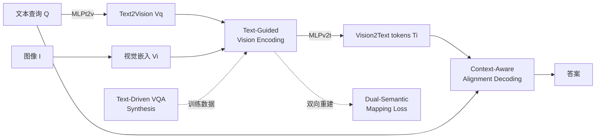

# FLARE: Fully Integration of Vision-Language Representations for Deep Cross-Modal Understanding

**会议**: ICLR 2026  
**OpenReview**: [https://openreview.net/forum?id=LWw9yLNQfx](https://openreview.net/forum?id=LWw9yLNQfx)  
**代码**: 待开源（论文承诺释放 code/data/models）  
**领域**: 多模态 / 视觉-语言模型（VLM）  
**关键词**: Vision-Language Model, 模态对齐, 文本引导视觉编码, 跨模态融合, 数据合成  

## 一句话总结
FLARE 把"视觉与语言的深度融合"贯穿 VLM 全流程——编码阶段让文本引导视觉、解码阶段按文本上下文动态聚合视觉、用双向重建损失桥接模态空间、再用"文本先行"的数据合成喂养训练，使 3B 模型仅用 630 个视觉 token 就超过 Cambrian-1 8B 和 Florence-VL 8B。

## 研究背景与动机
**领域现状**：主流 VLM（LLaVA 系、Qwen2.5-VL 等）的范式是"视觉编码器独立提特征 → 单个 MLP projector 投影到 LLM 空间 → 把跨模态交互全部推迟到 LLM 解码阶段"。近期工作大多在"视觉编码本身"上做文章，例如上动态分辨率、堆多个视觉编码器来提升视觉表征精度。

**现有痛点**：作者用注意力可视化（Figure 1）指出，LLaVA / LLaVA-NeXT 由于缺乏跨模态语义对齐，projector 之后的特征映射并不到位，解码阶段对关键 token（如 "flower"）的注意力很弱；LLaVA-NeXT 过多的视觉 token 反而进一步分散了注意力。换句话说，**视觉编码再强，只要交互被推迟、且推迟时还是单向因果掩码下的弱交互，模态融合就到不了位**。

**核心矛盾**：人类视觉感知本身是被语言主动调制的（先听到目标名字再找，找得更快更准），但当前 VLM 的"视觉编码 → 投影 → 解码"是单向、浅层、阶段割裂的，无法复刻这种双向深度整合。更底层的问题是**嵌入错位**——视觉和文本嵌入空间天生有差异，没有显式约束就难以无缝拼接；同时缺乏专门为"对齐+整合"设计的高质量训练数据。

**本文目标**：把深度、动态的视觉-语言整合贯穿整条 pipeline 的每一级——像素级、查询级、模态级、数据级四个层次全打通。

**核心 idea**：**全流程模态整合（Full-Modality Alignment & Integration）**——不再只在某一个环节做对齐，而是在 ① 视觉编码（像素级）、② 解码（查询级）、③ 投影空间（模态级）、④ 训练数据（数据级）四个粒度上同时引入文本引导与双向交互。

## 方法详解

### 整体框架
FLARE 由四个相互配合的组件构成，对应四个对齐粒度：**Text-Guided Vision Encoding** 在编码阶段就把文本注入视觉编码器实现像素级对齐；**Context-Aware Alignment Decoding** 在 LLM 解码层之间插入语义交换层、按文本上下文动态聚合视觉特征实现查询级整合；**Dual-Semantic Mapping Loss** 用双向重建损失约束两个投影器实现模态级桥接；**Text-Driven VQA Synthesis** 反转"图先文后"的惯例、以高质量文本为源头生成图像与 QA 实现数据级优化。骨干用 SigLIP2-Giant 视觉编码器 + Phi-3.5-mini / LLaMA3.1-8B，分 3B/8B 两规模、固定分辨率（FLARE-L）与动态分辨率（FLARE-X）两设置训练。

### 关键设计

**1. Text-Guided Vision Encoding：让文本在编码阶段就进场**。FLARE 不再把视觉编码当成与文本无关的独立过程，而是把查询文本嵌入 $T_q$ 经 $V_q=\mathrm{MLP}_{t2v}(T_q)$ 投影进视觉空间，与视觉嵌入 $V_i$ 一起送进编码器逐层联合更新 $(V_i^k,V_q^k)=\mathrm{EncoderLayer}(V_i^{k-1},V_q^{k-1})$，让两路特征相互精炼。由于浅层视觉特征还没有语义，作者在编码器前一半层屏蔽"视觉→文本"注意力，让早期层专注学纯视觉表征；之后对浅层（粗、偏纯视觉）与深层（细、富文本增强）特征分别做平均 $V_i^s,V_i^d$，再沿通道维拼接 $V_i^e=\mathrm{Concat}(V_i^s,V_i^d)$，兼顾单模态保真与跨模态增强，而不是像以往只取最后一层。最终 $V_i^e$ 经 $\mathrm{MLP}_{v2t}$ 映射为 Vision2Text 图像 token $T_i$ 进入解码。这一步把对齐提前到了像素级。

**2. Context-Aware Alignment Decoding：用潜在 token 打破因果掩码的单向交互**。传统做法把跨模态交互留到 LLM 解码，但因果掩码只允许单向信息流。FLARE 为每个查询前置一组**上下文感知潜在 token** $T_L\in\mathbb{R}^{l\times l\times D}$ 作为跨模态中介，并每隔三层解码层插入一个**语义交换层**。在交换层里，先取查询文本结尾位置 $P$ 的隐状态 $H_P$（它聚合了前文全部上下文），与每个潜在 token 拼接成上下文感知查询 $I_Q[r,c]=\mathrm{MLP}(\mathrm{Concat}(H_P,T_L[r,c]))$；再以 Vision2Text 图像 token $T_i$ 作为 key/value，用窗口注意力（窗口 $w=m/l,\,h=n/l$ 把注意力限制在局部区域）更新潜在 token $T_L[r,c]=\mathrm{softmax}(\tfrac{Q[r,c]K[r,c]^\top}{\sqrt D})V[r,c]$。每个交换层都为当前查询抽取最相关的视觉特征塞进潜在 token，下一解码层再把这些被富化的 token 与查询 token 整合，从而实现解码阶段双向、细粒度的查询级交互。训练时还随机从 $\{4,16,36,64,144\}$ 采样潜在 token 数以提升稳定性。

**3. Dual-Semantic Mapping Loss：用双向重建自监督地缝合两个模态空间**。视觉与文本特征在 pipeline 里被反复映射，为保证 $\mathrm{MLP}_{v2t}$ 与 $\mathrm{MLP}_{t2v}$ 两个投影器映得可靠，作者引入对称的余弦相似度重建损失。对 $\mathrm{MLP}_{v2t}$：把"经视觉编码器处理过的文本特征" $V_q^e$ 重投回文本空间得 $T_q^r=\mathrm{MLP}_{v2t}(V_q^e)$，要求它逼近原始文本嵌入 $T_q$，即 $L_{v2t}=1-\tfrac{T_q\cdot T_q^r}{|T_q||T_q^r|}$；对 $\mathrm{MLP}_{t2v}$：把图像 token $T_i$ 重建回视觉空间 $V_i^r=\mathrm{MLP}_{t2v}(T_i)$ 逼近 $V_i$，得对称的 $L_{t2v}$。总损失 $L_{total}=L_{ce}+\lambda(L_{v2t}+L_{t2v})$（$\lambda=0.1$）。这组损失不需要任何额外输入即可即插即用，从模态级缓解视觉-文本嵌入的语义鸿沟。

**4. Text-Driven VQA Synthesis：把数据生产从"图先"反转为"文先"**。现有 VQA 数据都是基于图像构造问答，视觉内容固定导致文本单调、多样性受限。FLARE 反过来：先从高质量 caption 池（覆盖 Landmark/Celebrity/Artwork/Color/Count/Text 等类别）出发，用 Llama3-70B 把 caption 扩写成细致描述，一路喂给扩散模型（FLUX）生成与文本对齐的图像、另一路再用 LLM 据此造出多选、多轮对话、推理等多样 QA。这样先保证文本丰富度、再让视觉去匹配，配合多阶段过滤，合成出大规模 FLARE-10M（预训练）/FLARE-12M（微调）数据，从数据级支撑跨模态整合组件的训练。

## 实验关键数据

### 主实验（16 benchmark，节选）

| Model | # Vis tok. | MMBEN | POPE | MM-Vet | Seed-Img | TextVQA | AI2D | CVBench |
|---|---|---|---|---|---|---|---|---|
| MiniCPM-V-2.0 3B | 400 | 69.1 | 86.3 | 41.0 | 67.1 | 74.1 | 62.9 | - |
| Florence-VL 3B | 576 | 71.6 | 88.3 | 51.0 | 70.6 | 69.1 | 73.8 | 70.2 |
| Qwen2.5VL 3B | 1400 | 79.1 | 87.3 | 61.4 | 74.0 | 79.3 | 81.4 | 75.5 |
| **FLARE-L 3B** | **630** | 79.6 | 88.8 | 59.1 | 74.2 | 73.3 | 79.4 | 78.2 |
| **FLARE-X 3B** | 1400 | 81.4 | 88.6 | 61.9 | 76.3 | 77.2 | 81.2 | 80.1 |
| Cambrian-1 8B | 576 | 75.9 | 87.4 | 48.0 | 74.7 | 71.7 | 73.0 | 72.2 |
| Florence-VL 8B | 576 | 76.2 | 88.4 | 56.3 | 74.9 | 74.2 | 74.2 | 73.4 |
| **FLARE-X 8B** | 1400 | 83.6 | 89.1 | 62.8 | 78.7 | 79.7 | 83.6 | 81.5 |

- FLARE-L 3B 仅用 **630 视觉 token** 就在多数指标上超过 Cambrian-1 8B、Florence-VL 8B；相比 MiniCPM-V 仅约 1/100 训练数据即取得大幅优势。
- FLARE-X 在近半数 benchmark 上追平甚至超过 Qwen2.5VL，而训练数据仅约其 1/1000。

### 同骨干公平对比（Table 2，与 Qwen2.5VL 同 backbone）

| Model | MMBEN | POPE | Seed-Img | TextVQA | AI2D | CVBench |
|---|---|---|---|---|---|---|
| Qwen2.5VL 3B | 79.1 | 87.3 | 74.0 | 79.3 | 81.4 | 75.5 |
| **FLARE 3B** | 83.2 | 89.0 | 77.1 | 80.8 | 82.9 | 81.2 |
| Qwen2.5VL 7B | 83.2 | 85.9 | 77.0 | 83.5 | 83.4 | 81.1 |
| **FLARE 7B** | 86.0 | 89.8 | 79.7 | 85.2 | 84.2 | 82.8 |

### 消融实验（Table 3，A=文本引导视觉编码 / B=双语义映射损失 / C=上下文感知解码）

| A | B | C | MMBEN | MMEP | Seed-Img | CVBench | MMVP |
|---|---|---|---|---|---|---|---|
| | | | 72.5 | 1531.7 | 71.7 | 68.3 | 66.1 |
| ✓ | | | 73.5 | 1543.2 | 72.8 | 70.7 | 67.6 |
| | ✓ | | 73.7 | 1554.3 | 72.8 | 70.3 | 68.4 |
| ✓ | ✓ | | 74.5 | 1574.2 | 73.7 | 70.7 | 70.3 |
| ✓ | | ✓ | 74.4 | 1566.8 | 73.7 | 71.2 | 69.1 |
| ✓ | ✓ | ✓ | **75.3** | **1583.9** | **74.6** | 71.7 | 69.8 |

### 关键发现
- 三个模态整合组件叠加单调提升，且全开（A+B+C）的 baseline 已超过 LLaVA-NeXT（MMBEN 75.3 vs 74.9），说明深度整合本身比堆视觉 token 更有效。
- 即便不用动态分辨率，FLARE 也能超过 LLaVA-NeXT，验证整合范式而非分辨率是收益来源。
- 注意力可视化显示 FLARE 在像素/查询/模态三个层级都呈现持续且逐级增强的跨模态对齐。

## 亮点与洞察
- **把"对齐"从单点变成全流程**：以往工作要么只改 projector、要么只改视觉编码器，FLARE 第一次系统地在像素级/查询级/模态级/数据级四个粒度同时引入文本引导与双向交互，思路统一且自洽。
- **用潜在 token + 语义交换层巧妙绕开因果掩码**：在不破坏 LLM 自回归结构的前提下，让解码阶段也能做双向跨模态交互，是工程上很聪明的折中。
- **数据合成"反客为主"**：文本先行再生成图像，直接拉高了 QA 文本的多样性，也契合其"文本引导视觉"的核心哲学，数据与架构的设计动机是一致的。
- **极高的 token/数据效率**：3B 模型 630 token 打 8B、1/1000 数据追平 Qwen2.5VL，对算力受限场景有很强吸引力。

## 局限与展望
- **训练管线复杂**：三阶段训练 + 四个组件 + 大规模自合成数据（10M/12M），复现成本高，对超参（$\lambda$、潜在 token 采样、语义交换层间隔）较敏感。
- **依赖强外部模型造数据**：合成依赖 Llama3-70B 与 FLUX，合成数据的偏差/质量上限会传导到模型，论文也承认需要多阶段过滤来兜底。
- **OCR/极细粒度仍逊于 Qwen2.5VL**：在 OCRBench、ChartQA、MMMU 等强依赖高分辨率细节的任务上仍落后，说明低 token 预算下的细节保真还有缺口。
- 未来可探索把全流程整合范式扩展到视频、音频等更多模态，以及在更大规模下验证可扩展性。

## 相关工作与启发
- **VLM 主流范式**：LLaVA / LLaVA-NeXT / Qwen2.5-VL —— FLARE 正是针对它们"交互推迟到解码"的结构性缺陷。
- **模态对齐探索**：InstructBLIP（QFormer 文本引导）、entity-enhanced 对齐、Florence-VL（生成式视觉编码器多 prompt 融合）—— FLARE 指出它们缺乏覆盖全流程的统一对齐算法。
- **指令数据合成**：从 GPT-4V 造 QA 到"先 caption 后扩散生图"的工作 —— FLARE 把后者从预训练小规模推向大规模指令微调，并强调"文本先行"。
- **启发**：当某个模块（如对齐）的收益遇到瓶颈时，与其在单点继续加码，不如检查它是否被"阶段割裂"限制——把同一目标拆到多个粒度协同实现，往往比单点极致优化更有效。

## 评分
- **新颖性**: ⭐⭐⭐⭐ 全流程四粒度整合的框架性创新，潜在 token + 语义交换层、文本先行数据合成都很有想法，虽各组件单看有前作影子，但系统组合与统一动机新颖。
- **实验充分度**: ⭐⭐⭐⭐ 16 benchmark + 同骨干公平对比 + 三组件消融 + 多规模多分辨率，证据链完整；OCR/知识类任务的劣势也如实呈现。
- **写作质量**: ⭐⭐⭐⭐ 动机（人类感知被语言调制）讲得有画面，四组件与四粒度的对应关系清晰，图示与公式配合到位。
- **价值**: ⭐⭐⭐⭐ 极高的 token/数据效率对落地很有意义，"全流程整合 + 文本先行数据"为 VLM 设计提供了可迁移的范式启发。

<!-- RELATED:START -->

## 相关论文

- [\[CVPR 2026\] HAMMER: Harnessing MLLM via Cross-Modal Integration for Intention-Driven 3D Affordance Grounding](../../CVPR2026/multimodal_vlm/hammer_harnessing_mllm_via_cross-modal_integration_for_intention-driven_3d_affor.md)
- [\[ICML 2025\] Vision-Language Models Create Cross-Modal Task Representations](../../ICML2025/multimodal_vlm/vision-language_models_create_cross-modal_task_representations.md)
- [\[ICLR 2026\] OmniVinci: Enhancing Architecture and Data for Omni-Modal Understanding LLM](omnivinci_enhancing_architecture_and_data_for_omni-modal_understanding_llm.md)
- [\[ICLR 2026\] WebWatcher: Breaking New Frontiers of Vision-Language Deep Research Agent](webwatcher_breaking_new_frontiers_of_vision-language_deep_research_agent.md)
- [\[ICLR 2026\] XModBench: Benchmarking Cross-Modal Capabilities and Consistency in Omni-Language Models](xmodbench_benchmarking_cross-modal_capabilities_and_consistency_in_omni-language.md)

<!-- RELATED:END -->
