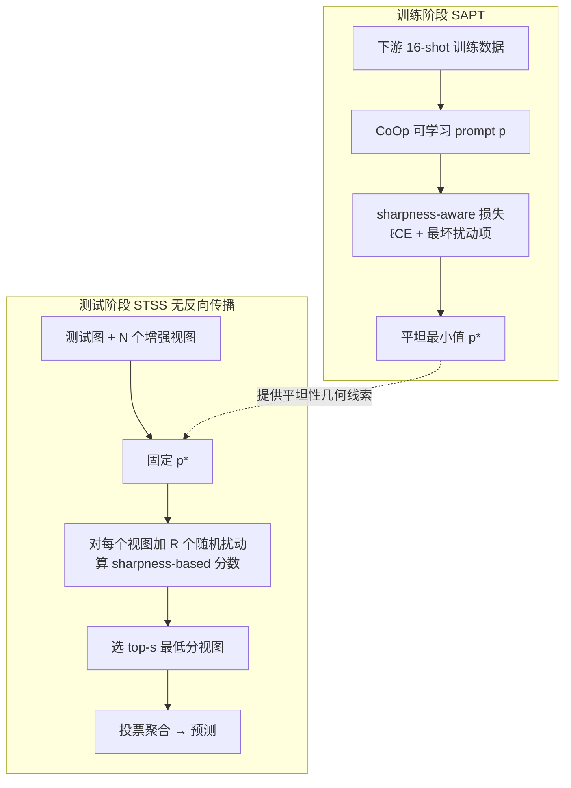

# Flatness-Guided Test-Time Adaptation for Vision-Language Models

**会议**: ICLR 2026  
**OpenReview**: [https://openreview.net/forum?id=S90g7NE88b](https://openreview.net/forum?id=S90g7NE88b)  
**代码**: 待确认  
**领域**: 多模态 / 视觉语言模型 · 测试时适应  
**关键词**: Test-Time Adaptation, Vision-Language Models, CLIP, Sharpness-Aware Minimization, Loss Landscape Flatness, Prompt Tuning  

## 一句话总结
本文提出 **Flatness-Guided Adaptation (FGA)** 框架：训练阶段用 sharpness-aware prompt tuning 找到平坦最小值，测试阶段不再更新任何参数，而是通过"扰动—打分—筛选"增强样本，让被选中的测试损失景观的平坦最小值与训练平坦最小值对齐，从而在零反向传播、低显存的前提下显著提升 CLIP 的分布外泛化。

## 研究背景与动机
- **领域现状**：CLIP 等 VLM 的测试时适应（TTA）以 TPT（Test-time Prompt Tuning）为代表——对每个测试样本生成多个增强视图，用低熵视图的平均熵作为损失反向传播更新 prompt。这类方法在分布偏移下能涨点，但都把测试阶段当成一个孤立的优化问题。
- **现有痛点**：①TPT 类方法在测试时对每张图都做反向传播，推理慢（TPT 0.62s/图）、显存高（19.33GB）；②它们把训练历史和测试适应割裂——已有研究指出 TTA 本质上受模型训练历史影响，但主流方法的适应策略与训练特性脱节，浪费了预训练模型蕴含的几何/表征性质。
- **核心矛盾**：训练阶段的 SAM 类方法早已证明"平坦最小值泛化更好"，但这一原则几乎只用在训练，没有被延伸为指导测试时适应的统一准则；测试时的昂贵优化对损失几何结构是"无感"的，因而泛化常常次优。
- **本文目标**：把"平坦性"从一个训练期的良好属性，升级为贯通训练与测试的统一指导原则，在不更新测试参数的前提下提升 VLM 抗分布偏移能力，并大幅降低计算开销。
- **核心 idea**：**对齐而非优化**——传统 TTA 把测试损失景观看成静态、努力把参数挪到测试平坦最小值；FGA 反过来，**固定参数、调整测试损失景观**（靠数据增强），筛出那些"训练平坦最小值恰好就接近其平坦最小值"的增强样本来投票预测。

## 方法详解

### 整体框架
FGA 由两个协同阶段组成：训练侧的 **Sharpness-Aware Prompt Tuning (SAPT)** 负责把 prompt 推到训练损失景观的平坦最小值，并把"sharpness"这一几何线索留给测试用；测试侧的 **Sharpness-based Test Sample Selection (STSS)** 在不动任何参数的情况下，用随机扰动给每个增强视图打一个 sharpness 分数，只让分数最低（即与训练平坦最小值最对齐）的样本参与投票。整个测试过程没有反向传播。

### 关键设计

**1. Sharpness-Aware Prompt Tuning：把训练最小值钉在平坦区，留下可测的几何线索。** 由于测试样本在训练时不可知、训练数据在测试时又因存储/隐私不可得，FGA 选择只对"训练最小值的内在性质"下手：希望它既损失低、又足够平坦。普通 CoOp 用交叉熵 $\ell_{CE}(p)=-\sum_{i}\log P_p(y_i|x_i)$ 微调 prompt，而 SAPT 在此基础上显式加一项最坏扰动 sharpness：$\ell_{SAPT}(p)=\ell_{CE}(p)+\lambda\max_{\|\epsilon\|\le\rho}[\ell_{CE}(p+\epsilon)-\ell_{CE}(p)]$。借助 Taylor 展开可近似解出最优扰动方向 $\epsilon^\star=\rho\,\nabla_p\ell_{CE}(p)/\|\nabla_p\ell_{CE}(p)\|$，于是 SAPT 不仅得到泛化更强的 prompt，更关键的是把"sharpness 度量"作为附加信息交给测试阶段——这是后续对齐能成立的前提。

**2. Sharpness-based Test Sample Selection：不动参数，靠增强改造损失景观再筛选。** 测试时 prompt 固定为训练得到的平坦最小值 $p^\star$，FGA 转而通过数据增强为每个测试样本制造出多个不同的测试损失景观，目标是让 $p^\star$ 恰好落在某个增强景观的平坦最小值上。为避开反向传播算 sharpness 的开销，STSS 把 sharpness 重定义为 $R$ 次随机扰动下损失的最大变化量：$\ell_{STSS}(p)=\ell_{SRG}(p)+\lambda\max_{r=1,\dots,R;\,\epsilon_r\sim\mathcal{N}}\big[\ell_{SRG}(p+\rho'\epsilon_r/\|\epsilon_r\|)-\ell_{SRG}(p)\big]$，其中代理损失 $\ell_{SRG}$ 在无标签时取熵 $-\sum_k P_r(y_k|x)\log P_r(y_k|x)$。扰动只作用在文本 prompt 上，每个类别的扰动文本特征 $[e_{t,k,1},\dots,e_{t,k,R}]=E_t([l_{k,1},\dots,l_{k,R}])$ 每类只需前向算一次，额外开销极小。最后取 sharpness 分数最低的 top-$s$ 个增强样本投票得到预测——分数越低，说明该样本越接近训练分布、预测越可靠。

**3. 用泛化界把"低 sharpness ⇒ 更可靠"讲成定理。** 论文给出泛化误差上界 $\mathbb{E}_T[\ell_\rho]\le \frac{M}{2}d(S;T)+\hat\ell^\rho_{S_n}+2\sqrt2\mu R_n(F,S)+M\sqrt{\log(1/\delta)/2n}$，其中 $d(S;T)$ 是训练/测试分布差异、$\ell_\rho$ 是 $\rho$ 半径内的最坏损失。进一步引入 β-tightness 与 γ-separability，证明当两个测试分布足够可分时，离训练分布更远的那个会倾向于呈现更高的 sharpness 分数（Theorem 4 给出 $P(H_\rho(x_{T_1})<\xi)>P(H_\rho(x_{T_2})<\xi)$）。这就为"按 sharpness 分数筛样本"提供了理论依据：可调参数 $\rho$（及测试侧 $\rho'$）控制上界紧致度，从而精细区分测试分布。

## 实验关键数据

### 主实验表格（自然分布偏移，CLIP-ViT-B/16，top-1 准确率 %）

| 方法 | IN | IN-A | IN-V2 | IN-R | IN-Sketch | Avg | OOD Avg |
|------|----|----|----|----|----|----|----|
| CLIP-ViT-B/16 | 68.34 | 49.89 | 61.88 | 77.65 | 48.24 | 61.20 | 59.42 |
| TPT | 69.70 | 53.67 | 64.30 | 73.90 | 46.40 | 61.59 | 59.57 |
| TPT+CoOp | 73.30 | 56.88 | 66.60 | 73.80 | 49.40 | 64.00 | 61.67 |
| DiffTPT+CoOp | 75.00 | 58.09 | 66.80 | 73.90 | 49.50 | 64.66 | 62.07 |
| ZERO+CoOp | 73.61 | 63.17 | 66.82 | 77.71 | 48.52 | 65.97 | 64.06 |
| **FGA (Ours)** | **74.01** | **65.90** | **67.23** | **81.24** | **51.81** | **68.04** | **66.55** |

FGA 的 OOD 平均较 TPT+CoOp 提升 **4.88%**（61.67%→66.55%），且在 IN-A、IN-R、IN-Sketch 上均显著领先。

### 消融实验表格（域泛化，CLIP-ViT-B/16）

| 配置 | Avg | OOD Avg | 说明 |
|------|----|----|----|
| CoOp | 61.72 | 59.28 | 基线 |
| SAPT+CoOp | 62.64 | 60.61 | 仅训练侧平坦，+0.92% Avg |
| STSS+CoOp | 66.48 | 64.60 | 仅测试侧筛选，+4.76% Avg |
| **FGA (full)** | **68.04** | **66.55** | SAPT+STSS 协同 |

STSS 是涨点主力；在 SAPT 基础上叠加 STSS 再涨 5.40%（62.64%→68.04%），超过 STSS 单用的 4.76%，说明更平坦的训练最小值能内在增强测试样本筛选效果。

### 关键发现
- **跨数据集泛化**：ImageNet→10 个细粒度数据集，FGA 平均 **67.60%**，在 6/10 数据集上最优（Caltech101 高达 96.96%），较 TPT+CoOp 提升 1.94%。
- **效率碾压**：单张 V100 上 FGA 仅 **0.07s/图**，比 DiffTPT（1.67s）快 23.86×、比 TPT（0.62s）快 8.86×；显存仅 **4.14GB**，比 TPT（19.33GB）低 4.67×。
- **超参 $\rho'$ 非单调**：测试准确率随 $\rho'$ 先升后降，$\rho'\to0$ 退化为熵最大化；全程固定 $\rho'=0.5$、$\lambda=1$，不在测试数据上调参。
- **损失景观可视化**：参数落在平坦最小值时增强样本语义完整、预测可靠；落在平坦区外则语义畸变，验证了筛选机制能滤掉不可靠样本。

## 亮点与洞察
- **范式反转**："不优化参数、优化损失景观"——固定平坦最小值，靠增强样本把测试景观调到与之对齐，这一视角把训练与测试用同一几何原则（平坦性）打通。
- **零反向传播 + 文本特征复用**：扰动只加在 prompt 上、每类文本特征只算一次，使得 sharpness 打分几乎不增加前向成本，是它能比 TPT 快近 9× 的根因。
- **理论与方法咬合紧密**：泛化界 + γ-separability 直接论证了"sharpness 分数低 ⇒ 离训练分布近 ⇒ 预测更可信"，让样本筛选不是启发式而是有据可依。

## 局限与展望
- **依赖下游训练数据做 SAPT**：需要 16-shot 标注数据先训 prompt，纯无训练数据的零样本场景不直接适用（不过 STSS+CoOp 单独也已很强）。
- **单样本设定**：FGA 面向单测试样本适应，未利用 TDA/DPE 那类在线缓存中跨样本聚合的信息，因此与在线 TTA 不完全可比。
- **沿用 TPT 的 63 增强视图**：增强策略直接复用 TPT，增强质量/多样性对景观改造的影响尚未深入探索。
- **展望**：作者指出 FGA 基于通用的损失景观几何，可迁移到更先进的 prompt tuning、新型 TTA 目标或其他 VLM 架构。

## 相关工作与启发
- **TTA / TPT 系**：TPT、DiffTPT、C-TPT、PromptAlign 走"测试时更新 prompt"，TDA/DPE 走"在线缓存原型"；FGA 与它们的根本区别是测试时完全不更新参数。
- **平坦最小值 / SAM 系**：SAM、ASAM、FisherSAM 关注训练期平坦性；SAR、SoTTA 虽在测试时用 sharpness-aware minimization，但只在测试侧操作、未建立训练—测试 sharpness 的交互——FGA 正是补上了这条贯通链路。
- **启发**：把"训练得到的几何性质"显式编码、再在测试时作为对齐准则复用，是降低 TTA 成本的有效思路；用随机扰动近似 sharpness 以规避反向传播的技巧，可推广到更多需要在线打分的场景。

## 评分
- **新颖性**: ⭐⭐⭐⭐ "调景观而非调参数 + 训练/测试平坦性对齐"的视角新颖，把 SAM 原则统一进 TTA。
- **实验充分度**: ⭐⭐⭐⭐ 覆盖域泛化 + 跨数据集 + 效率 + 消融 + 可视化，对比方法全面；但主文聚焦 ViT-B/16，ResNet50 结果放附录。
- **写作质量**: ⭐⭐⭐⭐ 动机—方法—理论—实验逻辑连贯，图 1 直观点明核心思想。
- **价值**: ⭐⭐⭐⭐ 在近 9× 加速、4.67× 省显存的同时还涨点，对资源受限/实时部署的 VLM TTA 很有实用价值。

<!-- RELATED:START -->

## 相关论文

- [\[ICLR 2026\] Bilateral Information-aware Test-time Adaptation for Vision-Language Models](bilateral_information-aware_test-time_adaptation_for_vision-language_models.md)
- [\[CVPR 2026\] Improving Calibration in Test-Time Prompt Tuning for Vision-Language Models via Data-Free Flatness-Aware Prompt Pretraining](../../CVPR2026/multimodal_vlm/improving_calibration_in_test-time_prompt_tuning_for_vision-language_models_via_.md)
- [\[CVPR 2026\] STAR: Test-Time Adaptation Can Enhance Universal Prompt Learning for Vision-Language Models](../../CVPR2026/multimodal_vlm/star_test-time_adaptation_can_enhance_universal_prompt_learning_for_vision-langu.md)
- [\[AAAI 2026\] Panda: Test-Time Adaptation with Negative Data Augmentation](../../AAAI2026/multimodal_vlm/panda_test-time_adaptation_with_negative_data_augmentation.md)
- [\[ICLR 2026\] A-TPT: Angular Diversity Calibration Properties for Test-Time Prompt Tuning of Vision-Language Models](a-tpt_angular_diversity_calibration_properties_for_test-time_prompt_tuning_of_vi.md)

<!-- RELATED:END -->
