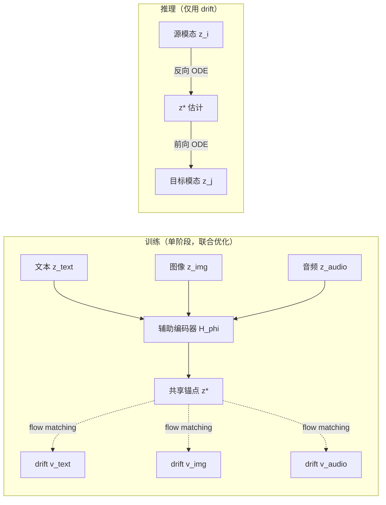

# FlowBind: Efficient Any-to-Any Generation with Bidirectional Flows

**会议**: ICLR 2026  
**OpenReview**: [https://openreview.net/forum?id=7DeARTwvwL](https://openreview.net/forum?id=7DeARTwvwL)  
**代码**: [https://yeonwoo378.github.io/official_flowbind](https://yeonwoo378.github.io/official_flowbind)  
**领域**: 多模态生成 / Any-to-Any Generation / Flow Matching  
**关键词**: any-to-any generation, flow matching, shared latent, invertible flow, multimodal  

## 一句话总结
FlowBind 用一个**可学习的共享潜在锚点 + 每模态可逆流**取代固定高斯先验，把多模态联合分布拆解成一组独立的模态-到-锚点流，仅用单一 flow matching 损失端到端训练，就能在文本/图像/音频之间任意互译，参数量少 6 倍、训练快 10 倍。

## 研究背景与动机
- **领域现状**：Flow 模型在 text-to-image、text-to-audio 这类**定向**生成上已是 SOTA，但要扩展到真正的 any-to-any（任意模态子集 → 任意模态子集）仍是开放问题。
- **现有痛点**：现有两条路线都很笨重。① CoDi 用**文本做中心锚点**，要求每个模态都和文本配对，无法学到非文本模态间（如音频↔图像）的直接关联；② OmniFlow 建模**全联合速度场**，表达力强但需要稀缺的全配对数据，且复杂度随模态数二次增长。两者还都依赖**多阶段训练**（对齐阶段 + 联合生成阶段），脆弱难调。
- **核心矛盾**：联合建模带来的表达力，和它对全配对数据、巨大算力、多阶段流水线的依赖之间不可调和——模态一多就不实用。
- **本文目标**：要一个**单阶段、低算力、能吃任意部分配对数据**的 any-to-any 框架。
- **核心 idea**：**[共享锚点因子化]** 假设所有模态背后存在一个共享潜在 $z^*$ 承载跨模态共性，每个模态只需学一条把自己连到 $z^*$ 的可逆流；锚点和所有流在**同一个 flow matching 目标**下联合优化，推理时仅靠这些流前向/反向积分即可任意互译。

## 方法详解

### 整体框架
FlowBind 把"建模 $N$ 模态联合分布"这件事，替换成"学一个共享锚点 $z^*$ + 为每个模态学一条数据↔锚点的直连流"。训练时一个辅助编码器 $H_\phi$ 把当前样本里出现的模态聚合成 $z^*$，每条流 $v_{\theta_i}$ 学习在 $z_i$ 与 $z^*$ 之间的直线插值速度；推理时丢掉编码器，靠流的可逆性：源模态反向积分到锚点、再前向积分到目标模态。因为每条流只需"自己这一模态 + 锚点"，所以任意部分配对的数据都能直接喂进来。

### 关键设计

**1. 共享锚点替代固定先验，把联合流因子化成每模态独立流：** 传统生成流是从固定高斯先验 $\pi_{\text{prior}}$ 桥接到数据；FlowBind 把先验换成一个**可学习的共享分布** $\pi_{\text{shared}}$。对子集 $S$ 里每个模态 $i$，定义一条直线插值路径 $z_t^i = t z_i + (1-t) z^*$，其速度场为 $\partial z_t^i/\partial t = v_i(z_t^i, t)$。关键在于：给定 $z^*$ 后，多模态流被**逐模态因子化**——每条 drift 只负责把自己这一模态连到锚点，彼此独立运行、互不耦合，从而把 OmniFlow 那种随模态数二次增长的联合建模成本降下来，也使得"只要某模态和锚点配上对就能训练"，天然支持任意部分配对数据。

**2. 单一 flow matching 目标联合训练锚点与所有流：** 训练损失就是把所有出现模态的 flow matching 项加起来：$\mathcal{L}(\theta,\phi)=\mathbb{E}_{t,z_S,z^*}\big[\sum_{i\in S}\|v_{\theta_i}(z_t^i,t)-(z_i-z^*)\|^2\big]$，其中 $z^*=H_\phi(z_S)$ 由辅助编码器实时产生。drift 学着从锚点预测指向各模态端点的位移，编码器则被反向激励去提供一个"每个模态都能从中恢复"的锚点——两者在同一个损失下耦合，**彻底省掉了 CoDi/OmniFlow 的多阶段流水线**。

**3. 时间相关的停梯度，仅用 flow matching 就防锚点坍缩：** 上述目标存在退化解——若编码器输出常数 $z^*=0$，drift 可平凡拟合 $v_i(z_t^i,t)=z_i$ 在 $t\in(0,1]$ 上取到零损失，编码器得不到有效监督。先前的 direct-flow 工作靠额外对比损失等正则项解决，但带来更多算力/超参且难扩展。FlowBind 的做法极简：**$t\in(0,1]$ 时对编码器停梯度**（只稳训 drift），**$t=0$ 时才让编码器随 drift 一起更新**。训练时按混合分布 $t\sim(1-\alpha)\,\text{Unif}(0,1)+\alpha\,\delta(t=0)$ 采样平衡两者。

**4. 锚点目标的理论解释——最小化条件方差（解释方差最大化）：** 把 Bayes 最优 drift 代入 $t=0$ 处的损失可推出编码器的有效目标为 $\mathcal{L}(\phi)=\mathbb{E}\big[\|\mathbb{E}[z_i\mid z^*]-z_i\|^2\big]=\mathbb{E}[\text{Var}(z_i\mid z^*)]$，即**最小化各模态在给定锚点下的"未解释方差"**。由全方差定律，这等价于最大化 $z^*$ 对 $z_i$ 的解释方差——编码器因此被驱动去塑造一个对每个模态都保留预测信息的锚点。Proposition 1 进一步证明：即便 drift 非最优，$t=0$ 处损失也可分解为"未解释方差 + drift 逼近误差"两项，保证编码器始终朝信息充分的锚点优化。推理时多源条件只需把各源反向流得到的锚点估计 $\hat z^{*,i}$ **简单平均**聚合，再前向流到目标模态。

> 此外，FlowBind 不在低层高维 latent 上建流，而是用各模态**冻结的强编码器**（EmbeddingGemma 文本、CLIP 图像、CLAP 音频）抽取的紧凑语义表示 + 对应解码器，把"跨模态对齐"和"模态内生成"解耦，drift 只需学跨模态对应，这是其数据/算力效率的另一来源。

## 实验关键数据

### 主实验：计算与数据预算（Table 1）

| 模型 | 可训练参数 | GPU-hr | 训练数据量 | 联合训练 |
|---|---|---|---|---|
| CoDi | 4.3B | — | ~405M 对 | 否 |
| OmniFlow | 3.2B | 480hr* | ~32.6M 对 | 否 |
| **FlowBind** | **568M** | **48hr** | **~586K 对** | **是** |

FlowBind 参数量约为 OmniFlow 的 1/6，算力约 1/10，数据量仅为 CoDi 的 0.15%、OmniFlow 的 1.79%。

### 一对一生成质量与对齐（Table 2/3，generalist 对比）

| 指标 | 模型 | T→I (FID↓) | I→T (CIDEr↑) | T→A (FAD↓) | A→T (CIDEr↑) | I→A (FAD↓) | A→I (FID↓) |
|---|---|---|---|---|---|---|---|
| 质量 | CoDi | 24.80 | 16.40 | 9.84 | 6.62 | 14.58 | 50.4 |
| 质量 | OmniFlow | 22.97 | 44.20 | 4.20 | 31.79 | 5.67 | 106.03 |
| 质量 | **FlowBind** | **17.39** | **46.26** | **4.19** | **55.11** | **2.50** | **26.60** |

FlowBind 在全部 6 个一对一任务上拿到最佳质量，对齐分（CLIP/CLAP/AIS）在 6 项中 4 项最优；尤其 **image-audio 方向大幅领先**——甚至超过专用 specialist，作者归因于直接从音图配对学到的共享锚点（CoDi/OmniFlow 都隐式依赖文本中介）。

### 多对一 / 一对多（Table 4/5，对齐分）
FlowBind 在多对一/一对多设置整体竞争或领先，且**明显更少"忽略某个条件模态"**：如 (Text+Image)→Audio 的 CLAP 达 28.13，远高于 CoDi 4.85 / OmniFlow 7.68，说明它能均衡吸收多源条件。

### 消融与分析

| 分析 | 结果 |
|---|---|
| 固定文本锚 vs 可学共享锚（Table 6，I→T/A→T/I→A 对齐） | FlowBind(去掉图音对) 仍全面胜过 text-anchoring（30.04/37.04/61.88 vs 27.94/36.72/55.48） |
| 共享潜空间对齐 CKNNA（Table 7，T-A/A-I） | 共享锚点 0.2872/0.3026 ≫ 各模态独立 latent 0.1965/0.1343 |

### 关键发现
- 共享锚点**不是简单的特征拼接**，CKNNA 显示它是真正语义对齐的空间，latent 插值时解码图像/文本能平滑过渡。
- 加新模态（3D 点云）只需**加一条 drift**，参数随 $N$ 近似线性增长，且仅用 image–点云配对就能泛化到 text↔点云这类**未见过的跨模态任务**。

## 亮点与洞察
- **把"建联合分布"换成"建一组到共享锚点的直连流"**，是对 any-to-any 问题结构的优雅重述：因子化既降算力又解锁任意部分配对数据。
- **停梯度的时间调度**是全文最巧的一笔——用最朴素的手段（按 $t$ 切换是否更新编码器）就避开了锚点坍缩，无需对比损失等额外机制，并配上 $\text{Var}(z_i\mid z^*)$ 的干净理论刻画。
- 在**语义表示空间**而非像素/波形空间建流，把跨模态对齐与模态内合成解耦，是其能用 1% 量级数据达到竞争质量的根因。

## 局限与展望
- 模态内生成质量**外包给冻结的预训练编解码器**（CLIP/CLAP/Stable-UnCLIP），FlowBind 本身的上限受这些组件天花板约束，对没有强预训练编码器的模态可能失效。
- 多源条件用**简单平均**聚合锚点，缺乏对各源置信度/冲突的建模，复杂多对多场景下可能不够精细。
- many-to-many 缺乏标准 benchmark，文中主要靠**自建合成三元组**（用 FLUX.1 补图像）和定性图评估，量化可信度有限。
- 论文坦言只在 text/image/audio(+点云) 小规模验证，是否能扩到更大模态集合、更高保真度仍待检验。

## 相关工作与启发
- **Any-to-any 主流路线**：① 把所有模态离散 token 化交给自回归 LLM（Chameleon、Unified-IO2）；② 离散扩散（UniDisc）。两者多聚焦 text-image 且常需文本配对/指令微调。FlowBind 走连续流路线、对模态对称。
- **Direct flow**：学数据↔数据的直连可逆映射（多限于 text-image 两模态，靠对比损失稳训）。FlowBind 把它推广到**多模态**，并用单一 flow matching 目标替掉那些额外正则项。
- **启发**：把多模态联合问题"因子化到一个共享中介"+"用损失本身的几何性质（条件方差）做表示学习"，是一种通用且省事的设计范式，可能迁移到其他需要对齐异构数据源的任务。

## 评分
- **新颖性**: ⭐⭐⭐⭐ 共享可学锚点 + 时间相关停梯度防坍缩 + 条件方差理论解释，对 any-to-any 是结构性的新表述，非增量缝合。
- **实验充分度**: ⭐⭐⭐⭐ 6 个一对一 + 多对多 + 锚点分析 + 点云扩展，效率优势量化扎实；但 many-to-many 靠合成数据/定性，扣一分。
- **写作质量**: ⭐⭐⭐⭐ 动机—方法—理论—实验链条清晰，Proposition 1 与图示到位，可读性好。
- **价值**: ⭐⭐⭐⭐ 6× 参数、10× 算力、~1% 数据即达竞争质量，对资源受限的多模态生成研究有很强实用与启发价值。

<!-- RELATED:START -->

## 相关论文

- [\[ICLR 2026\] NExT-OMNI: Towards Any-to-Any Omnimodal Foundation Models with Discrete Flow Matching](next-omni_towards_any-to-any_omnimodal_foundation_models_with_discrete_flow_matc.md)
- [\[CVPR 2026\] Describe Anything Anywhere At Any Moment](../../CVPR2026/multimodal_vlm/describe_anything_anywhere_at_any_moment.md)
- [\[ICLR 2026\] Grasp Any Region: Towards Precise, Contextual Pixel Understanding for Multimodal LLMs](grasp_any_region_towards_precise_contextual_pixel_understanding_for_multimodal_l.md)
- [\[ICLR 2026\] Exploring Cross-Modal Flows for Few-Shot Learning](exploring_cross-modal_flows_for_few-shot_learning.md)
- [\[NeurIPS 2025\] MDReID: Modality-Decoupled Learning for Any-to-Any Multi-Modal Object Re-Identification](../../NeurIPS2025/multimodal_vlm/mdreid_modality-decoupled_learning_for_any-to-any_multi-modal_object_re-identifi.md)

<!-- RELATED:END -->
