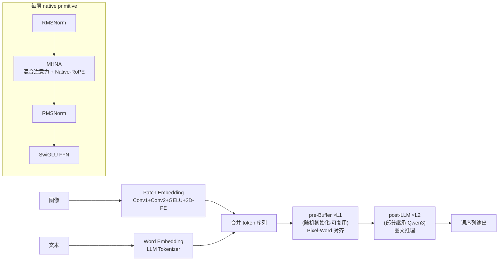

# From Pixels to Words -- Towards Native Vision-Language Primitives at Scale

**会议**: ICLR 2026  
**OpenReview**: [https://openreview.net/forum?id=DF6udvxuvY](https://openreview.net/forum?id=DF6udvxuvY)  
**代码**: [https://github.com/EvolvingLMMs-Lab/NEO](https://github.com/EvolvingLMMs-Lab/NEO)  
**领域**: 多模态视觉语言模型 / 原生（单体）VLM  
**关键词**: native VLM, early fusion, Native-RoPE, mixed attention, pre-Buffer, monolithic backbone  

## 一句话总结
本文提出 NEO——一族从第一性原理构建的**原生（单体）VLM**，用统一的「native primitive」把视觉编码、跨模态对齐与推理融进单个 decoder-only backbone，借助解耦 T/H/W 的 Native-RoPE、图文混合注意力和可复用的 pre-Buffer，仅用 390M 图文样本就把原生 VLM 与同规模顶级模块化 VLM 的差距大幅缩小。

## 研究背景与动机
- **领域现状**：主流 VLM 走「模块化」路线——预训练视觉编码器（VE）+ Projector + LLM 的「ViT-MLP-LLM」流水线，靠多阶段后训练逐步突破分辨率、宽高比限制，已成事实标准（Qwen-VL、InternVL 等）。与之对立的是「原生 VLM」路线（Fuyu、EVE、Chameleon），把图像 patch 直接喂进 LLM 做 early-fusion，追求单体架构。
- **现有痛点**：模块化设计背着预训练 VE 的强归纳偏置、复杂基础设施和 VE↔LLM 之间难调的容量权衡；而原生路线把视觉表征构造塞进预训练 LLM 内部，往往**拖慢效率、破坏优化稳定性、抹掉原有语言知识**。即便 HoVLE、HaploVL 先把图文映射到共享空间，它们的「模态共享模块」（要么源自 LLM 层、要么源自 VE 层）也**忽视了两模态在编码与交互上的内在差异**。
- **核心矛盾**：模块化靠「解耦」让视觉/语言各自发挥模态特性（双向 vs 因果注意力、不同位置编码、不同网络配置），但割裂了训练、抬高了对齐成本；原生想要「统一」，却又因为强行共用同一套模块而丢掉了模态特性。如何在一个单体里**既统一、又保留各模态特性**，是核心张力。
- **本文目标**：澄清原生 VLM 区别于模块化的根本约束，并给出构建原则——一个合格的 native primitive 应当 (i) 在共享语义空间里对齐 pixel 与 word；(ii) 无缝整合原本分离的视觉/语言模块之长；(iii) 内生地具备支持统一编码、对齐、推理的跨模态属性。同时让原生 VLM 研究更**低门槛、可复用、可扩展**。
- **核心 idea**：**【统一原生基元】** 把 LLM block 进化成「native VLM primitive」，配以全新的 Native-RoPE 和模态感知交互模式；**【pre-Buffer / post-LLM 分阶段训练】** 预训练时把单体 backbone 切成可复用的 pre-Buffer（从零学视觉）和继承 LLM 的 post-LLM，训练后再融合成统一单体。

## 方法详解

### 整体框架
NEO 是一个 decoder-only 单体架构：轻量 Patch Embedding Layer（PEL，两层 Conv + GELU，等效 32×32 patch）与 Word Embedding Layer（WEL，复用原 LLM Tokenizer）把图、文编成 token 序列，合并后流过一串 **native VLM primitive**（RMSNorm + MHNA + SwiGLU FFN）。这串 primitive 在预训练阶段被切成两段：前 $L_1$ 层是随机初始化、模态共享、可复用的 **pre-Buffer**（负责 pixel-word 对齐 / Pre-Align），后 $L_2$ 层是部分继承预训练 LLM 的 **post-LLM**（负责图文推理 / Full-Align & Reason）；mid-training 与 SFT 阶段分割消失，融为一个自主分配编码/对齐/推理容量的单体 backbone。

### 关键设计

**1. Native VLM Primitive：把 LLM block 升级为内生多模态单元** —— NEO 不像以往方法那样把视觉 token 压成 1D，也不只是把预训练 LLM 的 head 维度在 T/H/W 上重新分配，而是**增大 Query/Key 的 head 维度并显式解耦 H、W、T 三组关系**，在原 Transformer block 上只多约 10% 参数。具体保留温度（temporal，T）维度，新增 H、W 维度及其各自的 QK 归一化。primitive 的前向是标准残差结构 $x_m^{l'} = x_m^l + \mathrm{MHNA}(\mathrm{RMSNorm}(x_m^l))$、$x_m^{l+1} = x_m^{l'} + \mathrm{FFN}(\mathrm{RMSNorm}(x_m^{l'}))$，$m\in\{v,t\}$ 标识视觉/文本模态——同一套模块同时承担编码、对齐、推理，这是「统一原生基元」的落点。

**2. Native-RoPE：解耦 T/H/W 的索引、通道与频率分配** —— 这是全文最核心的设计，针对的是 3D-RoPE 的两个老问题：纯文本若把 H/W 索引清零、又被限制在 LLM 原通道内，会破坏 LLM 的语言建模能力；而 H、W 理论等价却被分配不同频率，且 LLM 的 RoPE 频率远低于视觉编码器、加之时间跨度可达百万而空间只有数百，导致局部语义建模受损。NEO 因此**给 T、H、W 各自独立的通道与基频**：T 用原 LLM head 维度，H/W 用新增 head 维度，
$$\Theta_T=\{\beta^{-2k/d_T}\mid k\in[0,d/2)\},\quad \Theta_H=\{\beta^{-4i/d_H}\mid i\in[0,d/4)\},\quad \Theta_W=\{\beta^{-4j/d_W}\mid j\in[0,d/4)\}$$
其中 $\beta_T=10^6$、$\beta_H=\beta_W=10^4$（与 VE 的高频对齐，强调局部依赖；T 兼顾局部与长程）。索引分配上：文本保留 T 索引、H/W 置零；图像 T 索引恒定、H/W 编码空间位置；视频按帧递增 T；图像对的 H/W 索引各自从 (0,0) 起、对应位置共享依赖以强化区域间相关，图文对里 H/W 与 T 解耦并界定在 (0,0)~(H,W) 之间，避免长程文本的大 T 索引把空间关系冲垮。

**3. Multi-Head Native Attention（MHNA）：图文混合掩码** —— 把单张图像当成一个自回归的「元单元」。**文本 token 走标准因果注意力**（只看前文，保持自回归生成）；**图像 token 走全双向注意力**（视觉 token 之间彻底交互，像视觉编码器一样），由此既捕获图内丰富的空间/上下文依赖，又支持图文对应与复杂多模态推理。实现上用 FlexAttention 把变长块状注意力做成定制 CUDA kernel，压低显存、提升吞吐。消融显示混合注意力稳定优于纯因果。

**4. Pre-Buffer & Post-LLM：分而后合的训练形式** —— 预训练把单体切成模态共享的 pre-Buffer（把 pixel-word 输入翻译成统一表征，对 post-LLM 干扰最小）和继承语言能力的 post-LLM。深度 $L_1$、$L_2$ 参照现有 VE 与 LLM 的参数量与 scaling 性质来配（NEO-2.2B 用 $L_1{=}12$、NEO-9B 用 $L_1{=}6$）。**pre-Buffer 整体随机初始化**；**post-LLM 沿 T 维继承预训练 LLM 的 RMSNorm/FFN/QKV/QK-Norm**，其中 H、W 的 Q 用 T 的 Q 权重初始化、K 零初始化、QK-Norm 取 $\beta=0,\gamma=1$，并匹配 LLM 的注意力缩放，从一开始就保住预训练范式、让多模态空间推理在 post-LLM 里渐进涌现。关键收益：分割只存在于预训练，之后融为单体；且 **pre-Buffer 作为可复用预训练资产**，后续开发原生 VLM 可直接拿来用，大幅降本。

> **三阶段训练**：① 预训练（冻结 LLM 权重，仅训 PEL、pre-Buffer、post-LLM 新增 QK 与 H/W，345M 图文，next-token loss，语言:多模态=3:7）；② mid-training（全量端到端，40M caption/QA/OCR/detection）；③ SFT（4M 高质量双语指令）。

## 实验关键数据

### 主实验表格
基于 Qwen3-1.7B / Qwen3-8B 得到 NEO-2.2B / NEO-9B，仅用 345M/40M/4M（共约 390M）数据、无 RL，用 VLMEvalKit 评测。

| 模型(规模) | 类型 | 数据量 | MMMU | MMB | MMVet | MMStar | SEED-I | HallB |
|---|---|---|---|---|---|---|---|---|
| InternVL2.5(2B) | 模块化 | >6B/100M/16M | 43.6 | 74.7 | 60.8 | 53.7 | – | 42.6 |
| Encoder-Based(Qwen3-1.7B) | 模块化基线 | >6B/40M/4M | 47.1 | 75.8 | 37.4 | 52.7 | 73.6 | 44.4 |
| Mono-InternVL-1.5(2B) | 原生 | 400M/150M/7M | 39.1 | 64.0 | 54.0 | – | 66.9 | 32.5 |
| HoVLE(2B) | 原生 | 550M/50M/7M | 32.2 | 73.3 | 43.8 | – | 70.9 | 38.4 |
| **NEO(2.2B)** | **原生** | **345M/40M/4M** | **48.6** | **76.0** | 49.6 | **54.2** | **74.2** | 43.1 |
| InternVL2.5(8B) | 模块化 | >6B/50M/4M | 56.0 | 84.6 | 62.8 | 64.4 | – | 50.1 |
| EVEv2(7B) | 原生 | 77M/15M/7M | 39.3 | 66.3 | 45.0 | – | 71.4 | – |
| SAIL(7B) | 原生 | 512M/86M/6M | – | 70.1 | 46.3 | 53.1 | 72.9 | 54.2 |
| **NEO(9B)** | **原生** | **345M/40M/4M** | **54.6** | **82.1** | **53.6** | **62.4** | **76.3** | 46.4 |

NEO 在 2B/8B 两档都**逼平甚至超过同规模 Encoder-Based 基线**，并大幅领先现有原生 VLM；在 AI2D/DocVQA/ChartQA 等 VQA 榜上同样接近顶级模块化模型（NEO-2.2B AI2D 80.1、ChartQA 81.2）。

### 消融实验表格
注意力模式 × RoPE 设计（pre-Buffer 深度 4，post-LLM = Qwen3-1.7B，10 个 benchmark 平均 Avg.）：

| 配置 | 注意力 | RoPE | ChartQA | TextVQA | OCRB | Avg. |
|---|---|---|---|---|---|---|
| A | Causal | 1D-RoPE | 16.1 | 16.2 | 13.9 | 39.1 |
| B | Mixed | 1D-RoPE | 16.0 | 17.4 | 16.0 | 39.8 |
| D | Mixed | M-RoPE | 23.7 | 20.4 | 18.8 | 41.7 |
| F | Mixed | Video-RoPE | 27.4 | 23.7 | 21.3 | 43.2 |
| G | Causal | Native-RoPE | 19.2 | 19.5 | 16.7 | 40.3 |
| **H** | **Mixed** | **Native-RoPE** | **30.6** | **24.1** | **23.2** | **44.0** |
| I | Mixed | Native-RoPE⋆(H/W基频=1M) | 25.6 | 21.7 | 20.1 | 42.0 |

### 关键发现
- **混合注意力 > 因果**（A→B、G→H 均提升），双向图内注意力对跨模态对齐至关重要。
- **Native-RoPE 全面胜出**：比 1D/IL/M/MM/Video-RoPE 至少高 0.8% Avg.，验证解耦 H/W/T 的必要性；把 H/W 基频设成 1M（配置 I）会严重损害局部语义感知，印证了「空间维需低频/高频率值」的设计。
- **pre-Buffer ≈ 视觉编码器**：经两阶段再训练，PB3 在多 benchmark 上仅落后 CLIP/InternViT/SigLIP 约 1.7/2.4/3.7%，且只用 22M 样本就到达离完整 NEO 仅差 2.5% 的水平，证明 pre-Buffer 是廉价可复用资产。
- **架构增益而非数据/backbone**：同在 Qwen3-1.7B 上，EVEv1.0/1.5/2.0 分别 33.4/40.2/41.5%，NEO 达 44.0%，说明提升来自 pre-Buffer + Native-RoPE + 交互模式本身。

## 亮点与洞察
- **把「模态特性」搬进单体**：用「同一套 primitive、但图文走不同掩码 + T/H/W 解耦 RoPE」一举调和了「统一 vs 模态特性」的矛盾，这是相对 HoVLE/HaploVL 的关键认知升级。
- **pre-Buffer 作为可复用资产**：把「从零学视觉」的昂贵部分沉淀成一块能被后续模型直接加载的预训练组件，显著降低原生 VLM 的研究门槛，呼应了论文「democratize」的目标。
- **数据极省**：390M 样本、无 RL、无 VE 蒸馏监督就逼近顶级模块化 VLM，展示了原生路线的数据-scaling 潜力。
- **位置编码工程的细致度**：对 T/H/W 的索引/通道/频率三层分配做了系统拆解，并给出图文对 H/W 与 T 解耦、图像对 H/W 共享等具体规则，可迁移到视频理解、多模态生成与编辑。

## 局限与展望
- **知识/OCR 密集任务仍偏弱**：MMMU、InfoVQA、TextVQA 落后顶级模块化模型，作者归因于训练语料的规模与质量受限。
- **scaling 异常**：NEO-9B 在 DocVQA、InfoVQA 上未超过 NEO-2B，暴露当前语料对高分辨率/文档理解支撑不足。
- **未用 RL / VE 监督**：留有性能上行空间——更大更高质数据、引入 RL 或视觉编码器监督有望进一步释放潜力。
- 作者明确指出「更大数据集与资源可解锁其全部潜力」，定位 NEO 为可扩展范式的基石而非终点。

## 相关工作与启发
- **模块化 VLM**（Qwen-VL、InternVL、Seed-VL、GLM-V）：ViT-MLP-LLM 范式的代表，NEO 以其为对照标尺。
- **原生 VLM**：Fuyu/EVE/SOLO（线性投影 early-fusion）、Chameleon/MoMA/MoT（离散 tokenizer）、Mono-InternVL/EVEv2（MoE/Divide-and-Conquer 抑制干扰）、HoVLE/HaploVL（先映射到共享空间）——NEO 与它们的根本区别是「modality-agnostic pre-Buffer + 端到端训练 + 第一性原理 primitive」。
- **3D/多维 RoPE**：M-RoPE、Video-RoPE、MM-RoPE、IL-RoPE 等是 Native-RoPE 的直接竞品，NEO 通过完全解耦通道与频率实现超越，启发后续多模态位置编码设计。

## 评分
- **新颖性**: ⭐⭐⭐⭐ 把原生 VLM 的「统一 vs 模态特性」矛盾拆成 primitive + 解耦 RoPE + 混合注意力 + pre-Buffer 四件套，Native-RoPE 与可复用 pre-Buffer 都是有分量的新点。
- **实验充分度**: ⭐⭐⭐⭐ 2B/8B 双规模、覆盖通用/VQA/OCR/幻觉多榜，且对注意力×RoPE、pre-Buffer 深度、pre-Buffer vs VE、与 EVE 系列同 backbone 对比的消融较系统；略欠 RL/更大数据上限的探索。
- **写作质量**: ⭐⭐⭐⭐ 动机—原则—方法—实验逻辑清晰，图 1-4 把架构与训练讲得直观，但 RoPE 三层分配的符号略密集。
- **价值**: ⭐⭐⭐⭐ 在数据预算极省下逼近顶级模块化 VLM，并把视觉学习成本沉淀为可复用 pre-Buffer + 开源代码权重，对推动原生 VLM 生态有实打实的工程与研究价值。

<!-- RELATED:START -->

## 相关论文

- [\[ICLR 2026\] Pay Less Attention to Function Words for Free Robustness of Vision-Language Models](pay_less_attention_to_function_words_for_free_robustness_of_vision-language_mode.md)
- [\[ICLR 2026\] Efficient Discriminative Joint Encoders for Large Scale Vision-Language Re-ranking](efficient_discriminative_joint_encoders_for_large_scale_vision-language_rerankin.md)
- [\[ICLR 2026\] One Patch Doesn't Fit All: Adaptive Patching for Native-Resolution Multimodal Large Language Models](one_patch_doesnt_fit_all_adaptive_patching_for_native-resolution_multimodal_larg.md)
- [\[CVPR 2025\] Words or Vision: Do Vision-Language Models Have Blind Faith in Text?](../../CVPR2025/multimodal_vlm/words_or_vision_do_vision-language_models_have_blind_faith_in_text.md)
- [\[ICCV 2025\] Scaling Laws for Native Multimodal Models](../../ICCV2025/multimodal_vlm/scaling_laws_for_native_multimodal_models.md)

<!-- RELATED:END -->
