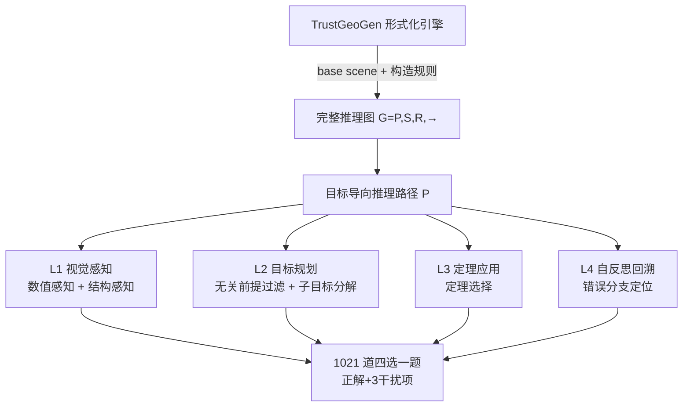

# GeoBench: Rethinking Multimodal Geometric Problem-Solving via Hierarchical Evaluation

**会议**: ICLR 2026  
**代码**: [https://github.com/FrontierX-Lab/GeoBench](https://github.com/FrontierX-Lab/GeoBench)  
**领域**: 多模态 / VLM 几何推理评测  
**关键词**: 几何问题求解, 层级化评测, 形式化验证, MLLM, 推理诊断, Chain-of-Thought  

## 一句话总结
GeoBench 用形式化引擎 TrustGeoGen 生成 1021 道可验证的合成几何题，按 van Hiele 认知模型把几何推理拆成「视觉感知→目标规划→定理应用→自反思回溯」四层六任务，从而把 VLM 的几何能力从"只看最终答案"细化到"诊断到底卡在哪一步"。

## 研究背景与动机
- **领域现状**：多模态大模型（MLLM）在 GeoQA 等几何 benchmark 上已能逼近甚至超过人类，看似几何推理已被攻克。
- **现有痛点**：当前评测有三个系统性缺陷——（1）题目几乎全部来自公开教材，存在**测试集污染**风险，模型靠记忆模式而非真推理拿分；（2）只看最终答案对错，忽略定理链、证明生成这些定义"几何严谨性"的中间过程；（3）缺乏诊断粒度，模型答错时无法判断是空间感知弱、定理检索差还是不会纠错。
- **核心矛盾**：高分掩盖了能力盲区——一个只会背 GeoQA 答案模式的模型和一个真正会做几何证明的模型，在传统 benchmark 上分数可能相同，但它们的真实能力天差地别。
- **本文目标**：构造一个**无污染、过程可诊断、能定位瓶颈**的几何推理评测，把"会不会做几何题"分解成可单独度量的子能力。
- **核心 idea**：**层级化诊断评测**——借 van Hiele 几何思维认知模型把求解过程分四层，每层对应若干形式化验证的子任务；同时用合成数据彻底规避教材污染，所有推理步骤经符号求解器证明正确。

## 方法详解

### 整体框架
GeoBench 的构造分两阶段：先用形式化引擎 TrustGeoGen 生成"图像+题目+完整推理图"三元组（每步推理由符号系统证明正确），再基于推理图把四个认知层级实例化成六个选择题任务，每题一对正解 + 三个精心设计的干扰项。

### 关键设计

**1. 形式化推理图作为评测真值：把"答案正确"升级为"过程可验证"。** GeoBench 不直接出题，而是先让 TrustGeoGen 从随机 base scene 出发、用构造规则迭代扩展几何元素，生成一个完整推理图 $G=(P,S,R,\hookrightarrow)$：其中 $P$ 是初始前提（关系前提 $p^r_i$ 如"A、B、C 共线"和数值前提 $p^n_j$ 如 $AB=3$），$S$ 是每步推出的中间状态，$R$ 是演绎规则集，$\hookrightarrow$ 形式化为 $S_r \xrightarrow{r} s'$ 表示"对状态子集 $S_r$ 应用规则 $r$ 推出 $s'$"。再从目标状态 $s_t$ 反向回溯出目标导向推理路径 $\mathcal{P}=\{(S_{i-1},r_s,s)\mid S_{i-1}\xrightarrow{r_s}s\}$。这条由符号求解器证明的"黄金推理链"是所有六个任务出题与判分的依据——干扰项的正确/错误有形式化保证，而非人工标注，从根本上排除了答案歧义和教材污染。

**2. van Hiele 四层六任务：把几何能力解耦成可单独度量的维度。** 四个层级逐级加难，每层从推理图上自动抽取对应任务的题目。**L1 视觉感知**含数值感知（从图中读取数值前提，干扰项用数值篡改 $AB=6\to AB=4$ 或标签篡改 $AB\to AY$ 制造，专测幻觉）和结构感知（识别几何关系前提，干扰项对关系做逆否，如"D、E、F 共线"→"不共线"）。**L2 目标规划**含无关前提过滤（正解取自未参与推理的前提 $P\setminus S_0$，要求 $P\setminus S_0\neq\varnothing$ 且 $|S_0|\geq3$）和子目标分解（基于后向链，正解为推出结论所需的中间条件 $S_{r_t}\setminus P$，干扰项混入无关中间状态）。**L3 定理应用**的定理选择任务从用过的规则集 $R_{used}$（$|R_{used}|\geq3$）里取三条做干扰，正解是规则库里**没用到**的那条，专测模型能否区分相关与无关定理。**L4 自反思回溯**的错误分支定位把错误路径 $\mathcal{P}_{faulty}:=\mathcal{P}_{wrong}\setminus\mathcal{P}$ 定义为偏离黄金链的子图，要求模型指出 8 步推理中**最初出错的那一步**——这是最难、最能反映真自反思能力的任务。

**3. 合成数据 + OOD 双重验证，确保诊断结论可迁移。** 全部 1021 题来自 76 个几何构造、42 条演绎规则、40 个 base scene 的合成，t-SNE 显示其图像与解题嵌入和 GeoQA 几乎不重叠且分布更广，解题 token 长度普遍上千（GeoQA 上限仅 189），难度经实测落在"超过中学、接近竞赛"区间。更关键的是，作者用 Spearman 秩相关 $\rho$ 把每个子任务的分数向量 $X_i$ 与最终求解分数向量 $Y$ 关联，发现子目标分解、无关前提过滤、定理选择三个任务相关性最高，且这一排序在 GeoBench-solving、GeoQA、Geometry3K 三个数据集上一致——证明 GeoBench 诊断出的瓶颈能 OOD 泛化，不是过拟合某个数据集的产物。

## 实验关键数据

### 主实验：四层六任务（节选 Table 4，acc）

| 模型 | N.P. | S.P. | I.P.F. | S.D. | T.S. | F.B.L. |
|------|------|------|--------|------|------|--------|
| Random | 24.6% | 25.8% | 26.2% | 24.6% | 25.6% | 25.7% |
| Human | 100% | 100% | 77.5% | 100% | 56.7% | 52.9% |
| Qwen2.5-VL-72b | 85.7% | 40.7% | 38.5% | 77.0% | 47.4% | 26.5% |
| GPT-4o | 66.7% | 23.0% | 44.0% | 57.5% | 35.1% | 23.8% |
| OpenAI-o1 | 75.0% | 65.2% | 61.5% | 77.0% | 53.2% | 27.9% |
| **OpenAI-o3** | 81.0% | **74.8%** | **70.0%** | **91.0%** | **54.4%** | 22.5% |
| Gemini-2.5-pro | 81.0% | 60.0% | 74.0% | 87.0% | 45.0% | 18.4% |

- 性能随层级升高**单调下滑**；推理模型（o1/o3/Gemini-2.5-pro）整体强于通用 MLLM；**L4 错误分支定位是公认天花板**——最高仅 27.9%，与随机 25.7% 几乎无差异，连 o3 都掉到 22.5%（低于随机）。

### 难度定位（Table 3）

| 模型 | GeoQA | Geometry3K | OlympiadBench-Geo | GeoBench-solving |
|------|-------|-----------|-------------------|------------------|
| Gemini-2.5-pro | 79.6% | 80.7% | 75.0% | 49.6% |
| GPT-4o | 42.3% | 31.5% | 13.4% | 22.1% |

GeoBench 求解难度略高于奥赛级 OlympiadBench-Geo，远超中学题。

### 子任务与最终求解的相关性（Table 6，Spearman ρ）

| | N.P. | S.P. | I.P.F. | S.D. | T.S. | F.B.L. |
|---|------|------|--------|------|------|--------|
| vs GeoBench-solving | 0.40 | 0.76 | **0.98** | **0.89** | 0.83 | 0.50 |
| vs GeoQA (OOD) | 0.66 | 0.67 | 0.75 | **0.93** | 0.85 | 0.50 |

### 鲁棒性消融（Table 7 扰动 / Table 8 纯文本，acc）

| 设置 | N.P. | S.P. | S.D. | T.S. |
|------|------|------|------|------|
| Qwen2-VL-72b（原始） | 86.3% | 29.6% | 60.5% | 37.1% |
| Qwen2-VL-72b（扰动） | 81.0% | 33.3% | 56.5% | 39.8% |
| Qwen2-VL-72b（纯文本） | 47.6% | 19.3% | 59.5% | 31.0% |
| Qwen2-VL-72b（图文） | 86.3% | 29.6% | 60.5% | 37.1% |

去掉图像后视觉任务（N.P. 86.3%→47.6%）断崖下跌，而规划类任务（S.D.）几乎不变，证明 benchmark 的视觉接地是真考点而非文本捷径。

### 关键发现
- **瓶颈识别**：无关前提过滤（I.P.F.）、子目标分解（S.D.）、定理选择（T.S.）与最终求解相关性最高（ρ 高达 0.98/0.89/0.83），是决定复杂几何题成败的核心能力；错误分支定位相关性最弱。
- **CoT 反直觉失效**：在 Qwen 系列和 GPT-4o 上做"let's think step by step" vs "only output the answer"消融，发现 **CoT 并非普遍有益**，在**自反思回溯（F.B.L.）任务上反而降低性能**——作者推测当 prompt 里含有误导性推理步骤时，CoT 会把模型引向无效纠错。
- **鲁棒性验证**：扰动数据集（Table 7）和纯文本 vs 图文（Table 8）实验显示，去掉图像后 N.P./S.P. 等视觉任务显著下降，证明 benchmark 确实在考视觉接地而非纯文本捷径。

## 亮点与洞察
- **把评测从"对答案"变成"做体检"**：四层六任务像一组诊断指标，能告诉你模型到底卡在感知、规划、定理还是纠错——这对开发几何推理系统给出了可操作的改进方向。
- **形式化验证 = 无污染 + 可信干扰项**：用符号求解器证明每步推理，既规避教材污染，又让正解/干扰项的对错有数学保证，省去人工标注的噪声与歧义。
- **相关性分析串起诊断与求解**：用 Spearman ρ 量化"哪个子能力最决定最终成绩"，并在 OOD 上验证排序一致，把碎片化的子任务分数升华成有迁移性的结论。
- **F.B.L. 全军覆没**是最有价值的负面信号：所有模型（含 o3）在错误定位上接近随机，说明当前 MLLM 的"自反思"能力很可能是表演而非真实，指向一个明确的研究空白。

## 局限与展望
- **依赖单一引擎**：全部数据来自 TrustGeoGen，几何场景受限于其 76 构造/42 规则/40 base scene，多样性虽广但仍是规则可枚举的合成分布，与真实手绘/复杂图示的几何题仍有差距。
- **四选一格式**：选择题便于自动判分，但天然存在猜测基线，且无法考查模型自由生成完整证明的能力（与最终 open-ended 求解仍隔一层）。
- **CoT 失效仅观察未机理化**：论文给出"误导步骤干扰纠错"的推测，但未深入分析 CoT 在 F.B.L. 上失效的内在机制，也未提出对应的 prompt/训练改进。
- **展望**：可把诊断信号反哺训练（如针对 S.D./I.P.F. 做定向数据增强）、扩展到非欧/立体几何、以及把四选一升级为过程级评分。

## 相关工作与启发
- **几何 benchmark**：GeoQA、Geometry3K、PGPS9K、GeoEval、MathVista、MathVerse 等多源自教材且只验最终答案；GeomRel 测结构理解、GeoSense 测定理应用，但范围窄、未把子能力系统关联到求解效能。GeoBench 是首个同时覆盖 F.A./V.P./G.P./R.T.A./S.B. 五维的合成 benchmark（Table 1）。
- **几何求解模型**：MAVIS 合成 834K CoT 轨迹、G-LLaVA 用 170K 标注、GeoX 做视觉-形式语言对齐，均强调最终答案，呼应本文"需结构化推理能力"的主张。
- **合成数据**：TrustGeoGen 是本文的数据基座，其形式化推理图的可验证性是整套评测可信度的来源。
- **启发**：层级化 + 形式化验证 + 相关性诊断的组合，可迁移到代数证明、物理推理、程序合成等任何"中间过程可形式化"的推理评测领域。

## 评分
- **新颖性**: ⭐⭐⭐⭐ — 把 van Hiele 认知模型与形式化推理图结合做层级诊断评测，CoT 在纠错任务上失效的发现尤其有价值；评测方法论创新明显，但底层依赖已有的 TrustGeoGen 引擎。
- **实验充分度**: ⭐⭐⭐⭐ — 覆盖 18+ 模型、四层六任务、人类基线、OOD 验证、CoT 消融、扰动与纯文本鲁棒性实验，相关性分析扎实；唯 F.B.L. 等任务样本量偏小。
- **写作质量**: ⭐⭐⭐⭐ — 框架清晰、形式化定义严谨、表格诊断信息密集；个别处 GeoBench/GenBench 拼写不一致。
- **价值**: ⭐⭐⭐⭐ — 给几何推理研究提供了可诊断、可定位瓶颈的标准评测，I.P.F./S.D./T.S. 是关键能力、F.B.L. 是公认短板等结论对后续工作有直接指导意义。

<!-- RELATED:START -->

## 相关论文

- [\[ICCV 2025\] Pi-GPS: Enhancing Geometry Problem Solving by Unleashing the Power of Diagrammatic Information](../../ICCV2025/multimodal_vlm/pi-gps_enhancing_geometry_problem_solving_by_unleashing_the_power_of_diagrammati.md)
- [\[ICLR 2026\] On Discriminative vs. Generative Classifiers: Rethinking MLLMs for Action Understanding](on_discriminative_vs_generative_classifiers_rethinking_mllms_for_action_understa.md)
- [\[ICLR 2026\] MME-Emotion: A Holistic Evaluation Benchmark for Emotional Intelligence in Multimodal Large Language Models](mme-emotion_a_holistic_evaluation_benchmark_for_emotional_intelligence_in_multim.md)
- [\[ICLR 2026\] Enhancing Geometric Perception in VLMs via Translator-Guided Reinforcement Learning](enhancing_geometric_perception_in_vlms_via_translator-guided_reinforcement_learn.md)
- [\[CVPR 2026\] Bias Is a Subspace, Not a Coordinate: A Geometric Rethinking of Post-hoc Debiasing in Vision-Language Models](../../CVPR2026/multimodal_vlm/bias_is_a_subspace_not_a_coordinate_a_geometric_rethinking_of_post-hoc_debiasing.md)

<!-- RELATED:END -->
