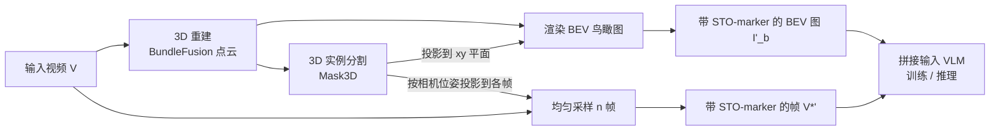

# GPT4Scene: Understand 3D Scenes from Videos with Vision-Language Models

**会议**: ICLR 2026  
**OpenReview**: [https://openreview.net/forum?id=0fib2BYc0L](https://openreview.net/forum?id=0fib2BYc0L)  
**代码**: 待确认  
**领域**: 多模态视觉语言模型 / 3D 场景理解  
**关键词**: VLM, 3D 场景理解, 视觉提示, 鸟瞰图(BEV), 时空物体标记, ScanNet  

## 一句话总结
不动 VLM 架构、不引入点云模态，仅用「视频 + 重建出的鸟瞰图 + 跨帧一致的物体 ID 标记」这套视觉提示，就把 2D 视觉语言模型补出 3D 室内场景理解能力，并在零样本与微调两种设定下都刷到 SOTA。

## 研究背景与动机
- **领域现状**：2D VLM 在图文/视频理解上已经很强，主流把它扩展到 3D 的做法是往里塞点云（3D Point LLM）或点云+多视图（Point-Vision-LLM），靠更丰富的几何线索提升场景理解。
- **现有痛点**：点云这一额外模态与文本对齐困难、需要改架构和重新训练对齐模块，工程上重、迁移性差；而人类其实只靠视觉就能感知 3D 空间，说明纯视觉路线是有可能的。
- **核心矛盾**：直接把场景视频喂进 VLM 做 3D 理解会失败，作者实证定位出两个根因——**缺少全局场景表示**，以及**逐帧局部观测与其时空上下文之间缺乏对应关系（global-local correspondence 断裂）**。
- **本文目标**：在**不修改 VLM 架构**、不引入点云作为输入模态的前提下，最大化预训练 VLM 的视觉感知能力，让它直接从纯视频理解 3D 场景。
- **核心 idea**：**[视觉提示范式]** 用 3D 重建产出一张带全局布局的鸟瞰图(BEV)补「全局」，再用在 BEV 与各帧上 ID 一致的物体标记补「局部—全局对应」，把 3D 理解问题转化成 VLM 本就擅长的 2D 图像理解问题。

## 方法详解

### 整体框架
GPT4Scene 是一条把视频「预处理成带标记的多视图 + BEV 图」再喂给 VLM 的流水线：对输入视频先做 3D 重建得到点云、渲染出鸟瞰图，再用 3D 实例分割得到物体并把它们的 ID 同时投影回 BEV 图和采样帧上，形成跨视图一致的标记；最后把「带标记的视频帧 + 带标记的 BEV 图」拼接送入 VLM，用于训练或推理。该范式既可对大模型零样本直接用，也可用于微调小模型。

### 关键设计
**1. 全局信息——BEV 鸟瞰图：把"看不全的第一视角"补成"一眼看全的俯视图"。** 第一视角视频天生缺全局上下文，模型不知道整个房间的布局。作者对完整视频序列 $V=\{I_1,\dots,I_N\}$ 配合相机外参 $E$ 做重建得到点云 $P=R(\{(I_t,E_t)\}_{t=1}^N)$，再以俯视外参 $E_{top}$ 渲染出鸟瞰图 $I_b=T(P,E_{top})$。关键取舍是：把全局 3D 信息以**俯视图像**而非点云的形式给 VLM，从而完全留在视觉模态内、不破坏 VLM 已有的图像理解通路。后续消融也证明 BEV 的重建质量对结果几乎无影响（换 SLAM3R / GS-SLAM / MAST3R-SLAM、改帧间隔，ROUGE 几乎不变），说明 BEV 起的是「全局概览」作用而非精确几何。

**2. 局部对应——时空物体标记(STO-markers)：用一致的物体 ID 把每一帧和俯视图缝在一起。** 单有 BEV 还不够，模型需要知道「这一帧里这把椅子」就是「俯视图里那个位置的物体」。作者在重建点云 $P$ 上跑 3D 实例分割（Mask3D）得到 $K$ 个物体掩码 $M=\{M_1,\dots,M_K\}$，对 BEV 图把掩码投到 xy 平面取包围盒中心 $C^{xy}$ 叠上去；对采样帧则按各自相机位姿把 3D 掩码投影回 2D、取质心作为该物体在该帧的标记 $C^{uv}_{i,k}$，得到带标记的帧与 BEV：$V^{*\prime}=\{F(I_i,C^{uv}_i)\}$、$I'_b=F(I_b,C^{xy})$。由于同一物体在所有帧和 BEV 上用同一个 ID，**空间上(帧↔BEV)与时间上(帧↔帧)都对齐**，直接把断裂的 global-local 关系补了起来。消融显示方法对标记精度同样鲁棒——它学的是「对应关系」而非精确几何。

**3. 零样本提示 vs ScanAlign 微调：大模型直接用，小模型靠数据补课。** 零样本设定下，仅把上述带标记的视频喂给大模型即可显著涨点（GPT-4o ScanQA ROUGE 34.2→39.3，Gemini-1.5-Pro 35.1→39.4，Qwen2-VL-72B 32.1→35.1），甚至逼近点云方法 Chat-scene；但 2B/7B 小模型因视觉编码与跨模态融合能力弱，解析不出 BEV 全局逻辑、对不齐跨帧标记，零样本几乎不涨甚至倒退（Qwen2-VL-2B 还掉了 0.7）。为此作者构建 **ScanAlign**：把 ScanQA/SQA3D/Scan2Cap/ScanRefer/Multi3DRef 五个基于 ScanNet 的基准的 165K 文本标注，**统一重排成 VLM 友好的 $(V^{*\prime}, I'_b, T)$ 视觉提示格式**（核心贡献是把纯几何点云数据转成带标记的视频帧+BEV+文本），用它微调 7B 级开源 VLM。

**4. 内生 3D 能力——训练后推理可去掉显式提示。** 最有意思的发现：用 GPT4Scene 范式微调后的模型，**即使推理时不再给 BEV 图和物体标记**，3D 理解仍明显优于纯视频微调的模型（消融表 6：训练用范式、推理去掉显式提示，ScanQA CIDEr 95.4，仅略低于带提示的 96.3，远高于纯视频 SFT 的 85.9）。这说明该范式让 VLM 把「全局—局部对应」内化成了一种内生能力，而不只是一次性的输入技巧，为无缝把 VLM 扩展到 3D 铺了路。

## 实验关键数据
基准基于 ScanNet，覆盖 3D 问答(ScanQA/SQA3D)、3D 稠密描述(Scan2Cap)、3D 视觉定位(ScanRefer/Multi3DRef)。重建用 BundleFusion，实例分割用 Mask3D，每视频采 32 帧(512×490)，1 epoch、lr 5e-6、8×A100 约 6 小时。

### 主实验表格（3D 问答，部分代表性结果）

| 方法 | 模态 | ScanQA CIDEr | ScanQA BLEU-1 | SQA3D EM-1 |
|---|---|---|---|---|
| Chat-scene（点云 SOTA） | Point+Vision | 87.7 | 43.2 | 54.6 |
| LLaVA-3D | Vision | 91.7 | - | 55.6 |
| Video-3D-LLM | Vision | 102.1 | 47.1 | 58.6 |
| ROSS3D | Vision | 107.0 | 49.2 | 63.0 |
| Qwen2-VL-7B (GPT4Scene) | Vision | 96.3 | 44.4 | 60.6 |
| **Qwen2.5-VL-7B (GPT4Scene)** | Vision | **105.7** | **49.2** | **63.5** |

视觉定位上 Qwen2.5-VL-7B (GPT4Scene) 在 ScanRefer Acc@0.25 达 65.6、Multi3DRef F1@0.25 达 67.3，较点云 SOTA Chat-scene 大幅领先（Qwen2-VL-7B 版即分别超 7.1 / 7.4 点）；稠密描述 Scan2Cap 上 Qwen2.5-VL-7B (GPT4Scene) IoU@0.5 的 BLEU-4/ROUGE 达 44.1/67.1，同样全面超越各类基线。

### 消融实验表格（训练/推理组件，Qwen2-VL-7B，ScanQA）

| 训练用 GPT4Scene | 推理用 GPT4Scene | METEOR | ROUGE | CIDEr |
|---|---|---|---|---|
| ✓ | ✓ | 18.9 | 46.5 | 96.3 |
| ✓ | ✗ | 18.6 | 45.9 | 95.4 |
| 纯视频 SFT | ✓ | 17.3 | 43.5 | 88.2 |
| 纯视频 SFT | ✗ | 16.7 | 42.1 | 85.9 |
| 无训练 | ✓ | 14.1 | 33.2 | 68.7 |
| 无训练 | ✗ | 12.4 | 30.8 | 64.7 |

### 关键发现
- **训练比推理提示更关键**：用范式微调过的模型即便去掉推理时的 BEV/标记，性能也几乎不掉（96.3→95.4），印证「内生 3D 能力」。
- **对重建质量与标记精度鲁棒**：换不同 SLAM/帧间隔，ScanQA ROUGE 在 45.8~47.0 间浮动，说明 BEV 提供的是全局概览而非精确几何。
- **强在物体层**：GPT Score 评测显示 GPT4Scene 在 Relational Refer、Existence & Counting 等物体中心任务上优势最大，纯空间关系上与点云方法相当。
- **零样本对大模型有效、对小模型无效**：参数规模决定能否自行解析 BEV 全局逻辑与跨帧标记一致性。

## 亮点与洞察
- **把 3D 理解"翻译"回 2D 图像理解**：不碰架构、不引点云，靠 BEV 图 + 一致 ID 标记这套纯视觉提示，让 2D VLM 直接吃下 3D 任务，迁移成本极低。
- **"内生能力"是最大彩蛋**：训练后推理可去掉显式提示仍涨点，说明该范式真正改变了模型的内部表征，而非靠输入端的脚手架硬撑。
- **数据贡献干净利落**：ScanAlign 不是新采数据，而是把五大基准的 165K 标注重排成统一视觉提示格式，复用性强。

## 局限与展望
- **依赖离线 3D 重建与实例分割**：BEV 图和标记都需先重建点云+Mask3D，仍是一条相对重的离线预处理管线，难做到端到端实时（虽对质量鲁棒，但流程不可省）。
- **小物体理解仍弱**：消融显示对大物体理解最好、随物体变小而下降。
- **仅限室内 ScanNet 场景**：方法与数据都围绕 ScanNet 室内场景，室外/开放世界泛化未验证。
- **展望**：若能把"重建+BEV"做成轻量在线模块、或让 VLM 自己学会想象 BEV，有望真正端到端把视频升级为 3D 理解器。

## 相关工作与启发
- **3D Point LLM / Point-Vision-LLM**（Chat-scene、LL3DA、LEO、Grounded-3D-LLM 等）：靠点云模态做 3D 理解，本文是其纯视觉替代路线。
- **Vision-only 3D LLM**（LLaVA-3D、Video-3D-LLM、ROSS3D 等）：同属去点云阵营，本文以「视觉提示(BEV+标记)」而非改架构来补 3D，思路更轻。
- **启发**：视觉提示(visual prompting)+俯视图/一致 ID 标记，是把现成强模态模型迁移到新任务的低成本通用范式，可能迁移到地图导航、多视图工业检测等需要「全局—局部对应」的场景。

## 评分
- 新颖性: ⭐⭐⭐⭐ 「纯视觉提示替代点云 + 训练后内生 3D 能力」的观察新颖且有说服力，BEV+一致标记的组合简单但抓住了 global-local 这个真问题。
- 实验充分度: ⭐⭐⭐⭐ 三大类 5 个基准 + 零样本/微调双设定 + 多角度消融（训练/推理拆解、重建质量、物体尺寸、GPT Score），覆盖很全。
- 写作质量: ⭐⭐⭐⭐ 痛点定位（两个根因）到方法到验证逻辑清晰，图表完整。
- 价值: ⭐⭐⭐⭐ 给「把 2D VLM 扩展到 3D」提供了低成本、可复用、可去脚手架的范式，对具身智能与场景理解落地有实际意义。

<!-- RELATED:START -->

## 相关论文

- [\[NeurIPS 2025\] Learning from Videos for 3D World: Enhancing MLLMs with 3D Vision Geometry Priors](../../NeurIPS2025/multimodal_vlm/learning_from_videos_for_3d_world_enhancing_mllms_with_3d_vision_geometry_priors.md)
- [\[ICLR 2026\] SR-3D: 3D-Aware Region Prompted Vision Language Model](3d_aware_region_prompted_vision_language_model.md)
- [\[ICLR 2026\] Error Notebook-Guided, Training-Free Part Retrieval in 3D CAD Assemblies via Vision-Language Models](error_notebook-guided_training-free_part_retrieval_in_3d_cad_assemblies_via_visi.md)
- [\[ACL 2025\] Can Vision Language Models Understand Mimed Actions?](../../ACL2025/multimodal_vlm/can_vision_language_models_understand_mimed_actions.md)
- [\[ICLR 2026\] Mordal: Automated Pretrained Model Selection for Vision Language Models](mordal_automated_pretrained_model_selection_for_vision_language_models.md)

<!-- RELATED:END -->
