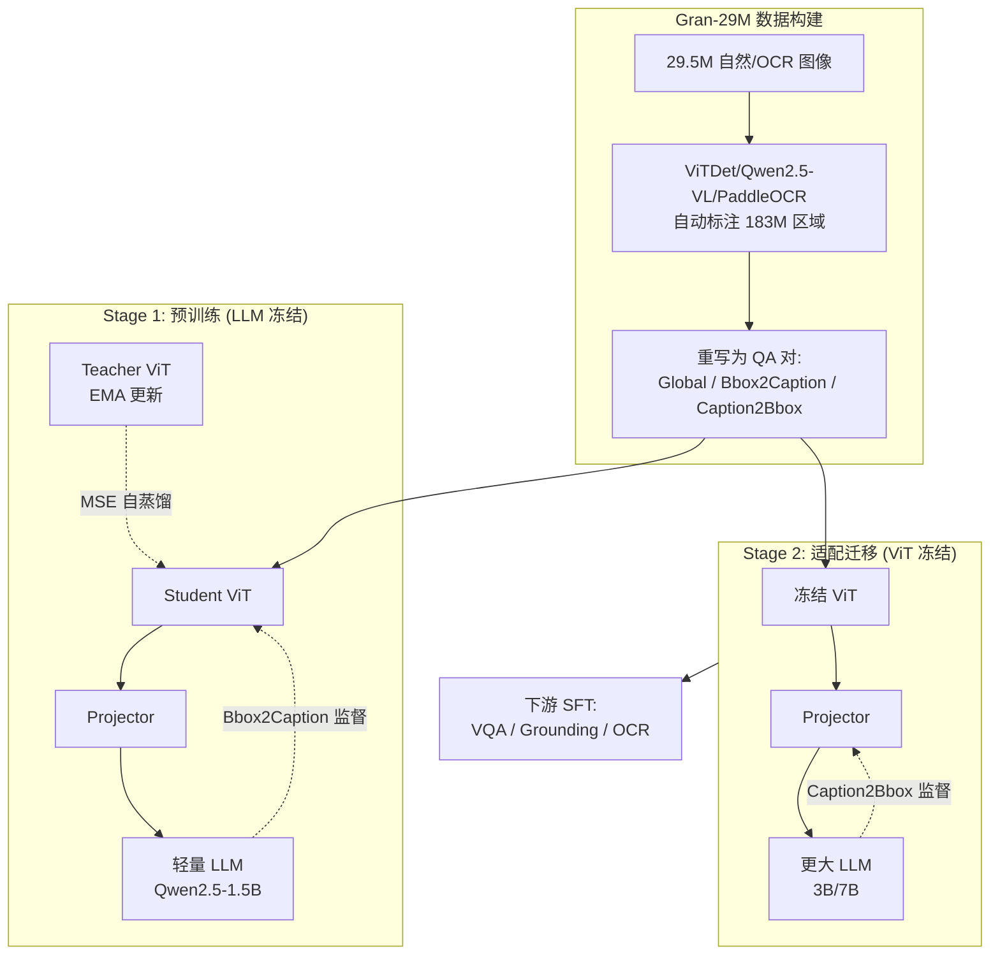

# GranViT: A Fine-Grained Vision Model For Autoregressive Multimodal Large Language Models

**会议**: ICLR 2026  
**OpenReview**: [https://openreview.net/forum?id=dQ6LWE0LnG](https://openreview.net/forum?id=dQ6LWE0LnG)  
**代码**: 待确认  
**领域**: 多模态视觉编码器 / 细粒度感知  
**关键词**: 视觉编码器, MLLM, 细粒度感知, 自回归预训练, 区域级标注, 自蒸馏  

## 一句话总结
通过构建 2951 万图像 / 1.83 亿区域级标注的 Gran-29M 数据集，并用「Bbox→Caption / Caption→Bbox」双向自回归任务 + 局部自蒸馏来预训练视觉编码器，GranViT 让 ViT 第一次具备了对齐 LLM 语义空间的细粒度局部感知能力，在视觉 grounding 与 OCR 理解上刷新 SOTA。

## 研究背景与动机

**领域现状**：现代 MLLM 普遍由「预训练视觉编码器 + 投影模块 + LLM」三件套构成，视觉编码器（CLIP、SigLIP、AIMv2、InternViT 等）的训练范式要么是对比学习（CLIP/SigLIP），要么是自回归建模（AIMv2/InternViT），目标都是把**整张图**的全局表征对齐到文本语义。

**现有痛点**：这些编码器几乎只盯着 image-level 的全局特征，**忽视了局部区域的细粒度分析能力**。论文给出的注意力可视化（Fig.1b）显示，现有编码器在 query token 指向某个小物体时，注意力是弥散、对不准的。背后有两个根因——一是**数据稀缺**：缺乏高质量的细粒度（区域级 bbox + caption）标注数据；二是**范式缺失**：没有一个专门训练细粒度视觉编码器、并让其特征与 LLM 对齐的预训练框架。

**核心矛盾**：MLLM 既要求视觉编码器**输出更细粒度的局部特征**，又要求 LLM **有能力利用这些局部特征**做定位和推理——但现有范式两边都没单独优化，导致细粒度感知（指代理解、OCR、计数、空间关系）成为短板。

**本文目标**：把细粒度定位能力直接注入「视觉编码器 ↔ LLM」级联结构中，让编码器在保留全局感知的同时具备区域级理解，且能迁移到不同规模的 LLM。

**核心 idea**：**用 LLM 当解码器、用区域级双向自回归任务反向监督视觉编码器**。Bbox2Caption（给框出 caption）强化编码器的局部特征抽取；Caption2Bbox（给 caption 出框）强化 LLM 对视觉特征的定位利用；再加一个**局部自蒸馏**给编码器局部特征施加显式约束。三者分两阶段组合，既练强编码器又保证可迁移。

## 方法详解

### 整体框架

GranViT 把整个流程拆成「数据 + 两阶段训练」。先用 ViTDet / Qwen2.5-VL-7B / PaddleOCR 自动标注，造出 Gran-29M（2951 万图、1.83 亿区域标注），并把所有标注重写成 Global Caption、Bbox2Caption、Caption2Bbox 三类 QA 对。训练分两阶段：**Stage 1 预训练**冻结 LLM、只训视觉编码器 + 投影器，用 Bbox2Caption 任务把局部特征监督灌进编码器，同时引入冻结 teacher 编码器做局部自蒸馏；**Stage 2 适配迁移**冻结视觉编码器、只训投影器 + LLM，用 Caption2Bbox 任务把 LLM 的定位能力练起来，并顺势完成向更大 LLM 的迁移。全程保留 Global Caption 任务以守住全局感知。

### 关键设计

**1. Gran-29M：用现成模型流水线造出区域级标注海洋。** 细粒度预训练的最大瓶颈是数据，论文用一条全自动标注流水线绕过了人工成本。自然图像复用 UMG-41M 自带的 bbox，再用 Qwen2.5-VL-7B 重生成全局/局部 caption；对 LAION、FLICKR30k 则用 ViTDet 检框 + Qwen2.5-VL-7B 写描述；OCR 图像因全局描述太空泛（"一页论文"），只用 PaddleOCR 标局部文本框 + 内容。随后用严格规则过滤——图像短边 > 448px、整图与 bbox 长宽比在 $[\frac{1}{3}, 3]$、bbox 面积 > $100^2$ 像素、每图至少一个 bbox——最终得到 2951 万图、1.8355 亿区域标注。所有 bbox 坐标都从绝对值转为相对图像分辨率的归一化坐标，消除对绝对尺寸的依赖。

**2. Bbox2Caption / Caption2Bbox：方向相反的两个自回归任务，分别练编码器和 LLM。** 这是全文的核心 insight。**Bbox2Caption**（"描述这个框里 ≤10 词的内容"）把 LLM 当成一个把视觉特征转成文字的解码器，监督信号经 LLM 直接反传到被框选的局部视觉特征上，从而逼着编码器抽出有判别力的细粒度特征。**Caption2Bbox**（"给出这句描述对应区域的 bbox 坐标"）则反过来要求 LLM 读懂视觉特征并输出坐标，练的是 LLM 利用细粒度特征做定位的能力。两个任务都用统一的自回归 caption 损失监督：

$$L_{caption} = \mathrm{CrossEntropy}(O_{LLM}, T)$$

其中 $T$ 是 ground-truth 文本、$O_{LLM}$ 是 LLM 输出。作者通过 Fig.4 的实验观察到一个关键现象——Stage 1 冻结 LLM 时 Bbox2Caption 的 ROUGE-L 能到 52% 但 Caption2Bbox 的 ACC@IOU0.5 只有 13%，因为出坐标更依赖语言侧能力；而 Stage 2 训 LLM 后 Caption2Bbox 大幅提升、Bbox2Caption 只涨 3%。既然在 Stage 2 继续优化 Bbox2Caption 收益微乎其微却要双倍算力，论文索性**把两个任务拆到两阶段分别优化**，这就是「预训练-适配」范式的由来。

**3. 局部自蒸馏：给编码器局部特征施加显式定位约束。** 仅靠 $L_{caption}$ 通过 LLM 输出文本来隐式监督编码器，缺少对局部区域特征的**显式**约束。论文额外引入一个冻结的 teacher 编码器：把原图按 bbox 裁出区域块 $x_{crop}$ 送进 teacher 得到局部特征 $x'_{crop}$，再对 student 在全图上抽的特征做 ROIAlign 取出对应区域，两者做 MSE 对齐：

$$L_{distill} = \mathrm{MSE}\big(x'_{crop}, \mathrm{ROIAlign}(x')\big)$$

teacher 权重由 student 经 EMA 更新 $\theta_{tea} = \alpha\theta_{tea} + (1-\alpha)\theta_{stu}$（默认 $\alpha=0.9$）。这相当于让 student 在看整图时抽到的局部特征，逼近 teacher 专门看裁剪块抽到的"纯净"局部特征，从而强化区域推理能力。总损失为 $L = L_{caption} + \lambda L_{distill}$（默认 $\lambda=1$）。

**4. 冻结编码器换取可迁移性。** Stage 2 之所以冻结视觉编码器、只训 LLM + 投影器，是因为编码器在 Stage 1 已被充分预训练，继续训它对性能只有边际提升却大幅推高适配成本。更妙的是这让同一个细粒度编码器能挂到不同规模 LLM（Qwen2.5-3B/7B、LLaMA3-8B）上：Stage 1 用轻量的 1.5B LLM 逼编码器抽**通用**细粒度特征（而非依赖大模型的推理能力），Stage 2 再迁移到大 LLM，兼顾了训练效率与跨架构通用性。

## 实验关键数据

### 主实验表格

低分辨率版本下，与各视觉编码器在四类任务上的平均分对比（LLM 为 Qwen2.5-1.5B）：

| 任务类别 | CLIP | SigLip | SigLip2 | AIMv2 | InternViT | SAILViT | **GranViT** |
|---|---|---|---|---|---|---|---|
| 细粒度 (Fine-Grained) | 66.41 | 57.67 | 75.61 | 73.50 | 70.53 | <u>77.95</u> | **80.78** |
| 多模态 VQA | 51.02 | 49.58 | 52.97 | 53.53 | 50.48 | **53.85** | <u>53.57</u> |
| 多模态推理 | 49.20 | 47.41 | 51.09 | 50.09 | 50.38 | **52.02** | 50.60 |
| OCR 理解 | 38.82 | 37.06 | 51.55 | 48.18 | 45.08 | <u>53.33</u> | **55.97** |

细粒度与 OCR 上 GranViT 分别超第二名 2.83 和 2.64；VQA 仅差 SAILViT 0.3，推理仅差 SigLIP2 约 0.4（作者解释推理不依赖细粒度特征，且未专门训推理数据）。

### 迁移性实验

把视觉编码器迁移到更大 LLM 后的平均分（GranViT 用 1.5B 预训练再迁移，其余直接用大 LLM 做 SFT）：

| LLM | SigLip2 | AIMv2 | SAILViT | **GranViT** |
|---|---|---|---|---|
| Qwen2.5-3B | 62.30 | 62.23 | <u>64.11</u> | **64.94** |
| Qwen2.5-7B | 64.69 | 63.41 | <u>67.11</u> | **67.47** |
| LLaMA3-8B | 65.62 | 63.33 | <u>67.60</u> | **69.02** |

三种不同 LLM 上全面领先，验证了细粒度编码器的强迁移性。DocVQA 这类指标尤其突出（LLaMA3-8B 上 77.24 vs SAILViT 68.97）。

### 消融实验表格

逐组件累加（小规模 8M+8M 训练）：

| SigLip2 | Stage1 | Self-Distill | Stage2 | Fine-Grained | VQA | Reasoning | OCR |
|:---:|:---:|:---:|:---:|---|---|---|---|
| ✓ | | | | 73.20 | 52.97 | 51.09 | 51.55 |
| ✓ | ✓ | | | 75.06 | 53.64 | 49.89 | 52.77 |
| ✓ | ✓ | ✓ | | 75.55 | 53.90 | 50.32 | 53.02 |
| ✓ | ✓ | ✓ | ✓ | **76.54** | 53.77 | 48.99 | **53.78** |

### 关键发现
- **两阶段任务分工被实验证实合理**：Stage 1 Bbox2Caption ROUGE-L 达 52% 但 Caption2Bbox ACC@IOU0.5 仅 13%；Stage 2 训 LLM 后 Caption2Bbox 显著提升而 Bbox2Caption 仅涨 3%，证明两任务该拆开优化。
- **细粒度预训练有 scaling law**：Stage 1 从 8M→16M→130M、Stage 2 从 8M→24M→130M 区域数据，细粒度与 OCR 性能随数据量持续提升。
- **初始化无关性**：换用 InternViT/AIMv2 初始化 GranViT 同样能涨点（InternViT 45.08→50.13 OCR），说明该范式是即插即用的增强方案，而非依赖特定起点。
- **代价**：推理任务略有损失（GranViT 50.60 vs SAILViT 52.02），因模型把容量优先给了细粒度而非推理。

## 亮点与洞察
- **把「编码器细粒度」和「LLM 定位」两个能力解耦成两个对称任务分阶段优化**，是非常干净的设计——Bbox2Caption 练前者、Caption2Bbox 练后者，且用一个 Fig.4 的实验现象直接论证了为什么不能混在一起训。
- **用 LLM 反向监督视觉编码器**而非传统对比/重建，让编码器特征天然对齐 LLM 语义空间，省去后续对齐摩擦。
- **数据流水线工程价值高**：1.83 亿区域标注全自动产出，Gran-29M 本身就是有价值的资产，且证明了"现成大模型造细粒度数据"路线可行。
- **冻结编码器 + 轻量 LLM 预训练**的设计同时拿下了训练效率和跨 LLM 可迁移性，实用性强。

## 局限与展望
- **推理能力略有牺牲**：为细粒度让路，MMMU/MathVista 等推理基准上不如 SigLIP2/SAILViT，作者也承认需额外引入推理 VQA 数据弥补。
- **数据标注质量依赖上游模型**：bbox 来自 ViTDet、caption 来自 Qwen2.5-VL-7B，上游模型的系统性偏差/幻觉可能被继承进 Gran-29M。
- **自蒸馏的 teacher 同源**：teacher 由 student EMA 而来，可能限制了它带来的额外信息增益上限。
- **未充分探索高分辨率/原生分辨率**：主表用 512×512，虽提到 image tiling 但作为附录，原生高分辨率细粒度感知仍有空间。

## 相关工作与启发
- **视觉编码器范式**：从对比学习（CLIP、SigLIP、SigLIP2）到自回归（AIMv2 首个纯自回归编码器、InternViT 混合对比+自回归），GranViT 沿自回归路线但首次把**区域级**双向任务引入，把"全局对齐"推进到"局部对齐"。
- **与 SAILViT 对比**：SAILViT 也做 LLM 对齐 + 多阶段预训练，但仍偏全局；GranViT 用区域级标注 + 自蒸馏在细粒度/OCR 上明显胜出。
- **启发**：「用下游消费者（LLM）反向监督上游生产者（编码器）」+「双向任务拆阶段优化」是可推广的范式，可迁移到视频、3D 等其它需要细粒度局部理解的模态；自动化区域标注流水线也为其它细粒度任务提供了数据冷启动思路。

## 评分
- **新颖性**: ⭐⭐⭐⭐ — 区域级双向自回归 + LLM 反向监督编码器 + 局部自蒸馏的组合是新的，且 Fig.4 现象驱动的两阶段拆分有说服力；单点技术多为已有组件巧妙组装。
- **实验充分度**: ⭐⭐⭐⭐⭐ — 6 个编码器 × 3 个 LLM × 4 类任务 × 近 20 个 benchmark 的全面对比，外加消融、scaling law、初始化无关性、可视化，非常扎实。
- **写作质量**: ⭐⭐⭐⭐ — 动机—矛盾—方法逻辑清晰，Fig.3/Fig.4 把框架和设计动机讲得很直观；部分表格密集、附录依赖较多。
- **价值**: ⭐⭐⭐⭐⭐ — Gran-29M 数据集 + 可即插即用的细粒度增强范式，对 MLLM 社区有直接实用价值，grounding/OCR SOTA 含金量高。

<!-- RELATED:START -->

## 相关论文

- [\[ICLR 2026\] UniF2ace: A Unified Fine-grained Face Understanding and Generation Model](unif2ace_a_underlineunified_underlinefine-grained_underlineface_understanding_an.md)
- [\[CVPR 2026\] DiG: Differential Grounding for Enhancing Fine-Grained Perception in Multimodal Large Language Models](../../CVPR2026/multimodal_vlm/dig_differential_grounding_for_enhancing_fine-grained_perception_in_multimodal_l.md)
- [\[CVPR 2026\] OddGridBench: Exposing the Lack of Fine-Grained Visual Discrepancy Sensitivity in Multimodal Large Language Models](../../CVPR2026/multimodal_vlm/oddgridbench_exposing_the_lack_of_fine-grained_visual_discrepancy_sensitivity_in.md)
- [\[CVPR 2025\] Multimodal Autoregressive Pre-training of Large Vision Encoders](../../CVPR2025/multimodal_vlm/multimodal_autoregressive_pre-training_of_large_vision_encoders.md)
- [\[ICLR 2026\] MotionSight: Boosting Fine-Grained Motion Understanding in Multimodal LLMs](motionsight_boosting_fine-grained_motion_understanding_in_multimodal_llms.md)

<!-- RELATED:END -->
