# Guided Query Refinement: Multimodal Hybrid Retrieval with Test-Time Optimization

**会议**: ICLR 2026  
**OpenReview**: [https://openreview.net/forum?id=4GRsedu43K](https://openreview.net/forum?id=4GRsedu43K)  
**代码**: 已开源（论文 "We release our code here"）  
**领域**: 多模态检索 / 视觉文档检索 / 混合检索  
**关键词**: Visual Document Retrieval, Hybrid Retrieval, Test-Time Optimization, ColPali, Query Refinement, Late Interaction  

## 一句话总结
提出 **Guided Query Refinement (GQR)**：在测试时用一个轻量文本检索器的打分作为引导信号，通过梯度下降迭代精修视觉检索器（ColPali 系）的查询嵌入，让 ColPali 模型在保持小表征的同时逼近甚至超越超大模型的检索质量，实现最高 14× 加速、54× 省内存。

## 研究背景与动机
- **领域现状**：视觉文档检索（检索含图表/表格的 PDF 页面）有两条技术路线。文本中心路线靠 OCR/VLM 把文档转成文本再用语义编码器索引；视觉中心路线以 ColPali（基于 ColBERT 后期交互）为代表，直接把文档页当图像、用多向量表征做查询 token 对图像 patch 的细粒度匹配，在公开榜单上取得 SOTA。
- **现有痛点**：① ColPali 系为了刷榜疯狂扩大查询和文档表征的长度与维度，部署代价高昂——例如 LLAMA-NEMORETRIEVER-COLEMBED-3B 每个文档页要 10 MB 内存，比单向量稠密检索器高三个数量级，延迟和存储都难以扩展；② 纯视觉路线受困于现代 VLM 固有的**模态鸿沟（modality gap）**，匹配文本查询与富文本文档时存在天然局限。
- **核心矛盾**：混合检索（hybrid retrieval）本可用互补表征弥补短板，但现有方法只在**排名层**（RRF、Average Ranking）或**打分层**（Min-Max / Softmax 归一化后加权）做粗粒度融合——它们把每个查询-文档对压缩成一个整数排名或一个标量分数，丢掉了模型表征空间里丰富的查询-文档交互信息。理想的**表征层融合**信息最丰富，但因不同编码器维度/尺度/单向量 vs 多向量异构、且无监督、又有严格延迟内存预算，实际难以落地。
- **本文目标**：在保持架构无关、轻量、实用的前提下，挖掘表征层的潜力——让一个弱小的文本检索器去"提点"一个更强的视觉检索器。
- **核心 idea**（**测试时查询精修**）：不重新定义打分规则，而是把互补检索器的打分变成一个学习信号，对主检索器的查询嵌入做梯度下降。**关键约束**是梯度只通过主检索器的相似度函数回传，因此排名的任何变化都必须在主模型自己的嵌入空间里"走得通"——这让弱模型的信号被主模型的相似度观念**软性过滤**，而非硬性覆盖打分。

## 方法详解

### 整体框架
GQR 介于"打分层"与"表征层"之间，分两阶段。**阶段一（候选池构建）**：主检索器 $m_1$（视觉，如 Colnomic-7B）和互补检索器 $m_2$（文本，如 Linq-Embed）各自独立编码查询并召回 top-K，取并集 $C(q)=\bigcup_m \pi_m(q)$ 作为候选池。**阶段二（查询精修）**：固定 $m_2$ 的查询嵌入不动，把 $m_1$ 的查询嵌入作为可优化变量，迭代 $T$ 步用 KL 散度把主分布拉向两者的"共识分布"，最后用精修后的查询嵌入对候选池重新打分排序。GQR 架构无关，单向量、多向量查询嵌入都能优化。

```mermaid
flowchart LR
    Q[查询 q] --> R1[主检索器 m1<br/>视觉 ColPali]
    Q --> R2[互补检索器 m2<br/>文本稠密]
    R1 -->|top-K| Pool[候选池 C&#40;q&#41;<br/>两路并集]
    R2 -->|top-K| Pool
    Pool --> Opt[阶段二: 迭代精修<br/>z^t 梯度下降 T 步]
    R2 -. 固定打分 p2 .-> Opt
    Opt --> Score[用 z^T 重新打分<br/>仅来自 m1]
    Score --> Out[最终排序 top-K]
```

### 关键设计

**1. 共识分布作为软目标，而非硬加权：** GQR 先把每个检索器在候选池上的打分经 Softmax 转成概率分布 $p_j(d_i\mid e^q_j)=\frac{\exp(s_j(q,d_i))}{\sum_k \exp(s_j(q,d_k))}$。设初始查询嵌入 $z^{(0)}=e^q_1$，在第 $t$ 步定义**共识分布**为主分布与（固定的）辅分布的平均：$p^{(t)}_{avg}(d)=\tfrac12\big(p_1(d\mid z^{(t)})+p_2(d\mid e^q_2)\big)$，其中只有 $p_1$ 随 $z^{(t)}$ 变化、$p_2$ 始终冻结。这种"取平均"的设计正是为了应对互补检索器**可能比主检索器还弱**的现实——不像传统从强 cross-encoder 拿伪相关反馈，这里 $m_2$ 是个轻量 bi-encoder，所以用 $p_{avg}$ 而非直接拿 $p_2$ 当目标，让弱信号被稀释后温和注入。

**2. KL 散度驱动的查询嵌入梯度精修：** 优化目标是把主分布拉向共识分布，最小化 $L^{(t)}=\mathrm{KL}\big(p^{(t)}_{avg}(d)\,\|\,p_1(d\mid z^{(t)})\big)$。每步对查询表征做梯度步 $z^{(t+1)}=z^{(t)}-\alpha\nabla_z L(z^{(t)})$（论文形式上写 SGD，实测 Adam 更好故采用），迭代 $T$ 步后用 $s^{(T)}_1(q,d)=s_1(z^{(T)},d)$ 重新打分并取 top-K。最小化 KL 会把 $p_1$ 推到辅分布概率高的地方、压低辅分布概率低的地方。$T$ 和步长 $\alpha$ 是仅有的两个超参。

**3. "在主空间内移动查询"带来的非均匀软融合：** 这是 GQR 区别于打分层融合的本质。打分层融合里，每个文档的概率都被辅检索器以**同一个固定量**拉动，更新永远是均匀加权平均；而 GQR 的梯度通过 $s_1(z,d)$ 回传，文档只能经由各自的嵌入和相对概率来影响更新，因此**不同文档可以沿主空间几何决定的非线性轨迹移动不同的幅度**。当 $m_2$ 偏弱或与 $m_1$ 错位时，其信号被主模型的相似度结构过滤而不是直接覆盖打分，从而"软性"地、受约束地融合——这正是 GQR 比传统 hybrid 更稳健的来源。

## 实验关键数据

数据集：ViDoRe 1 / 2 / 3 视觉文档检索基准；主指标 NDCG@5。主检索器（ColPali 系）：Colnomic-7B、Jina-v4(vision)、Llama-Nemo-3B；互补检索器（文本）：Jina(text)、Linq-Embed、Qwen3。共 9 对组合。

### 主实验表格（ViDoRe 2，NDCG@5，调参设置）

| 主检索器 | GQR 互补模型 | Avg | Δ |
|---|---|---|---|
| Colnomic-7B | 无精修 | 60.3 | — |
| Colnomic-7B | Jina(text) | 63.1 | ↑+2.8 |
| Colnomic-7B | Linq-Embed | 62.8 | ↑+2.5 |
| Jina(vision) | 无精修 | 57.2 | — |
| Jina(vision) | Linq-Embed | 61.2 | ↑+4.0 |
| Jina(vision) | Jina(text) | 60.7 | ↑+3.5 |
| Llama-Nemo | 无精修 | 63.0 | — |
| Llama-Nemo | Linq-Embed | 65.2 | ↑+2.2 |

亮点：即使 Qwen3（46.8）比 Llama-Nemo（63.0）低 16.2 分，作为互补信号仍带来 +0.3 增益——弱模型也不掉链子。

### 消融/对比实验表格（ViDoRe 2，相对基座的 NDCG@5 平均增益%，9 对平均）

| 方法 | Avg 增益 | Std |
|---|---|---|
| Average Ranking | ↓-3.0% | 2.5 |
| RRF | ↓-2.8% | 2.6 |
| Score Agg (Min-Max) | ↑+0.4% | 2.6 |
| Score Agg (Softmax) | ↑+1.5% | 1.9 |
| Score Agg (Min-Max, Tuned) | ↑+3.4% | 2.1 |
| Score Agg (Softmax, Tuned) | ↑+2.6% | 2.3 |
| **GQR** | **↑+3.9%** | **1.9** |

GQR 增益最大且 Std 最低，是唯一稳定为正的方法；排名层融合（RRF/Average）反而普遍掉点。

### 关键发现
- **效率 Pareto 前移**：Llama-Nemo 单模型 NDCG@5=62.9 需 2591 ms/查询；Colnomic+GQR(Linq) 达 62.7 仅 181 ms（≈14× 加速），Colnomic+GQR(Jina) 达 63.0 仅 350 ms（≈7× 加速）反超 Nemo。GQR 同时位于索引存储 Pareto 前沿。
- **零样本泛化**：ViDoRe 3 上用单一超参配置（由 ViDoRe 2 调参经验迁移），GQR 在所有模型对和所有子集上一致超越无精修基线（如 Colnomic-7B 55.7→57.4，fin_en 子集 +4.4）。
- ViDoRe 1 已饱和（多子集 90+），GQR 与基座基本持平。

## 亮点与洞察
- **把"打分"重新解读为"梯度信号"**：传统 hybrid 把互补检索器当作打分的一部分直接相加；GQR 把它当作引导查询表征移动的损失方向，从而在不引入新打分规则的前提下触达表征层的丰富交互——这是介于打分层与表征层之间的巧妙折中。
- **弱模型也能提点强模型**：核心反直觉结论是互补检索器即便整体更弱、模态不同，只要提供互补信号，经 KL-软约束注入后仍能稳定提升主模型，避免了"强者被弱者拖累"。
- **真正打到部署痛点**：不是再刷 0.5 个点，而是用小表征 + 测试时几步优化换来一个数量级的延迟/内存节省，把性能-效率权衡的 Pareto 前沿整体左上推。
- 架构无关，单/多向量通用，且测试时即插即用、无需重训或额外监督。

## 局限与展望
- 测试时迭代优化引入了每查询的额外在线延迟（虽相对小），对极端低延迟场景仍是开销；$T$、$\alpha$ 两超参需要在开发集上调或迁移。
- 仅在 $M=2$（一视觉一文本）下验证，多检索器、多模态互补的扩展性未充分探索。
- 共识分布固定为等权平均，未自适应地按互补检索器可信度加权；当 $m_2$ 严重错位时增益有限甚至偶有子集掉点（Llama-Nemo + Qwen3 个别子集为负）。
- 仅评测视觉文档检索（ViDoRe），在通用文本检索、跨语言或其他多模态任务上的有效性待验证。

## 相关工作与启发
- **混合检索**：经典 RRF、Average Ranking、Score Aggregation（Min-Max/Softmax，可调权重）只在排名/打分层粗粒度融合，本文证明这些方法在 ColPali 视觉检索上常常无增益甚至掉点。
- **后期交互检索**：ColBERT → ColPali 系（Colnomic、Jina-v4、Llama-Nemo），多向量细粒度匹配，但表征体量巨大。
- **测试时优化 / 伪相关反馈**：受 cross-encoder 伪相关反馈方法（Yu et al. 2021; Sung et al. 2023）启发，但 GQR 改用轻量 bi-encoder 且共识分布取平均以容忍弱互补模型——这一替换是方法新颖性的核心。
- **启发**：测试时对查询表征做轻量优化是弥合模态鸿沟、用小模型逼近大模型的可推广范式，可迁移到其他需要表征层融合却受异构性阻碍的多模态/多检索器场景。

## 评分
- **新颖性**: ⭐⭐⭐⭐ — "把互补打分变成查询嵌入的 KL 梯度信号"这一表征层折中思路新颖，明确区别于排名/打分层 hybrid 与重 cross-encoder 反馈。
- **实验充分度**: ⭐⭐⭐⭐ — 覆盖 ViDoRe 1/2/3、9 对模型组合、调参与零样本两种设置、延迟与存储双 Pareto 分析，对比 8 种 hybrid 基线，相当扎实。
- **写作质量**: ⭐⭐⭐⭐ — 三层融合的概念框架（排名/打分/表征）清晰，动机与方法推导连贯，图 1/图 2 直观。
- **价值**: ⭐⭐⭐⭐ — 直击 ColPali 系部署的延迟/内存痛点，14×/54× 的实打实收益对生产检索管线有现实意义。

<!-- RELATED:START -->

## 相关论文

- [\[ICLR 2026\] Flatness-Guided Test-Time Adaptation for Vision-Language Models](flatness_guided_test-time_adaptation_for_vision-language_models.md)
- [\[CVPR 2026\] Intra-class Distribution-guided Generative Hashing with Neighbor Refinement for Cross-modal Retrieval](../../CVPR2026/multimodal_vlm/intra-class_distribution-guided_generative_hashing_with_neighbor_refinement_for_.md)
- [\[ICLR 2026\] A-TPT: Angular Diversity Calibration Properties for Test-Time Prompt Tuning of Vision-Language Models](a-tpt_angular_diversity_calibration_properties_for_test-time_prompt_tuning_of_vi.md)
- [\[ICLR 2026\] Manzano: A Simple and Scalable Unified Multimodal Model with a Hybrid Vision Tokenizer](manzano_a_simple_and_scalable_unified_multimodal_model_with_a_hybrid_vision_toke.md)
- [\[ICLR 2026\] Bilateral Information-aware Test-time Adaptation for Vision-Language Models](bilateral_information-aware_test-time_adaptation_for_vision-language_models.md)

<!-- RELATED:END -->
