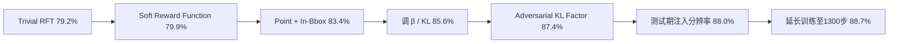

# GuirlVG: Incentivize GUI Visual Grounding via Empirical Exploration on Reinforcement Learning

**会议**: ICLR 2026  
**OpenReview**: [https://openreview.net/forum?id=zrH2A1upAo](https://openreview.net/forum?id=zrH2A1upAo)  
**代码**: 待确认  
**领域**: 多模态 / GUI 视觉定位 / 强化微调  
**关键词**: GUI Visual Grounding, GRPO, Reinforcement Fine-Tuning, MLLM, 数据效率  

## 一句话总结
把规则化强化微调（RFT/GRPO）拆成「奖励函数、预测格式、KL 惩罚、训练配置」逐项做受控消融，再补上一个能自适应抑制奖励过优化的 **Adversarial KL Factor**，最终只用 5.2K 样本就在 ScreenSpot 系列基准上超过用上千万样本 SFT 的方法。

## 研究背景与动机
**领域现状**：GUI 视觉定位（GUI-VG，给定指令在截图中定位可操作元素）是 GUI agent 的核心能力，主流做法是对多模态大模型（MLLM）做监督微调（SFT），需要海量领域数据与昂贵训练。

**现有痛点**：随着 MLLM 持续变强、预训练阶段就已吸收 GUI 数据，每代模型都重做一遍大规模 SFT 的性价比越来越可疑；而把 DeepSeek-R1 式的规则化 RFT（GRPO）迁到 GUI-VG 虽有潜力，却**从没有人系统研究过怎么做才对**。

**核心矛盾**：作者发现，在公平实验设置下，**朴素照搬 RFT 反而打不过 SFT**（ScreenSpot 79.2% vs 82.6%），说明 RFT 用于 GUI-VG 不是「换个目标函数」就能赢的，每个组件的最优形式都需要重新校准。

**本文目标**：不追求一味刷分，而是做 step-by-step 的公平消融，得出「GUI-VG 上 RFT 该怎么设计」的可复现结论，并解决 RFT 训练不稳定（奖励过优化）的问题。

**核心 idea**：**把 GRPO 解构为可独立消融的组件**——逐个找到格式奖励、准确率奖励、预测格式、KL 系数、微调策略、组/批大小、分辨率提示的最优配置，并提出 **奖励驱动的动态 KL 缩放** 来稳定训练。

## 方法详解

### 整体框架
GuirlVG 以 Qwen2.5-VL + LoRA 为底座，在 GRPO 框架下做规则化 RFT：模型对每条指令采样一组候选回答，由可自动验证的规则奖励打分，用组内归一化优势 + KL 惩罚更新策略。论文的「方法」其实是一条**探索轨迹**：从 trivial RFT（79.2%）出发，依次替换每个设计组件并保留更优者，最终把 ScreenSpot 推到 88.7%。

### 关键设计
**1. Soft Reward Function（SRF）：把"全或无"奖励改成可拆分的部分得分。** 默认 GRPO 的格式奖励要求输出严格匹配 `<think>...</think><answer>...</answer>` 且坐标必须是 JSON 列表，只要漏一个标签或把列表写成元组就直接给 0，即便模型其实推理对了，这种刚性会注入训练噪声。SRF 改为对每个标签给部分分（`<think>`/`</think>` 各 +0.5，`<answer>`/`</answer>` 各 +1/3，答案内坐标数目正确再 +1/3，归一化到 $[0,1]$），准确率奖励则忽略风格、直接抽取数值。仅此一项把 79.2% 提到 79.9%，且说明「不必死守预训练输出风格」。

**2. Point + In-Bbox 奖励：让奖励对齐任务的真正目标。** GUI-VG 的下游动作只需要一个落在目标元素内的点，因此与其预测 bbox 再算 IoU（连续 IoU 81.6%、IoU@0.5 阈值 79.9%）或用距离阈值 Distance@80（82.7%），不如**直接预测点、用「点是否落在 GT bbox 内」做二值奖励**（In-Bbox 83.4%）。结论很朴素但关键：奖励函数与任务功能目标对齐时效果最好。

**3. Adversarial KL Factor：用奖励自适应放大 KL 惩罚以抑制过优化。** 这是论文唯一的「新技术」。直觉是高奖励回答更容易引发过优化，但若原模型本身就给这些回答高概率，静态 KL 项并不会随之增大、压不住奖励。于是把 KL 系数乘上一个随奖励线性增长的因子 $\alpha_i = r_i / m$（$m=2$ 为最大可能奖励），目标改写为
$$J_i = A_i - \alpha_i\,\beta\, D_{KL}(o_i \| o_i^{orig}),\qquad A_i = \frac{r_i - \mathrm{Mean}(\{r\})}{\mathrm{Std}(\{r\})}$$
奖励越高、正则越强，从而动态平衡。在最优 $\beta=10^{-4}$ 基础上再带来 +1.8%（85.6%→87.4%）；同时实验显示 GRPO 对 $\beta$ 极敏感（$\beta$ 从 4e-2 调到 1e-4 单调提升，过小到 1e-6 又崩到 77.5%）。

**4. 训练配置的经验最优：LoRA、组/批大小、分辨率提示时机。** 这一组并非新方法，而是受控消融得到的「最佳实践」：(a) LoRA 与全量微调精度几乎持平（87.4% vs 87.5%），但单步训练快 25 倍以上（28.4s vs 749.4s），故选 LoRA；(b) 组大小 6、批大小 4 最优，反直觉的是组大小从 6 增到 8 反而大跌（87.4%→83.9%），说明 RFT 对实现细节异常敏感；(c) **分辨率提示只在测试期注入最好**（88.0%），训练时不给、测试时给——作者推测训练期不给分辨率反而逼模型学到更好的空间推理能力。

## 实验关键数据

### 主实验表格（数据效率对比）

| 方法 | 训练样本 | ScreenSpot Avg | ScreenSpot v2 Avg |
|------|---------|----------------|-------------------|
| SeeClick | 364K | 53.4 | 55.1 |
| UGround (7B) | 1.3M | 73.3 | — |
| OS-Atlas (7B) | 13.58M | 81.0 | 84.1 |
| **GuirlVG (7B)** | **2K** | **88.0** | **90.9** |
| **GuirlVG (7B)** | **5.2K** | **88.7** | **91.9** |

仅 5.2K 样本即超过用 13.58M 样本的 OS-Atlas：ScreenSpot +7.7%、ScreenSpot v2 +7.8%、ScreenSpot-Pro 据图 1 报告 +17.2%。在训练数据完全不含移动端样本的情况下，Mobile-Icon 子集仍超 OS-Atlas +11.8%，印证「SFT 记忆、RL 泛化」。

### 消融实验表格（探索轨迹关键步）

| 步骤 | ScreenSpot Acc (%) |
|------|--------------------|
| RFT (trivial) | 79.2 |
| + Soft Reward Function | 79.9 |
| + Point & In-Bbox | 83.4 |
| + 调 β=1e-4 | 85.6 |
| + Adversarial KL Factor | 87.4 |
| + 测试期分辨率提示 | 88.0 |
| + 训练至 1300 步 | 88.7 |

### 关键发现
- 朴素 RFT 打不过 SFT，必须逐组件精调（Finding 1）。
- 奖励函数要对齐功能目标（点预测 + In-Bbox）而非沿用 bbox/IoU（Finding 3）。
- GRPO 对 KL 系数、组/批大小这类「看似无关紧要」的细节极度敏感（Finding 4/6）。
- 训练期隐藏分辨率、测试期再给，反而更好（Finding 7）。

## 亮点与洞察
- **方法论价值大于单一技术**：把 RFT 当成可受控消融的系统而非黑箱，给出一份「GUI-VG 上 RFT 怎么调」的可复现配方，比单纯刷分更有指导意义。
- **Adversarial KL Factor 简洁可迁移**：仅用「奖励/最大奖励」做乘子动态缩放 KL，几乎零成本，思路可推广到其他规则奖励的 GRPO 任务。
- **数据效率惊人**：5.2K vs 13.58M（约 2600 倍）仍胜出，强力佐证「RL 泛化、SFT 记忆」在 GUI 定位上的体现。

## 局限与展望
- 全部围绕 Qwen2.5-VL 单一底座与 ScreenSpot 系列基准，结论是否跨模型/跨任务普适仍待验证。
- Adversarial KL Factor 的因子 $\alpha_i = r_i/m$ 形式较朴素，依赖已知最大奖励 $m$，对连续/复合奖励的推广未深入。
- 多处结论（组大小、分辨率时机）呈现「反直觉且敏感」，提示 RFT 稳健性本身仍是开放问题，换数据/超参可能需要重新探索。
- 只做 GUI-VG（单步定位），未触及多步 GUI agent 决策。

## 相关工作与启发
- **GRPO / DeepSeek-R1**：本文的 RFT 算法基座与「RL 激发推理」思路来源。
- **GUI-VG SFT 系**（SeeClick / UGround / OS-Atlas / UI-TARS / ShowUI）：被对标的大数据 SFT 路线，本文用其作为效率对照。
- **MLLM 经验研究**（LLaVA-1.5 / Prismatic / Eagle / Idefics2）：作者效仿的「受控消融式经验研究」范式，本文把它首次引入 RFT-for-GUI-VG。
- **启发**：当一个新范式（RFT）迁到新任务表现不佳时，与其堆新模块，不如把它拆开逐件校准——很多收益藏在「看似无关紧要」的实现细节里。

## 评分
- 新颖性: ⭐⭐⭐⭐ 单一技术（Adversarial KL Factor）较小，但系统性经验研究 + 把 RFT 解构消融的视角在 GUI-VG 上是首次，方法论新颖。
- 实验充分度: ⭐⭐⭐⭐ 七组受控消融逐步推进 + 三大基准对比，公平设置清晰；但底座与基准较单一。
- 写作质量: ⭐⭐⭐⭐ 以「探索轨迹 + Finding」组织，逻辑顺畅、图表自洽，易读。
- 价值: ⭐⭐⭐⭐ 给出可复现的 RFT-for-GUI-VG 配方与极致数据效率，对实践者指导性强。

<!-- RELATED:START -->

## 相关论文

- [\[ICLR 2026\] Breaking the SFT Plateau: Multimodal Structured Reinforcement Learning for Chart-to-Code Generation](breaking_the_sft_plateau_multimodal_structured_reinforcement_learning_for_chart-.md)
- [\[ICLR 2026\] MMDuet2: Enhancing Proactive Interaction of Video MLLMs with Multi-Turn Reinforcement Learning](mmduet2_enhancing_proactive_interaction_of_video_mllms_with_multi-turn_reinforce.md)
- [\[CVPR 2026\] DRS-GUI: Dynamic Region Search for Training-Free GUI Grounding](../../CVPR2026/multimodal_vlm/drs-gui_dynamic_region_search_for_training-free_gui_grounding.md)
- [\[ACL 2025\] Aria-UI: Visual Grounding for GUI Instructions](../../ACL2025/multimodal_vlm/aria-ui_visual_grounding_for_gui_instructions.md)
- [\[CVPR 2026\] Explore with Long-term Memory: A Benchmark and Multimodal LLM-based Reinforcement Learning Framework for Embodied Exploration](../../CVPR2026/multimodal_vlm/explore_with_long-term_memory_a_benchmark_and_multimodal_llm-based_reinforcement.md)

<!-- RELATED:END -->
