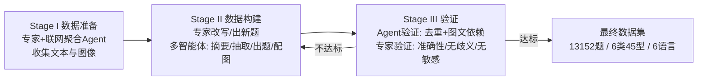

# HSSBench: Benchmarking Humanities and Social Sciences Ability for Multimodal Large Language Models

**会议**: ICLR 2026  
**OpenReview**: [https://openreview.net/forum?id=iQsKotob31](https://openreview.net/forum?id=iQsKotob31)  
**代码**: [https://github.com/Zhaolu-K/HSSBench](https://github.com/Zhaolu-K/HSSBench)  
**领域**: 多模态评测 / Benchmark  
**关键词**: 多模态大模型, 人文社科, VQA Benchmark, 多语言评测, 多智能体数据生成  

## 一句话总结
提出 HSSBench——首个聚焦人文社科(HSS)、覆盖 6 大类 45 小类、含联合国六种官方语言共 13,152 道多模态选择题的大规模评测基准，通过"专家 + 多智能体"协同流水线构建，并在 20+ 主流 MLLM 上验证 HSS 任务对当前模型仍是显著挑战(准确率普遍低于 60%)。

## 研究背景与动机
**领域现状**：多模态大模型(MLLM)能力快速提升，催生了 MMMU、MathVista 等大量评测基准，但这些基准绝大多数集中在通用常识或 STEM 学科(数学、科学、编程)上，强调"自上而下、逐步求解、唯一正确答案"的**垂直推理**。

**现有痛点**：人文社科(地理、艺术、文化、社会科学、历史、经济)走的是另一套逻辑——**横向推理**：需要跨语境关联、跨学科整合知识，往往存在多个合理解读而非单一解。HSS 的符号系统深植于地域文化、依赖历史文化语境解读，知识验证靠文献交叉与专家共识而非逻辑演绎。现有少数涉及 HSS 的基准既不深入也不系统。

**核心矛盾**：作者用一个生动例子(图 2)点出关键问题——**跨模态知识迁移失败**。直接问模型"商业书写体(Business Penmanship)"的知识点，它答得对；但通过一张手写体图片间接提问字体类型时，模型却无法把图像视觉特征与抽象概念关联起来。模型能孤立识别抽象概念，却建立不起 HSS 图像与其所代表概念之间的有意义映射。

**本文目标**：构建一个专门面向 HSS、支持多语言的多模态评测基准，系统衡量 MLLM 在跨学科横向推理与跨模态知识迁移上的真实能力。

**核心 idea**：**(1) 任务定位**——把评测从 STEM 垂直推理扩展到 HSS 横向推理，强制考察图像与抽象概念的双向绑定；**(2) 构建方法**——设计"专家标注 + 多智能体自动化"协同的 VQA 生成流水线(VGP)，兼顾质量与规模；**(3) 多语言覆盖**——以联合国六种官方语言呈现同一题目，考察语言对模型表现的影响。

## 方法详解

### 整体框架
HSSBench 的核心是一条三阶段的 VQA 生成流水线(VGP)：**Stage I 数据准备** → **Stage II 数据构建** → **Stage III 验证**。每一阶段都让"领域专家"与"多智能体"双轨并行——任一方都能独立产出该阶段所需内容，且失败数据会回退到 Stage II 重做，直到达标或被丢弃。最终得到 6 大类 45 小类、13,152 道单选题，全部以 VQA 形式呈现，并翻译为六种语言。

### 关键设计
**1. 三阶段专家-智能体协同流水线：让规模与质量兼得**。HSS 数据的难点在于图像稀缺、知识密集、需跨学科把关，单靠专家成本高、单靠模型质量差。VGP 把整个构建拆成准备、构建、验证三段，每段都"专家打样、智能体复刻专家逻辑批量放大"。Stage I 先由各领域专家从教材、真题、数字课程等高可信来源提取图文、剔除冗余、标准化格式，避免数据泄漏(优先用专家私有图像);随后一个**联网信息聚合 Agent** 模仿专家流程——为每个学科编制关键词作为知识点索引,联网检索后分类为文本/图像,按专业性、独特性、逻辑结构与是否需图文互证打分筛选,再交专家终审。

**2. 多智能体自动出题：摘要-抽取-出题-配图的角色分工**。Stage II 的自动化分支把出题拆成四个角色协作：summarizer 产出文档全局摘要(覆盖关键知识点)，extractor 独立抽取高质量文本片段(适合直接命题)，LLM 再按**信息密度、独特性、逻辑连贯性**给片段打分取 Top-N；question generator 结合全局摘要与选中片段、并参考多个人工范例(含题干、选项、答案、解析)生成 N 道题；最后 image matcher 通过直接图-题匹配或基于图像描述的匹配为题目配图。整条 VGP 全程采用思维链(CoT)提示，底层用 GPT-4o 与 GPT-4.1。

**3. 双重验证强制"图文缺一不可"：保证多模态有效性**。这是 HSSBench 区别于普通 VQA 的关键约束。Agent 验证先计算题目间文本相似度去除高度冗余题以保证多样性，再做一个**双向图文依赖检查**：要求每道题满足——(1) 不给图像、仅凭文本无法答对；(2) 不给题目、仅凭图像也无法答对。只有当两个模态缺一不可时，题目才真正考察跨模态能力；若图像被判定为非必需，题目退回 Stage II 修改，多轮迭代仍不达标则丢弃。专家验证则要求每条数据经其他领域专家确认无歧义、且全体专家确认无敏感内容，模型生成的数据还需数据生成专家严格复核。

**4. 多语言对齐：同题六语，控制文化偏差**。初始题目由各领域专家用其母语(多为中文)创作，再用 LLM 翻译模型译为英、中、法、俄、西、阿六种语言，所有译文由双语专家审校，在保持语义一致的同时尊重文化差异。原本天然多答案的 HSS 题被改写为单答案选择题(把多个正确项合并为一个选项)，以统一评测格式。

## 实验关键数据

### 主实验(EN-I 英文测试，节选 All 列总分 %，Ct.=CoT 提示，C.=选择题，O.=开放题)

| 模型 | Ct.C. (选择) | Ct.O. (开放) |
|------|------|------|
| Random | 24.62 | 0.00 |
| **Human (专家平均)** | **93.83** | - |
| Qwen2.5-VL-7B | 38.19 | 17.89 |
| InternVL3-8B | 41.42 | 12.31 |
| Qwen2.5-VL-32B | 50.75 | 15.00 |
| Qwen2-VL-72B | 54.22 | 20.43 |
| **Qwen2.5-VL-72B (开源最佳)** | **54.17** | 19.73 |
| GPT-4o | 46.09 | 20.05 |
| GPT-4.1 | 45.02 | **39.97** |
| GPT-4.1-mini | 45.75 | 24.32 |

最强模型选择题准确率仅 ~54%，远低于人类专家 93.83%；开放题更惨，多数模型不足 15%，仅 GPT-4.1 凭 39.97% 一枝独秀(约为其他闭源模型两倍)。

### 分类别与提示策略发现

| 维度 | 关键观察 |
|------|---------|
| 最难类别 | **经济(Economy)**——平均分最低，需深度经济理论理解+复杂推理，开源模型短板明显；闭源模型靠高质量训练数据表现突出 |
| 最易类别 | **地理(Geography)**——更偏事实、抽象度低，模型平均分最高 |
| 开源反超 | 在文化/社会科学的选择题上，Qwen2.5-VL-32B/72B 可媲美甚至超过 GPT-4o(疑因专家多为中国人，Qwen 的中文训练数据占优) |
| CoT 不总有用 | 部分模型直接作答反而更好——CoT 会放大幻觉，在地理等含点线视觉元素的题上误读图像、生成错误背景知识，且最终汇总阶段信息过载导致判断失误 |

### 关键发现
- **HSS 任务对当前 SOTA MLLM 仍是显著挑战**：选择题准确率普遍低于 60%，与人类专家近 94% 存在巨大鸿沟。
- **跨模态知识迁移是核心瓶颈**：模型能孤立识别概念，却无法在 HSS 发散思维中把视觉知识内化并关联到抽象概念。
- **开闭源差距在特定 HSS 任务上正在收窄**，但开放题(去掉选项提示)上闭源模型仍整体领先。

## 亮点与洞察
- **问题定位精准**：用"商业书写体"那个反差例子，把"跨模态知识迁移失败"这一抽象问题讲得极其直观，比单纯堆数据更有说服力。
- **首个系统性 HSS 多模态多语言基准**：6 类 45 型 × 6 语言 × 13k 题的规模与覆盖度填补了 STEM 主导评测的空白。
- **双向图文依赖约束**很有价值：强制"图文缺一不可"，从机制上杜绝了"看文字就能蒙对/看图就能猜对"的伪多模态题，提升了基准的鉴别力。
- **专家-智能体协同流水线可复用**：把专家标注逻辑蒸馏成多智能体角色分工，为其他高门槛领域的高质量数据批量构建提供了范式。

## 局限与展望
- **题型单一**：全部为多选/开放选择题，难以考察 HSS 中开放式论述、价值判断、伦理权衡等更贴近真实横向推理的能力。
- **文化与语言偏差**：专家多为中国人，导致 Qwen 系在中文相关内容上获益，跨文化公平性仍需更均衡的专家与数据来源。
- **依赖 GPT-4o/4.1 生成**：自动化分支的数据质量上限受限于底座模型，可能继承其偏见或盲区。
- **评测而非提升**：本文止于"诊断"HSS 能力短板，如何针对性提升 MLLM 的跨模态知识迁移与横向推理仍是开放问题。

## 相关工作与启发
- **与 STEM 基准对照**：相较 MMMU、MathVista、ScienceQA 等强调垂直推理的基准，HSSBench 把评测维度推向横向、跨学科、多解的人文社科，是对 MLLM 评测版图的有益补充。
- **多智能体数据合成**：摘要-抽取-出题-配图的角色分工，与近期 LLM-as-data-generator、self-instruct 思路一脉相承，但加入了专家回路与双向依赖校验，质量控制更严。
- **启发**：(1) 评测设计应回到"模态缺一不可"的本质约束，避免单模态捷径;(2) 跨模态知识迁移(图像↔抽象概念双向绑定)可能是下一代 MLLM 的关键能力短板，值得专门训练目标去优化;(3) CoT 并非万能——在视觉细节密集或发散推理任务上反而可能放大幻觉，提示推理策略需自适应。

## 评分
- **新颖性**: ⭐⭐⭐⭐ — 首个聚焦人文社科的多模态多语言大规模基准，问题定位(跨模态知识迁移)与双向图文依赖约束都有独到之处，但基准类工作方法论上属增量创新。
- **实验充分度**: ⭐⭐⭐⭐ — 覆盖 20+ 模型、6 类别、6 语言、两种提示策略与两种题型，并有人类专家上界对照，分析细致全面。
- **写作质量**: ⭐⭐⭐⭐ — 动机阐述清晰，用反差例子有效传达核心问题，流水线三阶段结构条理分明。
- **价值**: ⭐⭐⭐⭐ — 揭示了 SOTA MLLM 在 HSS 上与人类近 40 个百分点的巨大差距，为跨学科推理研究提供了可靠测评工具和明确方向。

<!-- RELATED:START -->

## 相关论文

- [\[ICLR 2026\] InternSVG: Towards Unified SVG Tasks with Multimodal Large Language Models](internsvg_towards_unified_svg_tasks_with_multimodal_large_language_models.md)
- [\[CVPR 2026\] Venus: Benchmarking and Empowering Multimodal Large Language Models for Aesthetic Guidance and Cropping](../../CVPR2026/multimodal_vlm/venus_benchmarking_and_empowering_multimodal_large_language_models_for_aesthetic.md)
- [\[ICLR 2026\] Thinking as Society: Multi-Social-Agent Self-Distillation for Multimodal Misinformation Detection](thinking_as_society_multi-social-agent_self-distillation_for_multimodal_misinfor.md)
- [\[ICLR 2026\] XModBench: Benchmarking Cross-Modal Capabilities and Consistency in Omni-Language Models](xmodbench_benchmarking_cross-modal_capabilities_and_consistency_in_omni-language.md)
- [\[ICLR 2026\] Investigating Redundancy in Multimodal Large Language Models with Multiple Vision Encoders](investigating_redundancy_in_multimodal_large_language_models_with_multiple_visio.md)

<!-- RELATED:END -->
