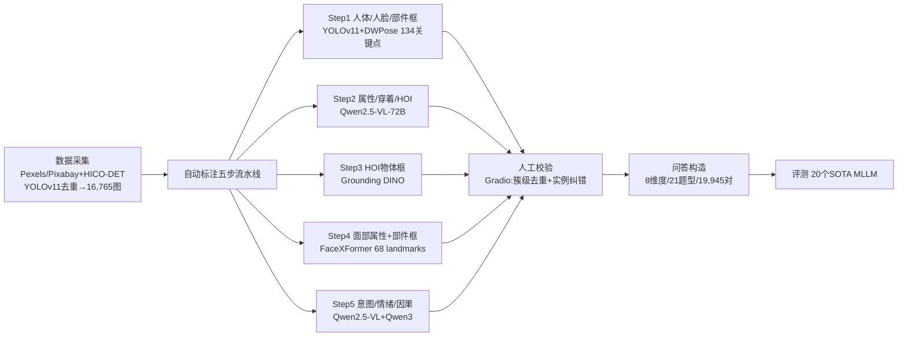

# Human-MME: A Holistic Evaluation Benchmark for Human-Centric Multimodal Large Language Models

**会议**: ICLR 2026  
**OpenReview**: [https://openreview.net/forum?id=4qIK0UV2Nt](https://openreview.net/forum?id=4qIK0UV2Nt)  
**代码**: [https://github.com/Yuan-Hou/Human-MME](https://github.com/Yuan-Hou/Human-MME)  
**领域**: 多模态大模型 / 评测基准 (Human-Centric MLLM Benchmark)  
**关键词**: MLLM 评测、以人为中心理解、细粒度感知、因果推理、视觉 grounding  

## 一句话总结
Human-MME 是首个面向「以人为中心场景」的综合性 MLLM 评测基准，用一条五步自动标注 + 专家人工校验的流水线，构建了覆盖 43 个细分场景、8 个由「细粒度感知→高维因果推理」递进的维度、近 2 万真实图文问答对，并在 20 个 SOTA 多模态大模型上系统暴露了它们在人体细粒度 grounding 和高阶推理上的短板。

## 研究背景与动机
**领域现状**：多模态大模型（MLLM）在通用图像理解上已经相当强，而「人」是真实世界图像里出现频率最高、价值最大的对象。理解人不仅要做细粒度感知（眉毛、配饰、左右手），还要做高阶的意图、情绪、因果推理，比通用场景难得多。

**现有痛点**：作者指出已有人类相关基准（MMBench、MME、Seed-Bench、Face-Human-Bench、HumaniBench 等）在以人为中心场景上有三个系统性缺陷——(1) 评测设定过于简单，覆盖不了人类活动的完整谱系；(2) 维度不全，无法同时兼顾细粒度感知与高阶空间/推理；(3) 标注质量低、问答范式单一，难以承载复杂多样的推理任务。它们大多停留在单人、单图、单题，缺少细粒度 grounding。

**核心矛盾**：人体的物理复杂度高、细粒度结构（面部部件、肢体）的标注极难，导致高质量的以人为中心评测基准一直缺位——既要广覆盖又要细粒度标注，二者难以兼得。

**本文目标**：构建一个真正"holistic（整体性）"的基准，既能从人脸/人体的细粒度感知出发，又能逐级爬升到多图、多人、意图、情绪、因果这些高维推理，并保证标注质量。

**核心 idea**：**[递进式维度设计]** 把评测组织成从"颗粒感知"到"高维推理"单调递进的 8 个维度；**[自动标注+专家校验]** 用一条五步流水线（检测+姿态+VLM+grounding+文本模型）批量产生丰富标注，再用 Gradio 平台让专家去重纠错以消除"同模型偏差"；**[多范式问答]** 把单图单人单题扩展到多图、多人互理解，并设计 Choice/BBox/Short-Answer/Ranking/Judgment 五类组件及其组合题型。

## 方法详解

### 整体框架
Human-MME 的构建分四步串联：(1) **数据采集**——从 Pexels/Pixabay 免费图库 + HICO-DET 开源数据集筛出 16,765 张高质量图；(2) **自动标注流水线**——五步逐人提取人脸/人体/部件框、属性、穿着、人物-物体交互（HOI）、面部属性、以及意图/情绪/因果等高维特征；(3) **人工校验**——专家在自定义界面做簇级去重 + 实例级纠正；(4) **问答构造**——基于标注特征生成覆盖 8 维度、21 种题型的 19,945 条问答对，每类用专属指标评测。

### 关键设计

**1. 递进式的 8 维度评测体系：从颗粒感知爬到高维推理。** 这是基准的骨架，作者把以人为中心的能力拆成单调递进的八个维度：人脸理解（FU）、人体理解（BU）、人物-物体交互理解（HU）、多图理解（MIU）、多人推理（MPR）、意图判别（ID）、因果判别（CD）、情绪判别（ED）。前三个是细粒度颗粒感知（看清眉毛、手、交互的物体），后五个逐步引入跨图/跨人的关系，以及看不见但要推断的意图、情绪和"过去发生了什么、未来会发生什么"的因果链。这种递进设计让基准能定位模型到底是"看不清"还是"想不到"——实验也确实发现准确率大致呈 Intention > Cause > Emotion 的难度阶梯，抽象程度越高越难。

**2. 五步自动标注流水线：把异构专家模型串成一条标注流水线。** 为了在人体这种高复杂度对象上拿到细粒度标注，作者把多个专用模型按顺序拼起来逐人 $i$ 提取特征。Step 1 用 YOLOv11 出人体/人脸候选框，并行用 DWPose 拿 134 个全身关键点，靠几何关系对齐姿态与框，进而切出双手双脚的部件框 $P_i$；Step 2 用 Qwen2.5-VL-72B 按 JSON 模板抽取通用属性 $A_i$（年龄/性别/种族/情绪）、穿着 $W_i^j$（类型/颜色/名称）和 HOI 三元组 $O_i^j$（交互部位、动作短语、物体名）；Step 3 把物体名喂给 Grounding DINO 出 HOI 物体框，再与部件框结合细化交互部位；Step 4 把人脸送 FaceXFormer 出 40 个二值面部属性（CelebA 格式）+ 68 个 landmark，从中切出眼/眉/口/鼻的部件框 $FP_i$；Step 5 用 Qwen2.5-VL-72B 逐人产出情绪/行为中间描述，再交给纯文本的 Qwen3 生成最终的去身份情绪分析、意图分析和过去-未来因果叙述。整条流水线产出 13 类框、42 个二值面部特征、4 个 person-level 属性，以及 8 类穿着和 3 类高维特征。

**3. 用独立文本模型切断"同模型偏差"。** 一个微妙但关键的细节：被评测的模型里就包含 Qwen 系列，如果标注答案也由 Qwen2.5-VL 直接生成，会给 Qwen 系不公平的优势（同模型偏差，self-preference bias）。作者在 Step 5 刻意让 Qwen2.5-VL 只产出中间描述，最终文本（情绪/意图/因果）一律交给纯文本的 Qwen3 改写生成；人工校验阶段也重点纠正那些依赖 Qwen2.5-VL 的字段，从源头削弱评测对某一模型族的偏向。

**4. 五类问答组件 + 组合题型，专攻幻觉与细粒度对齐。** 答案格式设计成 Choice、Bounding Box、Short-Answer、Ranking、Judgment 五类，外加 Judgment+BBox、Judgment+Short-Answer、Short-Answer+BBox 等复合形式，共 21 种题型。每类各有针对性：Choice 在构造干扰项时故意选"同型穿着""左右手对调""情绪相近"等易混项；BBox 直接测图文 grounding；Ranking 给三个特征四张图，要模型按特征出现数排序，逼模型跨图跨特征同时核对；**Judgment 是反幻觉的关键设计**——题目带前置条件（"如果图中有满足某特征的人就给出 ta 某部位的框，否则返回 [-1,-1,-1,-1]"），模型必须先判断条件成立与否再决定答不答，专门戳穿模型在不存在目标时硬编答案的幻觉倾向。

**5. 按题型量身定制的评测指标。** 不同组件用不同指标，避免一把尺子量所有题：Choice 用准确率（Accuracy）；Short-Answer 用 BERT F1 + 嵌入余弦相似度 + 关键词覆盖的复合分；BBox 用 IoU；Ranking 用 Kendall's $\tau$；Judgment 用 F1 平衡精确率与召回率。所有模型输出再用正则解析抽取最终答案，配合格式约束 prompt 进一步压低生成风格带来的偏差。

## 实验关键数据

### 主实验表格（20 个 MLLM，8 维度均分，节选）

| 模型 | FU | BU | HU | MIU | MPR | ID | CD | ED | **Avg.** |
|------|-----|-----|-----|-----|-----|-----|-----|-----|------|
| GLM-4.5V | 61.6 | 77.4 | 82.5 | 79.2 | 71.5 | 83.9 | 85.4 | 66.6 | **76.0** |
| Qwen2.5-VL-72B | 61.1 | 70.2 | 70.6 | 75.4 | 65.2 | 88.1 | 86.3 | 65.3 | 72.8 |
| InternVL3.5-241B | 50.7 | 74.6 | 71.4 | 76.4 | 59.4 | 83.7 | 82.5 | 66.4 | 70.6 |
| GLM-4.1V-9B | 55.2 | 74.1 | 69.5 | 71.8 | 64.3 | 82.7 | 76.0 | 58.8 | 69.1 |
| Intern-S1 | 41.0 | 65.2 | 65.5 | 79.8 | 59.3 | 82.9 | 83.2 | 68.3 | 68.2 |
| MiniCPM-V-4.5 | 38.9 | 62.6 | 62.4 | 73.5 | 52.1 | 81.5 | 67.8 | 63.3 | 62.8 |
| Llama-4-Scout | 27.3 | 50.6 | 49.4 | 48.9 | 33.9 | 66.5 | 57.1 | 50.4 | 48.0 |
| Phi-4 | 29.5 | 48.1 | 48.6 | 39.6 | 29.6 | 62.9 | 38.1 | 46.4 | 42.9 |
| *Gemini-2.5-Pro* (闭源) | 42.4 | 66.5 | 70.0 | 83.6 | 48.6 | 79.4 | 86.1 | 64.5 | 67.6 |
| *GPT-5* (闭源) | 34.4 | 67.8 | 71.1 | 75.8 | 43.1 | 82.3 | 89.2 | 42.6 | 63.3 |
| *GPT-4o* (闭源) | 28.8 | 58.8 | 59.8 | 74.7 | 34.4 | 79.2 | 76.2 | 52.7 | 58.1 |

带显式 grounding 训练的开源模型（GLM-4.5V、Qwen2.5-VL-72B）在感知类维度全面领先；Gemini-2.5-Pro 是最强闭源，但与 Intern-S1 类似——高阶理解强而细粒度 grounding 弱。

### 消融/分项分析（五类题型组件得分，节选）

| 模型 | Bounding Box | Choice | Short-Answer | Ranking | Judgment |
|------|------|------|------|------|------|
| GLM-4.5V | **66.3** | 70.8 | 83.5 | 86.2 | 68.3 |
| Qwen2.5-VL-72B | 50.8 | 70.4 | 81.7 | 83.9 | **71.3** |
| Intern-S1 | 22.1 | 72.6 | 82.0 | **86.6** | 68.9 |
| Gemini-2.5-Pro | 23.5 | 72.4 | 83.9 | **90.9** | 72.0 |
| GPT-4o | 11.5 | 57.6 | 78.3 | 83.8 | 48.6 |
| Llama-4-Scout | 6.4 | 47.9 | 69.5 | 71.0 | 38.6 |

BBox 分数把模型拉开最大差距：GLM-4.5V 高达 66.3，而 GPT-4o 仅 11.5、Llama-4-Scout 仅 6.4，说明细粒度空间定位是当前 MLLM 的最大短板，且更受训练数据是否含 grounding 监督影响（Figure 4 中 BBox 与模型规模相关性 $r=0.00$，几乎无关）。

### 关键发现
- **Choice/Ranking 有更强的规模效应**：这两类与模型大小相关性最高（Choice $r=0.78$、Ranking $r=0.75$），大模型更擅长同时整合多个视觉特征做候选评估与排序；而 BBox（$r=0.00$）几乎与规模无关。
- **grounding 看数据不看规模**：BBox 表现主要由训练数据是否含人体 grounding 样本、是否用归一化/JSON 框格式对齐决定，而非模型大小或架构。
- **左右肢体难分**：所有模型在区分左右手/脚上一致犯难（混淆矩阵明显），但区分左右眼/眉却相当可靠——面部部件空间布局更稳定，肢体则因姿态多变而歧义大。
- **Judgment 暴露幻觉**：模型普遍高召回低精确，目标不存在时仍硬答（倾向幻觉）；加强抗幻觉机制能提精确率却牺牲召回，出现过度拒答，体现谨慎与忠实执行指令的权衡。加入 Judgment 组件会整体降低任务表现。
- **难度阶梯**：判别准确率大致呈 Intention > Cause > Emotion，抽象程度递增。
- **闭源不及强开源**：GPT-5/GPT-5-mini 受安全对齐影响有少量拒答，但主要差距在 BBox——闭源模型整体框尚可、细粒度部件定位骤降（如 GPT-4o 左眼 IoU 仅 0.000），暴露细粒度 grounding 能力不足。

## 亮点与洞察
- **"递进式维度"是这个基准最有价值的设计思想**：它不是简单堆任务，而是把能力沿"看清→看懂→推断"单调排列，使评测结果能直接定位模型失败发生在哪一层，而非只给一个总分。
- **正视并主动消除"同模型偏差"**：在评测对象里包含 Qwen 的前提下，刻意用独立的纯文本 Qwen3 生成最终标注文本、人工重点纠正 VLM 标注字段，这种对评测公平性的自觉在 benchmark 论文里难能可贵。
- **Judgment 题型把"反幻觉"做进了评测协议本身**：通过强制"先判断条件再作答 / 否则拒答"，把模型的过度自信变成可量化的精确率-召回率权衡，比单纯问 TF 更能逼出真实的幻觉行为。
- **一个反直觉的实锤结论**：细粒度视觉 grounding 与模型规模几乎无关（$r=0.00$），更靠对的训练数据——这对"只要把模型做大就能解决一切"是一记提醒。

## 局限与展望
- **人工校验由作者本人完成**（伦理声明明确说明无外部众包），虽保证了一致性和专业判断，但标注规模受限、可能引入作者群体的主观偏好，难以像大规模众包那样统计多样性。
- **高维特征（意图/情绪/因果）的"真值"本质上由 VLM+LLM 生成再人工筛**，这类主观推理是否存在唯一正确答案、其 ground truth 的客观性仍值得商榷。
- **数据来源偏图库与 HICO-DET**，可能带有摄影/美学偏置，与真实监控、医疗、第一视角等场景的分布有差异。
- 论文聚焦"评测"而非"改进"，下一步自然是把这些诊断（尤其细粒度 grounding 与左右肢体歧义）转化为针对性训练数据或方法。

## 相关工作与启发
- **对比已有人类基准**：相比 Face-Human-Bench（缺细粒度人体空间 grounding、题型单一）、HumaniBench（BBox 粗粒度、忽略细粒度人体特征）、以及 MMBench/MME/Seed-Bench（不做细粒度 grounding），Human-MME 是首个同时覆盖人脸特征、人体特征、HOI、多图、多人、高阶抽象推理且支持细粒度 grounding 的基准（见 Table 1）。
- **构建范式的启发**：把"多专用模型流水线自动标注 + 专家校验 + 独立模型切断同模型偏差"组合起来，为后续构造其他高复杂度领域基准（如医疗、具身）提供了一套可复用的高质量标注方法论。
- **对模型研发的指向**：实验明确指出"细粒度 grounding 靠数据、左右肢体歧义需结构化监督、Judgment 反幻觉需精确-召回平衡"三条可操作的改进方向。

## 评分
- **新颖性**: ⭐⭐⭐⭐ 首个以人为中心的综合性 MLLM 基准，"递进式维度 + 多专家模型标注流水线 + 反幻觉 Judgment 题型"组合具有明确原创性，但单项技术（用现成检测/VLM/grounding 模型标注）多为已有工具的工程化集成。
- **实验充分度**: ⭐⭐⭐⭐⭐ 在 20 个开源+闭源 SOTA 模型上系统评测，给出 8 维度 × 5 题型的细致分项、规模相关性分析、左右肢体混淆矩阵、Judgment 精召权衡、闭源 vs 开源 grounding 对比等七大发现，证据链完整。
- **写作质量**: ⭐⭐⭐⭐ 结构清晰、图表（流水线图、统计图、混淆矩阵）信息量大，三大特性与三大缺陷的对照叙述有力；细节略多需对照附录。
- **价值**: ⭐⭐⭐⭐⭐ 填补了以人为中心 MLLM 评测的空白，暴露的"细粒度 grounding 靠数据不靠规模""左右肢体难分""幻觉权衡"等结论对下一代人本多模态模型的研发有直接指导意义，数据与平台公开后社区价值高。

<!-- RELATED:START -->

## 相关论文

- [\[ICLR 2026\] MME-Emotion: A Holistic Evaluation Benchmark for Emotional Intelligence in Multimodal Large Language Models](mme-emotion_a_holistic_evaluation_benchmark_for_emotional_intelligence_in_multim.md)
- [\[ICLR 2026\] Shuffle-R1: Efficient RL Framework for Multimodal Large Language Models via Data-centric Dynamic Shuffle](shuffle-r1_efficient_rl_framework_for_multimodal_large_language_models_via_data-.md)
- [\[ICLR 2026\] GranViT: A Fine-Grained Vision Model For Autoregressive Multimodal Large Language Models](granvit_a_fine-grained_vision_model_for_autoregressive_multimodal_large_language.md)
- [\[ICLR 2026\] Human Uncertainty-Aware Data Selection and Automatic Labeling in Visual Question Answering](human_uncertainty-aware_data_selection_and_automatic_labeling_in_visual_question.md)
- [\[ICLR 2026\] Grounding-IQA: Grounding Multimodal Language Models for Image Quality Assessment](grounding-iqa_grounding_multimodal_language_model_for_image_quality_assessment.md)

<!-- RELATED:END -->
