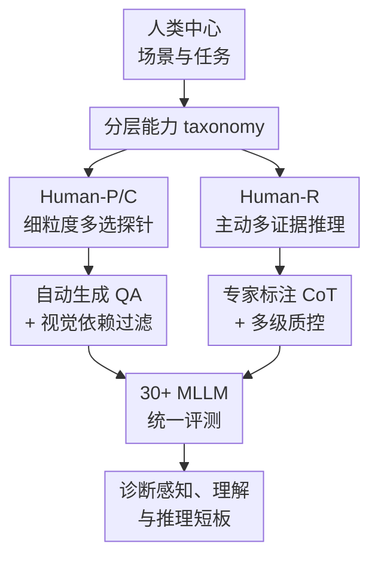

# HumanPCR: Probing MLLM Capabilities in Diverse Human-Centric Scenes

**会议**: ICLR2026  
**OpenReview**: [https://openreview.net/forum?id=I6LUSZMJLa](https://openreview.net/forum?id=I6LUSZMJLa)  
**论文**: [OpenReview](https://openreview.net/forum?id=I6LUSZMJLa)  
**代码**: 待确认  
**领域**: 多模态VLM / 评测基准 / 人类中心视觉理解  
**关键词**: MLLM评测、人类中心场景、视频推理、主动视觉证据、多模态基准  

## 一句话总结

HumanPCR 构建了一个面向人类中心视觉场景的 MLLM 分层评测套件，用感知、理解、推理三个层级诊断模型在人体细节、社会行为、时序过程和多证据视频推理上的短板，并发现当前模型最薄弱的不是“看更多帧”，而是主动寻找问题没有明说的关键视觉证据。

## 研究背景与动机

**领域现状**：多模态大模型已经能处理图片、视频和长上下文，很多通用 benchmark 也会报告模型在视觉问答、视频理解、动作识别等任务上的综合分数。与此同时，人类中心场景是 MLLM 真正落地时绕不开的部分：模型要理解人的姿态、视线、接触、动作顺序、群体关系、意图和后续计划，才能支撑机器人、辅助决策、教育训练、生活服务等应用。

**现有痛点**：已有评测要么太窄，只测动作识别、表情、脸部或某个专业动作；要么太泛，把少量人类相关问题混在通用视觉理解里，只给一个粗粒度总分。这样会遮住很关键的失败模式：一个模型可能会识别“有人”和“大概在运动”，但看不准手和物体是否接触、身体朝向、动作先后依赖，或者人与人之间的关系变化。更严重的是，视频推理 benchmark 往往可以被题面显式线索或单个片段 shortcut 解决，没有真正逼模型整合多个分散证据。

**核心矛盾**：人类场景理解不是单一分类问题，而是由细粒度感知、常识化理解和证据驱动推理层层叠起来的能力。评测如果只问显式目标、只看单帧或单段证据，就很难区分“模型真的理解了视频中的人”和“模型根据题面关键词检索到一个看似相关片段”。因此，benchmark 需要同时覆盖足够细的能力维度，并在推理层显式惩罚依赖题面线索的捷径。

**本文目标**：作者希望回答三个具体问题：第一，当前 MLLM 在人类中心场景的哪些基础能力上最不可靠；第二，模型在长视频、多人、多事件场景里能否整合多个视觉证据完成推理；第三，当关键证据没有被问题直接点名时，模型是否会主动去寻找隐含视觉线索。

**切入角度**：HumanPCR 不是提出一个新模型，而是把评测对象拆成 Perception、Comprehension、Reasoning 三层。前两层用大规模多选题做细粒度 probing，覆盖人体、姿态、外观、接触、身份、行为、过程、关系和场景等维度；第三层专门设计开放式视频推理题，要求模型找出多个视觉证据，并且至少包含一个 proactive evidence，也就是题面没有直接指明、但推理必须用到的隐含证据。

**核心 idea**：用“分层细粒度 taxonomy + 人工筛选的主动多证据视频推理”替代单一粗粒度分数，系统暴露 MLLM 在人类中心视觉理解中的真实能力缺口。

## 方法详解

### 整体框架

HumanPCR 的整体流程可以看成两条互补评测线：Human-P/C 负责大规模、结构化、可统计的细粒度能力探针，Human-R 负责高质量、小规模、难 shortcut 的开放式视频推理探针。前者告诉读者模型在哪些“看人、看动作、看关系”的基础维度上薄弱，后者进一步检查模型是否能像人一样从长视频里主动收集证据、串起事件并作出判断。

具体来说，作者先通过调研人类中心感知与理解任务定义 taxonomy，再为每个任务匹配多源数据集或人工补充样本。Human-P/C 主要生成多选 QA，先用模板或 LLM 从原始标注转成问题和干扰选项，再经过 blind filtering 和人工审核去掉不依赖视觉也能答的问题。Human-R 则从 11 个生活和专业场景域收集视频，由领域 annotator 写开放式问题、答案和 CoT 证据链，再经过 reviewer 和 meta-reviewer 多轮筛选，确保每道题都需要多证据整合和至少一个主动视觉证据。

这个框架的重点不在“题量越大越好”，而在每一层的诊断目标不同：Human-P/C 要让模型的细粒度能力被拆开看，Human-R 要让视频推理不能靠题面显式引用或单一证据偷懒。最终评测输出也不是一个总榜单了事，而是按层级、维度、任务、证据类型和错误类型给出模型失败画像。

### 关键设计

**1. 分层 taxonomy：把人类中心理解拆成可诊断的能力剖面**

HumanPCR 首先把人类中心视觉理解组织成三层：Human-P 看模型能否准确感知人、物、姿态、外观、接触和身份；Human-C 看模型是否能理解行为、过程、关系和场景；Human-R 看模型能否在复杂视频中完成推理。这个拆分解决的是“综合分数不解释失败原因”的问题。比如同样是视频问答答错，原因可能是看不出手是否接触物体，也可能是不懂动作顺序依赖，还可能是没有主动找到背景中稍早发生的事件。分层 taxonomy 让这些失败不再混成一个模糊低分。

在 Human-P/C 中，作者进一步细化到 9 个维度、34 个任务，覆盖 spatiality、posture、appearance、contact、identity、behavior、procedure、relation 和 scene。这样的粒度有实际诊断价值：实验里许多模型在 Spatiality 这类粗视觉定位上还可以，但在 Posture、Contact、Procedure、Relation 上明显掉分，说明模型不是“完全不会看视频”，而是对人体细部、时序过程和人际关系的表示仍然粗糙。

**2. 主动多证据推理：专门防止题面线索 shortcut**

Human-R 的核心不是普通开放式视频 QA，而是要求每题同时满足多证据、推理必要性和主动性。论文里把视觉证据定义为图像或视频中可支撑推理的信息单元，例如动作、属性、关系或事件；其中 referred evidence 是题面直接提到的证据，proactive evidence 则是题目没有明说、模型必须自己从上下文里找出来的证据。这个定义很关键，因为很多视频 benchmark 的问题本身会把关键片段点得太明，模型只要按关键词定位就能答对，无法检验真正的整体理解。

Human-R 因此要求问题至少涉及两个不同视觉证据，并且至少有一个 proactive evidence。举例来说，若问题问“某人是否提前知道一群人会来”，模型不能只看题目提到的“喂狗”和“戴眼镜的人”，还要主动发现她后来清理雪橇、自己骑雪地摩托离开、团队到达并使用雪橇等事件，才能推断她在喂狗时已经知道后续安排。这个设计把评测从“检索被问到的画面”推进到“在长视频中建立事件因果链”。

**3. 生成与质控闭环：用自动扩展题量，用人工守住视觉依赖和推理复杂度**

Human-P/C 的规模来自对已有数据标注的复用：作者把不同数据集中的姿态、动作、关系、身份等标注转成多选问题，并用 LLM 或模板生成选项。为了避免题目只靠语言常识就能答对，所有 QA 先经过 blind filtering，让模型在没有视觉输入时硬选答案；如果无图也能稳定答对，就说明题目泄漏了答案或太常识化，需要过滤。之后人工审核再检查语言质量、答案准确性、干扰项 plausibility 和视觉依赖。

Human-R 的质控更重。标注者不仅要写问题和答案，还要写出 CoT rationale 与关键视觉证据；reviewer 检查客观性、事实准确性、非冗余和复杂度；meta-reviewer 再确认是否真的需要整合多个视觉证据、是否依赖至少一个 essential proactive evidence。最终 Human-R 只有 442 道开放式问题，接收率约 20%，这说明它不是靠粗放扩题堆规模，而是把难题筛到足够“不能偷懒”。

**4. 诊断式评测协议：把分数、干预和错误类型连起来解释模型短板**

HumanPCR 的评测覆盖 9 个 proprietary 模型和 30 个开源 MLLM，Human-P/C 用多选 accuracy，Human-R 用 o3-mini judge 评估开放式答案，并通过人工标注验证 judge 与人类评分高度一致。更有价值的是，作者没有停在主表，而是继续分析帧数、视频检索/压缩策略、test-time scaling、CoT、证据提示干预和错误类别。

这种诊断式协议揭示了一个重要结论：Human-R 的主要瓶颈不是输入帧数不足。增加帧数对多数模型提升很小，在需要 6 个以上证据的问题上甚至可能引入干扰；而给出更直接指向 proactive evidence 的模糊提示能让多个模型提升约 10 到 13 个点。这说明当前 MLLM 往往会围绕题面显式线索做 query-driven retrieval，却不会主动构造“还缺哪些证据”的搜索过程。

### 一个完整示例

可以把 Human-R 的一道题想象成滑雪犬场景的视频推理。问题问：“这个女人在喂狗时，是否知道包括戴眼镜男子在内的一群人之后会来到院子？”题面直接出现的 referred evidence 只有“女人喂狗”和“戴眼镜男子所在团队”，如果模型只沿着这些词去找片段，很可能只能看到两段孤立画面，然后回答不确定。

HumanPCR 希望模型做的是另一种推理。它需要先看到女人喂狗，随后注意到她清理雪橇但没有自己使用雪橇，而是骑雪地摩托离开；再观察到一群人之后到达院子，把狗套上雪橇并乘雪橇出行。这样，证据链从“喂狗”扩展到“准备雪橇”“自己离开”“团队到达”“团队使用雪橇”，其中后几项并没有被问题明说，却是判断她是否提前知道团队会来的关键。最终答案才是：是的，她应该知道，因为她提前完成了团队后续使用雪橇所需的准备。

这个例子解释了 HumanPCR 和普通视频 QA 的差别：普通题可能只要求找到“红袜子有几个”这种显式目标，Human-R 则要求模型把多个时间点、人物动作和外部常识串成一个因果解释。模型错在这里，往往不是因为完全没看到画面，而是因为没有主动把题面之外的关键视觉证据纳入推理。

## 实验关键数据

### 主实验

HumanPCR 的主实验表明，当前 MLLM 在人类中心场景上仍远未达到可靠水平。Human baseline 在 Human-P/C 的平均准确率为 81.95%，Human-R 为 73.17%；最佳 MLLM 在 P/C 上仍落后明显，在 R 上差距更大。开源模型在感知和理解层可以接近甚至超过 proprietary 模型，但在开放式视频推理层普遍落后，说明“看懂局部视觉概念”和“整合复杂人类活动证据”之间还有明显断层。

| 模型 / 基线 | Human-P 平均 | Human-C 平均 | Human-P/C 总体 | Human-R | 关键观察 |
|--------|--------|--------|--------|--------|--------|
| Human | 88.43 | 73.86 | 81.95 | 73.17 | 人类在三层都明显领先 |
| InternVL3-78B | 65.34 | 60.20 | 62.77 | 37.56 | 开源模型 P/C 最强之一，但推理仍弱 |
| o4-mini | 64.13 | 60.42 | 62.28 | 53.39 | proprietary reasoning 模型在 Human-R 上显著更强 |
| Gemini-2.5-Flash | 64.66 | 55.38 | 60.02 | 43.44 | 综合较强，但仍远低于人类推理 |
| GPT-4o | 47.41 | 49.33 | 48.37 | 41.40 | P/C 不突出，R 高于多数开源模型 |
| Random | 23.00 | 20.25 | 21.78 | 0.00 | 多选随机基线和开放式无效基线 |

从维度看，模型在 Spatiality 上相对好一些，但在 Posture、Contact、Procedure、Relation 等维度经常明显掉分。这符合论文的核心判断：人类中心理解暴露的是更一般的 MLLM 缺陷，尤其是细粒度空间感知、接触关系、长期动作过程和心理/社会关系建模。

### 消融实验

论文没有消融一个新模型模块，而是围绕评测难度和推理机制做分析。最有信息量的两组结果是 test-time scaling 与证据提示干预：BoN 等方法能带来一定提升，但 Self-Refine 作用有限；当提示直接降低 proactive evidence 抽取难度时，模型提升更大。

| 设置 / 模型 | 原始 Human-R | 干预或策略后 | 变化 | 说明 |
|------|------|------|------|------|
| o4-mini + Level 3 proactive guidance | 53.39 | 63.35 | +9.96 | 模糊提示主动证据后显著提升 |
| GPT-4o + Level 3 proactive guidance | 41.40 | 52.35 | +10.95 | 说明缺口主要在主动证据定位 |
| Gemini-2.5-Flash + Level 3 proactive guidance | 43.44 | 53.40 | +9.96 | 同样受益于 proactive evidence 提示 |
| Qwen2.5-VL-72B + Level 3 proactive guidance | 34.39 | 47.74 | +13.35 | 开源强模型也明显缺主动证据搜索 |
| GPT-4o BoN, reward=o4-mini, $M=2$ | 41.40 | 46.38 | +4.98 | test-time compute 有用，但不如直接缓解证据抽取困难 |
| GPT-4o Self-Refine, $M=3$ | 41.40 | 40.95 | -0.45 | 自我修正可能无法解决看错或漏看证据的问题 |

帧数分析也支持同一结论：单纯增加输入帧数对多数模型提升很小，在证据数量更多的问题上边际收益更低。更多帧只是提供了更多可能证据，也同时带来更多干扰；如果模型没有主动选择和整合证据的机制，长上下文不会自动变成更好推理。

### 关键发现

- HumanPCR 的 6176 道 Human-P/C 多选题和 442 道 Human-R 开放式题形成了互补评测：前者给细粒度能力剖面，后者专测复杂视频中的主动多证据推理。
- 当前 MLLM 与人类差距显著，尤其在 Human-R 上，最强 o3 reported 为 59.28，仍低于人类 73.17。
- 开源模型在 Human-P/C 上可以 rival proprietary 模型，例如 InternVL3-78B 的 P/C 总体高于 o4-mini，但在 Human-R 上多数开源模型仍低于 30% 或 40%。
- 错误分析显示视觉证据抽取是最大失败来源之一，其中 missed proactive evidence 比 missed referred evidence 更突出，说明模型过度依赖题面明示线索。
- Human-R 的文本-only 和单帧 bias 很低：GPT-4o 在 Human-R 上 text-only 只有 2.94，single-image 为 11.08，而 video 为 41.40；相比之下 Video-MME text-only 和 image-only 已能达到视频分数的很高比例。
- CoT 对 Human-P/C 的影响并不一致，proprietary 模型更常受益，许多开源模型在某些任务上甚至下降，说明“让模型解释”不等于稳定提升视觉能力。

## 亮点与洞察

- **把 benchmark 变成诊断工具，而不是排行榜**：HumanPCR 的价值在于把总分拆成层级、维度、任务和错误类型。对研究者来说，这比“某模型又高 2 分”更有用，因为它指向了姿态、接触、过程、关系和主动证据抽取这些具体薄弱环节。

- **Proactive evidence 是非常好的评测抓手**：论文没有泛泛说“复杂推理”，而是把难点落到“题目没明说但必须找的视觉证据”。这个概念很适合迁移到其他视频 benchmark，比如机器人任务、医学操作视频、课堂互动分析，都可以要求模型主动寻找未被 query 点名的上下文证据。

- **多帧不是万能药**：实验清楚说明，长视频理解不是把帧数堆上去就行。模型需要知道哪些证据与问题有逻辑关系、哪些是干扰项，以及证据之间如何形成因果、程序或反事实链条。

- **P/C 与 R 的能力断层很明显**：一些开源模型在感知和理解层很强，但在 Human-R 推理层明显落后。这提醒后续训练不能只靠多选视觉问答或短视频 caption 数据，还需要面向证据搜索、证据整合和领域常识推理的数据与算法。

- **质控成本换来了 benchmark 的可信度**：Human-R 接收率只有约 20%，每题包含人工 CoT 和视觉证据链，并经过 reviewer/meta-reviewer 验证。虽然规模不大，但它的难度来源更可解释，也更能避免自动生成 benchmark 常见的语言泄漏和题目冗余。

## 局限与展望

- HumanPCR 仍依赖已有公开数据集和公共网络视频，虽然覆盖了 11 个 human-related domain，但真实专业场景还可以继续扩展，例如医疗护理、工业安全、教育评估和机器人协作。

- Human-R 的 442 道题质量高但规模有限，适合作为诊断 benchmark；如果要作为训练数据或大规模评测集，还需要更高效的标注、审核和去 shortcut 流程。

- 开放式答案使用 o3-mini judge，论文做了人类一致性验证，但 LLM-as-judge 仍可能受参考答案粒度、表达方式和领域知识影响。未来可以探索更透明的 evidence-level scoring，而不只判断最终答案是否等价。

- HumanPCR 主要揭示问题，没有直接提供解决模型缺陷的方法。后续研究可以基于它训练主动证据检索器、视频记忆模块、过程图推理模块，或构造“先找证据再回答”的视觉 CoT 监督。

- benchmark 明确限制非商业学术用途，并且不直接重分发部分第三方 raw media。实际复现实验时，视频源可访问性、平台条款和时间戳稳定性可能影响长期可用性。

## 相关工作与启发

- **vs HumanVBench / Face-Human-Bench**: 这些工作同样关注 human-centric 视觉理解，但覆盖维度、模态或诊断粒度较有限。HumanPCR 的优势是把人类中心场景从基础感知扩展到过程、关系、场景和主动多证据推理。

- **vs Video-MME / LongVideoBench**: 这些 benchmark 更偏通用视频理解，常有较强 text-only 或 single-frame bias。Human-R 刻意降低这种 shortcut，要求视频输入、多个视觉证据和 proactive evidence，因而更能测复杂人类场景中的真实视频推理。

- **vs Video-Holmes / MMR-V**: 这些近期工作也关注复杂视频推理或多帧推理，但任务设计可能仍受到特定题型、选择题格式或显式引用证据的限制。HumanPCR 的独特点在于 open-domain human-centric 视频、开放式答案、人工 CoT 和主动证据要求同时存在。

- **对后续方法的启发**: 如果要在 HumanPCR 上提升，模型可能需要显式分离“题面理解、候选证据搜索、证据关系建模、答案生成”四步，而不是直接把更多帧塞进同一个视觉上下文。特别是 proactive evidence 可以被训练成一种检索目标：模型先预测回答还缺什么视觉事实，再去视频中寻找对应片段。

## 评分

- 新颖性: ⭐⭐⭐⭐☆ 不是新模型，但把人类中心场景的细粒度 probing 与主动多证据视频推理系统结合，评测设计很有辨识度。
- 实验充分度: ⭐⭐⭐⭐⭐ 覆盖 30+ 模型、主结果、帧数、视频理解配置、test-time scaling、证据提示干预、错误分析和 judge 可靠性验证，实验维度非常完整。
- 写作质量: ⭐⭐⭐⭐☆ 主线清楚，taxonomy 和 Human-R 的动机讲得扎实；部分附录表格信息密度很高，读者需要来回对照。
- 价值: ⭐⭐⭐⭐⭐ 对 MLLM 人类中心视觉理解和长视频推理评测都很有参考价值，尤其适合后续研究定位“主动证据抽取”这一具体瓶颈。

<!-- RELATED:START -->

## 相关论文

- [\[ICLR 2026\] UrbanFeel：A Comprehensive Benchmark for Temporal and Perceptual Understanding of City Scenes through Human Perspective](urbanfeela_comprehensive_benchmark_for_temporal_and_perceptual_understanding_of_.md)
- [\[CVPR 2026\] HumanVBench: Probing Human-Centric Video Understanding in MLLMs with Automatically Synthesized Benchmarks](../../CVPR2026/multimodal_vlm/humanvbench_probing_human_centric_video_understanding_in_mllms_with_automatica.md)
- [\[ICLR 2026\] Human-MME: A Holistic Evaluation Benchmark for Human-Centric Multimodal Large Language Models](human-mme_a_holistic_evaluation_benchmark_for_human-centric_multimodal_large_lan.md)
- [\[CVPR 2026\] VisualOverload: Probing Visual Understanding of VLMs in Really Dense Scenes](../../CVPR2026/multimodal_vlm/visualoverload_probing_visual_understanding_of_vlms_in_really_dense_scenes.md)
- [\[ICLR 2026\] CapRL: Stimulating Dense Image Caption Capabilities via Reinforcement Learning](caprl_stimulating_dense_image_caption_capabilities_via_reinforcement_learning.md)

<!-- RELATED:END -->
