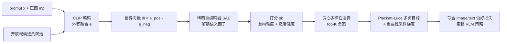

# Importance Sampling for Multi-Negative Multimodal Direct Preference Optimization

**会议**: ICLR 2026  
**OpenReview**: [https://openreview.net/forum?id=HEFPwoGtTj](https://openreview.net/forum?id=HEFPwoGtTj)  
**代码**: 待确认  
**领域**: 多模态对齐 / 视觉语言模型 / 偏好优化  
**关键词**: Multimodal DPO, Plackett-Luce, Sparse Autoencoder, Importance Sampling, Hallucination Reduction  

## 一句话总结
MISP-DPO 把多模态 DPO 从"一正一负"扩展到"一正多负"：用稀疏自编码器在 CLIP 空间挖出可解释的视觉偏差因子来挑选语义多样的负图，再用 Plackett-Luce 目标 + 重要性采样高效训练，把 VLM 的幻觉显著压下去。

## 研究背景与动机
**领域现状**：DPO 因为绕开了显式奖励建模、简单稳定，已成为对齐 LLM 的主流手段，近期被一系列工作（mDPO、CHiP、S-VCO、Re-Align 等）搬到视觉语言模型上，通过图文偏好反馈来提升多模态对齐、抑制幻觉。

**现有痛点**：这些方法构造负样本的方式过于简陋——每次对比只生成**单张负图**，靠对抗裁剪、随机扰动或相似度检索得到，把监督信号压缩成了"偏离正图的一维方向"。论文用一个直观例子点破问题：如果负图只是把"红苹果"换成"绿苹果"，模型学到的可能只是"拒绝绿色"，却对"厨房台面"这种上下文错配、"梨"这种物体错认视而不见。即便是引入多负的 listwise 扩展，多数也只是对同一张正图做扰动，得到的是高度同源、语义重叠的变体，学习信号仍然挤在一小撮相近偏差上。

**核心矛盾**：图像不像文本有 token 这样显式的组合单元，很难干净地隔离出"有意义的视觉偏差"。朴素扰动往往破坏整体连贯性却又分不清到底改了什么，使得物体身份、颜色、空间布局、上下文匹配这些**正交的错误维度**被纠缠在单张负图里，模型对其中大部分失败模式始终是盲的。

**本文目标**：构造能覆盖多个不同语义偏差的"多面"视觉负样本，给偏好学习提供更丰富、更结构化的信号。

**核心 idea**：**多负 + 语义解耦 + 高效采样**——先用稀疏自编码器把正负图的差异分解成可解释的潜在因子并据此筛出语义多样的负图，再用 Plackett-Luce 目标让正图同时压过一整组负图，并用重要性采样把"大候选池"的计算压成"小候选池"。

## 方法详解

### 整体框架
MISP-DPO 是一个两阶段框架：第一阶段从开放域图库（COCO）里**选负图**——把 prompt 和候选图嵌进 CLIP 空间，用稀疏自编码器（SAE）把它们和正图的语义差异拆成解耦因子，再按"信息量 + 语义偏离 + 互相多样"贪心挑出 top-K 张负图；第二阶段把这组负图喂进 **Plackett-Luce 多负 DPO 目标**，并用 SAE 分数引导的重要性采样估计梯度，外加一项文本侧偏好监督联合优化。

### 关键设计

**1. 多负 Plackett-Luce 目标：让正图同时压过一整组负图。** 标准多模态 DPO 用 Bradley-Terry 做"正图 vs 单负图"的两两比较，本文换成 Plackett-Luce 模型，把目标改成正图 $m_p$ 排在负图集合 $S_n=\{m_n^i\}_{i=1}^N$ 全体之上。损失通过 softmax 聚合所有负图：$L_{img}(\theta;S_n)=\log\sigma\!\big(-\log\sum_{i\in S_n}\exp(\beta\Delta_i)\big)$，其中 $\Delta_i=\log\frac{\pi_\theta(y_p|x,m_n^i)}{\pi_{ref}(y_p|x,m_n^i)}-\log\frac{\pi_\theta(y_p|x,m_p)}{\pi_{ref}(y_p|x,m_p)}$ 是每张负图相对正图的偏好优势。当 $N=1$ 时它精确退化回单负 DPO。论文进一步给出梯度分解（Lemma 4.1）：梯度是各负图修正信号 $\Delta_\theta(m_n^i,m_p)$ 按偏好分布 $p_\theta(m_n^i)\propto\exp(a_i)$ 的加权组合，于是"模型对哪种视觉偏差纠正多大力度"变得可解释——强迫策略同时满足多个约束，而非沿单一方向走捷径。

**2. SAE 解耦视觉偏差 + 重要性采样估计梯度。** 上述无偏更新需要从真实分布里抽大量负图并算全集 softmax，在真实图像域不可行。本文引入一个可学习分布 $q_\phi(m_n|x,m_p,y_p)$ 只抽一个小候选池 $\tilde S_n$，把梯度重写成 $q_\phi$ 下的**重要性采样估计**：$\nabla_\theta L_{img}(\theta;\tilde S_n)=\beta\sigma(\cdot)\sum_{i\in\tilde S_n}\frac{\exp(a_i)}{q_\phi(m_n^i)}\Delta_\theta(m_n^i,m_p)$。附录证明该估计**严格无偏**且方差有界，均方误差按 $O(1/K)$ 收敛（常数由最大重要性权重控制），从而"小候选池也能稳定优化"有了理论支撑。具体实现上，先用 CLIP 图文编码外积融合得到嵌入 $e=\mathrm{vec}(h_v\times h_t^\top)$，对每张候选负图取差异向量 $d_i=e(m_p,x)-e(m_n^i,x)$，再训练一个带 KL 稀疏约束的 SAE（重构损失 + $\sum_j\mathrm{KL}(\rho\|\hat\rho_j)$）把 $d_i$ 解耦成稀疏潜因子（如物体、颜色、布局），这些可解释因子正是 $q_\phi$ 的依据。

**3. 重构难度 + 多样性贪心选负图。** 有了 SAE 分解，每张候选负图按 $s_i=\frac{\|d_i-D(E(d_i))\|_2^2}{\max_j\ell_j}+\frac{\|E(d_i)\|_1}{\max_j v_j}$ 打分——前项是归一化重构误差（重构越难、越是新颖的硬负），后项是潜激活强度（语义偏离越大）。然后跑 Algorithm 1 的**贪心多样性选择**：每步选 $\arg\max_i[s_i+\beta\min_{j\in\tilde S_n}(1-\cos(E(d_i),E(d_j)))]$，即在"高分硬负"和"与已选负图在潜空间尽量正交"之间权衡，确保最终 K 张负图既信息量大又覆盖不同错误类型，避免同源重叠。

**4. 图文联合偏好监督。** 除了图像侧多负损失，框架额外加一项文本侧 DPO 监督 $L_{text}$：固定正图 $m_p$，用图像 grounded 的负回答 $y_n$ 替代传统纯文本偏好，最终损失 $L(\theta;\tilde S_n)=L_{img}+\lambda L_{text}$（实验取 $\lambda=1$ 等权）。这让对齐同时发生在视觉判别和跨模态文本两个层面，进一步加固 grounding。

## 实验关键数据

### 主实验表格
在 LLaVA-1.5-7B、Qwen2.5-VL-7B、Qwen2.5-VL-3B 三个 backbone、五个基准（MMHalBench / HallusionBench / POPE 测幻觉，WildVision / MMVP 测视觉中心推理）上对比，报告相对 Base 的平均提升：

| Backbone | 方法 | MMHal Score↑ | MMHal HalRate↓ | HallusionBench aA↑ | POPE Acc↑ | MMVP Acc↑ | avg impr. |
|---|---|---|---|---|---|---|---|
| LLaVA-1.5-7B | Base | 2.78 | 51.04 | 47.73 | 84.37 | 60.67 | 0% |
| | DPO | 3.29 | 37.50 | 55.62 | 83.02 | 62.66 | +21.13% |
| | mDPO | 2.99 | 49.81 | 47.32 | 83.25 | 58.33 | +0.22% |
| | CHiP | 3.13 | 34.04 | 51.95 | 82.56 | 52.33 | +5.59% |
| | Random(多负随机) | 3.42 | 36.46 | 55.94 | 82.61 | 60.33 | +22.23% |
| | **MISP-DPO** | **3.51** | **32.29** | **57.52** | **83.94** | **63.00** | **+30.09%** |
| Qwen2.5-VL-7B | Base | 4.61 | 18.09 | 70.45 | 87.65 | 77.67 | 0% |
| | **MISP-DPO** | **5.05** | **11.46** | **71.24** | **88.66** | **79.00** | **+5.35%** |
| Qwen2.5-VL-3B | Base | 4.20 | 22.34 | 64.67 | 87.48 | 70.60 | 0% |
| | **MISP-DPO** | **4.61** | **13.54** | **65.51** | 87.77 | **74.25** | **+19.89%** |

MISP-DPO 在所有 backbone、所有评测域上一致领先；最大增益出现在幻觉基准上（LLaVA 上 +30.09%）。值得注意的是 mDPO / CHiP 这类单负方法在更强的 Qwen2.5-VL-7B 上甚至会**掉点**（-1.16% / -1.33%），而 MISP-DPO 仍稳定为正。

### 消融实验表格
在 Qwen2.5-VL-7B 上对比不同负图构造方式（节选）：

| 负图构造 | MMHal Score↑ | MMHal HalRate↓ | HallusionBench aA↑ | POPE Acc↑ | MMVP Acc↑ |
|---|---|---|---|---|---|
| mDPO（单负） | 5.01 | 14.89 | 67.40 | 87.02 | 76.33 |
| diffusion 扰动 | 5.12 | 12.50 | 69.50 | 87.52 | 78.00 |
| crop+diffusion | 4.92 | 13.54 | … | … | … |
| **MISP-DPO（SAE 多负）** | **5.05** | **11.46** | **71.24** | **88.66** | **79.00** |

负图数量消融（Figure 2 右）显示性能随负图数从 1 增到 3 持续上升、之后趋于饱和，故默认选 3 张；t-SNE 可视化表明 SAE 重要性采样选出的负图语义高度分散，而随机采样则聚成低多样性的紧簇。$\beta$ 扫描显示在 0.45–0.75 区间性能最优，极端值 0.1/1.0 会退化，故取 $\beta=0.5$。

### 关键发现
- **多负本身就有用、语义多样性是放大器**：Random 多负已经超过单负 mDPO/CHiP，而 SAE 引导的多样化选负在此基础上进一步把幻觉率压到最低。
- **效果集中在幻觉抑制**：三个 backbone 的 MMHal 幻觉率分别降到 32.29% / 11.46% / 13.54%，POPE/HallusionBench 同步提升，说明多面负图确实暴露了物体错认、属性扭曲等正交失败模式。
- **对更强模型同样不退化**：单负方法在强 backbone 上失效，多负 + 重要性采样保持正增益，体现方法的可扩展性。

## 亮点与洞察
- **把"负样本工程"上升为可解释的潜因子选择**：用 SAE 在 CLIP 空间解耦视觉偏差，让"该挑哪种负图"从启发式扰动变成有结构、可解释的采样问题，这是相对 mDPO/CHiP 的本质区别。
- **理论与工程的闭环**：重要性采样估计被证明无偏且方差 $O(1/K)$ 有界，使"小候选池高效训练"不只是工程妥协，而有收敛保证支撑。
- **Plackett-Luce 把单负 DPO 优雅推广**：$N=1$ 精确退化回原式，梯度可分解为各负图修正信号的加权和，既兼容旧框架又提供可解释性。

## 局限与展望
- **依赖开放域图库与 CLIP/SAE 质量**：负图从 COCO 检索，SAE 在 CLIP 空间训练，若目标域分布偏离 CLIP 覆盖范围，解耦因子和负图相关性可能下降。
- **只在图像侧做多负**：文本侧仍是单负 DPO，跨模态的"多负"潜力尚未挖掘。
- **SAE 超参与潜维度需调**（latent dim=128、$\gamma=1$、$\rho$、选 3 负、$\beta=0.5$ 等），可解释因子的语义命名（物体/颜色/布局）更多是定性观察，缺少定量归因评估。
- **计算开销**：每个样本要对候选池跑 CLIP 编码 + SAE 解耦 + 贪心选择，相比纯扰动构造负图，预处理成本更高（虽然重要性采样缓解了训练侧开销）。

## 相关工作与启发
- **多模态 DPO 谱系**：mDPO（条件偏好 + 奖励锚定）、CHiP（层次文本监督 + 视觉对比损失）、S-VCO / Re-Align（反事实 / 检索式负图）——共同痛点是负图构造受限于局部扰动，本文沿幻觉中心的偏好优化路线给出可扩展的负图生成方案。
- **多负偏好优化**：Softmax-DPO、DMPO 在文本/推荐域用软排序或 Plackett-Luce 提升鲁棒性，本文把这一思路首次系统迁移到视觉语言模型，并解决"视觉负图如何捕捉细粒度跨模态语义偏移"的难题。
- **属性识别的启发**：紧凑、精选的小子集能匹敌大噪声集——本文据此用 SAE 选语义多样负图，印证"质优于量"在多模态偏好学习中同样成立。
- **启发**：把可解释性工具（SAE）当作数据筛选器、而非仅做事后分析，是值得借鉴的范式；"多负 + 重要性采样 + 无偏方差界"这套组合也可迁移到其它需要构造对比样本的对齐任务。

## 评分
- 新颖性: ⭐⭐⭐⭐ 首个用 SAE 在 CLIP 空间解耦视觉偏差来做多负多模态 DPO 的框架，把负样本工程重构成可解释的潜因子采样，思路清晰且有理论支撑。
- 实验充分度: ⭐⭐⭐⭐ 覆盖三个 backbone、五个基准，含负图构造方式 / 数量 / $\beta$ / t-SNE 等多组消融，对比基线齐全；缺域外泛化与计算开销的定量评估。
- 写作质量: ⭐⭐⭐⭐ 动机用"绿苹果"例子讲得直观，方法从目标到梯度到采样推导完整，图表清楚。
- 价值: ⭐⭐⭐⭐ 对 VLM 幻觉抑制给出可落地、可扩展且有理论保证的方案，单负方法失效的强模型上仍稳定增益，实用价值高。

<!-- RELATED:START -->

## 相关论文

- [\[ICML 2026\] TUR-DPO: Topology- and Uncertainty-Aware Direct Preference Optimization](../../ICML2026/multimodal_vlm/tur-dpo_topology-_and_uncertainty-aware_direct_preference_optimization.md)
- [\[ICML 2025\] Importance Corrected Neural JKO Sampling](../../ICML2025/multimodal_vlm/importance_corrected_neural_jko_sampling.md)
- [\[ICLR 2026\] Uni-DPO: A Unified Paradigm for Dynamic Preference Optimization of LLMs](uni-dpo_a_unified_paradigm_for_dynamic_preference_optimization_of_llms.md)
- [\[CVPR 2025\] SymDPO: Boosting In-Context Learning of Large Multimodal Models with Symbol Demonstration Direct Preference Optimization](../../CVPR2025/multimodal_vlm/symdpo_boosting_in-context_learning_of_large_multimodal_models_with_symbol_demon.md)
- [\[ICLR 2026\] Multimodal Prompt Optimization: Why Not Leverage Multiple Modalities for MLLMs](multimodal_prompt_optimization_why_not_leverage_multiple_modalities_for_mllms.md)

<!-- RELATED:END -->
