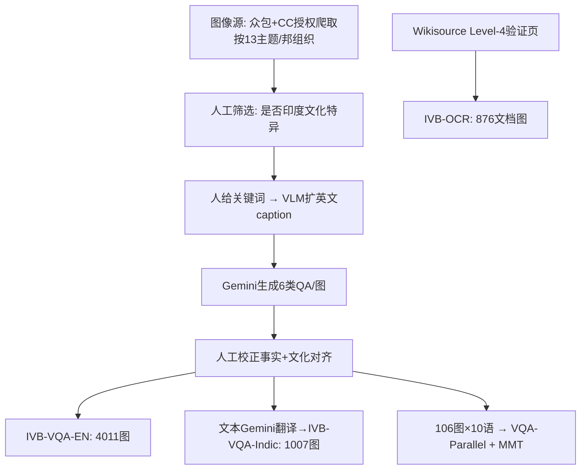

# IndicVisionBench: Benchmarking Cultural and Multilingual Understanding in VLMs

**会议**: ICLR 2026  
**OpenReview**: [https://openreview.net/forum?id=LmJoLn04iL](https://openreview.net/forum?id=LmJoLn04iL)  
**代码/数据**: [https://huggingface.co/datasets/krutrim-ai-labs/IndicVisionBench](https://huggingface.co/datasets/krutrim-ai-labs/IndicVisionBench)  
**领域**: 多模态 VLM / 文化与多语种评测基准  
**关键词**: VLM 评测、文化理解、印度语种、OCR、多模态翻译、文化 VQA  

## 一句话总结
IndicVisionBench 是首个聚焦印度次大陆的大规模文化—多语种 VLM 评测基准，覆盖英语 + 10 种印度语、3 个多模态任务（VQA / OCR / MMT）、5K 图像与 37K+ QA，系统揭示了当前 VLM 在文化多样语境下的显著性能缺口。

## 研究背景与动机
**领域现状**：视觉-语言模型（VLM）在通用多模态任务上表现强劲，但绝大多数评测基准（VQA、MME、VQAv2 等）都是「西方中心」的，主要围绕英语和欧美文化语境构建。

**现有痛点**：印度是全球文化与语言最多样的地区之一——22 种官方语言、28 个邦 + 8 个联邦属地，每个区域都有独特的族群、视觉与文化身份。但现有工作（CVQA、CulturalVQA、ALM-Bench）只是「部分触及」印度语境：要么语言覆盖窄（多数开源 VLM 只支持 2–4 种中等资源印度语），要么缺乏文化定向，要么任务单一，**没有一个统一框架能同时刻画印度文化多样性与多语种多模态评测**。

**核心矛盾**：VLM 号称「通用泛化」，但我们根本不知道它们在低资源语种和文化特异内容上是否真的成立——缺乏可复现、足够细粒度的探针。

**本文目标**：构建一个印度中心的、文化扎根的、可复现的评测套件，把「文化知识」「多语种鲁棒性」「文字识别」一并纳入，量化主流 VLM 的真实差距。

**核心 idea**：**以「邦/联邦属地作为文化群体的代理」**，围绕 13 个印度文化主题，构建覆盖 3 个互补多模态任务（VQA、OCR、MMT）的基准；并配套一份跨 10 种语言的**平行标注语料**，使得「跨语种文化理解」可以被逐语种对照分析。

## 方法详解

### 整体框架
IndicVisionBench（IVB）不是一个模型，而是一条「采集—合成—人审—评测」的基准构建流水线，最终落成 3 个任务轨道 + 1 份平行语料。图像经众包与 CC 授权网络爬取两路汇入，每一步都有人工质检；标注先由人给关键词、VLM 扩成详细英文 caption、再由 LLM 生成 6 类问题与翻译，最后全程人工校正以保证事实与文化准确性。

### 关键设计
**1. 三轨道互补设计：用 VQA / OCR / MMT 共同逼近「文化理解」**。单一任务无法刻画文化能力，IVB 因此用三个正交轨道：VQA 轨（4,011 英文 + 1,007 多语文化图，每图 6 类问题）测识别与推理；OCR 轨（876 篇 Wikisource 文档图，跨 10 种印度文字、含印刷体与手写体）测低资源文字脚本的识别；MMT 轨（106 个图–caption 对译成 10 种语言）测「视觉接地的翻译」。三者覆盖了从「看懂文字」到「看懂文化语义」再到「跨语种传递语义」的完整链路。

**2. 六类问题型 + 对抗题，把文化知识从「表层识别」逼向「深层判断」**。每张 VQA 图配 6 类问题：2 道短答、1 道长答、1 道单选（MCQ）、1 道判断（True/False）、以及关键的 **1 道对抗题**。对抗题刻意嵌入**虚假前提**，要求模型显式拒绝而非顺着错误假设作答——这把评测从「能不能认出蒙古风格城堡」升级为「会不会被诱导性的错误文化预设带偏」，是探测文化知识深度最尖锐的探针。

**3. 平行语料让「跨语种文化退化」可逐语对照**。作者额外抽出一个不相交的 106 图子集，把同一组 6 道问题译入全部 10 种印度语，构成 VQA-Parallel。因为问题与图像在各语种间严格平行，模型在某语种上的得分下降就能干净地归因到「语言资源/脚本」而非「题目难度差异」，从而系统量化跨语种鲁棒性。MMT 轨复用这 106 图，每条英文 caption 在**有图上下文**下译成 10 种语言并全程人工校对，避免了基于 Visual Genome 的旧 MMT 数据可能存在的数据污染问题。

**4. 确定性 + 裁判式混合评测，匹配题型特性**。MCQ 与 True/False 用 Exact Match（0–1）；短答/长答/对抗题用 GPT-4o 作 LLM-as-a-Judge（0–10 分）以捕捉语境与文化恰当性；MMT 用 BLEU 与 RIBES；OCR 以 ANLS（对离群点更鲁棒）为主指标，辅以 WER/CER。指标随题型「定制」，避免用单一刚性指标误判开放式文化问答。

## 实验关键数据
评测了 8 个主流 VLM，分三族：闭源（Gemini-2.5 Flash、GPT-4o）、大开源（Gemma-3-27B、LLaMA-4-Maverick-17B）、中等开源 7B（Maya、PALO、Pangea、Chitrarth-1），OCR/MMT 轨另加专用模型（Chitrapathak、Surya、Chitranuvad）。

### 主实验表格（English VQA，6 类问题平均分；MCQ/TF 为 0–1，其余 0–10）

| Model | MCQ ↑ | True/False ↑ | Long ↑ | Short-1 ↑ | Short-2 ↑ | Adversarial ↑ |
|---|---|---|---|---|---|---|
| Maya (7B) | 0.69 | 0.71 | 6.98 | 5.00 | 5.50 | 0.16 |
| PALO (7B) | 0.72 | 0.43 | 7.12 | 5.51 | 5.81 | 0.19 |
| Pangea (7B) | 0.85 | 0.37 | 7.01 | 6.72 | 6.95 | 0.67 |
| Chitrarth-1 (7B) | 0.81 | 0.68 | 7.53 | 6.22 | 6.33 | 0.03 |
| LLaMA-4 | 0.87 | 0.92 | 8.55 | 7.98 | 7.91 | 2.62 |
| Gemma-3 | 0.87 | 0.88 | 8.56 | 7.68 | 7.61 | 1.50 |
| GPT-4o | 0.90 | 0.91 | 8.75 | 8.19 | 8.02 | 2.95 |
| **Gemini-2.5** | **0.94** | **0.95** | **9.30** | **8.58** | **8.49** | **5.79** |

### 对抗题表格（部分语种，0–10；7B 模型得分趋近 0 故略）

| Model | English ↑ | Hindi ↑ | Bengali ↑ | Tamil ↑ | Telugu ↑ | Kannada ↑ |
|---|---|---|---|---|---|---|
| LLaMA-4 | 2.62 | 1.18 | 0.38 | 1.14 | 0.07 | 0.14 |
| Gemma-3 | 1.50 | 1.66 | 1.07 | 1.85 | 1.13 | 1.02 |
| GPT-4o | 2.95 | 2.25 | 2.23 | 1.70 | 2.04 | 0.67 |
| **Gemini-2.5** | **5.79** | **4.46** | **5.17** | **5.15** | **2.73** | **3.17** |

### 关键发现
- **闭源 Gemini-2.5 全轨道碾压**：VQA、MMT、OCR 三轨均居首；GPT-4o 与 LLaMA-4 为最强挑战者，但 GPT-4o 在多语 VQA 上反而落后于 LLaMA-4/Gemma-3。
- **对抗题是全场最大软肋**：即便最强的 Gemini-2.5，对抗题得分（英文 5.79）也远低于其它题型（长答 9.30），7B 模型几乎全军覆没（趋近 0）——说明模型普遍「认得出文化元素，却扛不住错误前提的诱导」。
- **低资源语种与文化特异内容性能骤降**：跨语种平行实验显示得分随语言资源下降而系统性退化，Malayalam 在 MMT 与 OCR 上均最难。
- **闭源 vs 开源鸿沟显著**：捕捉语言与文化细微差别的能力上，开源模型整体落后；7B 模型差距最大。
- **OCR 反直觉点**：GPT-4o 在印度文字 OCR 上表现意外糟糕（如 Malayalam word-level ANLS 94.67，远低于预期），印度语专用的 Surya / Chitrapathak 在各自语种上能拿第二。

## 亮点与洞察
- **「邦作为文化群体代理」是个聪明且可扩展的标注组织方式**，把模糊的「文化」落地成可枚举、可平衡采样、可逐区域分析的维度。
- **对抗题（虚假前提）的引入**是本基准最有价值的设计：它把「文化识别」与「文化判断/鲁棒性」分离开，暴露了所有模型共同的脆弱面，对后续训练目标有直接指导意义。
- **严格平行的跨语种语料 + 视觉接地的人工校对 MMT**，让「跨语种退化」从模糊印象变成可量化、可归因的结论，并主动规避了 Visual Genome 旧数据的污染风险。
- 公开数据集 + 代码，可复现，填补了印度语境下多语种多模态评测的真实空白。

## 局限与展望
- **以邦作文化代理**虽便于操作，但同一邦内部仍有巨大文化异质性，可能掩盖更细粒度的群体差异。
- **规模仍偏小**：平行/MMT 子集仅 106 图，OCR 仅 876 文档图，统计功效与覆盖度有限，扩展到更多图像与题型会更有说服力。
- **依赖 LLM 生成 + LLM 评判**：QA 由 Gemini 生成、开放题由 GPT-4o 评分，可能引入生成模型与裁判模型的偏好性偏差（尽管有人工校正）。
- 仅覆盖印度次大陆，结论能否外推到其它非西方文化区域仍待验证；未来可把这套「代理—多轨道—对抗题—平行语料」范式迁移到更多地区。

## 相关工作与启发
- **文化 VQA**：GD-VCR、Henna（阿拉伯语）、WorldCuisines（食物）偏单一文化/语言；CVQA、CulturalVQA、ALM-Bench 部分触及印度语境，但均未统一刻画印度文化多样性 + 多语种多模态——IVB 正是填这个缺口。
- **多语种多模态**：MaRVL、xGQA 扩了语言但无印度文化接地；多数开源 VLM 只支持 2–4 种印度语，Chitrarth 是少数覆盖全 10 语的例外。
- **OCR / MMT**：OCR 基准（RVL-CDIP、FUNSD、DocVQA）以英语为主，缺印度文字；MMT 历来集中在英-欧语对，IVB 用文化图像 + 人工校对的视觉接地翻译避免数据污染。
- **启发**：本文给「文化能力」评测提供了一个可复用范式——区域代理标注 + 多正交轨道 + 对抗题探针 + 严格平行语料，值得迁移到任何非西方语境的 VLM 评测。

## 评分
- **新颖性**: ⭐⭐⭐⭐ 首个印度中心、覆盖 10 语 + 3 轨道的大规模文化多模态基准；对抗题与跨语种平行语料的组合设计有明显创新，但「构建基准」本身在方法论上是组合式创新而非全新范式。
- **实验充分度**: ⭐⭐⭐⭐ 评测 8+ 模型、三族对比、三轨道全覆盖，含对抗/跨语种/统计显著性分析；扣分点在 MMT/OCR 子集规模偏小。
- **写作质量**: ⭐⭐⭐⭐ 流水线图清晰、表格规范、发现叙述层次分明，易于复现。
- **价值**: ⭐⭐⭐⭐⭐ 直击 VLM 评测「西方中心」的真实盲区，公开数据 + 可复现框架，对包容性多模态研究有长期基础设施价值。

<!-- RELATED:START -->

## 相关论文

- [\[CVPR 2026\] M4-RAG: A Massive-Scale Multilingual Multi-Cultural Multimodal RAG](../../CVPR2026/multimodal_vlm/m4-rag_a_massive-scale_multilingual_multi-cultural_multimodal_rag.md)
- [\[ICLR 2026\] VaseVQA-3D: Benchmarking 3D VLMs on Ancient Greek Pottery](vasevqa-3d_benchmarking_3d_vlms_on_ancient_greek_pottery.md)
- [\[ICLR 2026\] Kaleidoscope: In-language Exams for Massively Multilingual Vision Evaluation](kaleidoscope_in-language_exams_for_massively_multilingual_vision_evaluation.md)
- [\[ACL 2026\] VULCA-Bench: A Multicultural Vision-Language Benchmark for Evaluating Cultural Understanding](../../ACL2026/multimodal_vlm/vulca-bench_a_multicultural_vision-language_benchmark_for_evaluating_cultural_un.md)
- [\[ICLR 2026\] Teaching VLMs to Admit Uncertainty in OCR from Lossy Visual Inputs](teaching_vlms_to_admit_uncertainty_in_ocr_from_lossy_visual_inputs.md)

<!-- RELATED:END -->
