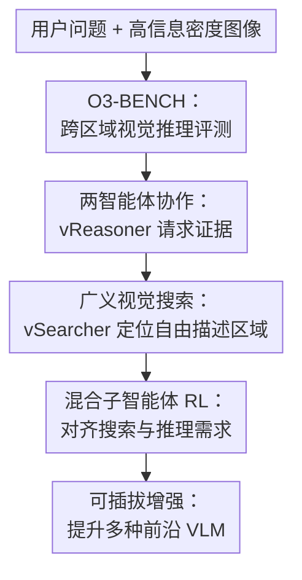

# InSight-o3: Empowering Multimodal Foundation Models with Generalized Visual Search

**会议**: ICLR2026  
**OpenReview**: [https://openreview.net/forum?id=vlraTIgUD3](https://openreview.net/forum?id=vlraTIgUD3)  
**代码**: https://github.com/m-Just/InSight-o3  
**领域**: 多模态VLM  
**关键词**: 视觉搜索, 多模态推理, 高分辨率图像, 多智能体, 强化学习

## 一句话总结
InSight-o3 提出 O3-BENCH 来评测模型在高信息密度图像中边找细节边推理的能力，并用 vReasoner + vSearcher 的两智能体框架把通用视觉搜索训练成可插拔组件，从而显著增强 GPT-5-mini、Gemini-2.5-Flash 等多模态基础模型。

## 研究背景与动机
**领域现状**：多模态大模型已经能回答很多图像问答、图表理解和 OCR 类问题，但常见评测要么只看整图级语义，要么只要求模型找到一个显眼物体。近年的视觉搜索工作开始让模型调用裁剪、放大等工具，去看清高分辨率图像中的局部区域，这和 OpenAI o3 展示的“用图像思考”方向很接近。

**现有痛点**：真实任务并不只是“图里有没有某个物体”。看地图时，用户可能问“离某个餐饮点最近且满足身高限制的游乐设施是哪一个”；看组合图表时，用户可能要先找到某个子图，再读图例、单位和数值，最后做比较或计算。现有开放模型往往在这类任务上卡住：它们要同时决定下一步该查哪里、从局部区域读什么、如何把多处证据串起来，单个模型的上下文和注意力很容易被高分辨率细节淹没。

**核心矛盾**：这篇论文抓住的矛盾是，视觉推理需要高层规划和细粒度感知紧密交替，但这两种能力对模型的要求不同。一个强推理模型未必擅长在任意截图、地图、海报或图表中精确定位模糊描述的区域；一个定位模型也未必能完成跨区域、多步逻辑推断。如果把两件事都压给同一个 MLLM，训练和推理都会变得笨重。

**本文目标**：作者希望同时解决两个问题。第一，建立一个真正能测“边看边想”的基准，而不是只测单次 OCR 或单目标定位。第二，训练一个可被不同多模态模型调用的视觉搜索子智能体，让现有 vReasoner 在需要细节时能主动请求“帮我找到这片区域”。

**切入角度**：论文没有直接训练一个端到端的万能视觉推理大模型，而是把任务拆成 vReasoner 和 vSearcher。vReasoner 负责拆问题、维护推理链、决定下一次要看哪里；vSearcher 负责根据自然语言区域描述，在原图中定位并返回相关区域。这个角度的好处是把“泛化视觉搜索”单独训练出来，让它可以插到不同前沿模型后面。

**核心 idea**：用专门训练的广义视觉搜索代理 InSight-o3-vS，替代单模型内部的粗糙局部注意力，让多模态基础模型在高信息密度图像中按需检索证据并完成多跳推理。

## 方法详解

### 整体框架
InSight-o3 的整体流程可以理解成“一个会想的模型 + 一个会找图像证据的模型”。用户给出问题和图像后，vReasoner 先做高层推理，判断当前缺少哪块视觉证据；它把缺失证据写成自由形式的区域描述交给 vSearcher，vSearcher 在原图中定位并裁剪相关区域，再把结果返回给 vReasoner。这个循环可以进行多轮，直到 vReasoner 聚合所有证据并输出答案。

论文的核心不只是提出两智能体接口，还定义并训练了广义视觉搜索：搜索目标可以是关系性的、模糊的、概念性的区域，比如“木椅左侧区域”“展示公司近十年收入的图表”“地图中某个餐饮标记附近的游乐设施”，而不是传统检测里明确类别的物体框。

### 关键设计
**1. O3-BENCH：把评测从“看见目标”推进到“跨区域取证后推理”**

O3-BENCH 的设计重点是高分辨率、高信息密度和多跳解题路径。它包含 204 张图像和 345 个多选问题，其中 117 张是组合图表、87 张是高分辨率地图；问题分布为 163 个图表题和 182 个地图题。每道题有六个选项，其中 F 是“无正确选项”，这会迫使模型真的检查图像证据，而不能只在候选答案里猜一个看起来合理的选项。

这个基准的难点在于，答案通常不在单个局部区域里。图表题可能要从多个子图中读数、对齐单位、做差值或比例计算；地图题可能要先在索引里找到实体编号，再回到地图上定位，再读图例解释符号，最后判断空间关系。作者还用强模型过滤掉三种前沿模型都能答对的样本，使得保留下来的问题对 OpenAI o3 也很难，o3 在 O3-BENCH 上只有 40.8% 准确率。

**2. 两智能体协作：让推理模型只负责“该找什么”，让搜索模型负责“在哪里”**

InSight-o3 把系统拆成 vReasoner 和 vSearcher。vReasoner 可以是 GPT-5-mini、Gemini-2.5-Flash 这类强多模态模型，它负责理解问题、分解目标、判断当前缺失的证据，并用自然语言向 vSearcher 发出区域请求。vSearcher 不需要解决完整问题，它只需要把描述转成图像中的区域定位，并通过裁剪等工具确认局部内容。

这个拆分解决了单代理系统的一个关键负担：如果一个模型既要规划推理路径，又要在 4K 到 10K 级别的图像里寻找很小的文本、图例或标记，它很容易在长上下文中漏看细节。两智能体结构把抽象推理和精细定位分开，让 vReasoner 可以像人一样说“我需要看左侧图例中身高限制那块”，再由 vSearcher 负责把这块证据带回来。

**3. 广义视觉搜索：从物体框定位扩展到自由语言描述的概念区域**

传统 visual search 更像“找到图中的狗”或“裁剪红色车牌”，目标是自然图像中的离散对象。本文的 vSearcher 面向的是更开放的目标：任意图像类型、任意区域粒度、任意自由描述。区域可以是地图一角、图表里的某个子图、海报中一段说明文字，也可以是“某个设施附近同时包含图例和编号的区域”。

这点很重要，因为真实视觉推理中的搜索请求往往来自推理过程，而不是预定义类别。vReasoner 生成的描述可能并不精确，它只知道自己要验证某个中间事实，例如“显示 Draken Valley attraction height requirements 的左侧图例区域”。vSearcher 要把这样的语义请求落到坐标框上，并尽量返回对解题有帮助的局部视图。

**4. 混合子智能体 RL：同时利用可标注定位监督和真实推理回路反馈**

训练 vSearcher 时，作者没有只依赖单一奖励。out-of-loop RL 使用预生成的区域描述和真实框，直接用 IoU 奖励训练定位能力。其奖励可概括为：只有 vSearcher 至少调用过工具时，才根据格式奖励和 IoU 奖励给分；IoU 奖励被阈值化为 $r_{IoU}=\max(0, IoU(b,b^*)-\alpha)/(1-\alpha)$，避免低质量框也获得正奖励。

in-loop RL 则更贴近真实推理：vReasoner 在解题过程中动态生成搜索请求，vSearcher 返回区域后，vReasoner 判断该区域是否有助于解题，并结合最终答案是否正确形成伪 IoU 奖励 $\hat r_{IoU}=I[s=c=1]$。这里 $s$ 表示 vReasoner 认为搜索结果有用，$c$ 表示最终答案正确。作者再基于 GRPO 目标优化 vSearcher，并对 in-loop 任务使用全局均值和方差做 advantage normalization，因为动态生成的搜索任务不再天然成组。

**5. 合成训练数据：用拼贴图和信息图补足高密度任务稀缺问题**

高质量高分辨率推理样本很难大规模人工标注，所以作者为两个训练分支分别构造数据。in-loop RL 用 Visual CoT 和 V* 训练数据拼成多图 collage，让一个目标图和若干干扰图放在同一画布中；经过难度过滤后得到 15,303 个 vReasoner 必须依赖 vSearcher 才能稳定解决的 hard problems。

out-of-loop RL 则使用 InfographicVQA 作为图像来源，用 PP-DocLayout plus-L 检测布局区域，过滤后得到 10,186 个高质量 layout boxes，再让 GPT-5-nano 为每个区域生成类似真实调用时会出现的高层区域描述。这样训练数据一边提供精确框监督，一边让描述风格贴近 vReasoner 在推理回路中的自然请求。

### 一个完整示例
以论文图 1 中的主题公园地图题为例，用户问“Draken Valley 中哪个设施能让 128cm 儿童独自乘坐，并且离 Draken Snack 最近”。vReasoner 不应直接猜选项，而是先把问题拆成三个子目标：找到 Draken Snack 在地图上的位置、找它附近的 Draken Valley 游乐设施、确认每个设施的身高和监护人规则。

第一轮，vReasoner 请求 vSearcher 查找 meals 列表和地图下方的 Draken Valley 区域。vSearcher 返回包含 Draken Snack 编号和附近地图标记的裁剪区域，vReasoner 得到“Draken Snack 是 #2，位置靠近 Valkyrie”。第二轮，vReasoner 请求左侧 attractions legend 中 Draken Valley 的身高规则。vSearcher 返回图例区域后，vReasoner 读到 Valkyrie 是 120cm+，而 Draken 和 Klake 是 135cm+。最后 vReasoner 把空间距离和身高约束合并，输出 Valkyrie。

这个例子体现了本文方法的核心价值：搜索请求不是固定类别检测，而是随着推理状态变化而生成的自然语言区域描述；最终答案也不是来自某一个裁剪图，而是来自多个区域证据的组合。

### 损失函数 / 训练策略
InSight-o3-vS 以 Qwen2.5-VL-7B-Instruct 为基础 vSearcher，在训练时搭配 GPT-5-mini-2025-08-07 作为 vReasoner。训练目标基于 GRPO，但针对子智能体场景做了两点改造：一是 out-of-loop 和 in-loop 样本混合在同一个 batch 中优化；二是对工具返回 token 做 loss mask，因为这些 token 不是策略模型生成的。

out-of-loop 分支的优势估计沿用 GRPO 的组内归一化；in-loop 分支则对所有动态生成任务的奖励做全局归一化，即 $\hat A_t=(r-mean(r))/std(r)$。这样做的原因是，在真实交互中 vReasoner 每次生成的搜索任务不同，无法像标准 GRPO 那样为同一个 query 采样一组可比较输出。

训练策略的一个现实细节是，作者只允许 vSearcher 使用最基础的 image cropping 工具。框架本身不限制工具类型，但论文先把问题收敛到“能不能可靠找到有用区域”。实验中作者还观察到 Qwen2.5-VL-7B-Instruct 倾向于少调用工具，因此奖励里加入了工具调用条件，鼓励模型至少用裁剪验证自己返回的区域。

## 实验关键数据

### 主实验
论文在自然图像、混合高分辨率场景和自建 O3-BENCH 上评测 InSight-o3-vS。最关键的结果是，它作为可插拔 vSearcher 接到不同 vReasoner 后，通常比直接让 vReasoner 单独解题更强，也比接未训练的 Qwen2.5-VL-7B 更稳定。

| vReasoner 设置 | V*-Bench | HR-Bench4K | VProbeHard | O3-BENCH | 平均 |
|--------|------:|------:|------:|------:|------:|
| GPT-5-mini | 73.8 | 72.0 | 26.4 | 39.0 | 53.7 |
| GPT-5-mini + Qwen2.5-VL-7B | 80.6 | 83.2 | 37.7 | 47.5 | 55.4 |
| GPT-5-mini + InSight-o3-vS | 86.9 | 86.7 | 41.2 | 61.5 | 64.9 |
| Gemini-2.5-Flash | 80.1 | 83.5 | 39.6 | 60.4 | 61.7 |
| Gemini-2.5-Flash + InSight-o3-vS | 87.6 | 82.3 | 36.2 | 69.7 | 63.7 |

在 GPT-5-mini 上，O3-BENCH 从 39.0% 提升到 61.5%，提升 22.5 个百分点；平均分从 53.7 提升到 64.9。Gemini-2.5-Flash 原本在 O3-BENCH 上已经很强，接入 InSight-o3-vS 后仍从 60.4 提升到 69.7。相比之下，简单接一个未训练 Qwen2.5-VL-7B 有时会拖累模型，说明搜索代理不是越多越好，必须训练成能理解请求并返回有用证据的子智能体。

### 消融实验
论文的消融主要验证混合 RL、奖励设计和输入分辨率。下面摘取最能说明训练策略必要性的两组结果。

| 配置 | V*-Bench | VisualProbe-Hard | O3-BENCH | 平均/说明 |
|------|------:|------:|------:|------|
| Proposed | 86.9 | 41.2 | 61.5 | 奖励与 advantage 设计完整 |
| w/o tool cond. | 86.4 | 39.3 | 60.6 | 去掉工具调用条件后平均降 1.1 |
| w/o feedback | 86.5 | 37.1 | 58.1 | 不用 vReasoner 反馈，O3-BENCH 降 3.4 |
| w/o outcome | 86.9 | 38.7 | 60.9 | 不用最终答案监督，VisualProbe-Hard 降 2.5 |
| w/o GN | 87.3 | 36.8 | 61.3 | 不用全局归一化，平均降 1.4 |

| 训练分支 | GPT-5-mini + vSearcher 的 V*-Bench | VisualProbe-Hard | O3-BENCH | 单步耗时 |
|------|------:|------:|------:|------:|
| 未训练基线 | 80.6 | 37.7 | 47.5 | - |
| 仅 in-loop RL | 86.4 | 39.0 | 59.6 | 1223s |
| 仅 out-of-loop RL | 84.8 | 41.2 | 58.8 | 105s |
| in-loop + out-of-loop RL | 86.9 | 41.2 | 61.5 | 941s |

### 关键发现
- O3-BENCH 确实测到了“主动找关键视觉区域”的能力：GPT-5-mini 在给定人工目标 layout 后从 39.0% 提升到 67.5%，说明瓶颈很大一部分来自找证据，而不是最终语言推理本身。
- InSight-o3-vS 对训练分布外的评测有较好泛化。训练数据来自拼贴图和 InfographicVQA，而测试覆盖 V*-Bench、HR-Bench4K、Tree-Bench、VisualProbe-Hard、MME-RealWorld Lite 和 O3-BENCH。
- 高分辨率对 vReasoner 很重要，但 vSearcher 的输入分辨率敏感性较低。GPT-5-mini + InSight-o3-vS 在 vSearcher 最大像素从 0.8M 增到 12.8M 时，O3-BENCH 从 56.0 到 61.5，中间 3.2M 还达到 62.3，说明训练出的搜索策略并不完全依赖超高分辨率。
- 混合 RL 的收益来自两类监督互补：out-of-loop 提供精确定位信号、训练效率高；in-loop 提供真实推理回路中的请求分布和 vReasoner 反馈。只用其中一个分支都能提升，但组合后 O3-BENCH 最好。

## 亮点与洞察
- 把“视觉搜索”重新定义成广义视觉搜索很有价值。它不再局限于物体检测式的类别框，而是面向推理过程中的自由语言区域请求，这更接近真实人机协作中“帮我看这块”的交互方式。
- 两智能体拆分比直接堆大模型更工程化。作者承认联合训练 vReasoner 和 vSearcher 会遇到信用分配和非平稳更新问题，因此先固定强 vReasoner、集中训练 vSearcher，这让问题可控，也让训练出的搜索器能迁移到不同前沿模型。
- O3-BENCH 的设计有助于暴露现有多模态评测的盲区。很多 benchmark 的难点在单次识别或单区域 OCR，而这里要求模型反复定位、读局部、合成证据，因此更能反映“用图像思考”的真实复杂度。
- 奖励设计里的 outcome safeguard 很实用。只让 vReasoner 评价“这个裁剪有用吗”可能会受 vReasoner 自身错误影响；再加最终答案是否正确，可以减少把无效搜索误当成好搜索的风险。
- 这套思路可以迁移到 GUI agent、文档审阅、遥感地图理解和医学报告阅读。只要任务里存在“全图太大、证据分散、推理需要多轮局部查看”的结构，就可以把视觉搜索代理作为通用证据检索层。

## 局限与展望
- vReasoner 仍然是系统上限的一部分。论文也指出，即使 GPT-5-mini 接入 InSight-o3-vS 后表现不错，典型失败案例中 vReasoner 仍会误判、错误调用工具或把正确裁剪证据组合错。
- vSearcher 训练依赖强外部模型生成请求和反馈。in-loop RL 中 GPT-5-mini 既生成区域描述又提供部分反馈，这会把训练质量绑定到专有模型能力上；未来如果要完全开放复现，需要更便宜、更透明的反馈机制。
- 工具空间目前很窄。论文为了简化只允许 vSearcher 使用裁剪工具，但真实“think with images”可能需要缩放、旋转、增强、OCR、表格解析或代码计算。只会裁剪的 vSearcher 对低质量图像和复杂视觉变换仍有限。
- O3-BENCH 规模不算大。345 个 QA 样本质量高但数量有限，适合做挑战性评测，却还不足以覆盖所有真实高密度视觉推理场景。后续可以扩展到网页截图、软件界面、长文档、科学图谱和医学影像报告。
- 两智能体通信协议仍比较自然语言化。自然语言请求灵活，但也可能含糊；未来可以研究把区域描述、置信度、搜索历史和失败反馈结构化，让 vReasoner 更清楚地知道 vSearcher 找到了什么、没找到什么。

## 相关工作与启发
- **vs V* / Mini-o3 / DeepEyes**: 这些工作推动了视觉搜索和多轮裁剪，但大多仍围绕自然图像中的单一区域或单目标查找。InSight-o3 的不同点在于把搜索目标扩展到任意高密度图像中的关系、模糊和概念区域，并把搜索器作为独立子智能体服务于多种 vReasoner。
- **vs MME-RealWorld / HR-Bench**: 这些 benchmark 强调高分辨率真实场景和细粒度识别，但很多问题在找到目标区域后就能直接回答。O3-BENCH 更强调跨区域证据聚合和多跳推理，因此更适合评估 interleaved perception-reasoning。
- **vs 多模态 RL 推理模型**: DeepSeek-R1 风格的 GRPO 已经被很多 VLM 用来增强链式推理，但这些模型常把视觉部分当成静态输入。本文把 RL 用在视觉搜索子智能体上，让模型学习何时裁剪、裁剪哪里、如何服务上层推理。
- **vs 工具调用型视觉 agent**: VisProg、ViperGPT、HYDRA 等方法通过程序或工具组合解决视觉任务，优势是灵活，但往往依赖预设模块。InSight-o3 的启发是，把“找相关视觉区域”本身训练成一个可复用模块，可能比为每个任务手写工具链更通用。

## 评分
- 新颖性: ⭐⭐⭐⭐⭐ 论文把自由语言驱动的广义视觉搜索作为独立能力训练，并和多模态推理代理解耦，问题定义和系统设计都很清晰。
- 实验充分度: ⭐⭐⭐⭐ 覆盖多个前沿 vReasoner、六类 benchmark 和多组消融，证据比较扎实；但 O3-BENCH 本身规模仍偏小。
- 写作质量: ⭐⭐⭐⭐ 论文主线清楚，图 1 和图 2 很好地解释了任务和训练流程；部分实验表较密，需要读者反复对照。
- 价值: ⭐⭐⭐⭐⭐ 这篇论文对开放多模态系统很有参考价值，尤其适合启发“证据检索子代理 + 高层推理模型”的可插拔架构。

<!-- RELATED:START -->

## 相关论文

- [\[ICML 2026\] CVSearch: Empowering Multimodal LLMs with Cognitive Visual Search for High-Resolution Image Perception](../../ICML2026/multimodal_vlm/cvsearch_empowering_multimodal_llms_with_cognitive_visual_search_for_high-resolu.md)
- [\[ICML 2026\] ACTIVE-o3: Empowering MLLMs with Active Perception via Pure Reinforcement Learning](../../ICML2026/multimodal_vlm/active-o3_empowering_mllms_with_active_perception_via_pure_reinforcement_learnin.md)
- [\[CVPR 2026\] SenseSearch: Empowering Vision-Language Models with High-Resolution Agentic Search-Reasoning via Reinforcement Learning](../../CVPR2026/multimodal_vlm/sensesearch_empowering_vision-language_models_with_high-resolution_agentic_searc.md)
- [\[ICLR 2026\] DaVinci: Reinforcing Visual-Structural Syntax in MLLMs for Generalized Scientific Diagram Parsing](davinci_reinforcing_visual-structural_syntax_in_mllms_for_generalized_scientific.md)
- [\[ICLR 2026\] ViPER: Empowering the Self-Evolution of Visual Perception Abilities in Vision-Language Models](viper_empowering_the_self-evolution_of_visual_perception_abilities_in_vision-lan.md)

<!-- RELATED:END -->
