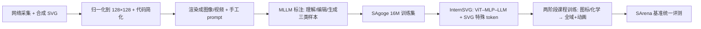

# InternSVG: Towards Unified SVG Tasks with Multimodal Large Language Models

**会议**: ICLR 2026  
**OpenReview**: [https://openreview.net/forum?id=YxqnNNs3sf](https://openreview.net/forum?id=YxqnNNs3sf)  
**项目主页**: [https://hmwang2002.github.io/release/internsvg](https://hmwang2002.github.io/release/internsvg)  
**领域**: 多模态大模型 / SVG 理解-编辑-生成  
**关键词**: SVG, 多模态大模型, 统一建模, 矢量图形, 特殊 token, 课程学习  

## 一句话总结
InternSVG 用一套「数据集 SAgoge + 基准 SArena + 模型 InternSVG」三件套，把 SVG 的理解、编辑、生成三类任务统一进同一个多模态大模型里，靠 SVG 专用 token、子词初始化和两阶段课程训练，在自建和已有基准上全面超越开源与闭源模型。

## 研究背景与动机
**领域现状**：SVG 是基于 XML 的 2D 矢量图标准，存储紧凑、可无损缩放、便于精细编辑，在网页设计、科学可视化、CAD 中被广泛使用。让模型「看懂、改对、画出」SVG，自然成了多模态智能的一个有价值的落点，而 SVG 本身是文本代码，又天然适配 LLM/MLLM 的处理范式。

**现有痛点**：作者指出三条核心短板。其一，**数据集任务割裂**——SGP-Bench 只做语义理解、SVGEditBench 只做编辑、MMSVG/SVG-Stack 只做生成，监督与评测都碎片化，无法支撑跨任务迁移。其二，**规模与多样性受限**——UniSVG 只有约 52.5 万样本、SVGenius 仅约 2400 条查询（够评测不够训练），且大多集中在图标/插画这类常见静态图，对化学结构式、动画等专业域几乎不覆盖。其三，**方法缺乏迁移性**——优化式/可微渲染管线（DiffVG、LIVE）扩展性差、无语义推理且生成的路径冗余；扩散式管线（VectorFusion、SVGDreamer）只提升视觉保真却可编辑性弱；近期 LLM 式方法（StarVector、OmniSVG、LLM4SVG）虽在 Text/Image-to-SVG 上进步明显，但难泛化到长序列与复杂结构，且基本忽略理解与编辑任务。

**核心矛盾**：SVG 任务本应共享「语义+几何+层次结构」这套底层知识、彼此可互相增益，但现有「单任务数据集 + 专用架构」的格局却把它们硬拆开，既无法规模化训练，又拿不到跨任务正迁移。

**本文目标**：构建一个覆盖理解/编辑/生成、横跨静态图与动画、足够大且足够多样的统一资源，并训练一个能在单一模型里同时胜任三类任务的 MLLM。

**核心 idea**：**[统一建模]** 借助 MLLM 的强迁移与泛化能力，把 SVG 三类任务塞进同一个「ViT–MLP–LLM」框架联合训练；**[SVG 原生表示]** 设计 SVG 专用特殊 token 并用子词平均初始化，让模型像处理自然语言一样紧凑高效地处理矢量代码；**[课程式训练]** 用两阶段从简单短图标渐进到长插画与复杂动画。

## 方法详解

### 整体框架
InternSVG 是一套数据-基准-模型联动的套件。数据侧 **SAgoge** 用「网络采集 + 合成管线」造出约 1600 万训练样本（图标、插画、化学结构式、动画），并统一归一化到 128×128 画布、做代码简化；基准侧 **SArena** 配套给出 4 个子基准（图标/插画/化学/动画）和每类任务的标准化指标；模型侧 **InternSVG** 以 InternViT-300M 作视觉编码器、Qwen2.5-7B 作语言模型，加入 SVG 专用 token 与两阶段训练。整条管线如下。

### 关键设计

**1. SVG 专用特殊 token：把矢量代码压短压紧。** 原生分词器处理 SVG 时序列冗长、坐标数值被切得稀碎，既吃上下文又拖慢训练。作者按 SVG 文法设计了 55 个标签 token（覆盖 `svg`/`path`/`circle` 等结构元素，以及 `animate`/`animateMotion`/`animateTransform` 等动画元素）和 42 个属性 token（几何属性 `viewBox`/`cx`/`cy`/`d`，动画属性 `dur`/`from`/`to`/`repeatCount`）。数值则用从 -128 到 128 的整数 token 加 100 个从 `.0` 到 `.99` 的小数 token 来表示——因为所有图已归一化到 128×128，这套有限词表足以精确覆盖坐标。这样既保留了几何与层次信息，又显著缩短序列长度（图 3b 显示加入特殊 token 后 token 数大幅下降），直接缓解了长 SVG 的算力与可靠性问题。

**2. 子词平均的嵌入初始化：让新 token 一出生就带语义先验。** 新增的特殊 token 若随机初始化，会让早期训练不稳、收敛慢。作者改用子词分解策略：把每个新 token $t_{new}$ 用预训练分词器拆成 $n$ 个子词 $\{s_1,\dots,s_n\}$，取其嵌入均值作为初始嵌入：

$$e_{t_{new}} = \frac{1}{n}\sum_{i=1}^{n} e_{s_i}$$

这样新 token 直接锚定在预训练词表的语义空间里，继承了原有先验。图 3c 显示该策略相比随机初始化明显降低了初始 loss、加快了收敛，是稳住早期训练、提升整体效率的关键一步。

**3. 两阶段课程训练：从简单短图标渐进到长序列复杂图。** SVG 语料天然不平衡——图标量大、结构简单、易采集，而插画/动画稀缺、序列长、结构复杂，混在一起直接训会被简单样本主导。作者据此设计 curriculum：第一阶段只用结构较短的 Icon 与 Chemistry 数据（含 SVG 描述、全部编辑子任务、Text-to-SVG 与 Image-to-SVG 两类生成），让模型先建立基本表示与生成能力；待初步收敛后第二阶段扩展到全部域与任务（含长插画与复杂动画），并对 Icon/Chemistry 重采样以匹配其他域比例，避免规模差异带来的失衡。消融显示长插画生成上 FID-C 从 25.67 降到 5.14、DINO 从 0.830 升到 0.924，提升极为显著。

**4. 统一三任务联合训练带来正迁移。** 把理解、编辑、生成放进同一模型不仅是工程便利，更是性能来源。作者用 10 万 Icon 样本做了单任务/双任务/三任务对照（表 5）：理解准确率从单任务的 62.9 一路升到 G+U+E 的 75.4，编辑 PSNR 从 42.1 升到 54.6，生成 FID 从 15.55 降到 12.39——三任务联合训练在几乎所有指标上都拿到最好结果，印证统一建模能促成跨任务知识迁移、学到更丰富的结构与语义表示。评测时对无法渲染的非法/残缺 SVG，统一以纯黑图/视频作惩罚，确保指标同时反映输出质量与生成鲁棒性。

## 实验关键数据

### 主实验表格（SArena-Icon，节选）

| 模型 | 理解 Overall ↑ | 编辑 PSNR ↑ | Text→SVG FID ↓ | Image→SVG SSIM ↑ |
|---|---|---|---|---|
| GPT-4o | 71.0 | 55.26 | 15.18 | 0.616 |
| Gemini-2.5-Flash | 73.0 | 54.20 | 16.72 | 0.587 |
| Claude-Sonnet-4（最强闭源） | 77.1 | 57.60 | 15.84 | 0.665 |
| OmniSVG 3B | – | – | 28.29 | 0.756 |
| **InternSVG 8B** | **85.1** | **77.33** | **8.72** | **0.811** |
| 相对最优提升 | +8.0 | +19.7 | −6.2(FID) | +0.146 |

在图标基准上，InternSVG 理解 Overall 比次优高约 8 分，编辑/生成各项均居首；相对最强闭源 Claude-Sonnet-4，理解准确率约 +11%、编辑 PSNR 约 +34%、Text-to-SVG FID 约 −56%、Image-to-SVG SSIM 约 +22%。

### 消融实验表格

| 消融维度 | 配置对比 | 关键变化 |
|---|---|---|
| 统一建模（表 5） | 单任务 → G+U+E | 理解 62.9→75.4，编辑 PSNR 42.1→54.6，FID 15.55→12.39 |
| 两阶段训练（表 6） | One-stage → Two-stage | 插画 FID-C 25.67→5.14，DINO 0.830→0.924 |
| 特殊 token+初始化（表 7） | Raw / T / T+E | T+E 全面最优，含特殊 token 的变体在长序列插画上成功率明显更高 |

### 关键发现
- **统一胜过专用**：三任务联合训练在所有任务指标上都优于单任务，正迁移真实存在。
- **课程训练对长序列收益最大**：插画/动画这类长复杂样本最受益于两阶段渐进。
- **token 压缩换来又短又好**：Image-to-SVG 上 InternSVG 用约 1.3k token 即可逼近优化式方法（LIVE 约 18k token）的视觉相似度，约为其 1/14。
- **跨基准泛化**：在 SGP-Bench、SVG-Stack、UniSVG 等已有基准上同样领先，UniSVG Final Score 达 0.826，证明效果不局限于自家数据分布。

## 亮点与洞察
- **三件套一体化**：数据（SAgoge，16M）、基准（SArena，31k）、模型（InternSVG）配套设计，任务定义、指标、训练域一一对齐，避免了「数据一套、评测另一套」的错位。
- **专业域覆盖**：除图标/插画外纳入化学结构式（PubChem SDF→SVG via Open Babel）和动画（SANI 任务，含 Text-to-SANI / Video-to-SANI），把 SVG 建模从玩具图标推进到科学图与动态图。
- **把「SVG 是代码」吃透**：有限数值词表 + 子词初始化是非常贴合 SVG 文法的工程选择，既省 token 又稳训练，思路可迁移到其他结构化代码生成。

## 局限与展望
- **画布固定 128×128**：归一化简化了数值词表设计，但也限制了高分辨率/大画布场景，更复杂的真实世界 SVG 可能需要更灵活的坐标表示。
- **依赖 MLLM 自动标注**：训练数据由 InternVL3/GPT-4o/Gemini/Qwen2.5-VL 等模型生成标注，标注质量与潜在偏差会传导进模型，长尾语义可能不准。
- **Image-to-SVG 相似度仍逊于优化式**：在纯视觉相似度上优化式方法（LIVE）仍占优，InternSVG 主打「相近质量 + 极致紧凑 + 统一能力」的折中。
- **算力门槛高**：96×A800、16M 样本两阶段训练，复现成本不低。

## 相关工作与启发
- **SVG 数据/基准**：相较 SGP-Bench、SVGEditBench、UniSVG、SVGenius 等单任务或小规模资源，SAgoge 在规模（16M）、任务覆盖（理解+编辑+生成）、多域（图标/插画/化学/动画）上全面占优。
- **SVG 建模方法**：从早期序列化原语 + 专用架构（DeepSVG）、可微渲染（DiffVG、LIVE）、扩散管线（VectorFusion、SVGDreamer），到 LLM 式（StarVector、OmniSVG、LLM4SVG）——本文是首个把理解/编辑/生成统一进单个 MLLM 的工作。
- **启发**：把「碎片化单任务基准」整合成「统一数据-基准-模型」是一种可复制的范式；对结构化文本（SVG/代码/分子式）而言，「领域专用 token + 子词初始化 + 课程训练」是低成本撬动 MLLM 能力的组合拳。

## 评分
- **新颖性**: ⭐⭐⭐⭐ 首次把 SVG 理解-编辑-生成统一进单个 MLLM，并配套造出迄今最大的多模态 SVG 数据集与基准，专业域（化学/动画）覆盖有开创性；单点技术（特殊 token、子词初始化、课程训练）较成熟但组合贴合问题。
- **实验充分度**: ⭐⭐⭐⭐⭐ 覆盖开源/闭源/传统/LLM 四类基线，跨 4 个子基准 + 3 个外部基准全面评测，统一建模、两阶段、特殊 token 三组消融都做齐，证据链完整。
- **写作质量**: ⭐⭐⭐⭐ 动机-痛点-方法-验证逻辑清晰，图表丰富；指标体系繁多对读者有一定门槛。
- **价值**: ⭐⭐⭐⭐⭐ 数据集+基准+模型开放联动，为 SVG 这一被低估的结构化多模态任务建立了统一研究底座，对后续工作有强基建价值。

<!-- RELATED:START -->

## 相关论文

- [\[CVPR 2026\] DuetSVG: Unified Multimodal SVG Generation with Internal Visual Guidance](../../CVPR2026/multimodal_vlm/duetsvg_unified_multimodal_svg_generation_with_internal_visual_guidance.md)
- [\[ICLR 2026\] Patch-as-Decodable-Token: Towards Unified Multi-Modal Vision Tasks in MLLMs](patch-as-decodable-token_towards_unified_multi-modal_vision_tasks_in_mllms.md)
- [\[ICLR 2026\] Lavida-O: Elastic Large Masked Diffusion Models for Unified Multimodal Understanding and Generation](lavida-o_elastic_large_masked_diffusion_models_for_unified_multimodal_understand.md)
- [\[ICLR 2026\] HSSBench: Benchmarking Humanities and Social Sciences Ability for Multimodal Large Language Models](hssbench_benchmarking_humanities_and_social_sciences_ability_for_multimodal_larg.md)
- [\[CVPR 2026\] DEVA: Fine-tuning Multimodal Large Language Models for Visual Perception Tasks](../../CVPR2026/multimodal_vlm/deva_fine-tuning_multimodal_large_language_models_for_visual_perception_tasks.md)

<!-- RELATED:END -->
