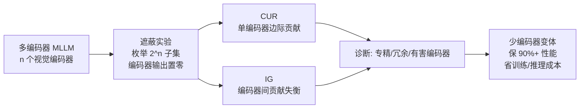

# Investigating Redundancy in Multimodal Large Language Models with Multiple Vision Encoders

**会议**: ICLR 2026  
**OpenReview**: [https://openreview.net/forum?id=cAopJVLKvi](https://openreview.net/forum?id=cAopJVLKvi)  
**代码**: [https://github.com/MaoSong2022/Encoder-Redundancy](https://github.com/MaoSong2022/Encoder-Redundancy)  
**领域**: 多模态大模型 / 视觉编码器架构分析  
**关键词**: 多视觉编码器, 编码器冗余, MLLM 效率, 条件利用率(CUR), 信息差(IG)  

## 一句话总结
通过系统性地遮蔽（mask）多编码器 MLLM 中的各个视觉编码器，本文揭示「编码器越多越好」其实是个伪命题，并提出 CUR 与 IG 两个指标量化每个编码器的边际贡献与冗余程度，证明多数任务用 1–2 个编码器就能保住 90%+ 性能、同时大幅省训练与推理成本。

## 研究背景与动机
- **领域现状**：近年的多模态大模型（MLLM）流行把多个视觉编码器拼在一起——CLIP/SigLIP 管全局语义、SAM/DINO 管像素级细节、ConvNext/Pix2Struct 管 OCR 结构——直觉上「不同预训练目标的编码器提供互补信号」，于是 Eagle、Cambrian-1、SPHINX 等纷纷堆到 4–5 个编码器。
- **现有痛点**：大量研究精力花在设计复杂的融合机制（channel concat、cross-attention、SVA）上，但「每个编码器到底提供了多少**独有、不可替代**的信息」这个根本问题几乎无人系统回答。Eagle、Mousi 等虽零星提到「收益递减」，却缺一套可量化、可诊断的框架。
- **核心矛盾**：多编码器在带来潜在互补信息的同时，也引入了**噪声、冲突信号和冗余**——融合困难、被无关信号分散注意力、白白消耗算力。即「更多编码器 ≠ 更好」可能成立，但没人量化过它有多严重、在什么任务上最严重。
- **本文目标**：第一次系统、定量地确认多编码器 MLLM 中的编码器冗余，并给出可操作的诊断工具，指导更高效的多模态架构设计。
- **核心 idea**：**[诊断式分析]** 不发明新模型，而是通过「编码器遮蔽 + 两个原则性指标（CUR、IG）」把冗余现象量化出来，证明遮掉某些编码器不仅不掉点、有时反而涨点。

## 方法详解

### 整体框架
本文针对主流「ViT-adapter-LLM」架构的多编码器 MLLM 做分析：给定图像 $I$ 和文本 $T$，输出为 $Y = \text{LLM}(\text{proj}(\text{fusion}(E_1(I),\cdots,E_n(I)), T))$。分析分两步——先通过**遮蔽实验**（把某编码器输出替换为同形状零张量）观察性能如何随被遮编码器数量变化，再用 **CUR** 和 **IG** 两个指标把「单个编码器的边际贡献」与「编码器之间的贡献失衡」量化出来，最终落到「用更少编码器复现性能」的效率结论。

### 关键设计

**1. 条件利用率 CUR：在「其他编码器都在场」的前提下衡量某编码器的独有贡献。** 一个编码器到底有没有用，不能孤立地看它单独能干啥，而要看「把它从完整集合里抽掉后掉了多少点」。本文定义编码器 $E_i$ 的条件利用率为 $u(E_i) = \dfrac{\text{acc}(f_{E_n}) - \text{acc}(f_{E_n\setminus\{E_i\}})}{\text{acc}(f_{E_n})}$，即遮掉 $E_i$ 后相对准确率的下降比例。由于 $\text{acc}(\cdot)\in[0,1]$，所以 $u(E_i)\in(-\infty, 1]$：**正值大**说明该编码器贡献了别人替代不了的独有信息；**接近 0** 说明它的信息已被其他编码器覆盖、纯属冗余；**负值**则说明它反而有害——引入了融合机制摆不平的冲突或噪声信号。这个「条件」二字是精髓，它衡量的是边际贡献而非孤立能力，所以能直接暴露「拼上去却没用」的编码器。

**2. 信息差 IG：用 CUR 的极差刻画一个编码器集合内部的贡献失衡。** 单看 CUR 只能评价单个编码器，本文进一步定义信息差 $\Delta_{\text{gap}}(E_n) := \max_i u(E_i) - \min_j u(E_j)$，即集合内最高与最低 CUR 之差。$\Delta_{\text{gap}}$ 小代表各编码器贡献均衡、配置合理；$\Delta_{\text{gap}}$ 大则代表严重失衡——某个编码器不可或缺，其余则冗余甚至有害。失衡本身就是低效的信号：那些低贡献编码器白白抬高了算力与架构复杂度却换不来性能。实验也证实，编码器超过 2 个的模型 IG 普遍更大（如 Eagle-X4 8B Plus 整体 IG 高达 70.27%），且在 OCR & Chart、Vision-Centric 这类「单一编码器主导」的任务上 IG 尤其突出。

**3. 注意力 KL 散度溯因：从 LLM 注意力分布层面解释「为什么某编码器主导」。** CUR/IG 给出了「谁主导」的结论，但本文还想知道这种主导在模型内部如何体现。做法是在 MME 上分别只激活单个编码器（$n=1$），抽取 LLM 最后一层对视觉 token 的注意力分布，再用完整模型作基准计算两者的 KL 散度——**KL 越小说明该单编码器越接近完整模型的注意力模式**，即它就是主导贡献者。结果在 Eagle 系列里 EVA-02 的 KL 最低（0.98），在 Cambrian-1 里 ConvNext 的 KL 最低，与 CUR 结论高度吻合；而 Eagle-X4 8B Plus 上 ConvNext 和 SAM 出现「无穷大 KL」，说明单独跑时它们把注意力质量全压在了完整模型根本不看的位置上，进一步坐实「EVA-02 主导、其余近乎无效」。

## 实验关键数据

### 主实验：少编码器复现性能（Table 3）

| 模型 | 编码器数 | General | Knowledge | OCR & Chart | Vision-Centric | Overall |
|------|---------|---------|-----------|-------------|----------------|---------|
| Eagle-X5 7B | 5 | 70.77 | 54.79 | 66.60 | 67.55 | 64.93 |
| –X3 (留 012) | 3 | 69.87 | 53.64 | 66.02 | 67.29 | 64.20 ↓1.1% |
| –X2 (留 01) | 2 | 69.04 | 52.77 | 62.04 | 66.05 | 62.48 ↓3.8% |
| –X1 (留 0) | 1 | 64.60 | 47.70 | **10.68 ↓84%** | 62.83 | 46.45 ↓28% |
| Eagle-X4 8B Plus | 4 | 66.49 | 61.88 | 71.92 | 70.62 | 67.73 |
| –X2 (留 01) | 2 | 67.28 ↑1% | 59.83 | 70.57 | 69.60 | 66.82 ↓1.1% |

**要点**：遮掉 2 个编码器，Eagle 仅掉 1% 左右；非 OCR 任务上单编码器变体仍能保住完整模型 90%+ 性能。唯独 OCR & Chart 高度依赖特定编码器（只留 1 个时崩到 10.68），加回 ConvNext 即可基本恢复。

### 信息差对比（Table 1，节选）

| 模型 | n | OCR & Chart IG | Overall IG |
|------|---|----------------|------------|
| Eagle-X4 8B Plus | 4 | 92.89% | 70.27% |
| Cambrian-1 13B | 4 | 76.22% | 27.82% |
| DeepSeek-VL 7B | 2 | 0.51% | 1.15% |

编码器越多、IG 越大、冗余越严重；2 编码器的 DeepSeek-VL 几乎均衡。

### 关键发现
- **遮蔽反而涨点**：Cambrian-1 8B 用 3 编码器子集比完整模型高 3.5%；某任务类别遮特定编码器可涨 16%，整体可涨 3.6%。
- **强专精**：OCR & Chart 上单编码器 CUR 可 >90%（Eagle-X4 8B Plus 的 EVA-02 达 92.89%）。
- **有害编码器**：Cambrian-1 8B 的 SigLIP 在 Vision-Centric 上 CUR = −16%，拖后腿。
- **效率收益**：Eagle-X5 7B → 双编码器 Eagle-X2 7B，训练时间降 34%、推理延迟降 19.5%、视觉 FLOPs 降至 61.4%（总 FLOPs 降 ~12.1%），整体性能仍保 96%+，平均掉点 <4%。
- **编码器大小≠贡献**：304M 的 EVA-02 在 Eagle-X4 8B Plus 里碾压 1.2B 的 Pix2Struct；同为对比学习预训练的 ConvNext/CLIP/SigLIP 贡献也差异巨大。

## 亮点与洞察
- **挑战默认假设**：用扎实的遮蔽实验把「more encoders are better」这个被广泛默认的启发式直接证伪，是少见的「反向澄清」型研究。
- **指标可操作、模型无关**：CUR/IG 只需要「遮蔽 + 跑 benchmark」，不依赖特定融合机制，可直接迁移到任意多编码器 MLLM 作为架构诊断工具。
- **从现象到机理闭环**：不止报告「冗余存在」，还用注意力 KL 散度从 LLM 内部解释「主导编码器」如何形成，结论自洽。
- **效率落地清晰**：把冗余分析直接换算成 GPU 小时、延迟、FLOPs 的真实节省，对工业界裁剪模型有直接指导价值。

## 局限与展望
- **遮蔽=置零的近似性**：把编码器输出替换为零张量是一种粗暴干预，可能与「该编码器从未参与训练」的真实反事实有差距，零张量本身也可能给融合层带来分布外输入。
- **只覆盖 concat / SVA 两类融合**：结论主要基于 Eagle（channel concat）和 Cambrian-1（cross-attention SVA），更复杂的 MoE 路由 / token 选择类架构是否同样冗余仍需验证。
- **benchmark 分类依赖 Cambrian-1 的四分法**：CUR/IG 的任务级结论与这套粗粒度分类强绑定，更细任务上的编码器专精图景可能不同。
- **展望**：把 CUR/IG 从「事后诊断」推进到「训练时正则 / 架构搜索目标」，让模型在训练阶段就自动剔除冗余编码器，是自然的下一步。

## 相关工作与启发
- **多编码器 MLLM**：DeepSeek-VL（SigLIP+SAM）、Mini-Gemini、CogAgent、SPHINX、Cambrian-1（最多 4 编码器）等是本文的分析对象；CoMM 发现 CLIP+DINO 强、MAE+DeiT 弱，与本文「同目标预训练贡献也差异大」呼应。
- **视觉 token / 专家选择**：MoVA、MOVE、Mixpert 走「路由到最合适编码器」，LEO-MINI 走「query-aware token 压缩」，它们都隐含假设「集成编码器天然互补」——而本文恰恰挑战了这一前提，指出这些选择策略并未从根本上量化或解决冗余。
- **启发**：在堆叠任何「多专家/多模块」结构前，先用类似 CUR/IG 的边际贡献指标做一次冗余体检，可能比设计更花哨的融合机制更值钱。

## 评分
- **新颖性**: ⭐⭐⭐⭐ 不是新模型，而是第一个把多编码器冗余系统量化的诊断框架，CUR/IG 简洁且模型无关，视角有原创性。
- **实验充分度**: ⭐⭐⭐⭐ 覆盖 Eagle/Cambrian-1/I-MoF/DeepSeek-VL 多架构、四类任务、$2^n$ 全子集遮蔽，并补了注意力 KL、FLOPs、延迟、GPU 小时等多维度证据。
- **写作质量**: ⭐⭐⭐⭐ 指标定义清晰、结论层层递进（现象→量化→溯因→效率），图表充分。
- **价值**: ⭐⭐⭐⭐ 直接证伪流行启发式并给出可落地的裁剪指南，对多模态架构设计与模型效率优化有实用价值。

<!-- RELATED:START -->

## 相关论文

- [\[ICLR 2026\] Efficient Discriminative Joint Encoders for Large Scale Vision-Language Re-ranking](efficient_discriminative_joint_encoders_for_large_scale_vision-language_rerankin.md)
- [\[ICML 2026\] Referring Multiple Regions with Large Multimodal Models via Contextual Latent Steering](../../ICML2026/multimodal_vlm/referring_multiple_regions_with_large_multimodal_models_via_contextual_latent_st.md)
- [\[ICLR 2026\] Multimodal Prompt Optimization: Why Not Leverage Multiple Modalities for MLLMs](multimodal_prompt_optimization_why_not_leverage_multiple_modalities_for_mllms.md)
- [\[ICLR 2026\] GranViT: A Fine-Grained Vision Model For Autoregressive Multimodal Large Language Models](granvit_a_fine-grained_vision_model_for_autoregressive_multimodal_large_language.md)
- [\[CVPR 2026\] Unified Multimodal Models as Auto-Encoders](../../CVPR2026/multimodal_vlm/unified_multimodal_models_as_auto-encoders.md)

<!-- RELATED:END -->
