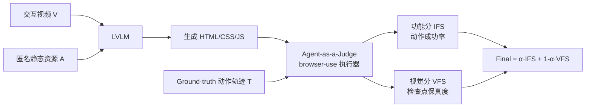

# IWR-Bench: Can LVLMs Reconstruct Interactive Webpage from a User Interaction Video?

**会议**: ICLR 2026  
**OpenReview**: [https://openreview.net/forum?id=1zOp2WPMdZ](https://openreview.net/forum?id=1zOp2WPMdZ)  
**代码**: 待开源（论文承诺公开 benchmark 与评测代码）  
**领域**: 多模态 / 视觉-语言模型评测（Video-to-Code）  
**关键词**: LVLM 评测, 网页重建, 视频理解, 交互式代码生成, Agent-as-a-Judge  

## 一句话总结
提出 IWR-Bench——首个让大型视觉-语言模型（LVLM）从「用户交互视频 + 完整静态资源」重建出**可交互**网页的基准，用 agent-as-a-judge 协议同时考核功能正确性与视觉保真度，28 个模型的实验揭示最强模型也只有 36.35 分、功能分（IFS 24.39%）远落后于视觉分（VFS 64.25%）。

## 研究背景与动机
**领域现状**：把网页截图翻译成 HTML 代码（screenshot-to-code）已是 LVLM 的成熟能力，Design2Code、WebSight 等基准在静态重建上让模型表现得相当不错；少数工作（如 Interaction2Code）开始触碰交互，但只用「前后两张图」建模单步、无状态的事件。

**现有痛点**：真实网页应用的本质是**连续、有状态的工作流**——点开搜索结果、输入评论、点星打分、玩 2048 这类带游戏逻辑的页面。现有基准存在三重缺陷：(1) 只评静态布局，回避了时序动态；(2) 为简化任务**故意删掉静态资源**（图片、图标、视频），与真实开发情境脱节；(3) 评测靠像素相似度，根本无法衡量「点了按钮有没有正确响应」这类功能正确性。

**核心矛盾**：模型「能处理视频/多图」的输入能力，和「交互式网页生成」的基准之间存在断层——没人系统问过：**LVLM 能否仅凭观看一段用户操作视频，就还原出网页的动态交互功能？**

**本文目标**：把这个问题形式化为 Interactive Webpage Reconstruction（IWR）任务，并造一个覆盖多样交互、提供真实完整资源、评测协议能真正执行交互的基准。

**核心 idea**：**用「交互视频 + 全量原始资源」当输入，用「能在浏览器里真跑动作序列的 agent」当裁判**——既逼模型从时序视觉证据里推断交互逻辑，又用程序化执行而非像素比对来判定功能对不对。

## 方法详解

### 整体框架
IWR-Bench 把一个任务拆成四件套：一段记录完整有状态操作流的**交互视频** $V=\{f_1,...,f_n\}$、一组（文件名匿名化的）**静态资源** $A=\{a_1,...,a_m\}$、一条结构化的**动作轨迹** $T=\{(a_i,p_i,d_i,v_i,l_i)\}$、以及每个关键动作后的**稳态检查点截图** $S$。模型要从 $V$ 和 $A$ 生成一份自包含的 HTML（含 CSS/JS）$C$；随后一个基于 browser-use 的确定性执行器扮演裁判，逐步重放轨迹 $T$，用 IFS 量功能、VFS 量视觉，加权成最终分。

### 关键设计

**1. 用「真实视频 + 完整资源 + 匿名文件名」逼出真推理而非套路。** 113 个任务全部源自 100 个真实网站（从 200 候选经去重、按领域/视觉复杂度/交互逻辑三轴平衡，再交叉核验筛到 113），每个任务都配齐爬下来的图片、图标、嵌入视频等全量静态资源——这正是以往基准为省事而删掉的部分。关键的一招是**把资源文件名全部匿名化**（`logo.png` → `asset_001.png`），切断模型靠语义文件名作弊的捷径，强迫它做真正的「视觉元素↔静态资源」匹配。同时三轴 taxonomy 把交互逻辑从 L1 静态展示、L2 简单状态、L3 复杂工作流到 L4 算法/游戏逻辑分层，使难度可解释。

**2. Agent-as-a-Judge 的程序化执行协议，把「功能对不对」从像素比对里解放出来。** 裁判不是看图打分，而是用 browser-use 在渲染出的页面上**逐个真实执行** ground-truth 动作 $a_i$。一个动作被判失败有两种情形：操作上不可行（目标元素找不到），或它附带的逻辑断言 $l_i$ 不满足（如「应出现『评分更新成功：9/10』」）。断言由 Gemini-2.5-Pro 作为 MLLM 裁判对比动作前后截图来判定。这种设计把评测隔离在「代码执行」层面、剥离了高层任务规划的干扰，保证可复现。动作成功后才抓新截图、才进入视觉评估，避免在过渡态上误判。

**3. IFS / VFS 双指标 + 加权 Final，刻意让功能权重压过视觉。** 功能分直接是成功动作占比 $\text{IFS}=N_{succ}/N_{total}$。视觉分只在「成功到达且需视觉评估（$v_i=\text{true}$）」的检查点上算，每个检查点融合低层视觉分 $S_{LVS}$（OCR 的 Levenshtein 相似度 + DINO 余弦相似度的均值）与高层视觉分 $S_{HVS}$（MLLM 整体评估），权重 $w=0.5$：
$$\text{VFS}=\frac{1}{|I_{v,succ}|}\sum_{i\in I_{v,succ}}\big(w\cdot S_{LVS,i}+(1-w)\cdot S_{HVS,i}\big)$$
最终分把两者按 $\alpha=0.7$ 加权：
$$\text{Final Score}=\alpha\cdot\text{IFS}+(1-\alpha)\cdot\text{VFS}$$
作者特意给 IFS 大权重，让「到不了的状态」对总分的惩罚被恰当反映——因为执行不了的步骤根本没图算视觉分。$w$ 和 $\alpha$ 都经过人类对齐研究确定。

## 实验关键数据

### 主实验表格（28 个 LVLM，节选代表）

| 模型 | LVS | HVS | VFS | IFS | Final |
|------|-----|-----|-----|-----|-------|
| GPT-5 | 68.29 | 60.21 | **64.25** | **24.39** | **36.35** |
| Claude-Sonnet-4 (thinking) | 64.90 | 55.51 | 60.20 | 23.65 | 34.62 |
| Claude-Opus-4 (thinking) | 63.53 | 53.80 | 58.67 | 23.61 | 34.13 |
| Doubao-seed-1.6 | 65.95 | 55.62 | 60.79 | 22.55 | 34.02 |
| Claude-Sonnet-4 | 65.75 | 56.92 | 61.34 | 22.29 | 34.00 |
| GPT-4o (latest) | 63.39 | 51.71 | 57.55 | 17.55 | 29.55 |
| Qwen3-VL (thinking)（最强开源） | 58.55 | 46.13 | 52.34 | 22.07 | 31.15 |
| Qwen2.5-VL-72B | 47.83 | 28.25 | 38.04 | 17.42 | 23.61 |
| VideoLLaMA3-7B（视频专用） | 31.29 | 11.86 | 21.58 | 10.29 | 13.67 |
| InternVideo-2.5-Chat-8B（视频专用） | 17.27 | 3.33 | 10.30 | 9.97 | 10.07 |

- 明显的性能分层：闭源 MLLM > 顶尖开源（Qwen3-VL）> 中低端开源 > 视频专用模型。说明**通用多模态推理 + 代码生成能力比专门的视频处理架构更关键**。
- 最强模型 Final 仅 36.35，所有模型 IFS 都不超过 25——交互式网页重建基本是个**未解问题**。

### 消融 / 验证（评测协议有效性）

| 验证项 | 设置 | 结论 |
|--------|------|------|
| 权重 $w,\alpha$ | 人类对齐研究 | $w=0.5$、$\alpha=0.7$ 最贴合人判；按成功步比例加权的替代方案区分度差 |
| Agent 裁判可靠性 | 3 名博士生在 100 个生成页面上关闭 headless 人工核对 | 仅 3 例评测失败，均因元素描述歧义（同名按钮），修正定位符后解决 |
| 断言验证 | Gemini-2.5-Pro 对比动作前后截图 | 自动核验逻辑断言准确性 |

### 关键发现
- **功能是主要瓶颈，不是视觉**：VFS 普遍远高于 IFS（GPT-5：64.25 vs 24.39）。模型能复刻静态布局，但合成事件驱动逻辑的能力严重欠缺。
- **静态→交互断崖**：从 L1 静态展示到 L2–L4 交互任务性能急剧下滑；高度结构化布局也让模型吃力。
- **推理增强收益稳定但有限**：thinking 变体普遍小幅提升（Claude-Sonnet-4：34.62 vs 34.00），但**基座能力才决定性能天花板**。
- 数据规模：113 视频、平均 35.4 秒、共 1001 个动作（620 需视觉评估、403 含断言）、平均每视频 8.9 个动作、10.62% 针对移动端。

## 亮点与洞察
- **把「无状态单步」升级为「有状态全轨迹」**：抓住了真实网页交互的本质——连续、带状态转移的工作流，而非孤立事件，这是相对 Interaction2Code 等前作最实质的进步。
- **反作弊设计很到位**：匿名化资源文件名这一细节，直接堵死了模型靠语义先验「猜」的捷径，使基准真正考验视觉-资源 grounding。
- **可执行的评测协议**：用 browser-use 真跑动作 + 逻辑断言，让「功能正确性」第一次成为可量化、可复现的指标，而非靠像素相似度的代理量。
- **诊断价值清晰**：VFS↔IFS 的巨大落差给社区指了明路——下一步不在视觉理解，而在时序推理、动态资源绑定、事件逻辑合成。

## 局限与展望
- **规模偏小**：113 个任务对一个 benchmark 而言数量有限，子维度（如 L4 游戏类仅 10.62%）样本更稀疏，统计结论的稳健性受限。
- **重度依赖 Gemini-2.5-Pro 当裁判**：逻辑断言和高层视觉分都由它判定，裁判模型本身的偏差/能力上限会传导到所有被测模型的分数上，存在「裁判即天花板」的隐忧。
- **视频采样妥协**：为兼容无原生视频能力的模型，视频按 1fps 采样、上限 64 帧，长视频被下采样，可能丢失关键的快速交互瞬间。
- **未来方向**：作者点名时序推理、动态资源绑定、鲁棒代码合成三条路；可进一步扩大规模、引入更细粒度的过程奖励或交互式 agent 范式来缩小 IFS 差距。

## 相关工作与启发
- **静态网页重建**：Pix2Code、WebSight、Design2Code、CC-HARD、ScreenCoder——都是 image-to-code，且大多删资源、合成数据。
- **交互式前作**：Interaction2Code 用图像对建模单步交互，但无状态、删资源，IWR-Bench 正是对它的关键补全。
- **视频理解基准**：MMBench-Video、MVBench、Video-MME、Video-MMMU——做 Video QA 而非代码生成，与本任务正交。
- **Agent-as-a-Judge / MLLM 裁判**：借鉴 Zhuge et al. 2024 的 agent 裁判范式与 MLLM-as-judge 思路，把它落到「真实执行网页交互」的可验证场景。
- **启发**：对做「多模态 → 可执行产物」（代码、UI、动作）的工作，本文示范了如何**把评测从相似度代理升级为程序化执行验证**，这套思路可迁移到 GUI agent、自动化前端生成等任务。

## 评分
- **新颖性**: ⭐⭐⭐⭐ — 首个 video-to-interactive-code 基准，「全轨迹有状态 + 完整真实资源 + 匿名反作弊 + agent 真执行」的组合是实打实的空白填补。
- **实验充分度**: ⭐⭐⭐⭐ — 28 个跨闭源/开源/视频专用的模型横评，配人类对齐与裁判可靠性验证，分析维度全面；扣分在任务规模偏小、部分子类样本稀疏。
- **写作质量**: ⭐⭐⭐⭐ — 问题动机层层递进，任务定义/指标公式清晰，图表组织得当，易读。
- **价值**: ⭐⭐⭐⭐ — 精准定位了「视觉会、逻辑不会」这一当前 LVLM 的真实短板，为前端自动化与多模态代码生成提供了高区分度的硬骨头基准，社区价值高。

<!-- RELATED:START -->

## 相关论文

- [\[CVPR 2026\] Interactive Episodic Memory with User Feedback](../../CVPR2026/multimodal_vlm/interactive_episodic_memory_with_user_feedback.md)
- [\[ICLR 2026\] ODI-Bench: Can MLLMs Understand Immersive Omnidirectional Environments?](odi-bench_can_mllms_understand_immersive_omnidirectional_environments.md)
- [\[ICLR 2026\] MMDuet2: Enhancing Proactive Interaction of Video MLLMs with Multi-Turn Reinforcement Learning](mmduet2_enhancing_proactive_interaction_of_video_mllms_with_multi-turn_reinforce.md)
- [\[ICLR 2026\] SpatialViz-Bench：一个认知科学驱动、用于诊断 MLLM 空间可视化能力的基准](spatialviz-bench_a_cognitively-grounded_benchmark_for_diagnosing_spatial_visuali.md)
- [\[CVPR 2026\] HAVE-Bench: Hierarchical Audio-Visual Evaluation from Perception to Interaction](../../CVPR2026/multimodal_vlm/have-bench_hierarchical_audio-visual_evaluation_from_perception_to_interaction.md)

<!-- RELATED:END -->
