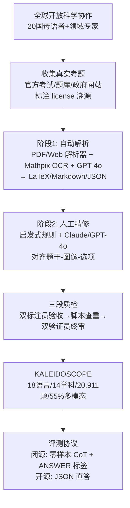

# Kaleidoscope: In-language Exams for Massively Multilingual Vision Evaluation

**会议**: ICLR 2026  
**OpenReview**: [https://openreview.net/forum?id=zCYXhSy9UH](https://openreview.net/forum?id=zCYXhSy9UH)  
**代码/数据**: 待确认  
**领域**: 多模态 / 视觉语言模型评测  
**关键词**: 多语言, 多模态, VLM 评测, in-language 考试, 文化包容性, MCQA  

## 一句话总结
KALEIDOSCOPE 通过全球开放科学协作，手工收集 18 种语言、14 个学科、共 20,911 道真实考试多选题（55% 需看图），构建出迄今最大的"原生语言（in-language）"多语言多模态 VLM 评测基准，揭示出当前 VLM 在低资源语言、多模态推理和 STEM 学科上的系统性短板。

## 研究背景与动机
**领域现状**：VLM 的能力评测长期被英语、西方中心的基准主导。文本侧的多语言评测近年虽有扩展，多模态基准也开始成型，但二者交叉处——既多语言又多模态的可靠评测——仍然稀缺。

**现有痛点**：最常见的"省事"做法是把英语基准翻译成其他语言，但这有两个根本缺陷：(1) 翻译无法承载文化语境与本地知识，反而把西方中心的假设固化进去；(2) 自动化数据管线会放大"翻译腔"（translationese）等噪声，污染评测信号。真正反映各地区文化与知识的"原生语言"基准始终缺位。

**核心矛盾**：前沿生成模型正快速向多模态、多语言扩张，宣称要表征一个更丰富多元的世界，但用来衡量它们的尺子却仍然单语、单文化——能力声明与评测覆盖之间存在系统性错位。

**本文目标**：构建一个大规模、原生语言、多模态、文化真实的考试型基准，像人类在世界各地参加考试那样去考 VLM，从而诊断模型在语言、模态、学科三个维度上的真实差距。

**核心 idea**：**[原生语言 in-language 考试题]** 不做翻译，而是直接从各国官方考试、题库、政府网站等公开渠道，由母语者与领域专家手工收集真实考题，保留原始语言与文化语境；**[全球开放科学协作]** 借助横跨 20 国、四大洲的开放科学社区贡献者来保证语言学与文化真实性；**[图文绑定的 MCQA]** 用 4 选 1 多选题这一贴近真实人类测试的统一格式，并要求 55% 的题目必须理解图像才能作答，从而把"视觉接地推理"作为核心考点。

## 方法详解

### 整体框架
KALEIDOSCOPE 不是一个模型而是一个"基准 + 评测协议"。其构建管线分三段：先由全球社区按统一规范**收集**真实考题，再经**自动解析 + 人工精修**的两阶段处理把 PDF/网页/扫描件转成结构化图文 JSON，最后通过**三道人工质检关卡**把关；评测端则对开放权重与闭源 VLM 分别设计 CoT / 直答两套协议，统一用准确率打分。

### 关键设计
**1. 三大设计原则锚定数据：多模态、多语言、多样性** 基准从一开始就用三条原则约束选题——多模态性要求图像处于核心地位（最终 11,459/20,911 题、即 55% 必须看图才能作答，且图像类型多样，涵盖图表、照片、地图、公式、表格等），并配上相当比例的纯文本题作为对照；多语言性聚焦中低资源语言（尼泊尔语、立陶宛语、孟加拉语、泰卢固语等）与高资源语言（英、西、葡、俄、法、德、阿拉伯、印地、荷兰语）并存，覆盖 8 大语系；多样性则跨越数学、社会学、医学乃至驾照考试等 14 个学科、6 大领域，并记录国别与教育层级（高中/大学入学/职业资格），保证后续可做细粒度聚类分析。各语言题量从尼泊尔语的 126 题到葡萄牙语/塞尔维亚语/波斯语的 2000 题不等。

**2. 两阶段标注管线：自动解析 + 人工精修** 收集到的考题源格式杂乱（PDF、网页、扫描图），处理分两步。第一步自动解析与抽取：可直接解析的文本走 PDF/Web 解析器，不可解析的走 OCR API（如 Mathpix）配合 GPT-4o 等 VLM，把文字与图像元素抽出并转成 LaTeX / Markdown / JSON 结构化输出。但自动解析常出现图文错位，于是第二步用启发式规则加高性能 LLM（Claude 3.5 Sonnet、GPT-4o）重构输出，确保题干、文本、选项正确对齐，再由人工核验图像是否绑定到对应题目、抽取的公式是否符合预期格式。每道题包含 17 个字段（源国别、语言、license、教育层级、类别、图像类型等），学科同时用英文与源语言标注。

**3. 三段式人工质检 + 评测期失败模式回查** 大规模国际协作最大的风险是质量参差，作者在管线里埋了三道人工关卡：收集阶段结束时两名独立标注员验收每份考卷（含 license 合规严审，仅双方都通过才入库）；标注后用验证脚本查 JSON 格式错误、重复与畸形字符串；合并入库前再由两名独立验证员做最终人工复审。质检还延伸到评测期——推理时若出现含糊答案、空响应或跨模型一致失败等可疑输出，会被标记人工复查，一旦确认有问题就回查并修正/移除整份考卷所在的题目，形成"评测反哺数据清洗"的闭环。

**4. 开源/闭源分轨的评测协议** 不同体量 VLM 的指令遵循与推理能力差异巨大，强行统一协议会失真。作者据此分轨：闭源模型用零样本 Chain-of-Thought，要求逐步推理后把最终答案放进 `<ANSWER></ANSWER>` 标签，且指令翻译成各评测语言做到完全 in-language；开源小模型在预实验中 CoT 收效有限，于是改用直答，强制输出 `{'choice': ...}` 的 JSON 结构以减少推理与格式错误，指令统一用英文。主指标为准确率，并额外报告"格式错误率"（F.E.，无效响应占比）与"有效答案准确率"（Valid Acc.，剔除无效响应后）以区分"答错"与"格式没遵守"。

## 实验关键数据

### 主实验表格（宏平均准确率 %，各语言等权）

| 模型 | Overall Acc. | F.E. | Multimodal Acc. | Text-only Acc. |
|---|---|---|---|---|
| Claude 3.5 Sonnet | **62.91** | 1.78 | **55.63** | 73.54 |
| Gemini 1.5 Pro | 62.10 | 1.62 | 55.01 | 72.35 |
| GPT-4o | 58.32 | 6.52 | 49.80 | 71.40 |
| Qwen2.5-VL-72B | 52.94 | 0.02 | 48.40 | 60.00 |
| Qwen2.5-VL-32B | 48.21 | 0.88 | 44.90 | 53.77 |
| Qwen2.5-VL-7B | 39.56 | 0.08 | 36.85 | 43.91 |
| Aya-Vision-32B | 39.27 | 1.05 | 35.74 | 44.73 |
| Aya-Vision-8B | 35.09 | 0.07 | 32.35 | 39.27 |
| Qwen2.5-VL-3B | 35.56 | 0.19 | 33.67 | 38.51 |
| Molmo-7B-D | 32.87 | 0.04 | 31.43 | 35.12 |
| Pangea-7B | 31.31 | 7.42 | 27.15 | 37.84 |

闭源模型领跑（Claude/Gemini ~62%），但即便最强模型 Overall 也仅 63%，离"做对人类考题"差距巨大；GPT-4o 受多模态高格式错误率（10.5%）拖累，剔除无效后 Valid Acc. 明显回升。开源阵营 Qwen2.5-VL-72B 最强（52.94%）。

### 消融/分项分析表格（按图像类型的有效准确率 %）

| 模型 | Diagram | Figure | Graph | Map | Photo | Formula | Table | Text |
|---|---|---|---|---|---|---|---|---|
| Claude 3.5 Sonnet | 62.9 | 50.5 | 74.2 | 80.1 | 77.8 | 52.1 | 75.0 | 85.2 |
| Gemini 1.5 Pro | 59.4 | 51.3 | 67.9 | 69.4 | 75.8 | 68.3 | 76.0 | 85.2 |
| GPT-4o | 59.6 | 48.2 | 68.4 | 78.8 | **81.5** | 64.4 | **76.5** | 86.2 |
| Qwen2.5-VL-72B | 51.1 | 43.9 | 59.4 | 66.1 | 70.5 | 48.7 | 61.5 | 86.0 |

模型在表格（76.5%）、照片（81.5%）上表现好，但在图示/示意图（diagram 62.9%）这类需要抽象视觉推理的类型上明显掉链子。

### 关键发现
- **模态差距**：所有模型纯文本都显著优于多模态；模型越大差距越宽——GPT-4o 文本与多模态相差 21.6%，而小模型 Molmo 仅差 3.69%（开源小模型更"均衡"但整体低）。
- **学科差距**：人文社科平均准确率 83.7%，STEM 仅 59.2%（各模型最佳分）。说明模型能识别视觉内容并检索相关知识，但缺乏 STEM 所需的推理链。
- **跨语言差距**：高资源语言表现好，中低资源差；拉丁字母脚本语言普遍优于非拉丁脚本，暗示跨语言迁移在起作用。

## 亮点与洞察
- **"考试"作为评测范式**：用世界各地真实考题（含驾照、职业资格、大学入学）来考 VLM，天然带有人类难度刻度、文化语境和图文绑定的推理需求，比图像描述类任务更能逼出模型短板。
- **in-language 而非 translation**：坚持原生语言收集，直击翻译型多语言基准"西方中心固化 + 翻译腔污染"的两大顽疾，是方法论层面的关键立场。
- **三维诊断 + 17 字段元数据**：模态 × 学科 × 语言三个正交维度，加上图像类型、教育层级等细粒度元数据，使基准不只是排行榜，更是可做失败归因的诊断工具。
- **评测反哺数据**：把推理期的可疑输出回查机制并入质检闭环，是大规模众包基准里值得借鉴的质量工程实践。

## 局限与展望
- **MCQA 天花板**：4 选 1 多选格式便于自动评分，但有随机猜测基线（25%）且无法考察开放式生成、长链推理与解释能力，对真实"理解"的刻画有限。
- **语言/题量不均衡**：各语言题量从 126 到 2000 差异巨大，低资源语言（如尼泊尔语）样本稀少，其结论的统计可靠性弱于高资源语言。
- **依赖 LLM 参与构建**：解析与精修阶段用了 GPT-4o/Claude，可能把这些模型的偏好或错误引入数据，对同族模型的评测公平性需谨慎。
- **静态基准与污染风险**：考题多取自公开网络，存在被纳入预训练语料、随时间被"刷穿"的风险；需要持续更新与污染检测。
- **展望**：可扩展到更多语系/学科、引入开放式作答与人类对照、并把诊断结果反哺到多语言多模态模型的训练数据配比上。

## 相关工作与启发
- **多语言文本评测**：延续 Global-MMLU、INCLUDE（Romanou et al.）等"in-language、母语者参与"的脉络，并把它从纯文本推进到多模态。
- **多模态基准**：与 MMMU、MMBench、Pangea 的 multilingual 多模态评测互补，但 KALEIDOSCOPE 在"原生考试题 + 文化真实性 + 18 语言规模"上更进一步。
- **启发**：对国内做多语言/多模态模型的团队，启示是评测要走出"翻英语基准"的舒适区；STEM 视觉推理与非拉丁脚本是当前 VLM 最薄弱、也最值得投入训练数据的方向。

## 评分
- **新颖性**: ⭐⭐⭐⭐ 不在模型创新而在评测范式——"原生语言真实考试 + 全球开放科学协作"填补了多语言×多模态交叉评测的真实空白，立场鲜明。
- **实验充分度**: ⭐⭐⭐⭐ 覆盖闭源/开源 11 个模型、模态×学科×语言×图像类型多维拆解，诊断充分；唯低资源语言样本不均、缺开放式作答评测。
- **写作质量**: ⭐⭐⭐⭐ 动机清晰、管线与质检流程交代细致，图表组织得当。
- **价值**: ⭐⭐⭐⭐⭐ 作为迄今最大的多语言多模态考试基准，对推动文化包容性 VLM 评测有长期社区价值。

<!-- RELATED:START -->

## 相关论文

- [\[ICLR 2026\] IndicVisionBench: Benchmarking Cultural and Multilingual Understanding in VLMs](indicvisionbench_benchmarking_cultural_and_multilingual_understanding_in_vlms.md)
- [\[ICLR 2026\] Massively Multimodal Foundation Models: A Framework for Capturing Interactions with Specialized Mixture-of-Experts](massively_multimodal_foundation_models_a_framework_for_capturing_interactions_wi.md)
- [\[ACL 2025\] Centurio: On Drivers of Multilingual Ability of Large Vision-Language Model](../../ACL2025/multimodal_vlm/centurio_multilingual_vlm.md)
- [\[ICLR 2026\] Human-MME: A Holistic Evaluation Benchmark for Human-Centric Multimodal Large Language Models](human-mme_a_holistic_evaluation_benchmark_for_human-centric_multimodal_large_lan.md)
- [\[ACL 2026\] VIGNETTE: Socially Grounded Bias Evaluation for Vision-Language Models](../../ACL2026/multimodal_vlm/vignette_socially_grounded_bias_evaluation_for_vision-language_models.md)

<!-- RELATED:END -->
