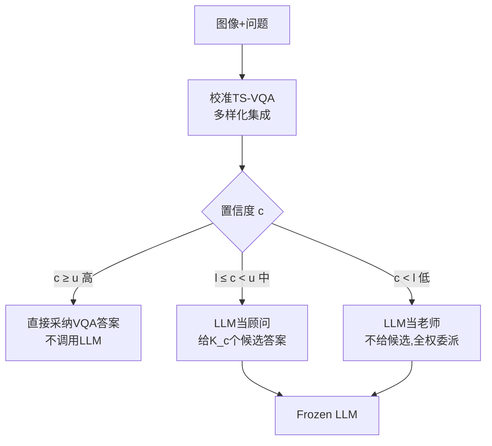

# Knowledge Exchange with Confidence: Cost-Effective LLM Integration for Reliable and Efficient Visual Question Answering

**会议**: ICLR 2026  
**OpenReview**: [https://openreview.net/forum?id=KCj3j5dNSY](https://openreview.net/forum?id=KCj3j5dNSY)  
**代码**: 待确认  
**领域**: 多模态 / 视觉问答 (VQA)  
**关键词**: VQA, LLM-VQA 协作, 置信度校准, 不确定性, 多样化集成, 动态委派  

## 一句话总结
用一个**校准良好的小型 VQA 模型**输出可信的置信度，按高/中/低三档把问题分别交给 VQA 直接回答、让 LLM 借候选答案当"顾问"、或全权委派 LLM 当"老师"，在保持甚至提升精度的同时把昂贵的 LLM 调用次数砍掉一大半。

## 研究背景与动机
- **领域现状**：把大语言模型（LLM）接入视觉问答（VQA）能显著提升精度，因为 LLM 在大规模预训练中积累了丰富的通用知识，VQA 准确率普遍高于专用小模型（TS-VQA）。
- **现有痛点**：全靠 LLM 答题面临三个实际困境——(a) 在专业领域知识上 LLM 反而不如领域数据训练的 TS-VQA；(b) 数十亿参数带来高昂算力、延迟和碳排放，第三方 LLM 还有持续费用和隐私风险；(c) 缺乏可靠量化 LLM 回答不确定性的手段，在高风险场景下可信度存疑。
- **核心矛盾**：并非所有视觉问题都需要 LLM 的全部火力——简单问题 TS-VQA 就能高效搞定。更关键的是，作者实证发现 LLM 与 TS-VQA **能力互补**：即便 TS-VQA 对最终答案没把握，它给出的候选答案分享给 LLM 后能大幅提升 LLM 精度（Fig. 2a）。但用交叉熵训练的标准 VQA 模型**过度自信、校准很差**，错误答案也常给出高置信度，置信度根本不能指示对错——这让"按置信度决策"的整个设想失效。
- **本文目标**：构建一个既准、又可靠、又便宜的混合 VQA 系统，让 LLM 只在真正需要时才介入。
- **核心 idea**：**先把 TS-VQA 校准成置信度可信，再用这个置信度作为"路由器"**——不仅决定何时调用 LLM，还决定何时、如何把 TS-VQA 的专业知识（候选答案）传给 LLM。作者将其命名为 **Uni-VQA**（不确定性感知的 LLM 集成 VQA）。

## 方法详解

### 整体框架
Uni-VQA 分两阶段。**训练阶段**：用"多样化集成"（Diverse Ensemble, DE）方法训练一个校准良好的 TS-VQA，使其置信度真实反映正确概率。**推理阶段**：校准后的 TS-VQA 先给出初始答案和置信度 $c$，再用两个阈值 $l<u$ 把问题路由到三种场景之一——直接采纳、LLM 当顾问、LLM 当老师。

### 关键设计

**1. 多样化集成校准（Diverse Ensemble）：让置信度变得可信。** 整个框架的地基是"置信度可信"，否则路由全是错的。作者用分布鲁棒优化（DRO）训练 $E$ 个互补的 TS-VQA 子模型。每个子模型最小化一个加权损失 $\mathcal{L}_{\text{DRO}}(\Theta)=\sum_n w_n l(x_n,\Theta)$，其中带 KL 正则的 DRO 给出闭式 softmax 权重 $w_n^*(\lambda)=\frac{\exp(l(x_n,\Theta)/\lambda)}{\sum_j \exp(l(x_j,\Theta)/\lambda)}$。超参 $\lambda$ 控制权重偏离均匀的程度：$\lambda$ 小则把注意力压到高损失的难样本上，训出"谨慎、低置信"的模型；$\lambda$ 大则接近均匀，训出对典型样本"自信"的模型。实验取 $E=3$ 个小/中/大 $\lambda$ 的成员，覆盖难度谱。推理时对 logits 取平均 $f_{\text{DE}}(x)=\frac{1}{E}\sum_e f_e(x)$ 再算 softmax——谨慎模型抑制了自信模型的过度乐观，而难样本专家的低置信又被简单样本专家交叉验证，**天然产生校准良好的置信度**：错误答案被压到低置信区，正确答案保持高置信。

**2. 三档置信度引导的知识交换：让 LLM 的角色随把握度变化。** 拿到可信置信度后，框架按两个阈值分三档处理。当 $c\geq u$（高置信，多为 TS-VQA 擅长的专业问题），直接采纳 TS-VQA 答案，**完全不碰 LLM**，省下全部开销；当 $c<l$（低置信，多为需要广博通用知识、超出 TS-VQA 专长的问题），把问题**全权委派 LLM 且不附候选答案**（LLM as Teacher）；当 $l\leq c<u$（中等置信，TS-VQA 有部分知识但不确定），把 TS-VQA 动态选出的候选答案塞进 prompt 交给 LLM（LLM as Consultant），让 LLM 把这些专业线索与自身通用知识融合。这套"按需委派"恰好榨取两类模型的互补优势：简单问题廉价解决，难的通用问题交给 LLM，半懂半不懂的问题通过候选答案做知识交换。

**3. 动态 Top-K 候选选择：候选数量该随置信度自适应。** 作者发现候选答案的有效数量随置信度变化——高置信区给少量候选反而更准，置信度越低越需要更多候选，但在最低置信区给一大堆候选会适得其反（不如不给）。于是对中档问题用学习到的映射决定候选数 $K(c_i)\approx\lceil M e^{-W\left(\frac{c_i-l}{u-l}\right)}\rceil$，其中 $M,W$ 在验证集上学得。这让 prompt 里的候选数随把握度平滑衰减，避免了"一刀切给固定 top-k"的浪费或干扰。

**4. 知识蒸馏加速：把集成压回单模型。** 三模型集成推理仍有额外开销。作者用 KL 散度把多样化集成的输出分布蒸馏进一个同架构的单模型，理论上可同时保住精度与校准，实测 ECE 与精度损失 <0.4%，但延迟最多降 60%，消除了集成的算力负担。

> 理论上作者证明了两点：DE 损失是"交叉熵 − 预测熵"的上界（Lemma 4.1，即在降交叉熵的同时抬高预测熵、抑制过度自信），以及 DE 比 ERM 把更多错误样本推入低置信区（Theorem 4.2，$N^{\text{in},\tau}_{\text{DE}}\geq N^{\text{in},\tau}_{\text{ERM}}$），从而让委派阈值不必设得过高就能把错样本交给 LLM 纠正。

## 实验关键数据

数据集 VQA-v2 与 COCO-QA；TS-VQA 骨干含 Pythia / CLIP-ViL / ViLBERT / VisualBERT / BEiT-3；LLM 用 Frozen Mistral-7B，VLLM 用 LLaVA-1.5 13B。指标：准确率 ACC↑、校准误差 ECE↓、LLM 委派比例↓、平均延迟↓。

### 主实验表格（VQA-v2，节选）

| 方法 | ACC↑ | ECE↓ | LLM-Deleg%↓ | Latency↓ |
|---|---|---|---|---|
| LLM-only (Mistral-7B) | 69.09 | 0.31 | 100 | 0.534 |
| Pythia 标准 VQA | 65.67 | 0.14 | – | 0.003 |
| Pythia Calibrated (Ours) | 66.15 | 0.06 | – | 0.009 |
| **Pythia Uni-VQA (Ours)** | **71.00** | **0.05** | 78.77 | 0.426 |
| CLIP-ViL 标准 VQA | 69.95 | 0.18 | – | 0.023 |
| **CLIP-ViL Uni-VQA (Ours)** | **72.98** | **0.07** | 69.86 | 0.440 |
| VisualBERT 标准 VQA | 64.92 | 0.14 | – | 0.009 |
| **VisualBERT Uni-VQA (Ours)** | **70.95** | **0.08** | 77.87 | 0.440 |
| BEiT-3 标准 VQA | 73.19 | 0.14 | – | 0.009 |
| **BEiT-3 Uni-VQA (Ours)** | **74.33** | **0.07** | 35.91 | 0.217 |

Uni-VQA 在全部骨干上都同时超过单用 LLM 与单用 TS-VQA，且 Calibrated 把 ECE 从 ~0.14–0.18 压到 ~0.02–0.08 而不掉精度。

### 消融 / 效率表格（匹配同等精度所需委派比例，VQA-v2）

| 骨干 | 目标 ACC | LLM-VQA | LLM-VectorScale | **Uni-VQA** |
|---|---|---|---|---|
| Pythia | 70.07 | 64.38 | 66.11 | **50.06 (−14~16%)** |
| CLIP-ViL | 71.5 | 35.5 | 40.56 | **24.4 (−11~13%)** |
| ViLBERT | 70.25 | 51.03 | 60.86 | **41.06 (−10~20%)** |
| VisualBERT | 69.75 | 64.01 | 66.79 | **47.51 (−16~18%)** |
| BEiT-3 | 73.71 | 10.16 | 26.23 | **6.71 (−1~20%)** |

匹配 LLM-only 精度时，ViLBERT 仅需 **19.4%** 委派；用 LLaVA 当 VLLM 时，CLIP-ViL 只需 65.4% 委派即可达到 LLaVA-only 的 78.35%，比基线少 8~15%。

### 关键发现
- **校准是性能与效率双赢的关键**：把错样本推入低置信区后，"动态委派"既能保精度又能少调 LLM；过度自信的 ERM 必须把阈值设很高才能纠错，导致精度或效率二选一。
- **委派阈值即旋钮**：调阈值可在"少调 LLM 省钱"与"多调 LLM 提精度"之间平滑权衡，适配不同资源约束。
- **TS-VQA 越强、增益越小**：BEiT-3 本身已很强，LLM 委派带来的提升自然有限。

## 亮点与洞察
- **把"校准"从可靠性工具升级为路由控制信号**：以往校准/选择性预测多用于"拒答"，本文让校准后的置信度直接驱动"何时调 LLM、给几个候选"，思路新颖且自洽。
- **三档角色（老师/顾问/直接采纳）划分直观且可解释**：高把握自己答、半懂请 LLM 参考候选、不懂全交 LLM，贴合人类协作直觉。
- **理论 + 实证闭环**：用 DRO-KL 闭式权重、Lemma/Theorem 证明 DE 改善校准并最大化错样本委派，再用四骨干的 $N^{\text{in},\tau}$ 曲线佐证。
- **与 RAG 正交互补**：RAG 控制 LLM"看到什么证据"，Uni-VQA 控制"何时怎么用 LLM"，被路由到 LLM 的低置信问题恰是最该上 RAG 的，可直接套接。

## 局限与展望
- **依赖良好阈值 $l,u$ 与 $M,W$ 的验证集调参**，跨数据集/分布漂移下的稳健性未充分验证。
- **仅在 VQA-v2 / COCO-QA 两个相对常规的基准上评测**，对知识密集型（如 OK-VQA）与强分布外场景的效果只在附录讨论。
- **TS-VQA 已很强时增益有限**（BEiT-3 案例），混合框架的价值随基座变强而递减。
- 候选答案质量直接决定"顾问"模式上限，若 TS-VQA 候选系统性偏差，可能误导 LLM。

## 相关工作与启发
- **VQA / LLM-VQA**：Yang et al. (2022) 用图像 caption 给 GPT-3 当隐式知识库，Yu et al. (2023) 用候选答案+示例提示 LLM 提升 OK-VQA——但都"全靠 LLM"，知识交换未被置信度引导。
- **VQA 校准与选择性预测**：Whitehead et al. (2022) 用选择器拒答，Dancette et al. (2023) 联合训练减少额外数据，GLEN (Mozaffari et al., 2025) 用低秩分解+广义 focal 集成降过度自信——本文进一步用校准置信度去引导 LLM 协作与候选交换。
- **RAG**：与本文高层原理相通（都给 LLM 加外部模块）但解决不同瓶颈，二者可组合。
- **启发**：在任何"小模型 + 大模型"的混合系统里，**先把小模型的置信度校准成可信，再用它做路由/级联决策**，可能是兼顾成本与质量的通用范式（如级联 LLM、推测解码的接受/拒绝判据）。

## 评分
- **新颖性**: ⭐⭐⭐⭐ — "校准置信度驱动三档 LLM 协作 + 动态候选数"组合明确，把校准从拒答升级为路由控制信号，思路清晰。
- **实验充分度**: ⭐⭐⭐⭐ — 五种 TS-VQA 骨干 × 两数据集 × LLM/VLLM 两种大模型，含理论证明与多角度消融；但基准偏常规、OOD/知识密集场景验证较弱。
- **写作质量**: ⭐⭐⭐⭐ — 动机—观察—方法—理论—实验逻辑顺畅，图表（Fig.1/2/3/4）直观支撑论点。
- **价值**: ⭐⭐⭐⭐ — 在保持/提升精度的同时把 LLM 调用砍半以上，对成本敏感、需可靠性的 VQA 部署有直接实用价值。

<!-- RELATED:START -->

## 相关论文

- [\[ICLR 2026\] Meta-Adaptive Prompt Distillation for Few-Shot Visual Question Answering](meta-adaptive_prompt_distillation_for_few-shot_visual_question_answering.md)
- [\[ACL 2026\] WikiSeeker: Rethinking the Role of Vision-Language Models in Knowledge-Based Visual Question Answering](../../ACL2026/multimodal_vlm/wikiseeker_rethinking_the_role_of_vision-language_models_in_knowledge-based_visu.md)
- [\[ICLR 2026\] Human Uncertainty-Aware Data Selection and Automatic Labeling in Visual Question Answering](human_uncertainty-aware_data_selection_and_automatic_labeling_in_visual_question.md)
- [\[CVPR 2026\] CC-VQA: Conflict- and Correlation-Aware Method for Mitigating Knowledge Conflict in Knowledge-Based Visual Question Answering](../../CVPR2026/multimodal_vlm/cc-vqa_conflict-_and_correlation-aware_method_for_mitigating_knowledge_conflict_.md)
- [\[ACL 2025\] MAGIC-VQA: Multimodal and Grounded Inference with Commonsense Knowledge for Visual Question Answering](../../ACL2025/multimodal_vlm/magic-vqa_multimodal_and_grounded_inference_with_commonsense_knowledge_for_visua.md)

<!-- RELATED:END -->
