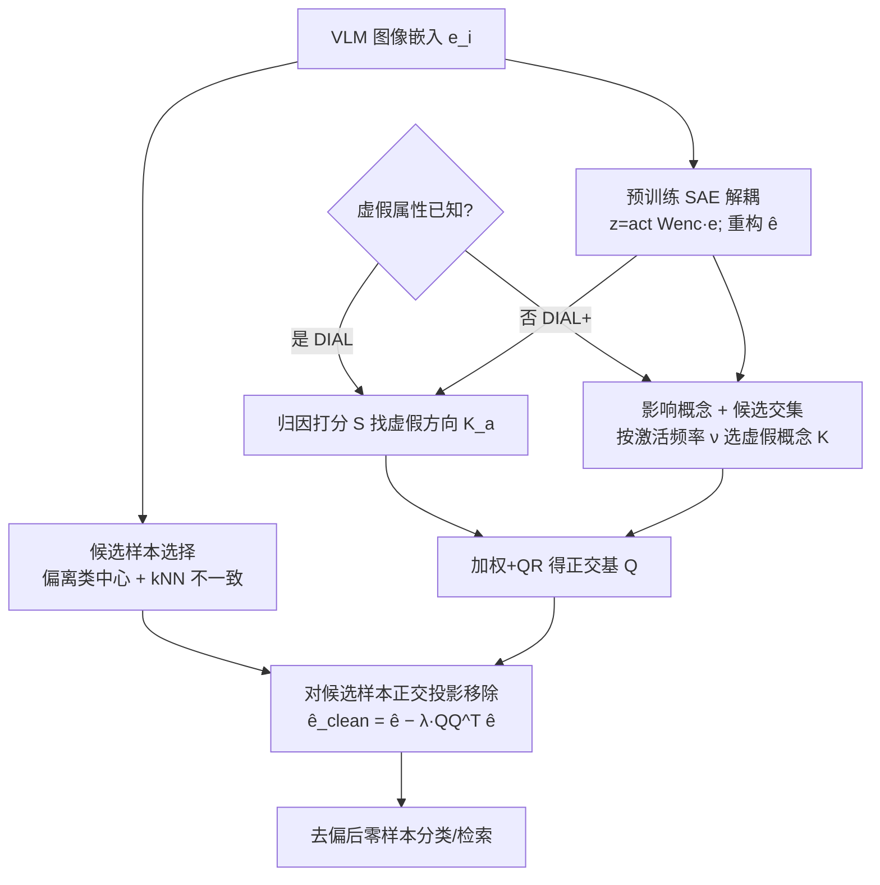

# Label-Free Mitigation of Spurious Correlations in VLMs using Sparse Autoencoders

**会议**: ICLR 2026  
**OpenReview**: [https://openreview.net/forum?id=NHOLsaHuFv](https://openreview.net/forum?id=NHOLsaHuFv)  
**代码**: [https://github.com/byalavar/DIAL](https://github.com/byalavar/DIAL)  
**领域**: 多模态 VLM / 鲁棒性与去偏 / 可解释性  
**关键词**: 虚假相关, CLIP 去偏, 稀疏自编码器, 零样本, 最差组准确率, 正交投影  

## 一句话总结
DIAL 用一个预训练稀疏自编码器把 CLIP 图像嵌入拆成可解释的单义特征方向，零样本地识别出编码虚假属性的子空间并用正交投影把它从受影响样本中减掉，全程不需要训练、额外数据、类别标签或虚假特征标签。

## 研究背景与动机
**领域现状**：CLIP 这类对比式 VLM 凭借 web 规模训练获得了强零样本能力，但它们常常依赖**虚假相关**——把训练数据里恰好高频出现的非因果特征当成判别依据。比如在 ISIC 皮肤病数据集上盯着成像伪影而非病灶、在胸片上盯着医疗设备而非肺炎征象、在 CelebA 上用面部特征而非发色去判断"金发"、在 Waterbirds 上靠水面背景而非鸟本身。这导致模型在特定人群或语义子组上的表现远低于平均，最差组（worst-group）准确率惨不忍睹，公平性与可靠性受到根本质疑。

**现有痛点**：已有的缓解方法几乎都要付出额外代价。一类需要训练/微调、重加权或访问模型参数与类别/虚假特征标签（如 Group-DRO 系方法、Zhu et al. 2025），直接抹掉了 VLM 的零样本优势；另一类号称零样本，却各有软肋——TIE 要拿到每个样本的虚假特征标签才能达到最优，其无标签变体 TIE\* 仍要靠额外数据估计缩放因子；ROBOSHOT 依赖大模型生成"虚假特征洞察"，引入幻觉、可靠性和 LLM 选型敏感等新问题。而且大量工作只在**文本模态**上做去偏，没碰视觉表征里编码的偏置。

**核心矛盾**：真正的零样本去偏要求"既不要标签、不要额外数据、不要外部 LLM，又要能定位并精准移除藏在图像嵌入里的虚假信息"——这三者很难同时满足，因为没有监督信号就难以知道"哪个方向是虚假的"。

**本文目标**：提出一个**完全零样本、可解释**的框架，仅凭 VLM 嵌入（外加可选的虚假属性高层描述）就能在图像嵌入空间里识别并移除虚假相关，同时提升平均准确率与最差组准确率、缩小二者差距。

**核心 idea**：**用稀疏自编码器把纠缠的 VLM 嵌入解耦成单义特征字典**，借"被虚假特征影响的样本会偏离类中心"这一先验零样本地圈出受害样本，再通过**归因打分**找出与虚假属性对齐的特征方向，最后用**正交投影**把这些方向张成的子空间从受害样本嵌入里减掉——整条链路天然可解释、可审查。

## 方法详解

### 整体框架
DIAL（**D**isentangle, **I**dentify, **A**nd **L**abel-free removal）把去偏拆成三步：先用分布分析筛出可能被虚假特征主导的候选样本，再用预训练 SAE 把嵌入投影到解耦空间并定位虚假特征方向，最后对候选样本做正交投影移除虚假子空间。当虚假属性已知时用 DIAL（需要一句高层描述，如 CelebA 的"Male/Female"）；当未知时用 DIAL+，它能先自动检测虚假概念再缓解，输入只需嵌入本身。整个过程不训练、不取标签、不调外部 LLM。

### 关键设计

**1. 候选样本选择：让去偏只动该动的样本。** DIAL 不对全体样本动手，而是基于"虚假样本往往远离其真实类中心"这一先验（Li et al. 2025），先用 VLM 自身的零样本预测当伪标签近似类中心，把偏离中心的样本挑出来；再用 k-近邻一致性做二次精炼，剔除噪声与离群点，得到候选集 $S_{cand}$。只对 $S_{cand}$ 里的样本做后续移除，避免破坏本来就预测正确、与虚假特征无关的样本，这也是它在保住平均准确率的同时大幅抬升最差组的关键。

**2. SAE 解耦 + 归因打分：零样本定位虚假特征方向。** 给定嵌入 $e$，预训练 SAE（论文用 Matryoshka SAE / MSAE）算出稀疏激活 $z=\mathrm{act}(W_{enc}e+b_{enc})$ 与重构 $\hat e=W_{dec}z+b_{dec}$，解码矩阵 $W_{dec}$ 的列 $\{f_j\}$ 就是一组单义特征向量，构成特征字典 $F$。对每个虚假属性 $a$，先用 prompt（"a photo of a $a$"及其否定）把重构嵌入零样本切成正集 $P_a$ 与负集 $N_a$，再把 Karvonen et al. 的归因打分搬到零样本场景：

$$S(f_j, a)=\left(\frac{1}{|P_a|}\sum_{i\in P_a} z_{i,j}-\frac{1}{|N_a|}\sum_{i\in N_a} z_{i,j}\right)\times \mathrm{CosSim}(f_j, e_a)$$

其中 $e_a=\phi_t(\text{prompt}_a)$ 是属性的文本嵌入。这个分数同时要求"特征方向与属性语义对齐"且"在正集激活显著更高"，因此能稳定挑出真正编码虚假属性的方向。选取时不是死卡 top-$k$，而是按 $|S|$ 降序累积，取最小的 $k$ 使其占归因总质量的比例 $\alpha$，得到该属性的虚假特征集 $K_a$；并所有属性合并为 $K$。消融显示按**归因质量 $\alpha$** 选优于固定 top-$k$，因为不同概念在 SAE 里的特征数量差异很大（"color patch"可能只占少量特征，"land background"则很多）。

**3. 正交投影移除虚假子空间：减得干净又不伤无关特征。** 拿到 $K$ 后并不直接投影，而是先去噪：算出虚假特征均值方向 $m=\frac{1}{|K|}\sum_{f_j\in K} f_j$，用对齐分数 $s_j=\beta\cdot\mathrm{CosSim}(f_j, m)$ 经 softmax 得权重 $w$，再把低于某分位数的权重置零，得到过滤后的 $K_f$。把加权特征向量 $\{w_j f_j\}$ 作为列构成矩阵 $V_w$，对其做 QR 分解 $V_w=QR$ 得到虚假子空间的正交基 $Q$。最后对候选样本嵌入做投影并按缓解强度 $\lambda\in[0,1]$ 减掉：

$$\hat e_{i,clean}=\hat e_i-\lambda\, QQ^\top \hat e_i$$

消融表明**正交投影显著优于神经元置零（ablation）**：置零只是把若干已识别神经元清掉，残留的未识别虚假方向会稀释效果，而正交投影把整个虚假子空间一并移除（代价是若非虚假特征与虚假特征过近会受牵连）。

**4. DIAL+ 的无监督虚假概念检测：把"先验描述"也省掉。** 当虚假属性未知时，DIAL+ 用三步纯数据驱动定位虚假概念：(i) **影响概念识别**——对每个特征做"模拟消融"$\hat e_{i,\neg j}=W_{dec}(z_i\odot(1-1_j))+b_{dec}$，若移除它会翻转样本的零样本预测，则该特征进入样本的局部影响集 $I_i$，全体并成 $I_{pool}$；(ii) **候选样本选择**——同样用 Alg.1（类中心偏离 + kNN 不一致）得 $S_{cand}$；(iii) **虚假概念提取**——在候选集内统计每个影响概念的激活频率 $\nu_j=\sum_{i\in S_{cand}}\mathbb{1}[j\in I_i]$，取频率最高的 top-$k$ 作为最终虚假概念集 $K$。直觉是"既能左右预测、又在偏离类中心的样本里反复出现"的概念，最可能就是虚假特征。此外框架用一个零样本网格搜索（Alg.2）自动选 $k^*$、$\alpha$、$\lambda$，优化目标是让嵌入到各虚假概念尽量等距，从而摆脱对额外数据调参的依赖。

## 实验关键数据

五个标准基准（CelebA、Waterbirds、FMOW、医学 ISIC、COVID-19），骨干含 CLIP ViT-B/32、ViT-L/14、医学用 BiomedCLIP，统一用预训练 MSAE 解耦。指标：平均准确率 AVG、最差组 WG（越高越好）、差距 Gap（越低越好）。基线分两组——需辅助信息组（PerceptionCLIP/ROBOSHOT/TIE/TIE\*）与无辅助信息组（Zero-Shot/GroupPrompt/Ideal Words/Orth-Cali，以及本文）。

### 主实验表格（节选最差组 WG / 差距 Gap）

| 数据集 / 骨干 | 方法 | AVG↑ | WG↑ | Gap↓ |
|---|---|---|---|---|
| CelebA ViT-B/32 | TIE（需标签+数据） | 85.11 | 82.63 | 2.48 |
| CelebA ViT-B/32 | **DIAL** | **85.54** | **83.47** | 2.17 |
| CelebA ViT-B/32 | **DIAL+** | 85.28 | 83.42 | **1.86** |
| CelebA ViT-L/14 | TIE | 86.17 | 84.60 | 1.57 |
| CelebA ViT-L/14 | **DIAL** | **86.87** | **85.24** | 1.63 |
| Waterbirds ViT-L/14 | Zero-Shot | 83.72 | 31.93 | 51.79 |
| Waterbirds ViT-L/14 | TIE（需标签） | 84.12 | 78.82 | 5.30 |
| Waterbirds ViT-L/14 | **DIAL+** | 82.25 | 69.18 | 12.47 |
| ISIC（BiomedCLIP） | TIE | 69.90 | 65.87 | 4.03 |
| ISIC | **DIAL** | 70.71 | **68.42** | **2.29** |

CelebA 上 DIAL 在 ViT-B/32 全面超过所有零样本基线，甚至胜过需要辅助数据/标签/LLM 的方法；ViT-L/14 上拿到最高 WG、最低 Gap。ISIC 医学数据上 DIAL 把 WG 从零样本的 42.21 抬到 68.42、Gap 从 28.00 压到 2.29，超过需标签的 TIE。Waterbirds 是相对弱项：作者归因于"land/water background"概念过于多样复杂，单句高层描述难以完整刻画其特征空间，影响归因打分精度。

### 消融实验表格

| 消融维度 | 对比项 | 结论 |
|---|---|---|
| 虚假特征选择 | top-$k$ 个特征 vs 归因质量 $\alpha$ | 选 $\alpha$ 分数更好（不同概念占用特征数差异大） |
| 虚假特征移除 | 神经元置零 vs 正交投影 | 正交投影显著更优（移除整个子空间，残留更少） |
| 去偏检索 | FairFace MaxSkew@1000 | Age 1.32→0.95、Gender 0.30→0.11、Ethnicity 0.61→0.32 |

### 关键发现
- DIAL+ 在不知道虚假属性的情况下，性能与需要先验描述的 DIAL **基本持平**，证明无监督虚假概念检测确实有效。
- 方法**模态无关**：去偏作用在图像嵌入上，区别于大多数只改文本模态的零样本基线；在 FairFace 检索任务上三类敏感属性的 MaxSkew 全面下降，说明嵌入空间确实变公平了。
- 在医学等高风险域，方法的可解释性允许直接审查"移除了哪些概念"，便于诊断模型失效根因。

## 亮点与洞察
- **把机制可解释性工具（SAE）落到实用去偏**：以往 SAE 多停留在"评估能否擦除概念"，本文把它变成无需标签即可定位并外科式移除虚假子空间的引擎，且归因打分被巧妙改造成零样本可用。
- **"只动受害样本"的定向缓解**：用类中心偏离 + kNN 一致性圈定候选，既抬最差组又不拖累平均准确率，这是很多全局去偏方法做不到的平衡。
- **真正的 data-free 零样本**：连调参用的额外数据都省了，用嵌入到虚假概念的等距性作为零样本搜索目标，把 TIE/ROBOSHOT 的隐性依赖一并去掉。
- **可审查性带来的信任价值**：整条管线（哪些特征、哪个子空间、移除多少）都可逐步检视，对医疗等高风险场景是实打实的卖点。

## 局限与展望
- **正交投影可能误伤**：当非虚假特征与虚假特征在嵌入空间靠得很近时，投影会连带削弱有用信息，论文自己也承认这一点。
- **复杂虚假概念刻画不足**：Waterbirds 上 WG 落后于 TIE，说明对"背景"这类高度多样的虚假属性，单一高层描述 + 归因打分难以完整覆盖其特征空间。
- **依赖预训练 SAE 质量**：解耦好坏直接决定上限，附录也显示 SAE 质量与性能相关；换骨干/数据集时最优 $(\alpha,\lambda)$ 会变，虽有零样本搜索兜底但仍受搜索范围与候选选择超参影响。
- **展望**：作者提出可探索解析解替代网格搜索以降低依赖，并把框架推广到机器遗忘（unlearning）与更广义的公平性任务。

## 相关工作与启发
- **零样本 VLM 去偏**：Orth-Cali（Chuang et al.）用闭式校准投影矩阵移除偏置方向、Ideal Words（Trager et al.）平均文本 prompt 去偏、TIE（Lu et al.）沿文本算出的虚假向量平移图像嵌入、ROBOSHOT（Adila et al.）用 LLM 生成洞察——DIAL 与它们的根本区别是**无标签、无额外数据、无 LLM，且作用在图像模态**。
- **SAE 与机制可解释性**：Karvonen et al. 的概念擦除评估、扩散模型里的概念擦除（Tian et al.）、对比稀疏表示（Wen et al.）都为"用 SAE 操纵语义"提供了工具，本文把归因 + 正交投影组合成可落地的去偏方案。
- **启发**：归因打分（语义对齐 × 激活差）+ 正交投影移除子空间，是一套可迁移到其它"定向擦除某语义"任务的通用配方；"偏离类中心 → 候选样本"这一无监督定位思路也可用于异常/偏置样本挖掘。

## 评分
- 新颖性: ⭐⭐⭐⭐ — 把 SAE 机制可解释性首次系统性地转化为完全 data-free 的零样本 VLM 去偏，归因打分零样本化 + DIAL+ 无监督概念检测有清晰创新。
- 实验充分度: ⭐⭐⭐⭐ — 五数据集 × 多骨干 + 检索任务，两组基线对比公平，选择/移除/检索三方面消融到位；但部分数据集（Waterbirds/COVID）上未稳居最优，可解释性多为定性展示。
- 写作质量: ⭐⭐⭐⭐ — 方法分步清晰、动机与设计动因交代充分，公式与算法配合好读；个别符号（如 DIAL+ 三步）稍密。
- 价值: ⭐⭐⭐⭐ — 无需任何标签/数据/LLM 即可去偏并可审查，对医疗等高风险域的公平性与可信部署有实用意义。

<!-- RELATED:START -->

## 相关论文

- [\[ICML 2026\] Density-Aware Translation of Spurious Correlations in Zero-Shot VLMs](../../ICML2026/multimodal_vlm/density-aware_translation_of_spurious_correlations_in_zero-shot_vlms.md)
- [\[NeurIPS 2025\] Sparse Autoencoders Learn Monosemantic Features in Vision-Language Models](../../NeurIPS2025/multimodal_vlm/sparse_autoencoders_learn_monosemantic_features_in_visionlan.md)
- [\[CVPR 2026\] Sparse Spectral LoRA: Routed Experts for Medical VLMs](../../CVPR2026/multimodal_vlm/sparse_spectral_lora_routed_experts_for_medical_vlms.md)
- [\[ICML 2025\] The Devil Is in the Details: Tackling Unimodal Spurious Correlations for Generalizable Multimodal Reward Models](../../ICML2025/multimodal_vlm/the_devil_is_in_the_details_tackling_unimodal_spurious_correlations_for_generali.md)
- [\[ICLR 2026\] MMTok: Multimodal Coverage Maximization for Efficient Inference of VLMs](mmtok_multimodal_coverage_maximization_for_efficient_inference_of_vlms.md)

<!-- RELATED:END -->
