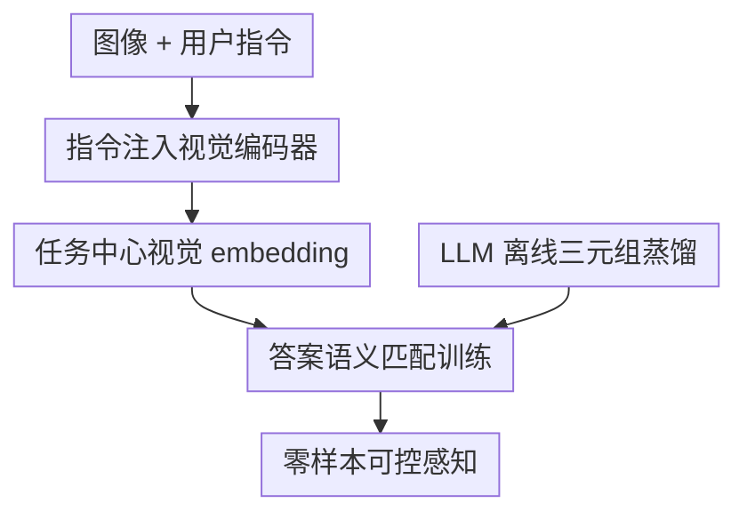

# Language-Instructed Vision Embeddings for Controllable and Generalizable Perception

**会议**: ICLR 2026  
**OpenReview**: [https://openreview.net/forum?id=r2b0fuf8xb](https://openreview.net/forum?id=r2b0fuf8xb)  
**论文**: [https://live-embedding.github.io/](https://live-embedding.github.io/)  
**代码**: 暂未开源  
**领域**: 多模态VLM / 语言指令视觉表征  
**关键词**: 语言指令视觉编码器, 可控感知, 视觉幻觉, 零样本检索, LLM数据蒸馏  

## 一句话总结
LIVE 把自然语言指令直接注入视觉编码器，让同一张图在不同问题下生成不同的任务中心视觉 embedding，并用 LLM 生成的图像-问题-答案三元组训练，使轻量视觉编码器在 MMVP、GQA 和跨数据集指令检索上显著超过静态视觉表征。

## 研究背景与动机

**领域现状**：CLIP、SigLIP、DINOv2 这类视觉基础模型通常把图像编码成一个通用 embedding，再交给文本塔、检索模块或更大的多模态 LLM 去做下游任务。这个范式很方便：视觉特征可以预计算，后续分类、检索、VQA 都能复用同一套表示。

**现有痛点**：问题在于，通用 embedding 对“当前到底要看什么”没有意识。同一张苹果图片上如果贴着 “iPod” 文本，静态视觉编码器可能把水果、文字、背景、形状都混在一个向量里；当用户问“图里是什么水果”或“图里有什么文字”时，下游模块只能在已经压缩过的信息里补救。如果关键细节在视觉编码阶段就没有被突出，后面的 LLM 参数再大也很难恢复。

**核心矛盾**：现有 VLM 大多把语言控制放在视觉编码之后：视觉塔先产出固定特征，语言模块再解释、融合、生成答案。这样做把任务适配压力推给昂贵的下游模型，也让视觉 hallucination 更容易发生。真正需要解决的是：语言指令能不能更早地进入视觉计算，让视觉编码器在生成 embedding 时就知道应该关注对象类别、文字、颜色、空间关系还是某个被框出的区域。

**本文目标**：作者希望训练一个可独立使用的语言指令视觉编码器。它在推理时输入图像 $x$ 和文本问题 $q$，输出一个已经被 $q$ 调制过的视觉 embedding；然后只需与候选答案的文本 embedding 做匹配，就能完成零样本感知、VQA 或检索式预测，不需要每个任务重新训练，也不需要部署大型 LLM 解码器。

**切入角度**：论文的关键观察是，LLM/VLM 虽然推理贵，但可以离线生成大量高质量监督信号。与其让 LLM 每次在线回答问题，不如让它离线为图像生成丰富的问题-答案对，再把这些知识蒸馏进视觉编码器。这样训练阶段借用 LLM 的开放世界知识，推理阶段只保留更便宜的指令化视觉塔。

**核心 idea**：用文本指令调制视觉编码器，并用 LLM 生成的图像-问题-答案三元组做 SigLIP 式匹配训练，让视觉表示从“看整张图的静态摘要”变成“按问题选择性看的任务表示”。

## 方法详解

### 整体框架

LIVE 的整体流程可以理解为“离线造指令数据，在线用指令控制视觉 embedding”。训练时，作者先用 Gemini 2.0 Flash 为 ImageNet 图像生成多样的问题和答案，得到 $(x, q, a)$ 三元组；模型把问题 $q$ 编成语言 token 后注入 ViT 视觉编码器，生成语言指令视觉 embedding，再让它靠近正确答案 $a$ 的文本 embedding、远离 batch 内错误答案。推理时，LLM 不再参与，用户只输入图像和问题，LIVE 输出的 embedding 直接与候选答案文本向量做检索匹配。

这张图里有三个真正的贡献节点：LLM 离线三元组蒸馏提供监督，指令注入视觉编码器改变视觉计算本身，答案语义匹配训练把视觉 embedding 拉到可检索的语言空间。输入、输出和下游检索只是脚手架，不单独作为关键设计。

### 关键设计

**1. 指令注入视觉编码器：让视觉特征在编码阶段就带有任务意图**

传统两塔模型的视觉 embedding 是 $z = E(x)$，它默认要把图像里所有可能有用的信息都塞进一个有限维向量。LIVE 改成 $z^{(I)} = E_{live}(x, T(q))$：问题 $q$ 先经过冻结的文本编码器 $T(\cdot)$ 得到指令向量，再通过线性投影变成若干 query token，和图像 patch token 一起进入 ViT。这样语言不是在最后和视觉特征做 late fusion，而是作为视觉编码器内部的条件信号，参与后续 self-attention 计算。

这个设计解决的是语义歧义而不是位置歧义。视觉 prompt 的框或圈可以告诉模型“看这里”，但无法告诉模型“看颜色、看品牌、看是否干净、还是看文字内容”。LIVE 的语言 token 则能表达任务维度：同一张带 “iPod” 字样的苹果图，问 “What is the text?” 时 attention 会转向文字，问 “What is the fruit?” 时 attention 会转向苹果本体。它把可控性放在 representation space 里实现，后续模块拿到的已经是被任务过滤过的视觉证据。

**2. LLM 离线三元组蒸馏：用生成式知识补齐指令监督的稀缺性**

训练语言指令视觉编码器最缺的不是图像，而是足够丰富的 $(图像, 问题, 答案)$ 三元组。已有 VQA 数据常常来自模板或规则，问题类型窄，难以覆盖“忽略前景后看什么”“某个物体相对另一个物体在哪里”“文字不可见时应该回答什么”这类开放式感知需求。LIVE 直接把 Gemini 2.0 Flash 当作离线知识源，对 ImageNet 训练图生成有编号的视觉问题及答案，最终得到约 $16.4M$ 个 image-query-answer triplets。

这里的蒸馏不是让学生模型复述 LLM 文本，而是让视觉编码器学习 LLM 认为值得看的视觉属性。因为同一张图会对应多个问题，模型不能只记住图像类别；它必须根据 $q$ 改变自己对 $x$ 的压缩方式。论文附录还把指令分成 fundamental properties、spatial-textual、viewpoint、dynamic reasoning 等族群，说明这些合成问题确实形成了长尾、多类型的视觉 taskonomy，而不是普通 caption 数据的改写。

**3. 答案语义匹配训练：把可控视觉 embedding 对齐到可检索的语言空间**

LIVE 不训练生成式 decoder，而是沿用 SigLIP 风格的 sigmoid matching loss。对一个 batch 中的第 $i$ 个图像-问题对 $(x_i, q_i)$，模型产生 $z_i^{(I)} = E_{live}(x_i, T(q_i))$；第 $j$ 个候选答案 $a_j$ 经过冻结文本塔得到 $z_j^{(T)} = T(a_j)$。若 $i=j$，标签 $y_{ij}=1$；否则 $y_{ij}=-1$。训练目标是让匹配对的点积更大，不匹配对更小：

$$
L=-\mathbb{E}_{i,j}\log \frac{1}{1+\exp(-y_{ij}(t(z_i^{(I)}\cdot z_j^{(T)})+b))}
$$

其中 $t$ 和 $b$ 是可学习的温度与偏置。这个目标的好处是推理形式很干净：给定问题后，视觉侧已经生成任务化 embedding，答案侧可以预先编码成文本向量库，预测就变成 Top-1 retrieval。与 LLaVA、InstructBLIP 这类依赖大语言模型解码的系统相比，LIVE 的输出空间更像“按问题检索答案语义”，因而参数量和推理成本都低很多。

**4. 指令与答案解耦：避免模型学到 caption shortcut**

与一些“用 caption 调制视觉编码器”的方法不同，LIVE 让输入给视觉塔的 query 和要匹配的 answer 明显不同。例如问题可以是“雪地车是什么颜色”，答案是“蓝色和白色”；问题也可以要求忽略前景、识别背景，或判断某个细节是否可见。如果指导文本和目标文本过于相似，模型可能只学会把文本特征互相匹配，而不是从图像里找证据。LIVE 的 query-answer 分离迫使模型在视觉 token 中寻找能支持答案的内容。

这点也解释了消融结果：把视觉输入端的具体问题换成中性 “Caption the image.” 后，GQA 从 $67.4$ 掉到 $13.1$；把 rich answer 换成普通类别名后，GQA 甚至降到 $2.7$。也就是说，性能不是来自更大的数据量或同一个 backbone 的重训，而是来自“具体指令 + 描述性答案”共同建立的视觉-语言控制信号。

### 一个完整示例

以论文里的 typographical attack 场景为例：一张苹果图片上贴着 “iPod” 字样。静态 SigLIP 只输出一个全局 embedding，后续检索“Apple”“iPod”“Table”等候选答案时，文字贴纸和真实物体都会混入同一个表示，因此很容易把问题“图中的水果是什么？”答成 “iPod”。

LIVE 的流程不同。若输入问题是 “What is the text in the image?”，文本塔先把这个问题编码成 query token，ViT 中的 attention 会偏向贴纸文字区域，最终 embedding 更接近 “iPod” 的文本向量。若输入问题换成 “What is the fruit in the image?”，同一张图的 query token 发生变化，视觉编码器会把注意力转向苹果本体，输出 embedding 更接近 “Apple”。这个例子说明 LIVE 不是单纯提高平均表征质量，而是在同一图像上按任务动态改变表征内容。

### 损失函数 / 训练策略

模型初始化来自 SigLIP / SigLIP 2 的 ViT 视觉编码器和文本编码器。文本塔保持冻结，用于预计算问题 embedding 和答案 embedding；视觉编码器以及把问题向量投影成视觉 query token 的线性层参与训练。ViT-SO 版本大约只额外增加 $13M$ 参数，主要来自文本投影层和 query token 相关参数。

训练数据使用 ImageNet 训练图像，由 Gemini 2.0 Flash 生成约 $16.4M$ 个三元组。作者采用与 SigLIP 类似的优化设置：学习率 $0.001$，batch size $8192$，训练 $122k$ steps，使用 $256$ 个 TPUv3 cores；数据增强只使用 resize augmentation。评测时所有 benchmark 都按 Top-1 retrieval accuracy 计算，且去重图像和文本指令以保证测试指令尽量未见。

## 实验关键数据

### 主实验

| 任务 / 数据集 | 指标 | LIVE | 之前强基线 | 提升 |
|--------|------|------|----------|------|
| MMVP-VLM | Top-1 accuracy | 76.3 | BRAVE 42.0 / SigLIP 37.8 | 相比 BRAVE +34.3 |
| GQA | Top-1 retrieval accuracy | 71.2 | LLaVA 63.3 / BRAVE 52.7 | 相比 LLaVA +7.9 |
| ImageNet† 指令检索 | Top-1 retrieval accuracy | 87.06 | Menon et al. 60.86 / SigLIP 38.03 | 相比 Menon +26.20 |
| SUN† 指令检索 | Top-1 retrieval accuracy | 52.94 | Menon et al. 25.79 / SigLIP 13.00 | 相比 Menon +27.15 |
| RefCOCO† 指令检索 | Top-1 retrieval accuracy | 54.33 | Menon et al. 14.98 / SigLIP 9.40 | 相比 Menon +39.35 |

MMVP 是最能体现论文动机的实验：它专门考察 VLM 是否会被细节、文字、方向、数量等视觉陷阱误导。LIVE 的 ViT-SO 版本达到 $76.3$，而静态 SigLIP ViT-SO-14 约 $37$-$38$，大模型/ensemble 的 BRAVE 也只有 $42.0$。这说明把指令提前注入视觉编码器，比把更大的模块接在静态视觉 embedding 后面更能减少 hallucination。

GQA 则验证了方法不只会做属性问答。LIVE 的 ViT-B-16 达到 $71.2$，超过 LLaVA 的 $63.3$、BRAVE 的 $52.7$ 和 InstructBLIP 的 $49.5$。由于 LIVE 在这里仍然是检索式答案匹配，而不是大语言模型生成，结果说明很多视觉问答的瓶颈确实在“视觉证据是否按问题被编码出来”。

### 消融实验

| 配置 | GQA | MMVP | 说明 |
|------|---------|------|------|
| LIVE: Specific Query + Rich Answer | 67.4 | 69.5 | 完整设置，视觉侧有具体问题，目标侧有描述性答案 |
| Neutral Query: “Caption the image.” + Rich Answer | 13.1 | 65.1 | 去掉具体指令后，GQA 几乎崩溃 |
| Specific Query + Class Name | 2.7 | 54.7 | 答案监督退化为类别名，无法学到细粒度语义 |
| Language injection at Layer 1 | 67.4 | 69.5 | 早期注入更利于 MMVP 细节辨别 |
| Language injection at Layer 4 | 67.8 | 69.4 | 中层注入两项接近 |
| Language injection at Layer 8 | 68.2 | 68.7 | 后期注入更利于 GQA 关系语义 |

| 训练数据 | 主要现象 | 说明 |
|------|---------|------|
| Open Images + 通用 caption 指令 | 增益很弱 | 没有真实 task query，难以学会指令控制 |
| WebLI + 通用 caption 指令 | OCR 相关任务有提升 | 文本丰富但任务覆盖仍偏窄 |
| CC3M-VQA | 部分 VQA 有小幅提升 | 规则式问题不够开放 |
| LIVE ImageNet triplets | 多 benchmark 全面提升 | LLM 生成的多样化三元组是核心数据优势 |

### 关键发现

- 指令本身是主要贡献源。Table 6 中 GQA 从 $67.4$ 掉到 $13.1$ 的幅度非常大，说明模型不是靠“看过更多 ImageNet 图像”提升，而是靠问题直接调制视觉表示。
- rich answer 也不可替代。若目标只用 class name，GQA 只有 $2.7$，这意味着开放式视觉感知需要答案端保留颜色、关系、可见性、动作等描述性语义。
- 注入深度没有单一最优。MMVP 更依赖早期细节，因此 Layer 1 最好；GQA 更依赖关系和高层语义，因此 Layer 8 稍好。这提示未来可能需要按任务动态选择注入层，或在多层同时注入。
- 模型对未见指令族群有一定泛化能力。Leave-one-group-out 实验中，训练缺失某一类指令后仍能保持较高 ImageNet† 准确率，但缺失 fundamental properties 时下降更明显，说明基础视觉属性仍是其它复杂任务的地基。
- 附录 OCR 和 typographical attack 实验显示，语言指令可以在同一模型内切换“读文字”和“忽略文字”。OCR 场景中 SigLIP 2 ViT-SO-14 从 $10.48$ 提升到 $38.99$；在文字攻击下，用“忽略文字、识别物体”的提示可把鲁棒准确率从 $48.31$ 提到 $51.48$。

## 亮点与洞察

- 最巧妙的地方是把语言控制前移到视觉编码器内部，而不是继续堆更大的 LLM decoder。这个选择直接针对 hallucination 的根因：如果视觉 embedding 本身不按问题保留证据，后续语言推理再强也只能猜。
- LLM 被用作离线数据工厂，而不是在线推理组件。这样既利用了 Gemini 的开放世界知识，又避免每次部署都承担大模型成本，是一种很实用的 teacher-to-encoder 蒸馏路线。
- 指令与答案解耦是本文区别于 caption-conditioned 表征的重要细节。它让模型不能走文本 shortcut，必须学会“根据问题从图像中找支持答案的证据”。
- 论文把 VQA 重新表述为 embedding retrieval，也很有启发。对许多封闭或半开放答案空间的感知任务，生成式回答可能不是必需的；一个能被指令控制的视觉 embedding 加候选答案库就足够有效。
- 这个思路可以迁移到检测、RAG grounding、机器人感知和生成模型条件编码。比如机器人可以用“找可抓取的红色物体”调制视觉编码器，RAG 系统可以用“核验图中是否真有这个对象”生成更专门的视觉证据。

## 局限与展望

- 作者承认 query 设计仍然依赖经验。同一个任务中，“Classify the main object.” 比无提示能把 ImageNet 分类准确率提高约 $20$ 点，但什么提示最有效还没有原则化方法。
- 复杂组合指令仍是短板。LIVE 依赖冻结文本编码器表示问题，若 query 包含多重否定、复杂关系或抽象逻辑，文本 embedding 未必能稳定表达用户意图。
- 安全性需要额外机制。语言可控性既能用于忽略攻击文字、缓解偏见，也可能被恶意提示引向 surveillance、profiling 或带偏见的视觉表示；论文目前只建议对指令加 benign/malicious 分类器，还不是完整安全方案。
- 数据开放和复现存在现实限制。论文给了伪代码和超参，但训练代码与内部基础设施深度绑定，训练数据也在机构审核中，短期内第三方完整复现实验会有门槛。
- 评测仍以检索式答案为主。真实开放生成、连续控制、视频长期推理等场景是否能直接受益，还需要把 LIVE 接入更复杂的系统后验证。

## 相关工作与启发

- **vs CLIP / SigLIP**: 它们学习静态图像-文本对齐，视觉 embedding 与具体问题无关；LIVE 复用类似两塔结构和 SigLIP loss，但把问题 token 注入视觉塔，使同一图像能根据 query 产生不同表示。
- **vs LLaVA / InstructBLIP / PaliGemma**: 这些方法通常把视觉特征送入大语言模型或 late fusion 模块，让语言侧完成任务适配；LIVE 反过来把语言监督蒸馏回视觉编码器，推理时不需要大 decoder，适合检索式和低成本感知。
- **vs visual prompting / RegionCLIP**: 视觉 prompt 可以指定位置，却难以指定属性维度；LIVE 的自然语言指令能表达颜色、文字、关系、可见性等更细的语义目标。
- **vs caption-conditioned representation / FLAIR 类方法**: caption 既像输入指导又像目标描述，容易诱导 shortcut；LIVE 把 query 和 answer 分离，让模型学会根据任务去重组视觉证据。
- **vs multimodal retrieval / UniIR / MagicLens**: 这些工作更多在融合后做检索或面向图像检索任务；LIVE 的重点是改变视觉 encoder 本身，因此可以作为更底层的 instruction-aware vision component 接入其它检索或 VLM 系统。

## 评分

- 新颖性: ⭐⭐⭐⭐⭐ 语言调制视觉编码器不是单纯 prompt tuning，而是把任务指令嵌入视觉表征生成过程，方向很清楚。
- 实验充分度: ⭐⭐⭐⭐☆ MMVP、GQA、跨数据集指令检索、注入层和数据消融都比较扎实，但开放生成和真实部署系统还没充分覆盖。
- 写作质量: ⭐⭐⭐⭐☆ 主线清晰，图和表能支撑论点；不过部分 appendix 数据与细节较散，读者需要自己串联。
- 价值: ⭐⭐⭐⭐⭐ 这篇论文给 VLM 提供了一个很实用的替代路线：与其无限扩大语言后端，不如先让视觉编码器按任务看图。

<!-- RELATED:START -->

## 相关论文

- [\[ICLR 2026\] MaskInversion: Localized Embeddings via Optimization of Explainability Maps](maskinversion_localized_embeddings_via_optimization_of_explainability_maps.md)
- [\[ICLR 2026\] ViPER: Empowering the Self-Evolution of Visual Perception Abilities in Vision-Language Models](viper_empowering_the_self-evolution_of_visual_perception_abilities_in_vision-lan.md)
- [\[ICLR 2026\] LEGATO: Large-scale End-to-end Generalizable Approach to Typeset OMR](legato_large-scale_end-to-end_generalizable_approach_to_typeset_omr.md)
- [\[ICLR 2026\] WAVE: Learning Unified & Versatile Audio-Visual Embeddings with Multimodal LLM](wave_learning_unified_versatile_audio-visual_embeddings_with_multimodal_llm.md)
- [\[CVPR 2026\] Controllable Federated Prompt Learning at Test Time](../../CVPR2026/multimodal_vlm/controllable_federated_prompt_learning_at_test_time.md)

<!-- RELATED:END -->
