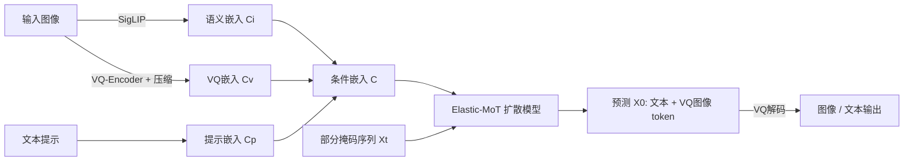

# Lavida-O: Elastic Large Masked Diffusion Models for Unified Multimodal Understanding and Generation

**会议**: ICLR 2026  
**代码**: [https://github.com/adobe-research/LaVida-O](https://github.com/adobe-research/LaVida-O)  
**领域**: 统一多模态模型 / 掩码扩散模型  
**关键词**: 掩码扩散模型, 统一多模态, Elastic-MoT, 图像编辑, 目标定位, 自反思生成  

## 一句话总结
Lavida-O 用一个掩码扩散模型（MDM）同时打通图像理解、目标定位、图像编辑和 1024px 高清文生图，靠"弹性混合专家"架构把 8B 理解分支和 2.4B 轻量生成分支高效拼起来，再引入规划与自反思机制让"会理解"反哺"会生成"，在 RefCOCO、GenEval、ImgEdit 上全面超过 Qwen2.5-VL 和 FluxKontext。

## 研究背景与动机
**领域现状**：以 GPT-4o 为代表的统一多模态模型用单一模型同时做理解和生成，已成为新范式。主流路线分两类：AR+扩散混合（如 BAGEL，文本用自回归、图像用连续扩散）和纯自回归离散 token（如 Janus）。近年掩码扩散模型（MDM）作为自回归的有力替代崛起——它把 token 生成当作离散空间上的扩散过程，前向逐步加掩码、推理时从全掩码序列逐步解掩，LLaDa-8B、Dream-8B 已证明 MDM 在语言建模上能匹敌自回归，还带来并行解码、双向上下文等优势。

**现有痛点**：把 MDM 推到统一多模态时，现有工作（MMaDa、Muddit）远落后于 SOTA。三大障碍：(1) 训练昂贵——MMaDa 要把 8B 模型在文本和图像生成上联合预训练；(2) 掩码图像生成模型（MIGM）的开源资源和训练经验稀缺，连最好的开源 Meissonic-1B 都明显弱于同体量连续扩散模型；(3) 缺乏让理解能力反哺生成的显式机制——MMaDa 和 Muddit 甚至做不了图像编辑，只能简单拼接文生图数据和理解数据。

**核心矛盾**：理解任务需要大容量语言骨干（8B 级别），而生成任务其实 2–4B 参数就够；但传统密集模型和标准 MoT 都对所有任务用同等规模参数，要么需要混合数据防遗忘、要么参数翻倍，训练成本都高得离谱。

**本文目标**：用一个 MDM 框架统一图像级理解、目标定位、图像编辑和高清文生图，同时控制训练成本并让理解能力主动提升生成质量。

**核心 idea**：
- **弹性解耦**：生成分支用更小的隐藏维度，且只在前若干层与理解分支做联合注意力，按任务动态激活部分参数。
- **统一为离散 token**：图像用 VQ 编码成离散 token，与文本共享掩码扩散目标，避免调和两套损失。
- **理解反哺生成**：用模型自身的理解能力做布局规划和生成后自反思纠错。

## 方法详解

### 整体框架
Lavida-O 以只能做理解的扩散模型 LaViDa 为底座，扩展出生成能力。给定输入图像和文本，先把图像语义嵌入 $C_i$（SigLIP 编码）、图像 VQ 嵌入 $C_v$、文本提示嵌入 $C_p$ 拼成条件嵌入 $C=\text{Concat}(C_i,C_v,C_p)$；模型接收 $C$ 和部分掩码序列 $X_t$，预测完全解掩的序列 $X_0$。理解任务的输出是文本 token，生成任务的输出则包含 VQ 图像 token。整个流程训练分三阶段：先训理解+定位，再加 2.4B 生成分支做渐进升分辨率（256→512→1024）的文生图预训练，最后把 2.4B+8B 端到端联合训练所有任务。

### 关键设计

**1. Elastic Mixture-of-Transformers：按任务弹性激活参数**
这是把成本压下来的核心。标准 MoT 给生成和理解两套等大参数、每层都做联合注意力，参数直接翻倍。Elastic-MoT 做两处关键改动：其一，生成分支用更小的隐藏维度（基于"很多文生图模型 2–4B 就能出高质量图、生成不需要理解那么大容量"的观察），最终生成分支只有 2.4B 新参数、理解分支沿用 LaViDa 的 8B；其二，给定 $N$ 层模型，只在前 $M$ 层让文本和图像模态通过联合注意力交互，后 $K=N-M$ 层各自模态内做自注意力。这样不同任务只激活部分参数：以 $N=32, M=K=16$ 为例，文生图只激活 6.4B（2.4B 生成 + 前 16 层理解的 4B），纯理解用 8B，需要双分支的交错任务用 10.4B。文生图预训练时甚至只训练 2.4B 生成分支。整体训练比 BAGEL 式标准 MoT 快 3.17×（缩小生成分支贡献 2.23×、解耦后 16 层注意力再贡献 1.44×）。

**2. 模态感知掩码：让并行解码知道该走哪个分支**
MoT 的路由难点是判断每个 token 该走理解还是生成分支。自回归模型可以生成 `[img_start]` 特殊 token 顺序指示，但 MDM 并行解码、必须提前决定每个掩码 token 的归属。作者设计模态感知前向过程：给定 $M$ 个文本 token 和 $N$ 个图像 VQ token，在一个特殊时间戳 $t_{exp}\in[0,1]$ 处，把全掩码的图像 VQ token 坍缩成一个特殊的 `[exp]` 文本 token。推理时先假设所有掩码都是文本 token，一旦生成出 `[exp]`，就把它展开成 $L_{img}$ 个掩码 token 并标记为后续由生成分支处理。这让交错生成（如带自反思的图像生成）能自动决定图像 token 的数量和位置。

**3. 统一文本条件 + 分层随机采样：提质量的两个轻量技巧**
统一文本条件把传统 micro-conditioning（分辨率、裁剪坐标、质量分等）直接当成纯文本附加到提示末尾（如 `SCORE: 5.40`，还加了亮度、对比度），借助模型本身的语言理解能力实现细粒度控制，无需专门嵌入。分层随机采样则针对图像生成改掉常规的置信度采样——置信度高的 token 往往聚集在已解掩 token 附近，相邻 token 高度相关，违背 MDM 的独立性假设；分层采样从 $2\times2$ 网格开始、每个区域解掩一个 token 保证空间均匀覆盖，再递归把每个区域四等分继续解掩，直到全部揭开，产生均衡分布的解掩顺序。

**4. 规划与自反思：让理解能力显式提升生成**
这是 Lavida-O 的新范式。规划阶段，模型先生成用边界框表示的图像布局再据此生成图像；图像编辑任务则先定位待编辑区域再生成结果。自反思阶段，模型用自身理解能力评估生成结果是否满足用户请求，检测到不一致就重新生成纠错。配合目标定位的坐标量化方案（把边界框坐标归一化到 $[0,1]$ 并量化成 1025 个离散 token，每个框恰好 4 个 token），借助 MDM 双向上下文可以一步并行解码多个边界框，定位任务最快单步完成。GenEval 上加规划从 0.77 升到 0.85、再加反思升到 0.89，提升明显。

## 实验关键数据

### 主实验表格

**文生图（GenEval / DPG / FID-30k）**

| 方法 | 参数 | 类型 | GenEval↑ | DPG↑ | FID-30k↓ |
|------|------|------|----------|------|----------|
| Flux-dev | 12B | 连续扩散 | 0.68 | 84.0 | 10.15 |
| SD3-Medium | 2B | 连续扩散 | 0.74 | 84.1 | 11.92 |
| BAGEL | 7B+7B | 连续 | 0.82 | - | - |
| MMaDA | 8B | 掩码 | 0.63 | 53.4 | 32.85 |
| Muddit | 1B | 掩码 | 0.61 | - | - |
| **LaViDa-O** | 4B+2.4B | 掩码 | 0.77 | 81.8 | **6.68** |
| **+规划** | 8B+2.4B | 掩码 | 0.85 | 82.9 | - |
| **+反思** | 8B+2.4B | 掩码 | **0.89** | 83.2 | - |

**目标定位（RefCOCO Precision@0.5，部分列）**

| 模型 | RefCOCO val/testA/testB | RefCOCOg val/test |
|------|------|------|
| Qwen2.5-VL-7B | 90.0 / 92.5 / 85.4 | 87.2 / 87.2 |
| InternVL3-8B | 92.5 / 94.6 / 88.0 | 89.6 / 90.0 |
| **LaViDa-O (4步)** | 92.3 / 94.8 / 89.0 | 90.0 / 90.6 |
| **LaViDa-O (1步)** | 91.9 / 94.6 / 88.4 | 89.5 / 89.8 |

**图像编辑（ImgEdit overall）**：GPT-4o 4.20 / **LaViDa-O+规划 3.80** / FluxKontext-dev 3.52 / BAGEL 3.20。在替换（4.40）和移除（4.05）物体两个需要局部理解的类别上甚至超过 GPT-4o（4.35 / 3.66）。

**图像理解**：MMMU 45.1、MMB 76.4、ChartQA 80.0、MathVista 56.9，全面超过同为统一掩码模型的 MMaDa（MMMU 30.2、ChartQA 仅 9.8），并相对底座 LaViDa 大幅提升。

### 消融实验表格

| 设计 | 效果 |
|------|------|
| 缩小生成分支（2.4B vs 等大） | 训练加速 2.23× |
| 后 16 层解耦注意力 | 额外加速 1.44× |
| Elastic-MoT vs BAGEL 式 MoT | 总训练加速 3.17× |
| +规划（GenEval） | 0.77 → 0.85 |
| +自反思（GenEval） | 0.85 → 0.89 |

### 关键发现
- 推理大幅提速：目标定位相比 Qwen2.5-VL-7B 快 6.8×，得益于一步并行解码多个边界框。
- 理解反哺生成是真实增益：规划和反思在 GenEval 上累计带来 +0.12 的提升，编辑任务上局部理解让其在替换/移除上超越 GPT-4o。
- 掩码扩散统一路线首次追平甚至超过 AR 和连续扩散统一模型，FID-30k 6.68 优于 Flux-dev 和 BAGEL。

## 亮点与洞察
- **"生成不需要和理解一样大"这个观察被工程化**：Elastic-MoT 把它落成"小生成分支 + 只在前半层联合注意力"，既省参数又省算力，是全文最实用的设计。
- **统一文本条件优雅**：传统要专门设计 embedding 的 micro-conditioning，在统一模型里直接写成自然语言塞进提示就行，是"理解能力强"带来的免费红利。
- **规划+自反思把 MLLM 的"会看图"变成"会改图"**：这是从"联合训练隐式互惠"到"显式调用理解纠正生成"的范式升级，且数据上验证有效。
- **分层采样针对 MDM 独立性假设的失效对症下药**：把图像采样的空间相关性问题用递归网格解掩缓解，思路简洁。

## 局限与展望
- 自反思和规划依赖额外推理步骤（参数从 4B+2.4B 升到 8B+2.4B 激活），换质量提升的同时增加了延迟，FID 评测因数据量大干脆没开。
- 生成质量仍依赖 VQ 离散 token，相比连续扩散在某些细节上可能受限；论文也承认 MIGM 训练经验整体仍不成熟。
- 评测主要在标准基准（GenEval、ImgEdit、RefCOCO），更复杂的多轮交错推理、长程一致性等真实交互场景的能力边界尚未充分展开。
- 三阶段训练 + 渐进升分辨率流程复杂，复现门槛较高。

## 相关工作与启发
- **掩码扩散基础**：从 BERT、MaskGIT、VQGAN 到 SEDD/MDLM 的离散扩散理论，再到 LLaDa-8B、Dream-8B 证明 MDM 可规模化，是本文的技术根基。
- **统一多模态模型**：BAGEL（AR+扩散）、Janus-Pro（统一 AR）、MMaDa/Muddit（统一 MDM）构成对比谱系，Lavida-O 是统一 MDM 路线的显著推进。
- **MoT 架构**：源自 Liang et al. 的 mixture-of-transformers，X-Fusion、LM-Fusion 探索过训练配方，Elastic-MoT 是其"弹性化"变体。
- **启发**：用单一离散目标统一所有模态 + 按任务弹性激活参数，可能是把"大理解骨干"复用到生成的高性价比通用配方；理解能力作为生成的"内置评审"值得在更多统一模型里推广。

## 评分
- **新颖性**: ⭐⭐⭐⭐⭐ 首个在文生图/编辑/定位上全面 SOTA 的统一 MDM，Elastic-MoT、模态感知掩码、规划+自反思都是有分量的新设计。
- **实验充分度**: ⭐⭐⭐⭐ 覆盖理解、生成、编辑、定位四类任务和多个基准，含速度和消融分析；但部分对比项标注"自测"，自反思未在所有基准开启。
- **写作质量**: ⭐⭐⭐⭐ 动机清晰、图示（架构对比、掩码流程、采样可视化）到位，关键设计讲解连贯。
- **价值**: ⭐⭐⭐⭐⭐ 给出把大理解模型低成本扩展为统一生成模型的可行配方，并证明掩码扩散路线能追平主流，对统一多模态社区有实际推动价值。

<!-- RELATED:START -->

## 相关论文

- [\[CVPR 2026\] Sparse-LaViDa: Sparse Multimodal Discrete Diffusion Language Models](../../CVPR2026/multimodal_vlm/sparse-lavida_sparse_multimodal_discrete_diffusion_language_models.md)
- [\[ICLR 2026\] Thinking with Camera: A Unified Multimodal Model for Camera-Centric Understanding and Generation](thinking_with_camera_a_unified_multimodal_model_for_camera-centric_understanding.md)
- [\[ICLR 2026\] Omni-Weather: A Unified Multimodal Model for Weather Radar Understanding and Generation](omni-weather_a_unified_multimodal_model_for_weather_radar_understanding_and_gene.md)
- [\[ICLR 2026\] ORION: Decoupling and Alignment for Unified Autoregressive Understanding and Generation](orion_decoupling_and_alignment_for_unified_autoregressive_understanding_and_gene.md)
- [\[ICLR 2026\] UniF2ace: A Unified Fine-grained Face Understanding and Generation Model](unif2ace_a_underlineunified_underlinefine-grained_underlineface_understanding_an.md)

<!-- RELATED:END -->
