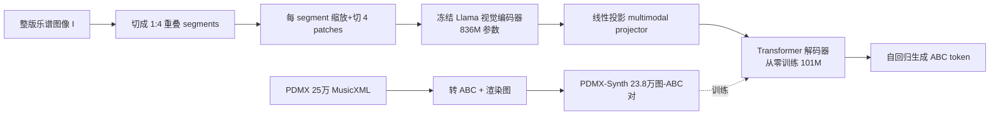

# LEGATO: Large-scale End-to-end Generalizable Approach to Typeset OMR

**会议**: ICLR 2026  
**OpenReview**: [https://openreview.net/forum?id=RdtQiM9gyB](https://openreview.net/forum?id=RdtQiM9gyB)  
**代码**: [https://github.com/guang-yng/legato](https://github.com/guang-yng/legato)  
**领域**: 多模态 / 光学乐谱识别（OMR）  
**关键词**: Optical Music Recognition、ABC notation、预训练视觉编码器、端到端、多页乐谱、BPE 分词  

## 一句话总结
Legato 把一张（甚至多页）整版印刷乐谱图像直接喂给冻结的 Llama 视觉编码器 + 从零训练的 ABC 解码器，端到端转写成简洁的 ABC 符号文本，靠 21.4 万张合成数据成为首个能识别整版/多页 typeset 乐谱、且输出 ABC 的大规模预训练 OMR 模型，在最贴近真实的数据集上把 TEDn 和 OMR-NED 分别绝对降低 68% 和 47.6%。

## 研究背景与动机
**领域现状**：大量乐谱只以扫描影印件形式存在（如 IMSLP 公共领域曲库），把它们数字化成机器可读符号能解锁海量音乐分析与合成数据。光学乐谱识别（OMR）就是干这件事，目前最成功的是端到端神经方法。

**现有痛点**：以往端到端 OMR 几乎都被限定在很窄的输入上——只处理钢琴谱、单声部或单行（single-system）乐谱。真实乐谱的复杂性远超于此：一页里可能有多个 system、多行五线谱、多声部，还夹杂标题、歌词等大量文字标注。最接近通用的 SMT++ 也只在 688 页纯合成钢琴谱（FP-GrandStaff）上训练，泛化能力有限。

**核心矛盾**：（1）**输出格式之争**——MusicXML 冗长难解析、**kern 偏研究者不直观，而评测又高度依赖"模型用什么格式训练就用什么格式评"，导致跨模型比较不公平；（2）**数据稀缺**——端到端 transformer 需要海量"图像-符号"配对，但现成 ABC 数据多为单声部、并非完整乐谱，没有大规模整版乐谱配对集。

**本文目标**：造一个能识别多 system、多页、真实印刷乐谱的通用端到端 OMR 模型，并选一个简洁却近乎完备的输出格式。

**核心 idea**：**[选 ABC 做输出 + 数据驱动分词]** 放弃 **kern/MusicXML，改用 ABC notation——它比 MusicXML 短一个数量级（同一首曲子 ABC 只要几十行 vs 数千行），降低自回归解码成本，且以"音乐元素"而非"排版元素"为中心；**[冻结大视觉编码器 + 从零训小解码器]** 直接复用预训练多模态 Llama 的视觉编码器（冻结），只从零训练一个轻量 ABC 解码器，把通用图像先验迁移到乐谱；**[大规模合成数据]** 用 PDMX 的 25 万 MusicXML 文件渲染出 23.8 万张高多样性"图-ABC"配对集 PDMX-Synth 来撑起预训练。

## 方法详解

### 整体框架
Legato 沿用多模态 Llama 的"视觉编码器 + cross-attention 解码器"骨架。输入整版乐谱图像先被切成 1:4 长宽比以内、相互重叠的 segment，每个 segment 缩放后再切成 4 个 patch，送进**冻结**的 Llama 视觉编码器得到 latent 嵌入；这些嵌入作为 cross-attention 的 key/value，驱动一个从零训练的 transformer 解码器自回归地吐出 ABC token，前面拼一段 context prefix。训练数据则来自作者自建的 PDMX-Synth（MusicXML→ABC→渲染图）。

### 关键设计

**1. PDMX-Synth：用渲染管线造大规模、强增广的图-ABC 配对集，对抗"默认渲染器过拟合"。** OMR 训练最缺的是海量配对数据，而 ABC 官方 75 万样本多为单声部、不像完整乐谱。作者转向 PDMX（25 万 MuseScore 公共领域 MusicXML），用 `xml2abc` 批量转成 ABC，过滤掉长宽比 >10 的极端长谱（约 5%，因为自回归训长序列太贵），最终留下 238,386 对（占原数据 93.8%）。关键在于渲染多样性：用两条管线——MuseScore 3.6.2（MusicXML→PNG）和 abcm2ps（ABC→SVG→CairoSVG→PNG）——并施加大量视觉增广（随机分辨率、随机边距裁剪、50% 横排、70% 随机风格的小节号、随机缩放 [0.9,1]、背景灰度从 [192,255] 均匀采样），避免模型过拟合到某个渲染器的默认参数。

**2. 近规范化 ABC 表示：把同义多写法收敛成唯一形式，降低学习与评测难度。** ABC 语法灵活，同一乐谱可被写成多种文本，给学习和评测都添乱。作者强制几条规范：用 `$` 显式标记真实换行（ABC 里换行本可省略，标出来才能还原原始排版）；每 5 小节强制断行并保留转换器产生的 `%小节总数` 注释；把单位音符长度固定为 8 分音符（`L:1/8`，不改变表达力但统一写法）。此外因 OMR 只关注乐谱符号而非文字，所有标题/乐器名/歌词/注释文字都替换成特殊 token `<|text|>`，让模型专注音乐符号识别。

**3. 数据驱动 BPE 分词：让"复合音乐概念"成为词表里的原子单元。** SMT++ 用专家定义的 **kern 符号词表，而 Legato 直接在 PDMX-Synth 训练集的 ABC 文本上跑 BPE（Sennrich 等 2016），词表大小 4097。好处是高频的复合概念会自然合并成单 token——例如 C 大三和弦 `CEG` 成为一个离散 token，且具备上下文灵活性：在方括号 `[]` 内表示同时发声的和弦，在括号外表示琶音；再配合时值 token `2`/`4` 就能表达四分/二分音符的三和弦。这把音乐结构先验编进了词表，提升表示效率与模型表现。

**4. 图像处理 + 冻结编码器 + 选择性 cross-attention 解码器：在算力可控下处理"很高的整版图"。** 整版乐谱宽度大致固定但可能非常高，所以先沿高度切成长宽比 ≤1:4 的重叠 segment，每个 segment 再缩放裁成 4 个 patch（内部尺寸 $D=448$），得到张量 $p \in \mathbb{R}^{S\times 4\times C\times D\times D}$。视觉编码器（取 `Llama-3.2-11B-Vision` 的 836M 参数部分，**冻结**）输出 $\mathbb{R}^{S\times4\times L\times 6d_v}$（$L=1025, d_v=1280$）。解码器先用线性投影把视觉嵌入对齐到 $d_l$ 维供 cross-attention 使用；核心是 $L_d$ 层 transformer，但只在子集层 $\Gamma_l$ 上做 cross-attention、其余层只做 self-attention 以省算力，MLP 先升维到 $d_u$ 再降回 $d_l$。Legato 用 $d_l=768, d_u=1526, L_d=18, \Gamma_l=\{3,7,11,15\}$（解码器 101M + projector 5.9M）；为与 SMT++ 公平比参数量，还有 Legato$_{small}$（$d_l=320, d_u=448, L_d=8, \Gamma_l=\{3,5,7\}$，解码器 8.5M）。两者均训 10 epoch、batch 32、lr 3e-4、AdamW、序列截断 4096、bf16。

## 实验关键数据

### 主实验表格
统一以 MusicXML 为评测格式（Legato/SMT++ 都不是用它训练的，更公平），TEDn 为主指标，OMR-NED 为格式无关的细粒度指标，**越低越好**。

| 数据集（指标） | n | GPT-5 | SMT++ | **Legato** | Legato$_{small}$ |
|---|---|---|---|---|---|
| Camera String Quartets (TEDn) | 252 | 90.5 | 98.6 | **60.4** | 84.1 |
| Camera String Quartets (OMR-NED) | 252 | 97.6 | 94.7 | **58.2** | 93.5 |
| Rendered String Quartets (TEDn) | 252 | 93.0 | 97.9 | **52.1** | 78.4 |
| Rendered String Quartets (OMR-NED) | 252 | 97.8 | 94.3 | **32.9** | 88.5 |
| Camera Lieder (TEDn) | 64 | 91.4 | 98.7 | **47.0** | 82.7 |
| Rendered Lieder (TEDn) | 64 | 91.0 | 97.4 | **26.5** | 68.8 |
| IMSLP Piano (TEDn) | 32 | 96.7 | 97.7 | **29.7** | 76.9 |

在 IMSLP 真实钢琴扫描谱这一"最现实"场景上，Legato 把 TEDn 从 SMT++ 的 97.7 降到 29.7（绝对 ↓68%），OMR-NED 也从 91.9 降到 44.3（↓47.6%）。所有数据集均**未参与训练/验证**，专测泛化。

### 消融 / 对照实验
- **格式偏置补偿**：TEDn 需输出可转 MusicXML，SMT++ 常转失败；即便只在"SMT++ 能成功转换"的样本子集上比（TEDn$_{convert}$），Legato 仍全面领先（如 Rendered Lieder 上 8.7 vs SMT++ 58.1）。
- **模型规模对照**：Legato$_{small}$ 可训练参数量与 SMT++ 相当（只是多了冻结的大视觉编码器），多数数据集上仍优于 SMT++，说明增益不只来自参数量。
- **通用 VLM 参照**：GPT-5 在 TEDn 上普遍优于 SMT++、但在 OMR-NED 上反而更差（因 OMR-NED 对 **kern 做了语法纠错偏向）；整体远不及 Legato。
- **域外泛化边界**：在手写谱 JAZZMUS 上，因偏离训练分布（纯印刷谱），Legato 泛化有限。

### 关键发现
1. "冻结通用视觉编码器 + 从零训 ABC 解码器 + 大规模强增广合成数据"组合，足以让端到端 OMR 在多个**未见过**的真实数据集上大幅刷新 SOTA。
2. 在最贴近真实的 IMSLP 扫描钢琴谱上提升最大，说明合成数据 + 视觉增广的设计有效缓解了 typeset 偏置。
3. 通用 VLM（GPT-5）尚不能胜任精确 OMR，专门化 + 大数据仍是必要的。

## 亮点与洞察
- **首个三连**：首个能识别整版/多页 typeset 乐谱的大规模预训练 OMR 模型，且首个以 ABC 为输出、首个图像→ABC 的 OMR 模型。
- **格式选择即建模选择**：把 ABC 这种简洁、近完备、以音乐元素为中心的格式当输出，不仅省自回归算力，还让 BPE 能学到和弦/琶音等复合概念——"分词器学会音乐"是很漂亮的副产物。
- **评测公平性的认真对待**：作者刻意用谁都没训过的 MusicXML 做统一评测、并补 TEDn$_{convert}$ 在对手能转换的子集上再比，处处给 baseline 让利仍胜出，结论更可信。
- **冻结大编码器迁移**：把通用图像预训练当 OMR 的强起点，绕开了乐谱图像标注稀缺的问题。

## 局限与展望
- **只识符号、不识文字**：刻意把标题/歌词等文字替换为 `<|text|>`，文本识别留给未来工作；但 TEDn/OMR-NED 仍会算 `<|text|>` 与真值文本的编辑距离，可能影响指标。
- **手写谱泛化弱**：训练分布是印刷谱，JAZZMUS 手写谱上泛化有限。
- **视觉编码器冻结**：未针对乐谱微调编码器，作者也明确指出 finetune 现代视觉编码器是有前景的下一步。
- **长谱被舍弃**：长宽比 >10 的约 5% 极端长谱被过滤，自回归对超长序列仍昂贵。
- **评测仍有格式偏置残留**：OMR-NED 对 **kern 有语法纠错优势、ABC 需先转 MusicXML 可能引入误差，跨格式绝对公平仍难。

## 相关工作与启发
- **端到端 OMR 谱系**：Camera-PrIMuS、单声部/钢琴谱端到端（Calvo-Zaragoza & Rizo；Ríos-Vila 等），到能处理多 system 的 SMT++（本文主要 baseline）。Legato 把"可处理范围"推到整版+多页+多声部。
- **符号音乐格式**：**kern（Humdrum）、ABC（Walshaw 2011）、MusicXML（Good 2001）三者信息大体等价但侧重不同；本文系统比较后选 ABC。
- **多模态架构迁移**：直接搬多模态 Llama 的视觉编码器与 cross-attention 解码器范式到 OMR，是"用通用 VLM 组件解专门文档识别"的好范例。
- **启发**：对任何"图像→结构化符号序列"的文档识别任务（化学式、电路图、数学公式版式），"选一个简洁近完备的目标格式 + 数据驱动分词学复合概念 + 冻结大视觉编码器 + 强增广合成数据"这套组合都值得借鉴。

## 评分
- **新颖性**: ⭐⭐⭐⭐ 首个多页 typeset、首个图像→ABC 的端到端 OMR，格式选择 + 数据驱动分词 + 冻结大编码器的组合有清晰新意，但单个组件多为已有技术的迁移组合。
- **实验充分度**: ⭐⭐⭐⭐ 在 5+ 个未见数据集、多指标、含 camera/rendered 双形态评测，并刻意给 baseline 让利仍胜出；有 GPT-5 与小模型对照，较扎实。略缺更系统的设计消融（如增广各项、ABC vs 其他格式同条件对比）。
- **写作质量**: ⭐⭐⭐⭐ 动机—设计取舍—数据—模型—评测层层递进，对格式选择与评测公平性的讨论尤为清晰透明。
- **价值**: ⭐⭐⭐⭐ 开源模型 + PDMX-Synth 数据集 + IMSLP 标注集，对 OMR 社区有直接基础设施价值，能解锁公共领域乐谱数字化。

<!-- RELATED:START -->

## 相关论文

- [\[ICLR 2026\] WebDS: An End-to-End Benchmark for Web-based Data Science](webds_an_end-to-end_benchmark_for_web-based_data_science.md)
- [\[CVPR 2026\] MarkushGrapher-2: End-to-end Multimodal Recognition of Chemical Structures](../../CVPR2026/multimodal_vlm/markushgrapher-2_end-to-end_multimodal_recognition_of_chemical_structures.md)
- [\[AAAI 2026\] SpeakerLM: End-to-End Versatile Speaker Diarization and Recognition with Multimodal Large Language Models](../../AAAI2026/multimodal_vlm/speakerlm_end-to-end_versatile_speaker_diarization_and_recognition_with_multimod.md)
- [\[ACL 2026\] E2E-GMNER: End-to-End Generative Grounded Multimodal Named Entity Recognition](../../ACL2026/multimodal_vlm/e2e-gmner_end-to-end_generative_grounded_multimodal_named_entity_recognition.md)
- [\[ICLR 2026\] Efficient Discriminative Joint Encoders for Large Scale Vision-Language Re-ranking](efficient_discriminative_joint_encoders_for_large_scale_vision-language_rerankin.md)

<!-- RELATED:END -->
