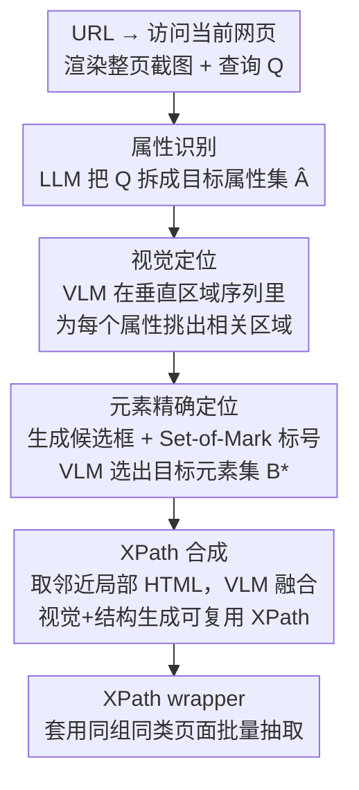

# LiveWeb-IE: A Benchmark For Online Web Information Extraction

**会议**: ICLR 2026  
**arXiv**: [2603.13773](https://arxiv.org/abs/2603.13773)  
**代码**: [GitHub](https://github.com/sbY99/LiveWeb-IE)  
**领域**: 多模态VLM  
**关键词**: 网页信息抽取, 在线评估, 视觉定位, XPath生成, 多模态Agent

## 一句话总结

提出首个面向在线网页的信息抽取（WIE）基准LiveWeb-IE，覆盖文本/图片/超链接等多类数据抽取，并设计Visual Grounding Scraper（VGS）框架，通过模拟人类认知过程——视觉扫描定位区域→精确定位元素→生成XPath——在动态网页上实现鲁棒的信息抽取。

## 研究背景与动机

网页信息抽取（WIE）是从网页中自动提取结构化数据的任务。现有WIE基准（如SWDE、WEIR、PLAtE等）全部基于**静态HTML快照**构建，存在根本性缺陷：

**时效失配**：网页布局和结构随时间不断变化，静态快照无法反映当前网页状态

**性能不可靠**：LLM based wrapper方法在结构演变后的同一网站上F1平均下降超过15%

**数据类型单一**：现有基准仅关注文本抽取，忽略了图片和超链接抽取需求

**复杂度维度缺失**：没有系统化的任务复杂度分层

此外，现有WIE方法过度依赖HTML解析。随着网页结构日趋复杂，HTML的冗余性使得从中准确定位信息越来越困难。

## 方法详解

### 整体框架

本文要解决的是「现有网页信息抽取（WIE）基准全是静态 HTML 快照、跟不上真实网页变化」这件事，给出两个配套贡献：一个面向在线网页的评估基准 LiveWeb-IE，和一个无需训练的抽取方法 VGS。LiveWeb-IE 把评估搬到线上——系统拿到 URL 后必须访问当前时刻的真实网页再作答；VGS 则模拟人在网页上找信息的认知过程，从「整页截图 → 锁定区域 → 精确定位元素 → 合成 XPath」一步步把观察空间收窄，最后产出可复用的 XPath wrapper。下图是 VGS 这条抽取流水线的整体走向（基准 LiveWeb-IE 提供它在线作答的评估场景）：

### 关键设计

**1. LiveWeb-IE：把 WIE 评估从离线快照搬到在线真实网页**

针对「静态快照时效失配、结构一变性能就不可靠」这个痛点，LiveWeb-IE 的核心是要求系统在评估时直接访问目标 URL、处理当前时刻的真实 DOM，而不是预先抓好的 HTML。围绕这点它有四个特性：在线评估、15 个获授权网站横跨 8 个领域（都经过 robots.txt 检查、使用条款审核和管理员直接授权）、覆盖文本/图片/超链接三类数据、并按属性数量和值的基数把任务分成 4 个复杂度级别。这 4 个级别对应四种任务——Type I 单属性单值（"这个教授的邮箱"）、Type II 多属性单值（"球员的身高和体重"）、Type III 单属性列表值（"页面上所有论文标题"）、Type IV 多属性列表值（"所有产品的名称和价格"），复杂度依次递增。

数据通过「网站选择 → 按布局聚类分组 → 数据标注 → 人工交叉验证」构建，最终有 342 个查询、97 个唯一属性、46 个页面组。让基准能长期有效的关键是内容稳定性设计：查询只问事实性信息（如 2022 年世界杯决赛比分），网页布局怎么变、答案本身都不变，所以标注不会随改版失效。

**2. VGS：模拟人类认知，用四阶段逐步收窄观察空间**

VGS 针对「HTML 越来越冗余、直接从中定位信息越来越难」的痛点，干脆绕开纯 HTML 解析，像人一样先用眼睛扫、再逐步聚焦。它分四个阶段，每一步都在缩小要处理的范围——以"所有产品的名称和价格"这个查询为例：

属性识别先用 LLM 把自然语言查询拆成结构化的目标属性集合，把这句话拆成 {名称, 价格}：

$$\hat{\mathcal{A}} = \text{LLM}(I_a, Q)$$

视觉定位把整页渲染成一串固定宽高的垂直区域截图 $\mathcal{R}$，对每个属性用 VLM 在区域序列里挑出相关区域 $r'_i = \text{VLM}(I_g, \mathcal{R}, \hat{a}_i)$。这一步的价值是把后续要精读的范围从「整页」压到「几个产品卡片所在的区域」，大幅缩减观察空间。

元素精确定位在锁定的区域里精确找到目标值，采用两步：先生成候选边界框（文本属性靠 VLM 扫描、非文本属性靠 HTML 标签定位），再用 Set-of-Mark Prompting 给候选覆盖带编号的标记，让 VLM 从中选出正确的元素子集——

$$\mathcal{B}_i^* = \text{VLM}(I_p, r_i^*, \hat{a}_i)$$

XPath 合成则拿精确定位的边界框找到对应 DOM 元素，取邻近距离 $d$ 内的局部 HTML 片段，让 VLM 结合视觉和结构两路信息生成可复用的 XPath：

$$x_i = \text{VLM}(I_x, \mathcal{H}_i, \hat{r}_i, \hat{a}_i)$$

把所有属性的 XPath 合在一起，就是一个能套用到同类页面（如所有商品详情页）的 wrapper，下次抓同结构的页面无需再走一遍 VLM。

### 损失函数 / 训练策略

VGS是**无需训练**的Agent框架，完全基于预训练LLM/VLM的推理能力。评估指标采用Precision、Recall和F1。

## 实验关键数据

### 主实验

**LiveWeb-IE上的Overall F1对比**：

| 骨干模型 | 方法 | Type I F1 | Type II F1 | Type III F1 | Type IV F1 | Overall F1 |
|----------|------|-----------|------------|-------------|------------|------------|
| GPT-4o | COT | 47.54 | 40.84 | 8.15 | 7.24 | 24.60 |
| GPT-4o | AutoScraper | 55.22 | 42.65 | 9.10 | 6.92 | 26.76 |
| GPT-4o | **VGS** | **65.87** | **46.35** | **45.38** | **41.50** | **48.58** |
| Gemini-2.5-Flash | **VGS** | **49.02** | **44.82** | **42.92** | **38.13** | **43.44** |

**开源模型对比（Overall F1）**：

| 骨干模型 | COT | AutoScraper | VGS |
|----------|-----|-------------|-----|
| Qwen-2.5-7B | 11.67 | 16.04 | **21.74** |
| Qwen-2.5-32B | 17.74 | 21.61 | **35.05** |
| Gemma-3-27B | 16.65 | 19.04 | **30.79** |

### 消融实验

VGS各阶段的贡献：
1. **去除视觉定位**：不先定位区域直接精确定位元素，性能显著下降
2. **去除元素精确定位**：跳过Set-of-Mark步骤，复杂类型退化明显
3. **使用HTML替代视觉信息**：Type III和Type IV的F1大幅下降

### 关键发现

1. **静态→在线的性能鸿沟**：LLM方法在结构演变后F1平均下降超过15%，证实在线评估必要性
2. **复杂度差距巨大**：VGS的最大优势在复杂类型——GPT-4o+VGS的Type III F1达45.38%，而COT仅8.15%
3. **视觉信息的关键作用**：纯HTML方法在复杂网页上失败，VGS通过视觉定位绕过HTML噪声
4. **开源vs闭源差距**：即便使用VGS，Qwen-2.5-32B (35.05%) 与GPT-4o (48.58%) 仍有显著差距
5. **Wrapper可复用性**：VGS生成的XPath具有跨同类页面的泛化能力

## 亮点与洞察

- **问题定义创新**：首次将WIE评估从离线搬到在线，通过内容稳定性设计解决标注持久性问题
- **认知启发的设计**：VGS四阶段流程完美模拟人类在网页上找信息的过程
- **视觉+结构双通道**：XPath生成巧妙结合视觉定位结果和局部HTML
- **多类数据覆盖**：将图片和超链接纳入WIE评估贴合实际需求

## 局限与展望

1. 基准规模有限：仅15个网站342个查询，更大规模扩展有价值
2. 内容稳定性假设：部分网站可能改版导致无法访问，需定期维护
3. VLM调用成本高：4个阶段每个都需VLM推理，大规模抽取效率待优化
4. XPath脆性：生成的XPath仍依赖DOM结构，网页大幅改版后可能失效
5. 动态内容处理不足：JavaScript动态渲染内容的处理未充分讨论

## 相关工作与启发

LiveWeb-IE与WebArena等网页Agent基准目标不同——后者关注多步任务完成，LiveWeb-IE关注单页面精确信息抽取。VGS的视觉定位思想与Set-of-Mark Prompting结合，展示了VLM在网页理解中的潜力，可拓展到网页自动化测试等应用。

## 评分

- **新颖性**: ⭐⭐⭐⭐ — 在线WIE基准是新颖且有实际价值的贡献
- **技术质量**: ⭐⭐⭐⭐ — VGS设计合理但技术创新点偏工程化
- **实验充分度**: ⭐⭐⭐⭐ — 多骨干模型对比充分，但消融可更系统
- **实用性**: ⭐⭐⭐⭐⭐ — 直接面向真实网页数据采集场景
- **写作质量**: ⭐⭐⭐⭐ — 基准设计动机和方法流程论述清晰
- **综合**: ⭐⭐⭐⭐ (8.0/10)

<!-- RELATED:START -->

## 相关论文

- [\[ICLR 2026\] WebDS: An End-to-End Benchmark for Web-based Data Science](webds_an_end-to-end_benchmark_for_web-based_data_science.md)
- [\[AAAI 2026\] Exploring LLMs for Scientific Information Extraction using the SciEx Framework](../../AAAI2026/multimodal_vlm/exploring_llms_for_scientific_information_extraction_using_the_sciex_framework.md)
- [\[CVPR 2025\] Relation-Rich Visual Document Generator for Visual Information Extraction](../../CVPR2025/multimodal_vlm/relation-rich_visual_document_generator_for_visual_information_extraction.md)
- [\[ICML 2025\] LAION-C: An Out-of-Distribution Benchmark for Web-Scale Vision Models](../../ICML2025/multimodal_vlm/laion-c_an_out-of-distribution_benchmark_for_web-scale_vision_models.md)
- [\[AAAI 2026\] Towards Scalable Web Accessibility Audit with MLLMs as Copilots](../../AAAI2026/multimodal_vlm/towards_scalable_web_accessibility_audit_with_mllms_as_copilots.md)

<!-- RELATED:END -->
