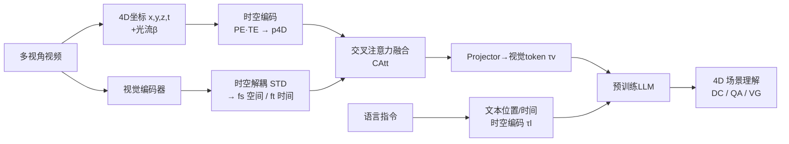

# LLaVA-4D: Embedding SpatioTemporal Prompt into LMMs for 4D Scene Understanding

**会议**: ICLR 2026  
**OpenReview**: [https://openreview.net/forum?id=URpbmVEsqB](https://openreview.net/forum?id=URpbmVEsqB)  
**代码**: [https://github.com/hyzhouboy/LLaVA-4D](https://github.com/hyzhouboy/LLaVA-4D)  
**领域**: 多模态大模型 / 4D 场景理解  
**关键词**: LMM, 4D 场景理解, 时空 prompt, 时空解耦, 多视角视频, 动态物体  

## 一句话总结
LLaVA-4D 把"3D 位置 + 1D 时间"编码成动态感知的 4D 坐标作为时空 prompt，并把视觉特征解耦成空间/时间分量后与之交叉注意力融合，让大多模态模型第一次能同时理解静态背景和随时间运动的动态物体。

## 研究背景与动机
- **领域现状**：2D LMM（LLaVA、PaLI 等）在图像理解上很强，但缺乏 3D 空间表征，无法和物理世界交互。现有 3D LMM（3D-LLM、LLaVA-3D、Video-3D LLM）通过把 3D 位置作为固定空间 prompt 嵌入视觉特征来表示场景。
- **现有痛点**：这些 3D 方法用"统一的空间表征"描述整个场景，**只能处理静态背景**，对位置漂移、形变等随时间变化的动态物体束手无策——问"这个物体接下来会往哪走"时它们答不上来。已有的 4D vision-language 工作又大多是任务专用、且对动态物体和静态背景用同一种表征策略，存在异质特征错配风险。
- **核心矛盾**：4D 场景同时含空间（颜色/外观）和时间（运动）两类异质信息，**统一表征会让两者互相干扰**；但动态物体和静态背景在 3D 位置编码上又高度相似，单靠空间维度难以区分二者。
- **本文目标**：构建一个**通用**（非任务专用）的 vision-language LMM，让它既懂静态背景又懂动态物体的时空特性。
- **核心 idea**：作者有两个关键观察——**(1)** 背景和物体共享相似的 3D 位置编码，但在时间维度上运动模式截然不同，因此把 3D 位置编码扩展成"动态感知 4D 坐标编码"就能区分二者；**(2)** 从视觉特征中解耦出的空间/时间分量比原始视觉特征对"区分背景与物体"更具判别力。两点共同支撑"**4D 时空 prompt + 时空解耦视觉嵌入**"的设计。

## 方法详解

### 整体框架
LLaVA-4D 把多视角视频输入逐级转成 LLM 可推理的时空 token，分三个阶段：① **动态感知 4D 坐标编码**——从多视角视频构造 $[x,y,z,t]$ 坐标张量并做时空编码，得到时空 prompt $p_{4D}$；② **时空解耦视觉嵌入**——把视觉特征解耦成空间/时间分量，再用交叉注意力把 4D 坐标融合进去；③ **坐标对齐语言嵌入**——把融合后的视觉特征投影到语言空间，并对文本里的位置/时间做同样的时空编码与之对齐，最后交给预训练 LLM 推理。

### 关键设计

**1. 动态感知 4D 坐标编码：用运动线索把"位置相同"的背景和物体拉开。** 给定某视角某时刻的图像，先用 SfM 求相机位姿、MVS 求深度，结合内参把 2D 像素 $x_{2D}$ 反投影到世界坐标 $x_{3D}=R^{-1}(D(x_{2D})\cdot K^{-1}x_{2D}-T)$，遍历所有视频拼成 4D 坐标张量 $[x,y,z,t]$。空间维度上，背景和物体用**同一套** learnable Fourier 位置编码 $p_{xyz}=\mathrm{PE}(x,y,z)$，因为光看某一时刻多视角图像很难区分二者；区分的关键放在时间维度——时间编码里**乘进光流运动信息** $p_t=\mathrm{TE}(t)\cdot(1+\Phi(\beta))$，其中 $\beta$ 是估计光流、$\Phi$ 是 softmax。这样运动剧烈的动态物体和静止背景在时间编码上自然分开。光流只作辅助运动线索而非唯一时间信号，这套 prompt 还可扩展（语义、动作等额外属性）。

**2. 时空解耦视觉嵌入：让异质特征各归其位再定位。** 直接用统一视觉表征会让空间外观和时间运动互相错配，因此先把多视角视觉特征 $f_{v,t}$ 解耦：**空间特征**取同一时刻不同视角间特征的相关性 $f_s=\mathrm{Aggregate}(\{f_{v=i,t}^\top f_{v=j,t}\mid i\neq j\})$，刻画整体外观；**时间特征**取同一视角相邻时刻特征的相关性 $f_t=\mathrm{Aggregate}(\{f_{v,t=i}^\top f_{v,t=i+1}\})$，刻画运动变化。作者用聚类可视化证实：原始视觉特征里物体区域是散乱的，但解耦后的时空特征对物体/背景都呈清晰聚簇，判别力更强。解耦后的特征还缺世界坐标定位，于是把 $p_{4D}$ 当 query、时空特征当 key/value 做交叉注意力 $o=\mathrm{softmax}(qk^\top/\sqrt{d})\cdot v$，再用一个门控 $\alpha=\sigma(\mathrm{MLP}_{obj}(p_{4D}))$ 做残差融合 $f_{st}=\alpha\cdot o+(1-\alpha)\cdot f_s$，得到带 4D 感知的视觉时空特征。

**3. 坐标对齐语言嵌入：视觉和文本用同一把"时空尺子"。** LLM 只接受文本式 token，因此先用 MLP 把 $f_{st}$ 投影到语言空间得到视觉时空 token $\tau_v^{st}$。对输入指令里出现的文本坐标——位置 $t_p$ 和时间 $t_t$——施加**与视觉端完全相同**的 $\mathrm{PE}(\cdot)$ 与 $\mathrm{TE}(\cdot)$ 编码：$\tau_s=\mathrm{PE}(t_p)$、$\tau_t=\mathrm{TE}(t_t)$，再加权融进词 token $\tau_l^{st}=\tau_l+w_s\tau_s+w_t\tau_t$。视觉 token 与语言 token 拼接后交给 LLM，保证"图里某坐标"和"文本里某坐标"落在同一表征空间，从而实现可交互的 4D 定位与问答。

**4. Chat4D 数据集与三阶段训练：用数据补齐 4D 监督缺口。** 4D vision-language 数据此前是空白，作者构建 Chat4D（共 879.1K 样本，覆盖 2D 37.6% / 3D 36.9% / 4D 25.5%，含 dense caption、QA、visual grounding 三类任务）。4D 部分用 3D 检测器 + GPT-4V 抽取局部时空信息（类别/位置/时间），再由 text-only GPT 生成全局 4D 描述，并经两轮清洗（自动过滤掉 4.7% 轨迹不一致样本 + 人工剔除 0.8% 异常标注）。训练分三阶段：**Stage 1** 用 2D/3D 的 DC+QA 做内容对齐（仅更新交叉注意力与 projector，$p_{4D}$ 置零）；**Stage 2** 用 VG 数据做时空坐标对齐（更新 4D 编码与融合模块）；**Stage 3** 用 4D 数据做指令微调（除视觉编码器外全更新）。

## 实验关键数据

### 主实验表格（3D + 4D Benchmark，节选）

| 方法 | Scan2Cap C@0.5↑ | ScanQA B-4↑ | Multi3DRefer F1@0.5↑ | Chat4D SAcc@0.5↑ | Chat4D TAcc↑ |
|------|------|------|------|------|------|
| LLaVA-3D | 79.2 | 14.5 | – | 42.2 | – |
| Video-3D LLM | 83.8 | 16.2 | 52.7 | 52.8 | – |
| **LLaVA-4D (Ours)** | **85.3** | **17.9** | **54.3** | **58.9** | **54.6** |

- 在纯 3D benchmark 上也全面领先（说明解耦出的空间特征本身就比普通视觉特征强），在 4D benchmark 上优势更显著；TAcc（时间定位精度）这一列只有 LLaVA-4D 能给出（3D LMM 无时间表征，整列为空）。

### VSI-Bench 空间推理

| 方法 | Average | Obj. Count | Room Size | Rel. Dist. |
|------|------|------|------|------|
| Spatial-MLLM | 48.4 | 65.3 | 63.1 | 41.3 |
| **LLaVA-4D** | **48.6** | **68.2** | **64.8** | **44.5** |

### 时间理解对比

| 方法 | SAcc@0.5↑ | TAcc↑ | tIoU@0.5↑ |
|------|------|------|------|
| Grounded-VideoLLM | 9.4 | 5.1 | 47.0 |
| LLaVA-ST | 15.2 | 7.3 | 58.7 |
| **LLaVA-4D** | **58.9** | **54.6** | **61.5** |

- 与视频 LMM 相比 tIoU 相当，但需要细粒度 4D 坐标理解的 SAcc/TAcc 远超对手（58.9 vs 15.2，54.6 vs 7.3）。

### 消融实验表格

| Coor.embed | Feat.disent | Feat.fusion | C↑ | SAcc@0.5↑ | TAcc↑ |
|:---:|:---:|:---:|---|---|---|
| × | × | × | 62.3 | 34.8 | 12.7 |
| √ | × | × | 85.4 | 51.5 | 47.5 |
| √ | √ | × | 89.0 | 54.3 | 51.2 |
| √ | √ | √ | **93.5** | **58.9** | **54.6** |

| 坐标编码消融 | C↑ | SAcc@0.5↑ | TAcc↑ |
|------|------|------|------|
| w/o Encoding | 75.0 | 47.2 | 46.8 |
| w/ 3D position | 88.6 | 53.4 | 47.0 |
| w/ 1D time | 82.7 | 48.5 | 52.7 |
| **w/ 4D coordinate** | **93.5** | **58.9** | **54.6** |

### 关键发现
- **坐标编码是性能跃升的关键**：仅加坐标编码就把 TAcc 从 12.7 拉到 47.5，是收益最大的单一模块；解耦和融合在此基础上进一步提升上限。
- **3D 位置主要帮空间、1D 时间主要帮时间**：单独加 3D 位置 SAcc 提升明显（47.2→53.4）、单独加 1D 时间 TAcc 提升明显（46.8→52.7），二者合成 4D 坐标才能同时拉满。
- **注意力融合 > 拼接/加权**（SAcc 58.9 vs 54.3/55.1），因为注意力能按 4D 坐标动态调权，而拼接/加权是固定权重的全局融合。
- 时空 prompt 可扩展：额外引入语义/动作 mask 作为 prompt 仍能正常工作。

## 亮点与洞察
- **首个面向 4D 场景理解的通用 vision-language LMM**：把 3D LMM 的"空间 prompt"范式升维成"时空 prompt"，把"理解动态物体"这件 3D LMM 做不了的事补上。
- **两个干净的观察驱动两个设计**：背景/物体"空间相似、时间相异"→ 把判别力放进时间编码（乘光流）；视觉特征解耦后判别力更强 → 时空解耦视觉嵌入。设计动机和现象观察一一对应，可解释性强。
- **视觉与文本共享同一套时空编码**，让"图里坐标"和"文本里坐标"天然对齐，是 4D 定位/问答能 work 的关键工程点。
- 顺手补齐了 4D vision-language 数据空白（Chat4D，879K 样本 + 生成与清洗管线）。

## 局限与展望
- **依赖几何重建链路**：4D 坐标来自 SfM 位姿 + MVS 深度 + 光流，这些前端估计的误差会传导到坐标 prompt；论文未充分讨论重建失败/弱纹理场景下的鲁棒性。
- **数据多为短视频**（多数 6–12 秒），长时序、长程运动与遮挡下的表现未验证。
- **4D 标注由 GPT-4V + text-only GPT 生成**，尽管经两轮清洗，仍可能残留幻觉/坐标偏差，标注质量上限受生成模型制约。
- 基座为 LLaVA-1.5-7B + CLIP-ViT-L，规模偏小；在更大基座、开放世界真实视频上的扩展性待观察。

## 相关工作与启发
- **3D LMM**（3D-LLM、LLaVA-3D、Video-3D LLM、PQ3D 等）：把 3D 位置作空间 prompt，本文直接对标并指出其"无时间维度"的硬伤。
- **4D vision & language**（4D Gaussians 语义查询、4D encoder 对齐）：本文批评其任务专用 + 同构表征，针对性提出通用框架 + 时空解耦。
- **位置编码**：沿用 learnable Fourier feature，但创新点在于把光流当运动调制乘进时间编码。
- **启发**：当一个模态有两类异质信息（空间外观 vs 时间运动）时，"先解耦再按坐标融合"比"统一表征"更稳；以及"用一个轻量物理线索（光流）去打破编码歧义"是个低成本高收益的技巧，可迁移到其他多模态时空任务。

## 评分
- **新颖性**: ⭐⭐⭐⭐ 首个通用 4D 场景理解 LMM，时空 prompt + 时空解耦是清晰且有观察支撑的新范式，但每个组件（Fourier 编码、交叉注意力融合、三阶段训练）单看都是成熟模块的组合。
- **实验充分度**: ⭐⭐⭐⭐ 覆盖 3D/4D/VSI-Bench/时间理解多个 benchmark，消融把三模块与 3D/1D/4D 坐标拆得很清楚，并有特征可视化佐证机制；但缺重建误差敏感性与长视频分析。
- **写作质量**: ⭐⭐⭐⭐ 动机—观察—设计的逻辑链顺畅，图 1/3/6 把"为什么 3D 不够、解耦为何有效"讲得直观，公式与流程对应清晰。
- **价值**: ⭐⭐⭐⭐ 把 LMM 从静态 3D 推进到动态 4D，并配套开放数据集与代码，对具身/自动驾驶等动态物理世界理解有较强实用与延续价值。

<!-- RELATED:START -->

## 相关论文

- [\[CVPR 2025\] 4D LangSplat: 4D Language Gaussian Splatting via Multimodal Large Language Models](../../CVPR2025/multimodal_vlm/4d_langsplat_4d_language_gaussian_splatting_via_multimodal_large_language_models.md)
- [\[CVPR 2026\] 4DWorldBench: A Comprehensive Evaluation Framework for 3D/4D World Generation Models](../../CVPR2026/multimodal_vlm/4dworldbench_a_comprehensive_evaluation_framework_for_3d4d_world_generation_mode.md)
- [\[CVPR 2026\] 4DP-QA: Scalable QA for 4D Perception in Vision Language Models](../../CVPR2026/multimodal_vlm/4dp-qa_scalable_qa_for_4d_perception_in_vision_language_models.md)
- [\[ICLR 2026\] Meta-Adaptive Prompt Distillation for Few-Shot Visual Question Answering](meta-adaptive_prompt_distillation_for_few-shot_visual_question_answering.md)
- [\[ICLR 2026\] LLaVA-FA: Learning Fourier Approximation for Compressing Large Multimodal Models](llava-fa_learning_fourier_approximation_for_compressing_large_multimodal_models.md)

<!-- RELATED:END -->
