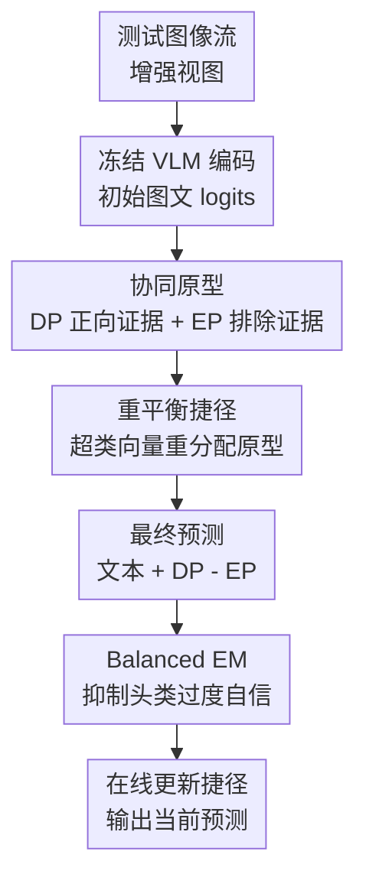

# Long-tailed Test-Time Adaptation for Vision-Language Models

**会议**: ICLR2026  
**OpenReview**: [https://openreview.net/forum?id=jLO4pSi5Pt](https://openreview.net/forum?id=jLO4pSi5Pt)  
**代码**: https://github.com/xuc865/LTTA  
**领域**: 多模态VLM  
**关键词**: 长尾测试时适应, 视觉语言模型, 原型缓存, 类别重平衡, 熵最小化

## 一句话总结

本文首次把视觉语言模型的测试时适应放到长尾测试流中系统研究，提出 L-TTA 用协同原型、可学习重平衡捷径和 Balanced Entropy Minimization 同时修补尾类语义不足、跨模态偏置放大和熵最小化偏向头类的问题，在 OOD、跨域和噪声长尾基准上都提升了准确率与 Macro-F1。

## 研究背景与动机

**领域现状**：CLIP 这类视觉语言模型已经具备很强的零样本识别能力，但真实部署时测试数据往往来自新的域、带噪声或者类别分布变化。测试时适应（Test-Time Adaptation, TTA）的思路是在推理阶段只看无标签测试流，边预测边用熵最小化、提示词更新、历史特征缓存等方式把模型调到当前测试分布上。

**现有痛点**：已有 VLM TTA 方法大多默认测试集接近平衡，或者至少没有专门处理明显长尾的类别流。现实里更常见的是少数头类频繁出现，多数尾类很少出现；在一轮在线 TTA 中，前面样本会持续影响后续模型状态，头类就更容易把决策边界推向自己，尾类的表示和原型长期初始化不足。

**核心矛盾**：VLM 的长尾 TTA 比单模态长尾识别更麻烦。第一，文本嵌入本身带有预训练偏置，有些类别即使不是头类也天然更容易被 CLIP 识别，作者称为 rich classes；当 rich classes 与头类重合时，尾类会被文本先验进一步侵蚀。第二，把单模态长尾 TTA 方法直接套到 VLM 上，会让视觉特征和文本原型之间已有的错配在在线更新中继续放大。

**本文目标**：作者要解决的是一个在线、无标签、单轮次的长尾测试流问题：既不能像传统长尾学习那样重采样训练集，也不能依赖昂贵的离线正则；方法必须在测试流中不断更新，同时保持视觉和文本空间对齐，并让尾类获得足够的语义支撑。

**切入角度**：论文的观察是，VLM TTA 中的历史知识不应只缓存“高置信属于某类”的样本，因为尾类早期很可能没有这样的样本。即使一个增强视图不属于某个类别，它对“这个类别不该长什么样”也有信息；如果把正向确定性原型和排除性原型结合起来，再用可学习的跨类别重分配机制调节原型，就能在测试时为尾类补足更细粒度的跨类别知识。

**核心 idea**：L-TTA 用“确定性原型 + 排除性原型”积累多模态历史语义，用 Rebalancing Shortcuts 对原型进行可学习重分配，再用对不确定尾类更友好的 BEM 代替普通熵最小化，从而把长尾 VLM TTA 从简单置信度自训练变成原型、捷径和损失共同重平衡的在线过程。

## 方法详解

### 整体框架

L-TTA 的输入是一条无标签测试图像流和固定类别文本，主干可以是预训练 CLIP 或其他 VLM。对每张测试图像，方法先生成多个随机裁剪增强视图，用原始文本嵌入得到初始预测；随后根据预测置信度更新两类原型，给这些原型接入可学习的重平衡捷径，最后用文本相似度、确定性原型亲和度和排除性原型亲和度共同形成最终 logits，并在当前测试步优化捷径参数。

这套流程的关键不在于重训 VLM 主干，而是在测试时维护一个围绕类别展开的轻量状态：文本原型保持冻结，视觉原型持续记录测试流中的类别证据，捷径负责把头尾类之间的原型分配拉开，BEM 则把熵最小化的梯度从“继续强化最自信头类”改成“更关注罕见且不确定的类别”。

### 关键设计

**1. 协同原型：让尾类即使没有高置信样本也能被持续更新**

普通原型缓存只在模型确信某个视图属于类别 $c$ 时，才把这个视图的视觉特征写入类别 $c$ 的原型。长尾测试流下，这会天然偏向头类：头类样本来得早、来得多，原型迅速稳定；尾类样本少且预测不确定，原型要么迟迟不初始化，要么只存下很稀薄的语义。L-TTA 因此把协同原型（Synergistic Prototypes, SyPs）拆成两部分：确定性原型（Deterministic Prototypes, DPs）记录“最像某类”的证据，排除性原型（Exclusionary Prototypes, EPs）记录“最不像某类”的细粒度关系。

DP 的更新仍然基于高置信增强视图。给定图像 $x$ 的 $Q$ 个裁剪视图，模型计算每个视图的预测熵，只把熵低于阈值 $\theta$ 的视图集合 $T$ 用于更新最大预测类别 $c^*$ 的原型：$v_{c^*} \leftarrow \mathrm{norm}((N^{DP}_{c^*,s}-1)v_{c^*}+\tilde v_{c^*})$，其中 $\tilde v_{c^*}=\mathrm{avg}_{i\in T} f(\tilde x_i)$。这部分保证原型不被明显歧义视图污染。

EP 的关键更有意思：它不是只给预测类别存一个“负缓存”，而是让每个视图都参与所有类别的排除性更新。论文用 $\phi_c=(\max_{c'}P(y_{c'}|\tilde x_i)-P(y_c|\tilde x_i))/\max_{c'}P(y_{c'}|\tilde x_i)$ 衡量该视图对类别 $c$ 的排除强度；如果某视图对类别 $c$ 概率很低，$\phi_c$ 就大，EP 会更强地吸收这个“不是 $c$”的特征。这样一来，即使尾类暂时没有被预测为 top-1，它的 EP 也能沿着测试流持续积累跨类别边界信息，缓解尾类原型空转的问题。

**2. 重平衡捷径：在冻结文本提示的同时让类别原型可学习地重新分配**

许多 VLM TTA 方法会优化 prompt，让梯度穿过文本编码器；但在长尾场景中，文本侧本来就有 rich class 偏置，继续改 prompt 容易把这种偏置放大。L-TTA 选择冻结 prompt 和主干，把可学习性集中放到 SyPs 上：它引入 $K$ 个共享的 hyper-class vectors $q=\{q_j\}_{j=1}^K$，通过 cross-attention 为 DP 和 EP 添加 Rebalancing Shortcuts（RSs）。对类别 $c$ 来说，更新形式可以写成 $v_c \leftarrow \mathrm{Attn}([v_c,t_c],q_j)q_j+v_c$，$u_c \leftarrow \mathrm{Attn}([u_c,t_c],q_j)q_j+u_c$。

这里的 hyper-class vector 可以理解成若干可学习的“类别簇专家”。如果所有头类都挤到少数专家上，尾类仍会被头类原型支配；所以作者借鉴 MoE 的 load balancing loss，设计 Class Re-Allocation（CRA）损失，把每个专家被选为 top-1 的次数和平均 attention 激活相乘后最小化。这个目标鼓励不同类别原型更均匀地分配到多个超类向量上，使头类不能垄断原型空间，也让尾类有机会通过共享专家获得来自相近类别的知识迁移。

RS 和 SyPs 是互相补位的：SyPs 提供稳定、不断更新的测试流知识，RS 则把这些知识从静态缓存变成可优化的类别重分配。它不需要反传到视觉或文本主干，计算上比更新大模型轻得多，但又比纯 training-free 缓存更有主动修正能力。

**3. 最终预测：用文本、正向原型和排除性原型共同塑造 logits**

L-TTA 的最终预测不是只看图文相似度。对测试图像的视觉特征 $f(x)$，它先保留与文本嵌入 $t_c$ 的相似度，再加上与确定性原型 $v_c$ 的亲和度，同时减去与排除性原型 $u_c$ 的亲和度：$P_{LTTA}(y_c|x)=\sigma(f(x)t_c + A(f(x)v_c)-A(f(x)u_c))$。其中 $A(x)=\lambda_1\exp(-\lambda_2(1-x))$ 是亲和度缩放函数。

这个公式把 SyPs 的含义用到了预测层面：DP 像一个“支持证据”，如果图像靠近类别 $c$ 的确定性原型，该类 logit 会被抬高；EP 像一个“排除证据”，如果图像靠近类别 $c$ 的排除性原型，该类 logit 会被压低。对尾类来说，这比只依赖稀疏的正样本缓存更稳，因为 EP 已经从大量非尾类视图中学到了边界信息。

**4. Balanced Entropy Minimization：把无监督适应的梯度从头类过度自信中拉回来**

普通熵最小化在 TTA 中很常见：让预测分布更尖锐，模型就会更自信。但长尾流里，头类更频繁成为 top-1，熵最小化会不断让头类 logits 更高；尾类因为少见且不确定，反而更容易被推离决策边界。论文用命题说明，在长尾 TTA 中，头类 logit 的熵梯度期望更倾向于继续增强置信度，而尾类则承受相反方向的压力。

BEM 的做法不是简单把类别先验加到 logits 上，因为在无标签熵最小化里，直接 logit adjustment 可能继续强化已有偏置。它在 logits 中加入带置信度调制的先验惩罚：$z'=z-(1-\tilde P)^\beta\log(\pi/\sum_i\pi_i)$，再计算 $L_{BEM}=H'(\tilde P)=-\sigma(z')\log\sigma(z')$。其中 $\pi$ 是基于当前伪标签持续更新的类别先验，$(1-\tilde P)^\beta$ 会显著降低高置信类别的先验影响，让损失更关注“不确定且稀有”的类别。最终目标为 $L_{LTTA}=L_{BEM}(P_{LTTA})+\eta L_{CRA}$，即一边重平衡熵最小化，一边约束快捷径的类别重分配。

### 一个完整示例

可以把一次测试流中的“金鱼、山雀、飞机零件”识别想成一个在线过程。假设前几十个样本大多来自金鱼和山雀，CLIP 文本嵌入又天然更容易把某些常见动物类识别对，那么普通 TTA 会不断强化这些头类或 rich classes；当一个少见的飞机类别样本晚些出现时，它的视觉特征很可能被拉向已有头类边界，尾类原型也没有足够证据纠正它。

在 L-TTA 中，早期高置信的金鱼视图会更新金鱼 DP，但同一批视图也会以较大的 $\phi_c$ 更新“飞机”等无关类别的 EP，相当于告诉系统“这些纹理和形状不该属于飞机”。等到飞机样本出现时，它不只和文本原型比较，还会同时避开那些已积累的排除性原型；RS 会把飞机原型和相近视觉簇重新分配到合适的 hyper-class vectors，而 BEM 则避免因为飞机当前置信度低就被头类继续压制。最终，这个样本的预测来自文本先验、正向原型支持、排除性边界和重平衡损失的合力，而不是单纯相信当前最自信的类别。

### 损失函数 / 训练策略

训练或更新发生在测试时，每个样本到来后只更新轻量的 RS 相关参数和原型状态，VLM 主干与 prompt 保持冻结。实现中默认使用 CLIP ViT-B/16，图像生成 15 个随机裁剪增强视图；优化器为 AdamW，权重衰减 $10^{-1}$，$\epsilon=10^{-3}$。主文默认超参数包括 $\eta=1$、$\lambda_1=6$、$\lambda_2=6$、$\beta=1$，类别不平衡比设置为 $\mathrm{imb}\in\{10,20,50\}$。

最终优化目标由两部分组成：$L_{BEM}$ 控制最终预测的无监督熵最小化方向，$L_{CRA}$ 控制 hyper-class vectors 的类别重分配；二者通过 $\eta$ 权衡。类先验 $\pi$ 不是来自真实标签，而是随测试流中当前伪标签的类别计数在线更新，因此方法仍然符合无标签 TTA 设定。

## 实验关键数据

### 主实验

论文把 15 个数据集改造成长尾分布，覆盖三类基准：OOD Benchmark 包含 ImageNet-A/R/S/V2 和 ImageNet，Cross-Domain Benchmark 包含 ImageNet 与 10 个细粒度数据集，Corruption Benchmark 在图像上加入不同强度噪声。指标除了 Accuracy，还报告 Macro-F1，用来衡量头尾类是否更均衡。

| 长尾基准 | 设置 | 本文 L-TTA | 之前较强方法 | 提升 |
|--------|------|------------|--------------|------|
| LT-OOD OOD Average | imb=10, Acc. / Mac. | 65.97 / 61.18 | DPE 64.50 / 60.15 | +1.47 / +1.03 |
| LT-OOD OOD Average | imb=20, Acc. / Mac. | 64.92 / 60.52 | DPE 64.21 / 58.82 | +0.71 / +1.70 |
| LT-OOD OOD Average | imb=50, Acc. / Mac. | 64.68 / 59.78 | DPE 63.71 / 55.43 | +0.97 / +4.35 |
| LT-Cross-Domain Average | imb=10/20/50 平均, Acc. / Mac. | 68.77 / 63.44 | DPE 67.75 / 61.24 | +1.02 / +2.20 |
| LT-Corruption Average | gaussian noise, Acc. / Mac. | 43.31 / 39.97 | DPE 40.44 / 37.33 | +2.87 / +2.64 |

在 OOD 长尾基准上，随着不平衡比从 10 加重到 50，许多原型或缓存方法的 Macro-F1 明显下降，例如 DPE 从 60.15 掉到 55.43，SCAP 从 57.42 掉到 53.83；L-TTA 的 OOD Average Macro-F1 从 61.18 到 59.78，下降更小，说明它确实更抗长尾恶化。

跨域结果更能说明泛化性。L-TTA 在 11 个数据集中的 10 个上取得最好结果，平均 Accuracy / Macro-F1 达到 68.77 / 63.44；Macro-F1 提升大于 Accuracy 提升，符合论文目标：不只是把头类做得更准，而是让类别间更均衡。

噪声基准中优势进一步扩大。作者解释说，training-free 方法依赖干净特征形成稳定簇，噪声会破坏这个假设；一些需要更新主干或提示的单模态式适应又容易放大跨模态错配。L-TTA 的 SyPs、RSs 和 BEM 更依赖样本级在线证据与轻量跨模态重平衡，因此在 corruptions 下更稳。

### 消融实验

| 配置 | ViT-B/16 Acc. | ViT-B/16 Mac. | 说明 |
|------|---------------|---------------|------|
| DP | 68.68 | 63.40 | 只用确定性原型，尾类仍容易缺少证据 |
| DP + RS | 69.76 | 64.12 | 加入重平衡捷径后，原型可学习重分配带来提升 |
| EP | 67.54 | 62.20 | 只用排除性原型不够，但能提供边界信息 |
| EP + RS | 68.03 | 62.77 | RS 对 EP 也有帮助，但缺少正向类别证据 |
| SyP(DP+EP) + RS | 70.94 | 65.17 | 正向证据和排除证据协同后效果明显更好 |
| SyP + RS + BEM | 71.30 | 65.83 | 完整模型最好，BEM 继续改善头尾优化差距 |

消融表说明三块设计不是简单堆叠。DP 负责可靠正证据，EP 负责跨类别排除边界，RS 让原型从静态缓存变成可学习重分配，BEM 则在优化目标层面对长尾熵最小化做校正；缺任何一块都会损失 Macro-F1。

| 分析项 | 关键结果 | 解释 |
|------|---------|------|
| 效率 | L-TTA 1.45h / 1.89G，LT-CDB HM 67.20 | 比需要主干梯度的 WATT、RLCF、SCAP 更轻，同时 HM 更高 |
| 其他 backbone | ViT-L/14 上 73.07 / 70.15，SigLIP-L/16 上 76.75 / 72.77 | 在更强 VLM backbone 上仍有平均约 1.5% Acc. / 1.8% Mac. 收益 |
| CRA 权重 $\eta$ | $\eta=1$ 最优 | 过小缺少重分配，过大可能过分追求簇均匀而影响在线适应 |
| BEM 惩罚 $\beta$ | $\beta=1$ 最优 | 太小接近原始 logits，太大过度依赖类别先验 |
| 动态头尾变化 | ImageNet / Flowers 上随 $\epsilon$ 改变表现稳定 | 尾类更早或更晚出现时，方法没有明显崩溃 |

### 关键发现

- 协同原型是最大贡献之一。只保留 DP 或 EP 都不如两者结合，说明长尾 VLM TTA 同时需要“属于某类”的正证据和“不属于某类”的排除性边界。
- Macro-F1 的提升通常比 Accuracy 更能体现 L-TTA 的价值。跨域平均 Macro-F1 比 DPE 高 2.20，噪声平均 Macro-F1 高 2.64，说明方法确实在改善类别均衡，而不是只刷总体准确率。
- BEM 比传统长尾 logit adjustment / balanced softmax 更适合无标签 TTA。附录中把 LA、BS 加到 MTA 或 DPE 上收益很有限，而 BEM 能带来更稳定增益，原因是它用置信度调制类别先验，避免高置信头类继续被强化。
- 方法在噪声条件下的优势更大，说明 VLM 长尾 TTA 不只是类别频率问题，还与跨模态错配和特征簇可靠性有关。

## 亮点与洞察

- 把 VLM TTA 的长尾失败模式讲得比较具体。论文没有只说“类别不平衡会掉点”，而是拆出 text-induced tail erosion 和 modality-bias amplification，让人看到文本先验、测试流顺序和跨模态对齐三者是如何一起伤害尾类的。
- EP 的设计很有迁移价值。它把每个视图对所有类别的低概率信息利用起来，适合那些正样本稀缺但负证据丰富的在线场景；这个思路也可能迁移到开放词表检测、长尾检索或增量类别发现中。
- BEM 的关键不是简单加入类别先验，而是用 $(1-\tilde P)^\beta$ 把先验影响集中到不确定类别上。这个细节回应了无监督熵最小化和有监督交叉熵的差异，是比直接套长尾分类损失更稳的选择。
- RS 把“类别重平衡”放在原型空间而非大模型参数里，工程上较轻。它既有可学习能力，又避免在测试时反传整条视觉或文本编码器，适合部署约束较强的在线适应任务。

## 局限与展望

- 方法仍然依赖类别集合已知的闭集分类设定。若测试流中出现未知类别、开放集噪声或类别文本本身不准确，DP/EP 的更新和 BEM 的伪标签先验都会受到影响。
- 类先验来自当前伪标签计数，早期错误预测可能影响后续 BEM。虽然 EP 和 RS 能缓解这种问题，但在极端短测试流或强 domain shift 下，伪标签统计是否可靠仍值得进一步验证。
- 实验主要集中在图像分类式 VLM TTA。对于检测、分割、视觉问答、视频理解等更复杂输出空间，如何定义类别原型、排除性原型和长尾 Macro-F1 还需要重新设计。
- 方法有多个超参数，例如增强视图数量、$K$、$\eta$、$\beta$、$\lambda_1$、$\lambda_2$。论文展示了敏感性分析，但真实部署中仍需要更自动化的在线调参或无参化策略。
- EP 需要利用所有类别的预测概率更新排除性原型，类别数很大时可能带来额外状态和计算开销。未来可以考虑稀疏类别候选、近邻类别更新或层次化类别簇来扩展到更大标签空间。

## 相关工作与启发

- **vs TPT / C-TPT / O-TPT**: 这些方法主要通过测试时提示调节和熵最小化改善 CLIP 零样本泛化，适合平衡或近似平衡设定；L-TTA 不再只优化 prompt，而是围绕长尾测试流维护原型、重分配捷径和 BEM，因此更关注头尾类决策边界。
- **vs TDA / DPE**: TDA 和 DPE 都利用历史原型或缓存增强 VLM TTA，说明测试流记忆很重要；L-TTA 的区别是把原型分为 DP 和 EP，并用 RS 主动重平衡，使尾类不再完全依赖少量高置信正样本。
- **vs SAR / DELTA 等单模态 LT-TTA**: 这些方法处理动态或长尾测试分布时主要围绕视觉模型的归一化、可靠样本和重加权展开；L-TTA 指出 VLM 还存在文本先验和跨模态错配，所以需要双模态视角下的原型与损失设计。
- **vs 传统长尾学习的 LA / Balanced Softmax**: 传统方法通常在有标签交叉熵下工作，类别先验和标签监督是明确的；L-TTA 面对的是无标签熵最小化，直接加先验可能加剧头类偏置。BEM 的启发是：长尾校正要和当前置信度耦合，而不是机械套用训练时长尾损失。

## 评分

- 新颖性: ⭐⭐⭐⭐⭐ 首次系统定义并解决 VLM 的长尾测试时适应问题，SyP、RS、BEM 都紧扣这个新设定。
- 实验充分度: ⭐⭐⭐⭐⭐ 覆盖 OOD、跨域、噪声、不同不平衡比、不同 backbone、组件消融和效率分析，证据链比较完整。
- 写作质量: ⭐⭐⭐⭐☆ 主线清楚，失败模式和方法动机讲得好；但符号较密，RS 中 $K$ 的表述和部分附录细节略显压缩。
- 价值: ⭐⭐⭐⭐⭐ 对实际部署 VLM 很有意义，尤其提醒大家平衡测试集上的 TTA 结论不能直接外推到长尾数据流。

<!-- RELATED:START -->

## 相关论文

- [\[ICLR 2026\] Bilateral Information-aware Test-time Adaptation for Vision-Language Models](bilateral_information-aware_test-time_adaptation_for_vision-language_models.md)
- [\[ICLR 2026\] Flatness-Guided Test-Time Adaptation for Vision-Language Models](flatness_guided_test-time_adaptation_for_vision-language_models.md)
- [\[CVPR 2025\] Realistic Test-Time Adaptation of Vision-Language Models](../../CVPR2025/multimodal_vlm/realistic_test-time_adaptation_of_vision-language_models.md)
- [\[CVPR 2026\] Dynamic Logits Adjustment and Exploration for Test-Time Adaptation in Vision Language Models](../../CVPR2026/multimodal_vlm/dynamic_logits_adjustment_and_exploration_for_test-time_adaptation_in_vision_lan.md)
- [\[NeurIPS 2025\] DOTA: DistributiOnal Test-time Adaptation of Vision-Language Models](../../NeurIPS2025/multimodal_vlm/dota_distributional_testtime_adaptation_of_visionlanguage_mo.md)

<!-- RELATED:END -->
