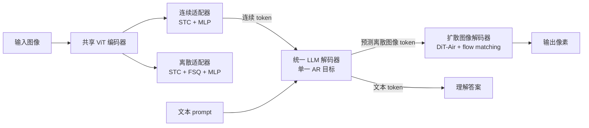

# Manzano: A Simple and Scalable Unified Multimodal Model with a Hybrid Vision Tokenizer

**会议**: ICLR 2026  
**OpenReview**: [https://openreview.net/forum?id=FIXPFUeO9Z](https://openreview.net/forum?id=FIXPFUeO9Z)  
**代码**: 待确认  
**领域**: 多模态 / 统一理解与生成  
**关键词**: 统一多模态模型, 混合视觉 tokenizer, 自回归, 扩散解码器, 任务冲突, 模型扩展  

## 一句话总结
Manzano 用一个共享视觉编码器 + 两个轻量适配器（连续 token 给理解、离散 token 给生成）的混合 tokenizer，让统一自回归 LLM 在同一语义空间里同时学理解和生成，再外挂扩散解码器渲染像素，从而几乎消除了理解-生成之间的任务冲突，并验证了从 300M 扩到 30B 的可扩展性。

## 研究背景与动机
- **领域现状**：能同时"看懂"和"生成"图像的统一多模态 LLM（如 GPT-4o）正在兴起，整合两种能力能解锁世界推理、迭代视觉编辑等涌现能力。
- **现有痛点**：开源统一模型普遍在理解与生成之间存在**性能权衡**——加上生成能力往往拉低理解，尤其在 DocVQA/ChartQA/InfoVQA 这类文字密集（text-rich）的基准上明显落后于纯理解模型。
- **核心矛盾**：根源在于**视觉 tokenization 的冲突**——自回归生成偏好离散 token，而理解偏好连续 embedding。常见的双 tokenizer 方案（语义 encoder + VQ-VAE/VAE）让 LLM 同时处理"高层语义空间"和"低层空间细节"两种异质 token，制造了任务冲突；MoT 等方案虽能缓解但参数低效且难与 MoE 兼容；冻结 LLM 外接扩散解码器则牺牲了生成从 LLM 扩展中获益的机会。
- **本文目标**：在一个简单、可扩展的框架内，把理解与生成的表示**协调到同一来源**，最大限度消除冲突，并能随模型规模稳定提升。
- **核心 idea**：**同源混合 tokenizer**——一个共享视觉编码器后接两个适配器，分别产出连续 token（理解）和离散 token（生成），两者落在**同一语义空间**，让 LLM 不再被异质 token 撕扯；像素级合成交给外挂扩散解码器，LLM 只专注预测高层语义。

## 方法详解

### 整体框架
Manzano 由三部分组成：(i) **混合视觉 tokenizer**，同一 ViT 编码器后接连续适配器和离散适配器，分别输出连续/离散视觉 token；(ii) **统一 LLM 解码器**，接收文本 token 和/或连续图像 embedding，从共享词表里自回归地预测下一个文本或离散图像 token；(iii) **扩散图像解码器**，把预测出的离散图像 token 渲染成像素。训练分三步：先用一个 300M 小 LLM 解码器**预训练对齐** tokenizer，再**联合训练**统一 LLM（文本 / 图像理解 IT / 图像生成 TI 混合数据），最后训练扩散解码器渲染像素。

### 关键设计

**1. 同源混合表示：用一个编码器分叉出"连续给理解、离散给生成"。** 这是消除任务冲突的核心。理解任务（I2T）走连续 embedding，保留更多视觉细节，符合 Qwen-VL 等主流理解模型的成熟做法，在文字密集基准上优势明显；生成任务（T2I）走离散 code 索引，让 LLM 像处理文本一样用同一套 next-token 策略预测图像 token，简化生成管线和扩展行为。关键在于**两个分支共享同一个编码器 backbone**，因此连续与离散 token 处在同一语义空间——这与"CLIP encoder 管理解 + VAE encoder 管生成"的双 tokenizer 方案形成鲜明对比：后者虽保留更多空间细节，却在 LLM 内部加剧了异质 token 的冲突。消融（Table 1）显示这种异质冲突恰恰发生在 LLM 内部。

**2. 混合 tokenizer 的具体结构：STC 压缩 + FSQ 量化。** tokenizer 含三件套：标准 ViT 作 backbone；**连续适配器**先用 3×3 的 Spatial-to-Channel（STC）层把空间 token 数压缩 9 倍（如 $42{\times}42{\times}1024 \to 14{\times}14{\times}9216$），再用 MLP 投影到 LLM 维度（如 2048）；**离散适配器**同样先做 STC 压缩，但额外用**有限标量量化 FSQ**（codebook 达 64K）做量化，再 MLP 投影。选 FSQ 而非 VQ-VAE 是看中其简单性和向大 codebook 的可扩展性。训练 tokenizer 时随机采样其中一个适配器输出喂给 300M 小 LLM 解码器做对齐，把图像特征**预对齐**到 LLM 特征空间。

**3. 简单可扩展的解耦设计：统一 AR 目标 + 语义/像素分工。** 统一 LLM 解码器对 text-only、I2T、T2I 三类任务都只用**单一自回归目标**，不加任何辅助损失或 per-task 头。把"语义预测（LLM 解码器）"和"细节生成（图像解码器）"清晰解耦，使两者可独立扩展，并能直接复用 LLM/MLLM 和扩散模型各自成熟的训练管线。这正是 Manzano 能把 LLM 扩到 30B、扩散解码器扩到 3B 的关键——相比 Transfusion、Bagel 把 AR 文本预测和扩散生成揉进同一个 LLM 却难以大规模扩展，Manzano 的解耦带来了实打实的可扩展性。

**4. 扩散图像解码器：以 LLM 视觉 token 为条件渲染像素。** 解码器采用 **DiT-Air** 架构（层间参数共享，相比标准 MMDiT 减少约 66% 参数而性能相当），用 flow matching 目标在 latent 域把高斯噪声搬运成真实图像。与传统文生图扩散模型以 CLIP 文本 embedding 为条件不同，Manzano 以**LLM 生成的视觉 token embedding**为条件，由 LLM 负责高层语义、扩散解码器负责高保真细节。提供 0.9B / 1.75B / 3.52B 三档配置，支持 256–2048 像素的输出画布。

## 实验关键数据

### 主实验（与 SOTA 对比，3B 档理解基准节选）

| 模型 | RealWorldQA | MMBench(dev-en) | AI2D | MMMU(val) | MathVista | ChartQA | TextVQA | DocVQA | InfoVQA | OCRBench |
|---|---|---|---|---|---|---|---|---|---|---|
| MM1.5-3B | 56.9 | 72.4 | 65.7 | 37.1 | 44.4 | 74.2 | 76.5 | 87.7 | 58.5 | 65.7 |
| InternVL2.5-4B | 64.3 | 78.7 | 81.4 | 52.3 | 60.5 | 84.0 | 76.8 | 91.6 | 72.1 | 82.8 |
| Qwen2.5VL-3B | 65.4 | 76.4 | 81.6 | 53.1 | 62.3 | 84.0 | 79.3 | 93.9 | 77.1 | 79.7 |

Manzano 在统一模型中取得 SOTA，并能与上述**纯理解专家模型**竞争，尤其在文字密集评测上表现突出。

### 消融实验（tokenizer 策略，1B 统一 LLM）

| Tokenizer 范式 | General | Knowledge | Text-Rich | GenEval | DPG | WISE |
|---|---|---|---|---|---|---|
| Pure-Discrete | 63.3 | 62.2 | 62.3 | 77 | 80.9 | 35 |
| Dual-Encoder | 63.8 | 63.6 | 72.0 | 65 | 66.3 | 17 |
| **Hybrid（本文）** | **64.9** | **66.5** | **73.3** | **77** | **79.9** | **35** |

混合 tokenizer 在所有理解与生成任务上几乎都最优：纯离散在文字密集理解上因量化信息损失大幅掉点；双编码器虽缓解了理解退化，但在知识类基准上仍持续落后混合方案，说明异质 token 冲突就发生在 LLM 内部。

### 关键发现
- **统一 vs 单任务**：在 300M 与 3B 上，统一模型相比纯理解/纯生成模型几乎无退化（3B 时理解差距 < 1.0，生成仅一个基准小幅下降），证明混合 tokenizer 范式实现了"无性能权衡的统一"。
- **扩展 LLM 解码器**（300M→3B）：理解与生成全面单调提升——General +14.2、Knowledge +18.8、Text-rich +10.9、GenEval +11.0、WISE +12.0；继续扩到 30B 仍有一致但更小的增益。
- **扩展图像解码器**（基于 3B LLM）：人评结构完整性大幅 +9.9，指令遵循基本不变，自动指标 GenEval/DPG 几乎持平、WISE 微升 +2.0；美学质量略降（留作未来研究）。

## 亮点与洞察
- **把"任务冲突"精准定位到 LLM 内部**，并用"同源"而非"分离"的思路化解——共享编码器让两路 token 同处一个语义空间，比双 tokenizer 的细节保留更划算。
- **简单优先**：单一 AR 目标、无 per-task 头、组件解耦，最大化复用 LLM 与扩散两条成熟管线，使大规模扩展成为可能。
- **语义/像素分工清晰**：LLM 只管高层语义，扩散解码器只管像素细节，二者可独立扩展，扩展行为干净可预测。
- **扩展性实证扎实**：覆盖 300M→30B（LLM）和 0.9B→3.52B（解码器）两个维度的系统扩展曲线，结论对"该往哪扩"有直接指导意义。

## 局限与展望
- **依赖内部资源**：语言 backbone 用的是 Apple 内部预训练 LLM，数据混合也来自内部语料，复现门槛较高。
- **美学质量随解码器扩展不升反降**，论文坦承机制未明，留作未来工作。
- **离散生成 token 的画布/分辨率上限**仍受 tokenizer 压缩与 codebook 设计约束，超高分辨率细节有待进一步验证。
- **缺图像编辑/多轮交互的系统评测**：虽提到统一模型能解锁迭代视觉编辑，但正文以理解+文生图基准为主，编辑能力尚未充分展开。

## 相关工作与启发
- **理解侧 MLLM**：LLaVA 用轻量 MLP 连接器奠定"vision encoder + LLM"范式，MM1/InternVL/Qwen-VL 系列靠扩数据扩模型推高性能——Manzano 直接继承了这套成熟的理解训练配方。
- **统一多模态三范式**：统一自回归（Chameleon、Emu）、解耦 LLM-扩散（冻结 LLM 外接扩散）、混合 AR-扩散（Transfusion、Bagel）。Manzano 归属第一类，但用**统一语义 tokenizer**替代分离 tokenizer，是其核心差异。
- **扩散生成**：从 LDM、DiT 到 flow matching、DiT-Air，Manzano 借 DiT-Air 的参数共享省下约 66% 参数，并创新性地以 LLM 视觉 token 而非 CLIP 文本 embedding 作条件。
- **启发**：当多个任务表示打架时，与其各给一条专用通路，不如让它们**共享同一来源、落在同一语义空间**；同时把"语义建模"与"像素渲染"解耦，能让统一模型享受到各自领域成熟管线的扩展红利。

## 评分
- **新颖性**: ⭐⭐⭐⭐ — "同源混合 tokenizer（连续+离散共享编码器）"是对统一模型任务冲突的优雅新解，把冲突根因定位到 LLM 内部并对症下药。
- **实验充分度**: ⭐⭐⭐⭐⭐ — 覆盖 tokenizer 三范式消融、统一 vs 单任务、LLM(300M-30B)与解码器(0.9B-3.52B)双维度扩展、人评+自动评，证据链完整。
- **写作质量**: ⭐⭐⭐⭐ — 动机-设计-验证逻辑清晰，图表（Fig.1-4、Table 1）紧扣论点，"简单可扩展"的主线贯穿始终。
- **价值**: ⭐⭐⭐⭐⭐ — 在统一模型普遍存在理解-生成权衡的背景下给出几乎无权衡且可扩展的方案，对工业级统一多模态系统有很强的工程与方向参考价值。

<!-- RELATED:START -->

## 相关论文

- [\[CVPR 2026\] AToken: A Unified Tokenizer for Vision](../../CVPR2026/multimodal_vlm/atoken_a_unified_tokenizer_for_vision.md)
- [\[ICLR 2026\] Thinking with Camera: A Unified Multimodal Model for Camera-Centric Understanding and Generation](thinking_with_camera_a_unified_multimodal_model_for_camera-centric_understanding.md)
- [\[ICLR 2026\] UniF2ace: A Unified Fine-grained Face Understanding and Generation Model](unif2ace_a_underlineunified_underlinefine-grained_underlineface_understanding_an.md)
- [\[ICLR 2026\] UniHM: Unified Dexterous Hand Manipulation with Vision Language Model](unihm_unified_dexterous_hand_manipulation_with_vision_language_model.md)
- [\[ICLR 2026\] Omni-Weather: A Unified Multimodal Model for Weather Radar Understanding and Generation](omni-weather_a_unified_multimodal_model_for_weather_radar_understanding_and_gene.md)

<!-- RELATED:END -->
