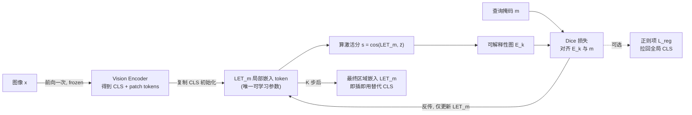

# MaskInversion: Localized Embeddings via Optimization of Explainability Maps

**会议**: ICLR 2026  
**OpenReview**: [https://openreview.net/forum?id=3xyx2ncRln](https://openreview.net/forum?id=3xyx2ncRln)  
**代码**: [https://walidbousselham.com/MaskInversion](https://walidbousselham.com/MaskInversion)  
**领域**: 多模态 / 视觉-语言模型  
**关键词**: CLIP, 区域级表征, 可解释性图, 测试时优化, 文本反演, 零样本  

## 一句话总结
不微调任何权重，仅在测试时把"让 frozen CLIP 的可解释性图去逼近一张查询掩码"当作优化目标，迭代优化一个 token，就能为图像任意区域学到一个可直接替换 [CLS] 的局部嵌入。

## 研究背景与动机
CLIP 这类对比式视觉-语言基础模型在**全局**图文对齐上极强，但训练时只匹配图像 [CLS] token 与文本 token，本质上只对全局池化信息建模。这导致它们在需要**精确定位**或**识别特定区域**的任务上力不从心——而下游有大量任务（指代表达、区域分类、区域描述、局部图像生成）恰恰需要一个"只属于某个区域"的向量。

**现有痛点**：把区域嵌入抠出来的几条朴素路线都不理想。裁剪（Crop）只送区域进 CLIP 会丢掉关键上下文；按掩码聚合 patch token（MaskCLIP / SCLIP 这类）依赖局部 token 与全局语义对齐的假设，而局部 token 往往并不落在正确的表征上。另一条改造路线（ReCLIP 涂色框、FGVP 模糊背景、RedCircle 红圈、AlphaCLIP 加 alpha 通道）要么改输入图像去"骗"出一个局部化的 [CLS]，要么需要重训——AlphaCLIP 甚至要数百万掩码标注才能泛化。

**核心矛盾**：既想拿到 frozen 大模型里那套丰富、对齐良好的表征，又不想为每个新区域改输入、改权重或重新训练。

**本文目标**：在**测试时**、**不动 backbone 任何权重**、**不改输入图像**的前提下，给定图像 + 一张二值查询掩码，直接学出一个落在区域上的局部嵌入 token（Localized Embedding Token, LET），且能作为 [CLS] 的即插即用替代品喂给任意基于同一 backbone 的下游模块。

**核心 idea**：**用可解释性图当桥梁**——一个 token 的可解释性图（gradient-based explanation）会暴露它"在看图像哪里"。那么反过来，**只要把可解释性图监督成查询掩码的形状，被优化的 token 就被逼着只编码那个区域**。这把"学区域表征"翻译成了"对齐解释图与掩码"的优化问题，受 Textual Inversion（用一个 token 反演出概念）启发，但反演的对象从"多图里的物体概念"换成了"单图里掩码圈定的区域"。

## 方法详解

### 整体框架
MaskInversion 把局部嵌入 token `LET_m` 当成唯一的可学习参数（backbone 全程冻结）。流程是：图像只前向一次拿到所有 token；用全局 [CLS] 初始化 `LET_m`；用它的可解释性图与查询掩码 `m` 算 Dice 损失，反传**只更新这一个向量**；迭代 K 步（默认 10 步）即得最终区域嵌入。可选一个正则项把局部 token 拉回全局流形，再配一个梯度分解技巧让多掩码场景大幅提速。

### 关键设计

**1. 用可解释性图把"学区域表征"反演成"对齐掩码"的优化目标。** 这是全文支点。先把局部 token 初始化为全局 [CLS]：$LET_m^{(0)} = z_0$，于是初始解释图天然就是 [CLS] 的解释图。每一步用该 token 与"[CLS] 和所有 patch token 的均值 $\bar z = \frac1n\sum_p z_p$"的余弦相似度当激活分 $s^{(k)} = \cos(LET_m^{(k)}, \bar z)$，再由 frozen 模型导出解释图 $E^{(k)}$（值域 $[0,1]$），它指示当前 token 主要"看"图像的哪些地方。监督信号是把 $E^{(k)}$ 逼近二值查询掩码，用分割里常用的软 Dice 损失衡量区域重合：$L_{\text{Dice}} = 1 - \frac{2\,\mathrm{intersection}(E^{(k)}, m)}{\mathrm{union}(E^{(k)}, m) + \epsilon}$，其中交集由逐元素乘、并集由逐元素加实现。对 $LET_m$ 做 K 步梯度下降最小化该损失，token 就被迫只编码掩码区域。因为优化对**每张掩码独立实例化**、Dice 只在"该 token 解释图 ↔ 该掩码"之间算，所以面对密集物体簇或重叠掩码也不会互相串扰。

**2. 一个正则项在"只看区域"和"保留全局上下文"之间打滑块。** 纯 Dice 监督会让 $LET_m$ 越来越脱离整图全局语义，但像指代表达这类任务又需要上下文。于是加一个 add-on 正则项把局部 token 拉回原始全局嵌入：$L_{\text{reg}} = 1 - \cos(LET_m^{(k)}, z_0^L)$，总损失 $L = L_{\text{Dice}} + \alpha \cdot L_{\text{reg}}$。超参 $\alpha$ 就是"区域信息 vs 全局信息"的旋钮——实验里 RefCOCO/RefCOCO+ 取 $\alpha=5$（吃上下文），而纯物体任务（区域分类）取 $\alpha=0$，印证了"object-only 任务不需要全局对齐、上下文任务才需要"的直觉。

**3. 梯度分解把多掩码场景的二阶反传降成一次点积。** 朴素做法里，导出解释图本身要算一次梯度，而每步优化又要对损失 $L$ 再算梯度，于是要反复评估形如 $\frac{\partial L}{\partial LET_m^{(k)}}(LET_m^{(k)}, \nabla A)$ 的二阶导，既贵又数值不稳。关键观察是：解释图所需的梯度 $\nabla A = \frac{\partial s}{\partial A} = \frac{\partial(\bar z \cdot (LET_m^{(k)})^T)}{\partial A} = \frac{\partial \bar z}{\partial A}\cdot(LET_m^{(k)})^T$，而 $\frac{\partial \bar z}{\partial A}$ **与掩码无关、与被优化 token 无关**（因为 $LET_m$ 不依赖激活 $A$）。所以只要对每张图算**一次** $\frac{\partial \bar z}{\partial A}\in\mathbb{R}^{h\times n\times n\times d}$，之后每一步、每张掩码生成解释图都退化成 $LET_m$ 与它的**点积**，不必反复反传。掩码数 >5 时就开始反超朴素法：100 张掩码时从 1.27s 降到 0.44s，且数值更稳。

## 实验关键数据

主干用 OpenAI/OpenCLIP 的 ViT-B/32、B/16、L/14、H/14；AdamW 优化 10 步；除 RefCOCO/RefCOCO+ 用 $\alpha=5$ 外其余 $\alpha=0$。下游全程零样本，把 `LET_m` 当 [CLS] 即插即用。

### 主实验表格

指代表达检索（给掩码检索对应表达，∗ 为复现结果）：

| 方法 (ViT-B/16) | PhraseCut Acc@1 | RefCOCO Acc@1 | RefCOCO+ Acc@1 |
|---|---|---|---|
| CLIP∗ | 14.4 | 18.3 | 18.4 |
| Masked Crop∗ | 48.3 | 52.3 | 58.7 |
| FGVP∗ | 35.9 | 42.6 | 48.0 |
| AlphaCLIP∗（需微调） | 34.0 | 43.4 | 44.2 |
| **MaskInversion** | **57.2** | **56.1** | **58.3** |
| **MaskInversion (ViT-H/14)** | **64.0** | **61.2** | **65.0** |

区域类别检索（给掩码检索类别，Acc@1）：

| 方法 (ViT-B/16) | PascalVOC | PascalContext | COCO | OpenImagesV7 |
|---|---|---|---|---|
| CLIP∗ | 40.1 | 17.8 | 25.0 | 28.9 |
| Masked Crop∗ | 75.0 | 40.4 | 38.2 | 33.8 |
| AlphaCLIP∗（需微调） | 52.6 | 27.7 | 30.9 | 43.0 |
| RIS∗ | 78.0 | 38.1 | 43.6 | 34.5 |
| **MaskInversion** | **85.4** | **58.1** | **44.7** | 46.3 |
| **MaskInversion (ViT-H/14)** | **93.5** | **61.8** | **63.7** | **51.2** |

对比 training-free 的 patch 聚合法（平均 Acc）：

| 方法 (ViT-H/14) | VOC | Context | COCO | 7 任务均值 |
|---|---|---|---|---|
| MaskCLIP | 61.8 | 37.8 | 30.9 | 41.1 |
| CLIPSurgery | 68.0 | 40.8 | 40.1 | 46.6 |
| SCLIP | 38.2 | 20.7 | 19.8 | 24.4 |
| **Ours** | **93.5** | **61.8** | **63.7** | **65.8** |

### 消融实验表格

| 掩码质量 (COCO 类检索) | Acc | | 梯度分解 (100 掩码) | 用时↓ | | 局部描述 | Acc |
|---|---|---|---|---|---|---|---|
| Mask（GT） | 44.7 | | 朴素 | 1.27s | | CLIP | 20.1 |
| Erosion | 42.7 | | **+分解** | **0.44s** | | AlphaCLIP | 31.8 |
| Dilation | 44.3 | | (5 掩码) 朴素 | 0.10s | | **MaskInversion** | **48.4** |
| Box | 42.9 | | (5 掩码) +分解 | 0.13s | | | |
| Box + SAM | **45.0** | | | | | | |

### 关键发现
- **越大的 backbone 收益越大**：training-free 聚合法在 B/16 还算能打，但放大到 H/14 反而退化；MaskInversion 随主干规模单调提升，H/14 上对最佳 baseline 在 VOC/Context/COCO 分别 +31.7%/+21.0%/+32.8%，说明它能真正榨干大模型的表征容量。
- **不微调照样赢需微调的方法**：在区域类检索上全面超过用百万掩码-文本对微调的 AlphaCLIP，证明"测试时反演"能避开重训成本。
- **掩码可以很粗糙**：bbox+SAM 近乎追平 GT 掩码（45.0 vs 44.7），用户画框即可，实用性强；侵蚀掩码比膨胀掉得更狠。
- **能直接驱动生成式下游**：把 `LET_m` 当 CLIPCap 的 CLIP 输入，局部描述 Acc 较 CLIP 翻倍（20.1→48.4）；喂给 λ-ECLIPSE 扩散模型可对掩码区域做局部图像生成，且最终解释图确实聚焦在掩码上。

## 亮点与洞察
- **把"可解释性"从诊断工具升级成可优化的目标函数**：解释图通常用来"事后看模型在想什么"，本文反其道把它当监督信号去**塑造**一个 token，思路新颖且自洽。
- **真正的 test-time、backbone-agnostic**：不改权重、不改输入、不需任何标注训练，任意可微解释方法 + 任意 CLIP 都能插（默认用 LeGrad，只取最后一层注意力降本）。
- **梯度分解是工程上的点睛之笔**：抓住"被优化向量与激活无关"这一结构，把二阶反传约成一次点积，让"每掩码独立优化"这个看似昂贵的设定在多掩码下反而更快更稳。
- **一个 token 打通判别与生成**：同一个区域嵌入既能做检索/分类，又能即插进 captioner 和 diffusion，验证了它确实落在 backbone 的语义流形上。

## 局限与展望
- **每张掩码都要 K 步在线优化**：虽有梯度分解，但相比一次前向的聚合法仍有额外测试时开销，单掩码场景未必划算（5 掩码以下分解还略慢于朴素法）。
- **强依赖解释方法质量**：整套监督建立在解释图能忠实反映 token 关注区域的前提上，解释方法本身的偏差/噪声会直接传导到学到的嵌入。
- **激活分定义较启发式**：用 token 与"[CLS]+patch 均值"的余弦当激活分是经验设计，是否最优、对不同 backbone 是否稳健仍待考。
- **掩码侵蚀敏感**：对掩码偏小（侵蚀）较敏感，提示在自动掩码偏保守时可能掉点。
- **展望**：可探索摊销式（amortized）一次前向直接预测 LET 以去掉在线迭代、把方法推广到检测/分割密集预测、或换更强解释器进一步提质。

## 相关工作与启发
- **Textual Inversion (Gal et al., 2023)** 是直接灵感：用一个可学习 token 反演出概念。本文把"从多图学物体概念"换成"从单图 + 二值掩码学区域属性"，反演目标与监督形式都不同。
- 对比 **visual prompt 路线**（RedCircle 红圈、FGVP 模糊背景、ReCLIP 涂色框）：那些改输入图像去诱导一个局部化 [CLS]，本文则学一个全新表征、不碰输入。
- 对比 **mask-based 预训练**（AlphaCLIP、CPT）：那些要重训/微调与海量标注，本文纯测试时、零额外训练。
- 对比 **training-free patch 聚合**（MaskCLIP、CLIPSurgery、SCLIP）：那些靠平均池化掩码内 patch token，受限于局部 token 是否对齐；本文用优化绕开了这一假设，且在大模型上优势拉开。
- 解释方法侧承接 GradCAM 系与 ViT 专用的 Rollout / Chefer / **LeGrad**，并延续"解释图可微 ⇒ 可当目标函数"（Chefer 2022、Paiss 2022）的思路。

## 评分
- **新颖性**: ⭐⭐⭐⭐⭐ 把可解释性图从"诊断"反转为"优化目标"来反演区域嵌入，是一个清晰、少见且自洽的新视角。
- **实验充分度**: ⭐⭐⭐⭐ 覆盖指代表达/类检索/局部描述/局部生成四类任务、4 个主干、7+ 数据集，并配掩码质量、运行时、正则等消融；稍欠对超参与失败案例的更系统分析。
- **写作质量**: ⭐⭐⭐⭐ 动机—方法—实验衔接顺畅，公式与图清晰；梯度分解推导略紧凑但可跟。
- **价值**: ⭐⭐⭐⭐⭐ 即插即用、不改权重、掩码可粗糙、还能驱动生成式下游，对任何想从 frozen CLIP 拿区域表征的应用都有直接实用价值。

<!-- RELATED:START -->

## 相关论文

- [\[ICLR 2026\] WAVE: Learning Unified & Versatile Audio-Visual Embeddings with Multimodal LLM](wave_learning_unified_versatile_audio-visual_embeddings_with_multimodal_llm.md)
- [\[CVPR 2026\] VLM-Loc: Localization in Point Cloud Maps via Vision-Language Models](../../CVPR2026/multimodal_vlm/vlm-loc_localization_in_point_cloud_maps_via_vision-language_models.md)
- [\[CVPR 2026\] Illuminating Visual Identity in Universal Multimodal Embeddings](../../CVPR2026/multimodal_vlm/illuminating_visual_identity_in_universal_multimodal_embeddings.md)
- [\[ICLR 2026\] Importance Sampling for Multi-Negative Multimodal Direct Preference Optimization](importance_sampling_for_multi-negative_multimodal_direct_preference_optimization.md)
- [\[ICLR 2026\] Uni-DPO: A Unified Paradigm for Dynamic Preference Optimization of LLMs](uni-dpo_a_unified_paradigm_for_dynamic_preference_optimization_of_llms.md)

<!-- RELATED:END -->
