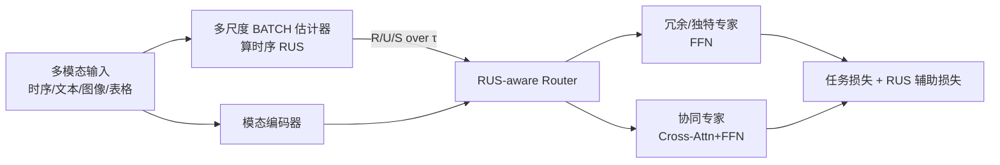

# Massively Multimodal Foundation Models: A Framework for Capturing Interactions with Specialized Mixture-of-Experts

**会议**: ICLR 2026  
**OpenReview**: [https://openreview.net/forum?id=qF9WJxvHX8](https://openreview.net/forum?id=qF9WJxvHX8)  
**代码**: 待确认  
**领域**: 多模态学习 / Mixture-of-Experts / 海量模态融合  
**关键词**: 海量多模态、时序多模态交互、Partial Information Decomposition、RUS、Mixture-of-Experts、交互感知路由

## 一句话总结
本文提出 MERGE 框架，先用有向信息把多模态交互分解成随时间延迟变化的"冗余/独特/协同 (RUS)"信号，再用这些信号去引导 MoE 路由——让相似的模态走同一专家、独特的模态走不同专家、协同的模态走专门的跨模态专家，从而在传感器、影像、文本等几十路异构输入的"海量多模态"场景下显著提升性能并产生可解释的专家分工。

## 研究背景与动机
**领域现状**：传统多模态学习多聚焦文本/图像/音频这两三个"经典"模态。但真实应用（尤其医疗、可穿戴、活动识别）往往涉及几十到上百路异构输入流——心率、血氧、ECG、呼吸、影像、化验、临床文本——每路采样率、噪声、测量模型都不同。本文把这种"每个传感器都算一个独立模态"的设定定义为**海量多模态 (massively multimodal)**。MoE 因其稀疏路由天然适合按模态分配计算，已有 LIMoE、FuseMoE、Flex-MoE 等工作做多模态 MoE。

**现有痛点**：(1) 现有 MoE 路由器只看 token 与专家之间的**相似度**，把模态当作静态特征处理，无法捕捉跨模态的**时间延迟效应**——比如脓毒症早期是 SpO₂/呼吸率夜间缓慢漂移、数小时后才发热升乳酸；讽刺语气是先扬眉、200–400ms 后才升调。(2) 已有把多模态交互引入 MoE 的工作（I²MoE 等）把专家数量和模态数量**硬绑定**，扩展性差；且用单模态分类器的二元标签一致性来近似交互，严重依赖分类器质量，且只能刻画**静态**交互。

**核心矛盾**：模态数一多，跨模态交互的空间爆炸（有的冗余、有的独特、有的只有联合才显现的协同），而这些交互**随时间以特征性延迟展开**——既需要一个能量化"时延交互"的尺度，又需要一个能在训练中利用它的 MoE 架构，二者现有方法都不具备。

**本文目标**：把"能否用时序多模态交互来指导 MoE 训练与推理"落地为一个可扩展、可解释的框架。

**核心 idea**：**用信息论的 PID 分解 (Redundancy / Uniqueness / Synergy) 沿时间轴量化模态对的延迟交互，再把这套 RUS 信号作为路由的"先验"注入 MoE**——交互类型决定路由策略，让专家学到可泛化的"交互处理技能"而非死记模态。

## 方法详解

### 整体框架
MERGE 把多模态输入送入 N 层堆叠的编码器（Transformer 块与 MoE 块交替），核心创新全在 MoE 层。整条管线分两阶段且**刻意解耦**：先离线算出"时序 RUS"（数据集的内禀属性，只需算一次、可缓存复用），再用这些 RUS 序列在线引导 MoE 的路由与训练。

### 关键设计

**1. 时序 RUS：用有向信息把多模态交互沿时间延迟分解。** 标准 PID 基于互信息，只能刻画静态交互。MERGE 改用**有向信息 (directed information)**，它尊重"从过去到现在"的信息流方向，从而能在多个时间滞后 $\tau$ 上做 PID 分析。作者定义多源有向信息 $DI(\tau)=\sum_{t=\tau+1}^{n} I(Y_t; X_{1,t-\tau}, X_{2,t-\tau}\mid Y^{t-1})$，并把它在每个滞后 $\tau$ 上分解为四项 $DI(\tau)=R(\tau)+U_1(\tau)+U_2(\tau)+S(\tau)$。其中冗余 $R(\tau)=\max_{Q_\tau\in\Delta_\tau} I_{Q_\tau}(X_1^{n-\tau}; X_2^{n-\tau}; Y^n)$，独特 $U_i(\tau)=\min_{Q_\tau\in\Delta_\tau} I_{Q_\tau}(X_i^{n-\tau}; Y^n\mid X_{j}^{n-\tau})$，协同 $S(\tau)=I_{P_\tau}-\min_{Q_\tau}I_{Q_\tau}$，优化都在保持时刻特定二元边缘 $P_\tau(x_i,y)$ 的分布簇 $\Delta_\tau$ 上做。这样每对模态在每个延迟下都有一条 RUS 轨迹，刻画了"延迟多长、是哪种交互"。为省内存，作者让一对模态共享同一滞后 $\tau$（也指出框架能自然推广到跨滞后交互）。

**2. 多尺度 BATCH 估计器：一次训练同时估出所有滞后的 RUS。** 经典 PID 估计只能处理离散小支撑或低维连续变量，无法上高维。作者基于 BATCH 估计器（用神经网络参数化分布、按子采样 batch 近似真分布）做高维扩展，并把"逐步重复优化 $Q_\tau^*$"的朴素做法升级为**多尺度**版本：训练**单个**模型、用可学习的滞后嵌入 $e(\tau)$ 条件化判别器，一次性预测所有 $\tau$ 的 RUS。具体地，融合判别器 $\hat P(Y\mid X_1,X_2,\tau)=D_{12,\theta}(\phi(g_{12,\theta}([x_1;x_2]),e(\tau)))$；再构造对齐张量 $\text{align}_\tau[i,j,k]=\exp(\hat q_{X_1}^{(i,k,\tau)}\cdot \hat q_{X_2}^{(j,k,\tau)}/\sqrt d)$ 衡量样本间相容性，用 Sinkhorn–Knopp 归一化强制边缘匹配得到最优 $Q_\tau^*$。所有 $\tau$ 借张量并行同时算，带来约 $\tau$ 倍加速且参数高效。

**3. RUS-aware 路由器：让交互类型决定路由策略。** 这是把信息论和路由决策挂钩的中枢。设计原则对应三种交互（也等价于三种融合方式）：高冗余 $R$→把 token 路由到**同一**常规专家（等价早融合）；高独特 $U$→**分散**路由到不同专家以保留各自独特信息（等价晚融合）；高协同 $S$→路由到专门的**协同专家**（cross-attention + FFN，等价混合融合）。路由器结构上，注意力机制聚焦模态对的冗余与协同 $\{[R_{m_1,m_2}, S_{m_1,m_2}]\}$，GRU 捕捉独特性 $U_{m_1}$ 的时序动态，最后与 token 表征拼接出路由 logits：$\text{RUSContext}_{m_1}=\text{Attention}(\text{Query}_{m_1}, \{[R,S]\}) \oplus \text{GRU}(U_{m_1})$，$\text{Logits}_{m_1}=\text{MLP}(\text{TokenFeatures}_{m_1}\oplus\text{RUSContext}_{m_1})$。这样模态 $m_1$ 的路由由它与所有其他模态的时序交互共同决定，而非只看自身内容。

**4. 交互感知辅助损失：把路由策略写进训练目标。** 路由原则靠辅助损失强制执行，每项对应一种交互。冗余项用 JSD 拉近超过阈值的模态对路由分布 $\mathcal L_{\text{redundancy}}=\lambda_R\cdot\frac{1}{N}\sum_{R_{m_1,m_2,t}>\tau_R}\text{JSD}(P^{(t,m_1)}_{\text{router}}, P^{(t,m_2)}_{\text{router}})$；独特项符号相反，**推远**两者路由分布以鼓励分散；协同项 $\mathcal L_{\text{synergy}}=\lambda_S\cdot\frac{1}{N}\sum_{S_{m_1,m_2,t}>\tau_S}(1-\frac{P^{(t,m_1)}_{\text{syn}}+P^{(t,m_2)}_{\text{syn}}}{2})$ 推动高协同对走协同专家。总目标 = 任务损失 + 上述三项。作者强调 RUS 估计与 MERGE 训练**刻意分离**：RUS 是数据集的任务无关内禀结构，不应被下游任务损失污染，且算一次即可缓存复用。

## 实验关键数据

### 主实验表格
覆盖医疗、活动识别、情感计算三大领域共 6 个基准（5 次随机种子平均）：

| 方法 | PAMAP2 Acc | MIMIC-IV IHM F1 | MIMIC-IV LOS F1 | MOSI Acc | WESAD AUROC | Opportunity Acc |
|------|-----------|-----------------|-----------------|----------|-------------|-----------------|
| Transformer | 82.48 | 78.96 | 72.31 | 68.39 | 74.39 | 81.59 |
| mTAND | 74.62 | 79.35 | 73.45 | 70.07 | 71.66 | 70.26 |
| MulT | 82.23 | 81.55 | 72.52 | 68.80 | 71.43 | 72.61 |
| MISTS | 85.34 | 80.56 | 73.86 | 69.42 | 73.29 | 79.36 |
| FuseMoE | 87.74 | 81.64 | 75.18 | 75.65 | 76.31 | 83.15 |
| I²MoE | 84.55 | 82.59 | 74.36 | 71.91 | 75.52 | 82.16 |
| **MERGE** | **91.37** | **84.97** | 74.43 | 72.04 | **77.34** | **84.32** |

MERGE 在绝大多数指标上取得最优，相对 FuseMoE/I²MoE 等 MoE 基线在 PAMAP2、MIMIC-IV、WESAD 上提升明显（PAMAP2 准确率 +3.6 个点）。

### 消融实验表格

| 消融维度 | 设置 | 结论 |
|----------|------|------|
| 辅助损失项 (Fig.7) | 分别去掉 R / U / S 损失 | 三项在几乎所有任务上都贡献正向，去任一项性能均下降 |
| 时序 RUS 长度 (Fig.6a) | 最大滞后 1→10 + 片段重复加长 | 越长越好：更宽时间视野 + 降梯度方差 |
| 多尺度 vs 逐步估计 (Fig.6b/c) | naive step-wise vs multi-scale | RUS 轨迹差异很小，性能基本无损，但获 ~τ 倍加速 |

### 关键发现
- 时序 RUS 给出**可解释且符合领域知识**的洞察：MIMIC-IV 中胰岛素与呋塞米同时给药时呈强协同（同时影响血糖/血钾），胰岛素提前 1 小时后其独特性变强（起效快）；呋塞米给药后随时间与 BUN 的协同上升（药效延迟显现）；PAMAP2 中胸部与手部运动在行走/跑步时高度耦合呈强冗余；WESAD 中 ECG/呼吸提前 1 秒能更好预测当前胸温，对应应激响应的自然延迟。
- 学到的专家激活分布与上述交互预期一致，路由模式可解释。

## 亮点与洞察
- **把"路由器只看相似度"换成"路由器看交互类型"**：这是范式层面的转变——R/U/S 三类交互直接对应早/晚/混合融合三种策略，让 MoE 的专家分工从黑箱启发式变成有信息论依据的可解释决策。
- **专家数与模态数解耦**：不再像 I²MoE 那样把专家数绑死在模态数上，而是用 RUS 动态决定"哪些模态该/不该走一起"，天然适配几十上百路模态的海量多模态场景。
- **有向信息 + 多尺度 BATCH 估计器**是把静态 PID 推向"高维 + 时序"的关键工程贡献，一次估计拿到全滞后 RUS 并可缓存复用，把信息论量化从"理论玩具"拉到了可训练规模。
- RUS 估计与 MoE 训练解耦保证了交互信号的任务无关性，避免被下游损失污染，工程上也省算力。

## 局限与展望
- **模态对共享同一滞后 $\tau$**：为省内存放弃了跨滞后交互的穷举，真实世界里不同模态的因果延迟未必对齐，跨滞后交互可能丢失（作者称框架可推广但未做）。
- **两阶段解耦的代价**：RUS 必须离线先算，端到端联合学习被有意放弃，换来任务无关性但也牺牲了 RUS 随任务自适应的潜力。
- **RUS 估计依赖判别器与 Sinkhorn 优化**：高维分布近似的稳定性、最大滞后只能到 ~10（再大多尺度估计退化）限制了超长程延迟的建模。
- 主要在结构化时序/传感器/临床数据上验证，向真正"上百路模态"的极端规模以及图文等大模型场景的可扩展性仍待检验。

## 相关工作与启发
- **多模态 MoE**：LIMoE（对比学习 + 熵正则做模态专门化）、FuseMoE（Laplace gating 处理不规则采样/缺失模态）、Flex-MoE（缺失模态库 + 双路由）、Hierarchical MoE（两级 Laplace gating）。MERGE 与它们的根本区别是把**时序交互**而非相似度作为路由依据。
- **Partial Information Decomposition / 多模态交互**：Williams & Beer 的 R/U/S 分解、BATCH 估计器（高维 PID）、Varley 的时序交互框架（但不支持连续变量、不可扩展）。MERGE 首次把 PID 用来改进多模态 MoE。
- **交互专家**：Mixture of Multimodal Interaction Experts、I²MoE（交互类型专家但专家数绑模态数、用单模态分类器近似静态交互）。MERGE 用动态路由 + 连续时序 RUS 解决了扩展性和静态性两个软肋。
- **启发**：把"信息论量化的交互结构"作为可缓存的数据先验注入稀疏模型路由，是一条值得迁移到 LLM/VLM MoE 的思路——尤其当模态/专家数量爆炸、需要可解释分工时。

## 评分
- **新颖性**: ⭐⭐⭐⭐⭐ 用有向信息把 PID 推向时序、再把 R/U/S 直接映射成 MoE 路由策略，是把信息论与稀疏架构挂钩的原创范式转变。
- **实验充分度**: ⭐⭐⭐⭐ 覆盖医疗/活动/情感三大领域 6 基准 + 多组消融 + 可解释性分析，论证完整；但模态规模仍以个位到十几路为主，"海量"承诺的极端规模未直接压测。
- **写作质量**: ⭐⭐⭐⭐ 动机清晰、公式与图示（架构/估计器/路由器）配合到位；信息论部分稍重，但医学/活动的 RUS 洞察例子很有画面感。
- **价值**: ⭐⭐⭐⭐ 为海量异构模态融合提供了可解释、可扩展、专家数解耦的实用框架，对临床多源监测等场景落地价值明确。

<!-- RELATED:START -->

## 相关论文

- [\[ICLR 2026\] Capacity-Aware Inference: Mitigating the Straggler Effect in Mixture of Experts](capacity-aware_inference_mitigating_the_straggler_effect_in_mixture_of_experts.md)
- [\[ICML 2026\] Toward Structural Multimodal Representations: Specialization, Selection, and Sparsification via Mixture-of-Experts](../../ICML2026/multimodal_vlm/toward_structural_multimodal_representations_specialization_selection_and_sparsi.md)
- [\[ICCV 2025\] A Quality-Guided Mixture of Score-Fusion Experts Framework for Human Recognition](../../ICCV2025/multimodal_vlm/a_qualityguided_mixture_of_scorefusion_experts_framework_for.md)
- [\[ICML 2026\] SAME: Stabilized Mixture-of-Experts for Multimodal Continual Instruction Tuning](../../ICML2026/multimodal_vlm/same_stabilized_mixture-of-experts_for_multimodal_continual_instruction_tuning.md)
- [\[ICLR 2026\] Kaleidoscope: In-language Exams for Massively Multilingual Vision Evaluation](kaleidoscope_in-language_exams_for_massively_multilingual_vision_evaluation.md)

<!-- RELATED:END -->
