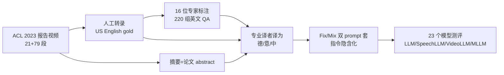

# MCIF: Multimodal Crosslingual Instruction-Following Benchmark from Scientific Talks

**会议**: ICLR 2026  
**OpenReview**: [https://openreview.net/forum?id=PtPYZYfa0h](https://openreview.net/forum?id=PtPYZYfa0h)  
**代码**: [github.com/hlt-mt/mcif](https://github.com/hlt-mt/mcif) / [hf.co/datasets/FBK-MT/MCIF](https://huggingface.co/datasets/FBK-MT/MCIF)  
**领域**: 多模态 / 评测基准  
**关键词**: 多模态 LLM、跨语言、指令跟随、语音、视频、benchmark、长上下文  

## 一句话总结
MCIF 是首个由人工标注、覆盖语音/视频/文本三模态、英德意中四语言、长短两种上下文、并在所有维度完全平行对齐的跨语言多模态指令跟随评测基准，取材自 ACL 学术报告视频，对 23 个主流模型的测评揭示出当前 MLLM 在长上下文摘要、语音视频联合理解、细粒度问答上仍有巨大差距。

## 研究背景与动机
**领域现状**：大模型正从纯文本走向统一文本/语音/视频的多模态 LLM（MLLM），目标是用自然语言指令完成跨模态、跨语言的通用任务。要评估这种"通用指令跟随"能力，需要同时考察**跨语言**、**多模态**、**长短上下文**三个维度。

**现有痛点**：作者梳理了语音-文本与视觉-文本两类已有 benchmark，发现它们普遍**只覆盖单一或两个维度**——要么局限于英文（甚至英中两语），要么一次只测一种模态（语音-文本或视觉-文本），要么只用短输入而忽略长依赖，要么直接复用 CommonVoice/FLEURS 等旧数据集导致**数据污染**风险，又或者缺乏人工标注、数据质量与可靠性存疑。没有任何一个基准能在统一设定下同时支持语音、视频、文本三模态的跨语言长上下文指令跟随。

**核心矛盾**：MLLM 的能力在快速向"什么都能做"演进，但评测工具还停留在"一次只测一个切面"，导致无法系统诊断模型到底在跨语言整合、多模态融合、长文本理解上的短板究竟在哪。

**本文目标**：构建一个**在模态、语言、上下文长度上完全平行对齐**的人工标注基准，让每个样本都能在控制其他变量的情况下做消融式诊断。

**核心 idea**：**取材真实学术报告视频 + 三模态平行 + 四语言平行 + 指令隐含化**——以 ACL 2023 报告视频为原料，人工产出转录/翻译/摘要/问答，让同一份内容在语音、视频、文本三种模态下都存在，且 prompt 与参考答案在英德意中四语言下都对齐；任务类型、模态、目标语言都不作为显式 metadata 给出，而要求模型从 prompt 本身推断，逼近真实的人机交互。

## 方法详解

### 整体框架
MCIF 不是模型而是 benchmark，其"方法"是一条**数据采集—人工标注—跨语言扩展—指令构造—多模型测评**的流水线。核心产物是一个 3 模态 × 4 语言 × 2 上下文 × 13 任务（归并为识别/翻译/问答/摘要 4 大宏任务）的平行评测集，每个样本由"输入内容（短/长形式的文本、语音或视频）+ 含指令的文本 prompt（四语言之一）+ 同语言参考答案"三件套构成。

### 关键设计

**1. 三模态 × 四语言完全平行的对齐设计：让消融成为可能。** MCIF 最核心的卖点是"parallel"——同一段学术报告同时以语音（mono 16kHz wav）、视频（mp4）、文本（gold transcript）三种模态存在，而 prompt 与参考输出在英、德、意、中四语言下逐一对齐。这种笛卡尔积式的对齐意味着研究者可以固定内容、只切换模态来看模型对语音 vs 视频 vs 二者联合的依赖，或固定模态、只切换目标语言来看跨语言泛化。13 个细任务被组织成识别（ASR/AVR）、翻译（MT/ST/AVT）、问答（TQA/SQA/VQA/AVQA）、摘要（TSUM/SSUM/VSUM/AVSUM）四大宏任务，其中带 cross 标记的任务源语言与目标语言不同，专门考察跨语言能力。

**2. 取材真实学术报告 + 选最新材料防污染：自然、专家级、难。** 数据来自 ACL Anthology 的报告视频（CC-BY 4.0 可自由再分发），由各国研究者自录，自带口音、设备、背景、风格的巨大差异，天然贴近真实场景且有配套幻灯片、音频、论文。为避免模型在训练数据上"作弊"，作者刻意挑选采集时**最新**的 ACL 2023 报告，并人工剔除重复说话人、低质量音频、TTS 合成语音。基准最终含 21 段核心报告（2 小时、约 1.55 万词），为提升摘要任务代表性再补 79 段、共 100 样本（约 10 小时、摘要约 1.7 万词）。长上下文同时提供完整视频/语音和用 SHAS 自动切成约 16 秒的短段版本，兼顾长依赖评测与小上下文模型的可用性。

**3. 结构化 QA 与模态标签：精确定位"答案藏在哪个模态"。** 每段报告配至少 10 组 QA，按三类分布构造：通用问题（适用任何报告，如"作者的单位是什么"）、转录问题（看完全片后针对细粒度、上下文依赖的信息检索）、摘要问题（只读 abstract 后提出，模拟用户没看视频就发问的场景）。16 位高英语水平、有 ML/NLP 背景的专家创建并交叉验证全部 QA，并给每条问题标注**回答所需的输入模态**：NA（音视频中都不存在答案，即不可回答）、AV（音视频都显式给出、任一模态即可作答）、A（仅音频显式）、V（仅视频显式）。这套标签让"模型在不同模态条件下、以及面对不可回答样本时表现如何"成为可系统量化的诊断维度。所有 QA 先用英文创建，再由专业译者译为德意中——译者在翻译过程中复核原文，相当于二次质量校验。

**4. 指令隐含化 + Fix/Mix 双 prompt：测真实交互与鲁棒性。** 任务类型、输入模态、目标语言都不以显式 metadata 提供，模型必须从 prompt 文本本身推断该做什么——例如"Answer the following question concisely given the English content: {QUESTION}"，prompt 用目标语言书写并总在其中指明源语言。作者进一步设计两个变体：MCIF$_{\text{fix}}$ 为每个宏任务固定一条 prompt；MCIF$_{\text{mix}}$ 则从十条候选（含 fix 那条）中随机抽取。通过对比"始终同一 prompt vs 随机多样 prompt"，可直接度量模型对措辞变化的泛化与鲁棒性。评测指标按任务沿用社区标准：识别用 WER（jiWER + Whisper normalizer），翻译用 COMET（wmt22-comet-da），问答与摘要用基线校准后的 BERTScore（0 对应目标语言随机输出）。

## 实验关键数据

### 主实验设置
评测 23 个 <20B 的开源模型加商用 Gemini 2.5 Flash，分为 7 个 LLM、5 个 SpeechLLM、5 个 VideoLLM、6 个 MLLM。从识别、翻译、问答、摘要四个宏任务在 fix/mix、长/短上下文下全面对比。

### 各宏任务代表性结果（短上下文，MCIF$_{\text{fix}}$）

| 模型类别 | 模型 | REC (WER↓) | TRANS (COMET↑) | QA (BERTS.↑) |
|---|---|---|---|---|
| SpeechLLM | Phi4-Multimodal | 6.8 | 80.2 | 37.1 |
| SpeechLLM | GraniteSpeech | 9.4 | 52.1 | 0.5 |
| SpeechLLM | Qwen2-Audio | 31.7 | 74.9 | 32.6 |
| SpeechLLM | UltraVox v0.5 | 127.7 | 43.3 | 19.6 |
| SpeechLLM | DeSTA2 | 54.0 | 75.3 | 17.2 |

### 关键发现
- **识别虽简单仍有模型崩溃**：部分 SpeechLLM/MLLM（Phi4、GraniteSpeech、Ola、Gemini）WER<10 证明任务可行，但 UltraVox/Ming-Lite-Omni/MiniCPM-o-2 在长短上下文 WER 双双 >100；Ola 在短上下文从 6.6/14.0 暴跌到 98.8/104.1，人工检查发现它把转录指令误解成给幻灯片做图像描述。
- **翻译仍是文本 LLM 的天下**：得益于文本翻译的成熟，LLM 在翻译宏任务全面领先，Phi4-Multimodal 短上下文 COMET 甚至 >80，但 UltraVox、MiniCPM-o-2 等模型在该任务上全面失败。
- **普遍短板**：模型在长上下文（尤其摘要）、语音与视频联合整合、细粒度内容问答上集体吃力，指明了未来跨语言多模态指令跟随的主要改进方向。

## 亮点与洞察
- **"完全平行"是方法论级别的贡献**：把模态、语言、上下文长度做成可独立切换的正交维度，使 benchmark 从"打分排名"升级为"消融诊断工具"，能精确指出模型短板出在哪个维度。
- **指令隐含化贴近真实**：不喂显式 metadata、要求模型自己从 prompt 推断任务/模态/语言，比传统给定任务标签的评测更接近真实人机交互，也更难。
- **防污染的工程自觉**：刻意选最新会议材料、避开复用旧公开数据集，正面回应了当前 benchmark 普遍的数据泄漏隐忧。
- **QA 的模态归因标签**很巧妙，把"答案到底藏在音频还是视频"显式化，让多模态融合能力的评测可解释。

## 局限与展望
- **规模偏小**：核心仅 21 段报告、补充至 100 样本，相对自然语料规模有限，长尾覆盖与统计显著性受限。
- **领域单一**：取材以 NLP 及邻近的学术报告为主，是否能泛化到讲座之外的口语/视频场景待验证。
- **语言虽典型但仍少**：英德意中四语虽兼顾语系与书写系统多样性，但都是高资源语言，低资源跨语言能力未被覆盖。
- **指标依赖现成自动指标**：WER/COMET/BERTScore 在长文本摘要、开放问答上与人类判断的相关性仍有限，未来可补充人工或 LLM-as-judge 评测。

## 相关工作与启发
- **语音-文本 IF benchmark**（Speech-ifeval、SAKURA、AIR-Bench、VoiceBench、Dynamic-SUPERB、SIFT-50M 等）大多局限英文/英中、短上下文、或复用旧数据集，难以联合考察跨语言长上下文。
- **视觉-文本 IF benchmark**（MMMU、MIA-Bench、MME、M3Exam、EXAMS-V 及一众 Video-Bench/MVBench 等）虽语言覆盖在扩展，但普遍局限单图或视频-文本双模态、且少有人工多语指令。
- **三模态先驱**（VideoMME、MF2）首次同含语音/文本/视频，但 VideoMME 非跨语言且偏视频任务，MF2 含语音却不评测语音——MCIF 正是填补"语音+视频+文本+跨语言指令跟随"统一评测的空白。
- **启发**：平行对齐 + 指令隐含化的设计范式，可迁移到其他需要多维度消融诊断的多模态评测；模态归因式 QA 标注值得在通用 VQA/AVQA 数据集中推广。

## 评分
- 新颖性: ⭐⭐⭐⭐ 首个语音/视频/文本三模态 × 四语言 × 长短上下文完全平行的人工标注跨语言指令跟随基准，填补了明确的评测空白。
- 实验充分度: ⭐⭐⭐⭐ 覆盖 23 个跨类别模型、4 大宏任务、fix/mix 与长短上下文，并辅以模态/语言级细分析与失败案例剖析。
- 写作质量: ⭐⭐⭐⭐ 动机—痛点—设计逻辑清晰，表格与统计图信息密度高，相关工作梳理到位。
- 价值: ⭐⭐⭐⭐ 作为开源（CC-BY 4.0 + Apache 2.0）人工标注基准，对诊断与推动 MLLM 的跨语言多模态长上下文能力有实打实的社区价值。

<!-- RELATED:START -->

## 相关论文

- [\[ACL 2025\] CrafText Benchmark: Advancing Instruction Following in Complex Multimodal Open-Ended World](../../ACL2025/multimodal_vlm/craftext_benchmark_advancing_instruction_following_in_complex_multimodal_open-en.md)
- [\[ICCV 2025\] MM-IFEngine: Towards Multimodal Instruction Following](../../ICCV2025/multimodal_vlm/mm-ifengine_towards_multimodal_instruction_following.md)
- [\[CVPR 2026\] ARGUS: Defending Against Multimodal Indirect Prompt Injection via Steering Instruction-Following Behavior](../../CVPR2026/multimodal_vlm/argus_defending_against_multimodal_indirect_prompt_injection_via_steering_instru.md)
- [\[ICLR 2026\] PCLR: Progressively Compressed LoRA for Multimodal Continual Instruction Tuning](pclr_progressively_compressed_lora_for_multimodal_continual_instruction_tuning.md)
- [\[CVPR 2026\] Multi-Crit: Benchmarking Multimodal Judges on Pluralistic Criteria-Following](../../CVPR2026/multimodal_vlm/multi-crit_benchmarking_multimodal_judges_on_pluralistic_criteria-following.md)

<!-- RELATED:END -->
