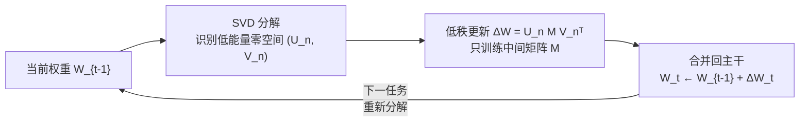

# Memory-Free Continual Learning with Null Space Adaptation for Zero-Shot Vision-Language Models

**会议**: ICLR 2026  
**OpenReview**: [https://openreview.net/forum?id=tucuU4sQ3s](https://openreview.net/forum?id=tucuU4sQ3s)  
**代码**: 待确认  
**领域**: 多模态 VLM / 持续学习 / 参数高效微调  
**关键词**: CLIP, 持续学习, 零样本泛化, 零空间, 低秩适配, 无记忆缓冲  

## 一句话总结
NuSA-CL 通过 SVD 把 CLIP 当前权重的"低能量零空间"挖出来，再把每个新任务的低秩更新严格锁死在这个零空间里训练后直接合并回主干，从而在零存储、零参数增长、零额外模型的前提下持续学习新任务又几乎不损失原有的零样本能力。

## 研究背景与动机
**领域现状**：CLIP 这类视觉-语言基础模型靠图文对齐表征撑起了零样本泛化，已经成为 LLaVA 等多模态大模型和机器人 VLA 系统的感知底座。但这些上层系统继承了一个致命弱点——主干知识是冻结的，在数据分布持续演化、不断冒出新类别的真实部署场景里，静态零样本能力远远不够。

**现有痛点**：持续学习（CL）虽然是出路，但主流范式都撞在"可扩展性墙"上。一类是存储型方法（经验回放、参考数据、梯度投影记忆），存储成本随任务数线性增长；另一类是扩张型方法（为每个任务加 adapter / prompt 模块），参数量和结构复杂度随时间无界膨胀。即便是 InfLoRA 这种 PEFT 方法，仍然要维护一个过往梯度的记忆库来做正交投影。这些方法在短序列基准上有效，却撑不起真正的终身学习。

**核心矛盾**：要在**固定容量**的模型里既吸收新任务知识、又不破坏原有（尤其是预训练得来的零样本）知识，本质是稳定性-可塑性的权衡；而在 CLIP 上，遗忘破坏的不只是过往任务，还有最宝贵的通用零样本能力。

**本文目标**：彻底摆脱外部资源，让模型只靠**自身的内在结构**完成持续适配，做到零存储开销、零额外模型负载、零参数增长。

**核心 idea**：**[零空间约束]** 模型当前权重经 SVD 分解后，高能量主成分编码了核心知识，低能量子空间（近似零空间）则几乎没承载知识；把新任务的低秩更新**持久地**约束在这个零空间里，就能在数学上保证更新与主成分近乎正交，从而把对旧知识的干扰压到最小。

## 方法详解

### 整体框架
NuSA-CL 是一个数据无关、循环往复的三阶段适配流程：对序列中的每个任务，先对当前权重 $W_{t-1}$ 做 SVD 找出内在零空间，再在该零空间内训练一个低秩更新 $\Delta W_t$，最后把更新直接合并回主干得到 $W_t \leftarrow W_{t-1} + \Delta W_t$。合并后的模型保持固定参数预算，成为下一任务的起点，循环重复。

### 关键设计

**1. 内在零空间识别：用 SVD 把"没承载知识"的方向找出来。** 对权重矩阵 $W \in \mathbb{R}^{m \times n}$ 做 SVD $W = U\Sigma V^\top$，认定高能量奇异值对应主成分、承载核心知识。通过找到能捕获至少 $\rho$ 比例总谱能量的最小整数 $k$ 来界定主空间维度：$\sum_{i=1}^{k}\sigma_i^2 \ge \rho \cdot \|W\|_F^2$。剩下的 $d-k$ 维就构成近似零空间，由基向量 $(U_n, V_n)$ 张成。为了让各层各任务的可训练参数数量一致且稳定，再用超参 $r_{max}$ 给更新秩封顶，有效秩取 $r = \min(d-k,\, r_{max})$（实验里 $r_{max}=128$）。这一步完全数据无关，只看权重自身的谱结构，因此不需要访问或存储任何过往数据、特征、梯度。

**2. 零空间内的持久约束适配：只训练一个小矩阵 M。** 不同于标准 LoRA 学两个投影矩阵，NuSA-CL 把更新写成 $\Delta W = U_n M V_n^\top$，其中零空间基 $U_n, V_n$ 来自冻结权重的 SVD 且训练中保持冻结，唯一可训练的是中间矩阵 $M \in \mathbb{R}^{r \times r}$（每个新任务都初始化为零矩阵）。这样构造数学上保证 $\Delta W$ 与 $W$ 的主子空间正交，从源头压制干扰。关键区别在于"持久"——MiLoRA 等工作只是拿低能量子空间做**初始化**，训练中更新可以漂移出去；NuSA-CL 则在整个训练过程中**始终**把更新锁死在零空间里。理论上（Lemma 1）单次更新在参数空间的干扰被界定为 $|\langle W, \Delta W\rangle_F| \le \sigma_{max}^{null}\cdot\|M\|_F$，其中 $\sigma_{max}^{null}:=\sigma_{k+1}$ 是零空间内最大奇异值；推广到 $T$ 个任务则累积干扰被各任务该界之和所控（Theorem 2），为缓解灾难性遗忘提供了原理性机制。

**3. 合并式持续累积：固定参数预算下不断吸收新知识。** 每个任务训练完后，学到的低秩更新 $\Delta W_t$ 直接合并进基础权重 $W_t \leftarrow W_{t-1}+\Delta W_t$，不新增任何参数或模块。下个任务开始时，对**已更新**的权重 $W_t$ 重新做 SVD，识别新的零空间——这意味着模型每次都在对当前累积的全部知识"最不具破坏性"的方向上适配。作者进一步发现这是一种"累积式"而非"覆写式"学习：可视化显示常规 LoRA / Full-FT 的有效秩几乎静止（视觉输出投影层从 447.42 几乎不动到 447.58），而 NuSA-CL 的有效秩随任务持续上升，说明它真在逐步填充此前被闲置的低能量子空间；而且零空间并不会枯竭——学完 10 个任务后最饱和的层仍有 313.58 个可用零方向，是 $r_{max}=128$ 的两倍多。

## 实验关键数据

### 主实验表格（MTIL 基准，full-shot，CLIP ViT-B/16）

| 方法 | 类别 | 参数量 | 额外存储 | Peak GPU(GB) | GPU-Hours | Transfer | Avg. | Last |
|---|---|---|---|---|---|---|---|---|
| ZSCL | 存储型 | 149.6M | 数据&模型 10.5GB | 43.1 | 47.24 | 68.1 | 75.4 | 83.6 |
| MoE-Adapters | 存储型 | 59.8M | 路由 4.8GB | 15.5 | 3.42 | 68.9 | 76.7 | 85.0 |
| DIKI | 存储型 | 1.8M | 任务统计 159MB | 10.2 | 4.40 | 68.7 | 76.3 | 85.1 |
| InfLoRA† | 存储型 | 7.8M | 梯度投影记忆 9MB | 6.6 | 4.29 | 66.2 | 74.2 | 83.6 |
| Continual-FT | 无存储 | 149.6M | 无 | 14.6 | 12.76 | 44.6 | 55.9 | 77.3 |
| LoRA† | 无存储 | 15.7M | 无 | 6.7 | 1.21 | 63.9 | 70.1 | 79.9 |
| MiLoRA† | 无存储 | 15.7M | 无 | 6.7 | 1.24 | 62.8 | 68.7 | 77.4 |
| **NuSA-CL** | **无存储** | **1.5M** | **无** | **6.6** | **1.21** | **68.6** | **75.1** | **82.8** |

NuSA-CL 在无存储设置里全面登顶，且 Transfer/Avg./Last 几乎追平存储型 SOTA：相比 MoE-Adapters，参数少 40×（1.5M vs 59.8M）、零额外存储、不到一半显存、近 3× 提速。

### 消融实验表格（核心机制 + 鲁棒性）

| 消融项 | 配置 | Transfer | Avg. | Last |
|---|---|---|---|---|
| 持久约束 | 仅训 M（本文） | 68.58 | 75.08 | 82.79 |
| 持久约束 | 训 M & Vn | 66.37 | 73.11 | 82.04 |
| 持久约束 | 训 M, Un, Vn | 62.60 | 68.12 | 77.32 |
| 模态 | 双模态（本文） | 68.58 | 75.08 | 82.79 |
| 模态 | 仅文本 | 68.47 | 72.62 | 79.09 |
| 模态 | 仅视觉 | 65.14 | 70.49 | 77.86 |
| 子空间选择(r=128) | Tail/零空间（本文） | 遗忘 2.57% | — | — |
| 子空间选择(r=128) | Top | 遗忘 4.44% | — | — |
| 子空间选择(r=128) | Random | 遗忘 4.57% | — | — |

解冻零空间基会显著掉点，证明"持久约束"不可或缺；联合更新文本+视觉编码器对维持跨模态对齐至关重要；Tail（低能量方向）在所有秩下遗忘都最低。

### 关键发现
- **5-shot MTIL 压力测试**：NuSA-CL 在所有汇总指标上击败最强对手 InfLoRA（Transfer 68.1 / Avg. 70.3 / Last 75.4），证明持久零空间约束比"子空间初始化"（MiLoRA）或"梯度投影"（InfLoRA）更稳健、更数据高效。
- **长序列 CIFAR100 CIL**：序列越长优势越明显，50-step 时 Last 达 71.85%，比最强基线 ZSCL 高出 4.4% 以上；谱分析显示即使在高度相关的任务流下也不发生谱坍缩。
- **更新秩权衡**：$r_{max}=128$ 是稳定性-可塑性的最佳平衡点；增大秩提升当前任务精度但加剧遗忘。
- **实用性**：SVD 初始化开销可忽略，对能量截断阈值 $\rho$（0.80~0.90）不敏感。

## 亮点与洞察
- **把"零空间"从抽象概念落成可操作的持续学习机制**：低能量谱区不是有限的空容器，而是可以反复挖掘的低干扰区域，这个观察直接支撑了"零空间不会枯竭"的长序列可行性。
- **真正的三零**：零存储、零额外模型、零参数增长——这是绝大多数 CL 方法做不到的，对端侧 AI、自主智能体等资源受限场景极具吸引力。
- **持久约束 vs 仅初始化**的对比一针见血，理论（干扰界）+ 谱可视化（累积 vs 覆写）+ 消融三路交叉验证，论证链条扎实。
- 作用在**特征编码层**而非生成栈，定位为多模态系统的互补底座，而非与完整生成模型直接竞争。

## 局限与展望
- 理论保证停留在**参数空间**，是局部稳定性条件而非函数级遗忘保证；作者也承认更紧的函数级界留待未来。
- 每个新任务都要对各层权重做 SVD，虽然作者称开销可忽略，但在更大主干或更多层时的实际成本仍需关注。
- 实验主干仅 CLIP ViT-B/16，未验证在更大 VLM 或与上层 MLLM/VLA 联合训练时的表现。
- 零空间容量随极长任务流（远超 50 步）是否最终饱和、以及高度相关任务流之外的极端分布漂移场景仍待考察。

## 相关工作与启发
- **PEFT 持续学习**：prompt 型（隔离任务知识）与 adapter 型（每任务插模块）方法多把新知识外化进任务模块，导致参数增长；NuSA-CL 反其道在固定预算内适配核心权重。
- **正交投影 / 零空间方法**：GPM、Adam-NSCL、InfLoRA 等靠存储的过往数据/特征/梯度来界定要避开的子空间；NuSA-CL 的独特之处是**仅从当前权重结构内在地**导出近似零空间，完全无记忆。
- **SVD 引导适配**：PiSSA（用主成分）、MiLoRA（用低能量成分）等主要面向单任务微调且只拿子空间做初始化；NuSA-CL 把它扩展到序列学习并强制持久约束。
- **启发**：在固定容量模型里"挖掘自身闲置谱方向来累积知识"的思路，或许可推广到 LLM 的持续指令微调、扩散模型的概念增量学习等更广的终身学习场景。

## 评分
- **新颖性**: ⭐⭐⭐⭐ 把"持久零空间约束 + 自身权重 SVD 导出 + 合并式固定预算"三者组合成完全无记忆的 CL 框架，相比仅做初始化的 SVD-LoRA 与需要梯度记忆的正交投影方法有清晰的概念区分。
- **实验充分度**: ⭐⭐⭐⭐ 覆盖 MTIL（full/5-shot）、CIFAR100 CIL（10/20/50 步），有效率对比、子空间/模态/秩/阈值多维消融及谱动态可视化，论证完整；扣分在主干单一、缺更大 VLM 验证。
- **写作质量**: ⭐⭐⭐⭐ 动机-方法-理论-实验链条清晰，"累积 vs 覆写"的叙事和图表很有说服力。
- **价值**: ⭐⭐⭐⭐ 三零特性对资源受限的终身学习部署有很强实用价值，为零样本 VLM 的持续演化提供了可扩展方案。

<!-- RELATED:START -->

## 相关论文

- [\[ICLR 2026\] Enhanced Continual Learning of Vision-Language Models with Model Fusion](enhanced_continual_learning_of_vision-language_models_with_model_fusion.md)
- [\[ICLR 2026\] KeepLoRA: Continual Learning with Residual Gradient Adaptation](keeplora_continual_learning_with_residual_gradient_adaptation.md)
- [\[ICLR 2026\] Reversible Primitive–Composition Alignment for Continual Vision–Language Learning](reversible_primitivecomposition_alignment_for_continual_visionlanguage_learning.md)
- [\[CVPR 2026\] Bridging the Modality Gap in Compositional Zero-Shot Learning via Sparse Alignment and Unimodal Memory Bank](../../CVPR2026/multimodal_vlm/bridging_the_modality_gap_in_compositional_zero-shot_learning_via_sparse_alignme.md)
- [\[ICLR 2026\] Preserve and Sculpt: Manifold-Aligned Fine-tuning of Vision-Language Models for Few-Shot Learning](preserve_and_sculpt_manifold-aligned_fine-tuning_of_vision-language_models_for_f.md)

<!-- RELATED:END -->
