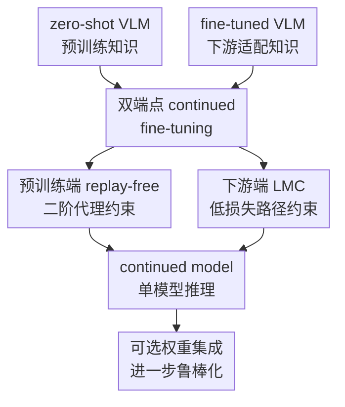

# MergeTune: Continued Fine-Tuning of Vision-Language Models

**会议**: ICLR2026  
**OpenReview**: [https://openreview.net/forum?id=MAApSY32Z6](https://openreview.net/forum?id=MAApSY32Z6)  
**论文**: OpenReview  
**代码**: https://github.com/Surrey-UP-Lab/MERGETUNE  
**领域**: 多模态VLM  
**关键词**: VLM持续微调, CLIP适配, 模型合并, 线性模式连通性, 灾难性遗忘  

## 一句话总结

MERGETUNE 把“已经微调完的 CLIP/VLM 还能不能补回预训练知识”单独定义成 continued fine-tuning 问题，通过线性模式连通性约束继续优化已训练参数，让最终模型同时接近 zero-shot CLIP 和下游微调模型，在不加推理参数的情况下提升 base-novel、跨数据集、域泛化和 ID-OOD 鲁棒性。

## 研究背景与动机

**领域现状**：CLIP 这类视觉-语言模型依靠大规模图文预训练获得很强的 zero-shot 泛化能力，但真实下游任务往往还需要适配。常见做法包括 CoOp、KgCoOp、MMA、PromptKD 这类参数高效微调方法，只更新 prompt、adapter 或轻量分类头；另一条线是 robust fine-tuning，在 ImageNet 之类的大数据上微调整个模型或线性头，再用权重平均、预测集成等方式缓和分布外性能下降。

**现有痛点**：这些方法通常把目标放在“微调过程中尽量少忘”，但微调完成后仍然会丢掉一部分预训练知识。论文的一个直接观察是，在 11 个跨数据集评测上，没有一个已有 PEFT 方法能稳定超过 CLIP；而 TIES、DARE 这类训练后模型合并方法直接拿 zero-shot 和 fine-tuned checkpoint 做合并时也经常退化，说明两个解在权重空间里并不天然处在一条好走的低损失直线上。

**核心矛盾**：下游微调希望模型向任务数据靠近，zero-shot 泛化又依赖原始预训练解附近的知识。简单限制更新会牺牲适配能力，简单合并 checkpoint 又可能跨过高损失区域，导致 base 类、novel 类或 OOD 数据之间出现不稳定 trade-off。问题不只是“两个模型怎么平均”，而是“能不能学出一个新解，使它同时和两个端点保持低损失连通”。

**本文目标**：作者把这个问题改写成 continued fine-tuning：给定已经完成适配的模型，不推翻原有微调流程，不改架构，也不要求重新拿预训练数据训练，而是在 post hoc 阶段继续优化可训练参数，恢复 fine-tuned 模型遗忘掉的预训练知识，同时保留下游任务性能。

**切入角度**：MERGETUNE 从模型合并和 mode connectivity 的几何视角出发。若一个模型 $w$ 与 zero-shot 解 $\hat{w}_1$、fine-tuned 解 $\hat{w}_2$ 之间都存在低损失线性路径，那么 $w$ 就不再只是二者的粗暴平均，而是处在能同时承接两端知识的连通区域里。作者把这个性质直接变成训练目标，而不是训练后再被动尝试平均。

**核心 idea**：用线性模式连通性指导 continued fine-tuning，学习一个与 zero-shot CLIP 和下游微调模型都低损失相连的 continued model，从而把预训练泛化能力“补回”已经适配过的 VLM。

## 方法详解

### 整体框架

MERGETUNE 的输入是两个 checkpoint：zero-shot VLM 权重 $\hat{w}_1$，例如原始 CLIP；以及某个下游方法已经训练好的权重 $\hat{w}_2$，例如 CoOp、KgCoOp、MMA、PromptKD、linear probing 或端到端微调后的 CLIP。方法不新增网络结构，而是在原方法允许训练的参数空间里初始化一个 continued model $w$，继续用下游数据训练它，并同时约束它靠近 zero-shot 解、与 fine-tuned 解保持低损失线性连通。训练结束后，单个 $w$ 直接用于推理；在 robust fine-tuning 场景下，也可以再把 $w$ 与 zero-shot 模型做一次普通权重插值，作为更强的 ensemble 版本。

这张图里真正的贡献节点是三个：双端点 continued fine-tuning 定义了 MERGETUNE 要找的目标解；预训练端 replay-free 二阶代理约束解决 CLIP 预训练数据不可重放的问题；下游端 LMC 低损失路径约束让 continued model 不只在当前点好，而是在通往 fine-tuned checkpoint 的插值路径上也保持好。可选权重集成只是后处理增强，不是方法必须依赖的结构。

### 关键设计

**1. 双端点 continued fine-tuning：把遗忘恢复放到微调之后解决**

MERGETUNE 最重要的视角转变，是不再把灾难性遗忘只当作微调时的正则化问题。传统 PEFT 会在训练中限制可更新参数或加入知识约束，robust fine-tuning 则常在训练后把 zero-shot 与 fine-tuned 模型做平均或集成；但如果 fine-tuned 模型已经离 zero-shot 解较远，直接平均可能穿过高损失区域。本文反过来问：既然已有一个适配好的模型，能不能继续训练出第三个模型 $w$，让它成为两个端点之间更可合并、更平滑的桥。

形式上，理想目标是让 $w$ 与 zero-shot 解 $\hat{w}_1$、fine-tuned 解 $\hat{w}_2$ 分别通过线性插值相连，并且沿路损失都低：

$$
w = \arg\min_w \mathbb{E}_{\alpha \sim U[0,1]}\left[L_1(\hat{w}_1 + \alpha(w - \hat{w}_1)) + L_2(\hat{w}_2 + \alpha(w - \hat{w}_2))\right].
$$

这个目标比普通权重平均更主动：它不是挑一个插值系数 $\alpha$ 去赌哪个平均点更好，而是通过训练改变 $w$ 的位置，让 $w$ 自己进入一个同时承接预训练知识和下游知识的低损失连通区域。也因此，MERGETUNE 可以作为 post hoc enhancement 接在不同 VLM 适配方法后面：prompt tuning 时 $w$ 对应 text encoder 产生的分类器权重，adapter 方法时 $w$ 包含 adapter 参数，many-shot robust fine-tuning 时 $w$ 可以是线性头或整个模型。

**2. 预训练端 replay-free 二阶代理约束：不用 CLIP 原始数据也能拉住 zero-shot 知识**

理想 LMC 目标里有一个难点：$L_1$ 是 CLIP 预训练任务损失，需要 web-scale 图文预训练数据。CLIP 的原始语料通常不可得，即便可得也不可能在 continued fine-tuning 阶段重放。MERGETUNE 因此没有硬凑一个小规模替代数据集，而是对 zero-shot 端的插值损失做二阶 Taylor 近似。

在 $\hat{w}_1$ 附近，论文把

$$
L_1(\hat{w}_1 + \alpha(w - \hat{w}_1))
$$

展开为常数项、梯度项和 Hessian 二次项。由于 zero-shot checkpoint 被视为预训练任务的局部最优点，作者假设 $\nabla L_1(\hat{w}_1) \approx 0$；再用各向同性曲率 $H_1 \approx \mu I$ 简化 Hessian。这样预训练端的损失就变成一个距离正则：

$$
R_{Task1} = \lambda \|w - \hat{w}_1\|^2.
$$

这个设计的关键不是“让模型完全别离开 CLIP”，而是给 continued model 一根通向 zero-shot 解的几何锚点。它比重放预训练数据便宜得多，也比只用下游数据继续训练更不容易继续遗忘；同时，由于 MERGETUNE 还保留下游任务损失和 fine-tuned 端 LMC 约束，$w$ 不会简单退回原始 CLIP。

**3. 下游端 LMC 低损失路径约束：让新模型与原 fine-tuned 解可平滑合并**

如果只用 $L_2(w)$ 加上 $\lambda\|w-\hat{w}_1\|^2$，模型会受到 zero-shot 端牵引，但未必能保住原来的下游适配知识。MERGETUNE 因此在 fine-tuned 端显式加入 LMC 项：从 $\hat{w}_2$ 到 $w$ 取若干插值点 $\hat{w}_2 + \alpha(w-\hat{w}_2)$，在这些插值模型上计算下游任务损失 $L_2$，要求整条路径都低损失。

最终 replay-free 目标写成：

$$
L(w) = L_2(w) + \lambda\|w - \hat{w}_1\|^2 + \beta\mathbb{E}_{\alpha \sim U[0,1)}L_2(\hat{w}_2 + \alpha(w - \hat{w}_2)).
$$

其中 $L_2(w)$ 确保 continued model 本身在下游训练数据上有效，$\lambda$ 控制保留 zero-shot 知识的强度，$\beta$ 控制与 fine-tuned 解的连通性。论文实际训练时用少量均匀采样的 $\alpha$ 点近似期望，例如 5 或 10 个点；附录显示 $N_\alpha$ 从 1 增至 5 会明显提升，之后收益趋于饱和，而训练成本继续上升，所以 $N_\alpha=5$ 是更均衡的选择。这个约束解释了为什么 MERGETUNE 比 TIES/DARE 更稳：TIES/DARE 试图在训练后处理参数干扰，但没有在训练目标里保证插值路径低损失。

### 损失函数 / 训练策略

训练流程可以理解为三步。第一步，先按原 baseline 训练出下游 checkpoint $\hat{w}_2$，zero-shot checkpoint $\hat{w}_1$ 固定不动。第二步，用 $w=(1-\tau)\hat{w}_1+\tau\hat{w}_2$ 初始化 continued model；附录里 $\tau\in[0.3,0.6]$ 往往最好，说明从两端平衡初始化比完全从 CLIP 或完全从 fine-tuned 权重出发更稳。第三步，在每个 minibatch 上计算下游损失、zero-shot 端距离正则，以及若干插值点上的 LMC 损失，再用与 baseline 相同或相近的优化配置继续训练。

少样本设置下，作者在 16-shot 条件评估 CoOp、KgCoOp、MMA、PromptKD，主干为 CLIP ViT-B/16。CoOp+MERGETUNE 沿用 batch size 128、学习率 0.002 等设置，continued fine-tuning 训练 50 epoch；PromptKD+MERGETUNE 沿用 teacher-student prompt distillation 的训练日程；MMA+MERGETUNE 则继续训练多模态 adapter。多样本 robust fine-tuning 设置下，linear probing 只训练分类头，E2E-FT 同时训练 encoder 和分类头，MERGETUNE 再用对应优化器和 schedule 做相同轮数的 continued fine-tuning。

超参方面，Table 7 显示在 KgCoOp 初始化上，$\lambda$ 与 $\beta$ 的可用范围相对宽。$\lambda=8, \beta=0.5$ 时平均 harmonic mean 为 77.62，是表中较优点；$\lambda\in[8,16]$、$\beta\in[0.1,0.5]$ 都能维持接近最优的表现。作者还检查了长时间 continued fine-tuning 是否会 over-merging，在 Siglip2-B/16 + CoOp 上从 10 到 100 epoch 没观察到性能下降，说明双端点约束确实给训练提供了稳定锚点。

## 实验关键数据

### 主实验

MERGETUNE 的主实验覆盖四类协议：base-to-novel generalisation、cross-dataset generalisation、domain generalisation，以及 many-shot ID-OOD robust fine-tuning。最核心的结论是：训练后直接合并的 TIES/DARE 在 PEFT 场景经常退化，而 MERGETUNE 在不同 baseline 上都给出正增益，尤其对遗忘更明显的 CoOp 提升最大。

| 设置 | Baseline | 原方法 | TIES / DARE | MERGETUNE | 主要结论 |
|------|----------|--------|-------------|-----------|----------|
| Base-to-novel 平均 HM | CoOp | 71.66 | 66.32 / 70.59 | 77.24 | 相比 CoOp +5.58，且训练后合并反而掉点 |
| Base-to-novel 平均 HM | KgCoOp | 77.01 | 72.56 / 75.17 | 77.98 | 在较强知识保持 baseline 上仍有 +0.97 |
| Base-to-novel 平均 HM | MMA | 79.87 | 69.41 / 71.81 | 80.44 | 结构不同场景下只合并 linear head，仍优于原 MMA |
| Base-to-novel 平均 HM | PromptKD | 83.73 | 79.52 / 82.13 | 84.09 | 强 baseline 上增益较小但稳定，为 +0.36 |
| Cross-dataset Avg-C | CoOp | 63.88 | 63.80 / 61.67 | 65.80 | ImageNet 训练后迁移到 10 个数据集，+1.92 |
| Domain Avg-D | CoOp | 59.28 | 53.20 / 57.64 | 60.15 | ImageNet shift 上 +0.87，TIES/DARE 明显退化 |

在 base-to-novel 表里，CoOp 的 base accuracy 原本高、novel accuracy 低，典型反映了 prompt tuning 对 base 类适配过强、novel 类泛化被削弱。MERGETUNE 把 CoOp 的 Novel 从 63.22 提升到 73.97，HM 从 71.66 提到 77.24，同时 Base 仍保持 80.82。相比之下，CoOp+TIES 的 HM 只有 66.32，说明 zero-shot 和 fine-tuned 权重之间没有天然可用的线性通道。

在 robust fine-tuning 里，MERGETUNE 也比复杂 ensemble 更有吸引力：单个 LMC-tuned 模型就超过 VRF 等方法，如果再和 zero-shot 模型做一次权重插值，可以得到更高 OOD 平均准确率。

| Robust fine-tuning 设置 | 方法 | ImageNet | Avg-D | 相对原 fine-tuned 提升 | 推理形态 |
|-------------------------|------|----------|-------|------------------------|----------|
| Linear probing | 原始 LP | 79.79 | 57.39 | - | 单模型 |
| Linear probing | Weight ensemble | 79.80 | 58.56 | +1.17 | 单次权重插值 |
| Linear probing | VRF | 79.84 | 58.87 | +1.48 | 需要额外失败集/距离计算 |
| Linear probing | MERGETUNE | 79.96 | 59.66 | +2.27 | 单模型 |
| Linear probing | MERGETUNE + Weight ens. | 79.88 | 60.23 | +2.84 | 单次权重插值 |
| E2E-FT | 原始 E2E-FT | 81.31 | 53.70 | - | 单模型 |
| E2E-FT | VRF | 82.32 | 61.72 | +8.02 | 额外推理开销 |
| E2E-FT | MERGETUNE | 82.26 | 62.29 | +8.59 | 单模型 |
| E2E-FT | MERGETUNE + Weight ens. | 82.18 | 62.90 | +9.20 | 单次权重插值 |

### 消融实验

| 配置 | 关键指标 | 说明 |
|------|----------|------|
| $\lambda=1, \beta=0.1$ | HM 76.44 | zero-shot 端约束较弱，novel 恢复不足 |
| $\lambda=8, \beta=0.5$ | HM 77.62 | 主设置之一，base/new 平衡最好 |
| $\lambda=16, \beta=2$ | HM 77.52 | 较强正则仍稳定，但没有明显继续提升 |
| 初始化 $\tau=0.0$ | HM 76.94 | 从 CLIP 出发偏向预训练端，保留下游适配较弱 |
| 初始化 $\tau=0.3$ | HM 77.62 | 平衡初始化效果最好之一 |
| 初始化 $\tau=1.0$ | HM 77.24 | 从 fine-tuned 权重出发仍可用，但恢复预训练知识稍弱 |
| $N_\alpha=1$ | HM 77.19 | 插值路径采样太少，LMC 约束不充分 |
| $N_\alpha=5$ | HM 77.62 | 性能与成本折中点 |
| $N_\alpha=15$ | HM 77.70 | 只比 5 点略高，但训练成本约 7 倍于 KgCoOp |

### 关键发现

- MERGETUNE 的增益与 baseline 遗忘程度有关：CoOp 原本 novel 类掉得最明显，所以 +5.58 HM；PromptKD 已经通过外部 teacher 保留了较多知识，因此只增加 +0.36，但仍没有负增益。
- 训练后直接合并在 PEFT 场景不可靠。TIES 和 DARE 在 CoOp、KgCoOp、MMA、PromptKD 上大多降低 HM，说明“模型合并”本身不是答案，关键是训练过程中要显式塑造低损失连通路径。
- 域泛化和跨数据集结果显示，MERGETUNE 恢复的不是单个 novel split 上的偶然收益，而是更接近 CLIP 原本的跨域知识。MMA+MERGETUNE 在 cross-dataset 中平均 66.30，超过 CLIP 的 65.24，并且作者强调它在所有评测数据集上都能超过 CLIP。
- robust fine-tuning 中，MERGETUNE 单模型推理就超过 VRF；如果进一步与 zero-shot 做普通权重插值，LP 和 E2E-FT 的 Avg-D 分别到 60.23 和 62.90，是表中最高结果。
- 附录的 backbone 扩展说明方法不只适用于 CLIP ViT-B/16：在 CLIP-L/14、Siglip2-B/16、Siglip2-L/16 上，CoOp+MERGETUNE 的平均 HM 分别比 CoOp 高 +1.93、+1.60、+1.30。

## 亮点与洞察

- MERGETUNE 的亮点在于把“恢复遗忘知识”从微调过程里拆出来，变成一个清晰的 post hoc continued fine-tuning 阶段。这个设定很实用，因为很多已有 VLM 适配方法已经训练好了，研究者或工程团队并不一定愿意重新设计架构或重跑完整 pipeline。
- 论文没有停留在“CLIP 权重离 fine-tuned 权重不要太远”这种直觉正则，而是用线性模式连通性解释为什么模型合并有时有效、有时失败。它把低损失路径从事后观察变成训练目标，这是比 TIES/DARE 更本质的差异。
- 二阶代理约束很朴素但切中工程痛点。对于 CLIP 这类预训练语料不可得的模型，如果 continued fine-tuning 还要求 replay 预训练数据，方法基本不可用；用 $\lambda\|w-\hat{w}_1\|^2$ 代替预训练端 LMC 虽然近似粗糙，但让整个框架变成真正可执行的后处理步骤。
- 这篇论文对“模型合并”和“参数高效微调”的连接很有启发。很多 VLM/LLM adaptation 方法都可以看成在某个轻量参数子空间里移动，MERGETUNE 提示我们：与其训练后硬合并，不如在训练阶段把可合并性、连通性和知识保留显式写进目标。
- robust fine-tuning 结果尤其有工程价值。VRF 这类方法虽然强，但需要构造 failure set 或做额外 per-sample 操作；MERGETUNE 得到的是一个普通 checkpoint，推理成本和原模型基本一致，更容易落地到部署场景。

## 局限与展望

- zero-shot 端的二阶代理依赖较强假设：$\nabla L_1(\hat{w}_1)\approx 0$ 和 $H_1\approx\mu I$ 对大型 VLM 未必严格成立。实验说明这个近似有效，但它更像一个实用正则，而不是精确刻画预训练损失地形。
- MERGETUNE 仍然需要下游数据继续训练，并不是完全 training-free。对于只有 checkpoint、没有原下游训练集的场景，它无法直接应用；而 TIES/DARE 虽然效果差一些，但对数据依赖更低。
- 插值点数量会增加训练开销。附录显示 $N_\alpha=5$ 已经约为 KgCoOp 训练成本的 3 倍，$N_\alpha=10$ 约 5 倍，因此在大模型或多任务场景下需要更高效的 LMC 近似。
- 实验主要集中在分类式 VLM 适配与 CLIP/SigLIP 风格 encoder 上。对于生成式多模态模型、视觉问答、多轮 agentic VLM 或 dense prediction 任务，$w$ 的定义、损失路径以及评估指标可能更复杂。
- 未来可以把 MERGETUNE 和 LoRA/adapter bank、多任务 prompt pool、continual learning memory 结合起来：一边保持不同任务端点的 LMC，一边学习可组合的轻量模块，而不是每次只连接 zero-shot 与单个 fine-tuned checkpoint。

## 相关工作与启发

- **vs CoOp / KgCoOp**: CoOp 直接学习连续 prompt，适配 base 类强但容易牺牲 novel 泛化；KgCoOp 用知识引导约束缓解遗忘。MERGETUNE 不替代它们的训练过程，而是在它们训练完之后继续优化，让 prompt 对应的分类器权重同时向 CLIP 和 fine-tuned 解保持低损失连通。
- **vs MMA / adapter-based PEFT**: MMA 通过多模态 adapter 增强 VLM 适配能力，结构上已经比 prompt tuning 更复杂。MERGETUNE 的优势是 model-agnostic：可以继续训练 adapter 参数，也可以在结构不匹配时只处理 linear head，因此不要求为每个 PEFT 架构重新设计遗忘恢复模块。
- **vs TIES / DARE**: TIES 和 DARE 是训练后模型合并方法，关注参数冲突、稀疏化或重加权，但不保证 zero-shot 与 fine-tuned 模型之间存在低损失线性路径。MERGETUNE 的核心区别是用 continued fine-tuning 主动塑造这种路径，所以在 CLIP 与下游模型距离较远时更稳。
- **vs Wise-FT / Weight Ensemble**: Wise-FT 通过在 zero-shot 和 fine-tuned 权重之间插值获得更好的 ID-OOD trade-off。MERGETUNE 可以看作先把 fine-tuned checkpoint 改造成更适合插值的 continued checkpoint；实验中 MERGETUNE 单模型已超过多种 ensemble，进一步 weight ensemble 后还能达到最高 OOD 平均精度。
- **vs VRF**: VRF 通过 failure set 和 variance reduction 改善 robust fine-tuning，但推理或准备过程更复杂。MERGETUNE 得到的是单个 checkpoint，更像一个训练侧的 checkpoint 修复步骤，适合希望控制推理成本的系统。

## 评分

- 新颖性: ⭐⭐⭐⭐☆ 把 LMC 从解释模型合并的现象变成 post hoc continued fine-tuning 目标，问题定义和方法结合很清楚，但 zero-shot 端代理正则相对朴素。
- 实验充分度: ⭐⭐⭐⭐⭐ 覆盖 PEFT、cross-dataset、domain generalisation、ID-OOD robust fine-tuning、多 backbone、超参和插值路径分析，证据链比较完整。
- 写作质量: ⭐⭐⭐⭐☆ 主文逻辑顺，从遗忘现象到 LMC 目标很自然；但表格很密，部分实验细节和符号解释需要读附录才能完全拼齐。
- 价值: ⭐⭐⭐⭐⭐ 方法简单、无需改架构、推理不加参数，能作为已有 VLM fine-tuning pipeline 的后处理增强，工程迁移价值较高。

<!-- RELATED:START -->

## 相关论文

- [\[ICLR 2026\] pFedMMA: Personalized Federated Fine-Tuning with Multi-Modal Adapter for Vision-Language Models](pfedmma_personalized_federated_fine-tuning_with_multi-modal_adapter_for_vision-l.md)
- [\[ICLR 2026\] Preserve and Sculpt: Manifold-Aligned Fine-tuning of Vision-Language Models for Few-Shot Learning](preserve_and_sculpt_manifold-aligned_fine-tuning_of_vision-language_models_for_f.md)
- [\[AAAI 2026\] Difference Vector Equalization for Robust Fine-tuning of Vision-Language Models](../../AAAI2026/multimodal_vlm/difference_vector_equalization_for_robust_fine-tuning_of_vis.md)
- [\[CVPR 2026\] TRivia: Self-supervised Fine-tuning of Vision-Language Models for Table Recognition](../../CVPR2026/multimodal_vlm/trivia_self-supervised_fine-tuning_of_vision-language_models_for_table_recogniti.md)
- [\[CVPR 2026\] FairLLaVA: Fairness-Aware Parameter-Efficient Fine-Tuning for Large Vision-Language Models](../../CVPR2026/multimodal_vlm/fairllava_fairness-aware_parameter-efficient_fine-tuning_for_large_vision-langua.md)

<!-- RELATED:END -->
