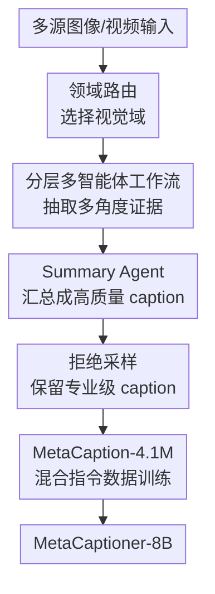

# MetaCaptioner: Towards Generalist Visual Captioning with Open-source Suites

**会议**: ICLR2026  
**OpenReview**: [https://openreview.net/forum?id=fPXO6Jc8Xj](https://openreview.net/forum?id=fPXO6Jc8Xj)  
**代码**: https://github.com/OpenGVLab/MetaCaptioner  
**领域**: 多模态VLM  
**关键词**: 通用视觉描述, 多智能体标注, Caption 数据合成, 多模态大模型, 开源 VLM  

## 一句话总结
MetaCaptioner 提出用开源模型组成的多智能体 CapFlow 流程生成跨图像与视频领域的高质量长 caption，再经严格拒绝采样得到 4.1M 训练数据，把一个 8B 多模态模型微调成接近商业模型描述质量、同时保持强下游能力的通用视觉描述器。

## 研究背景与动机
**领域现状**：视觉 captioning 原本更多服务于自然图像描述，典型输出是“图中有什么物体、它们在哪里、发生了什么”。但在当前 MLLM 训练与数据合成场景里，caption 已经变成一种高价值监督信号：它不仅要描述自然场景，还要覆盖图表、文档、医学图像、代码截图、UI、教育图、视频等复杂视觉域，并能把 OCR、结构关系、专业知识和时序事件都写进一段可被模型学习的文本里。

**现有痛点**：高质量通用 caption 目前很大程度依赖 GPT-4.1/GPT-4o 这类商业模型。它们效果强，但大规模标注成本高，难以支撑千万级训练数据；开源 MLLM 虽然便宜，却常在复杂域里漏细节、误读结构、推理不严谨，尤其遇到图表、数学题、长文本文档、医学图或视频事件时，很难把“看见的东西”和“需要解释的逻辑”整合成一个完整 caption。

**核心矛盾**：通用视觉描述不是单一能力，而是许多能力的组合：自然场景需要细粒度感知，文档需要 OCR，图表和数学图需要结构解析，医学图需要专业知识，视频需要时序理解。把这些能力压进一个开源模型的一次生成里，容易出现领域错配；但如果完全依赖商业模型，又会被成本和闭源接口限制住。

**本文目标**：作者想解决两个层面的问题。第一，能不能只用开源模型搭出一个质量接近 GPT-4.1 的通用 caption 生成流程？第二，能不能把这个流程当作数据引擎，合成足够大且足够干净的 caption 数据，进一步训练出一个便宜、可部署、可开源的通用 captioner。

**切入角度**：论文的观察很直接：不同视觉域需要不同“专家视角”。与其让一个模型一次性完成所有事情，不如先判断输入属于哪个视觉域，再让一组具有不同职责的 agent 分别抽取视觉细节、文本、结构、知识和推理线索，最后由 summarizer 汇总。这样既复用了开源大模型的局部能力，也绕开了单模型在复杂域里“一步到位”失败的问题。

**核心 idea**：用领域路由 + 分层多智能体协作把通用视觉描述拆成可组合的专业子任务，再用拒绝采样筛掉低质 caption，最终把 CapFlow 合成的数据蒸馏进 MetaCaptioner-8B。

## 方法详解

### 整体框架
MetaCaptioner 的方法可以分成两条线：先构建 CapFlow 作为“开源 caption 数据引擎”，再用它批量合成并筛选 MetaCaption-4.1M，训练出 MetaCaptioner-8B。CapFlow 面向输入图像或视频，先由 domain router 判断主视觉域，再选择对应 workflow；workflow 内多个功能 agent 分别负责感知、OCR、专业推理或工具解析，summary agent 将所有证据整合为最终 caption。训练阶段则把这些 caption 与常规指令数据混合，按 InternVL3.5 风格训练一个以 InternViT-600M 和 Qwen3-8B-Instruct 为主体的多模态模型。

这个框架里，CapFlow 不是一个单模型 captioner，而是一套可替换、可扩展的标注流程；MetaCaptioner 则是把这套流程的输出压缩进一个 8B 模型，使推理成本从多 agent 调用进一步降到单模型调用。

### 关键设计

**1. 领域路由：先判断“这张图该用哪种读法”**

通用 captioning 最容易失败的地方，是模型用自然图像的阅读方式去处理非自然图像。比如数学图不仅要说线段和符号，还要解释结构关系；文档图需要完整 OCR；UI 截图需要描述交互组件；视频则要保留时间顺序。CapFlow 因此把第一步设计成 domain routing：让 MLLM 根据输入视觉特征，在 Natural、Structure & Math、Infographic & Document、Medical & Bio-Imaging、UI & Interaction、Code & Programming、Knowledge & Education、Synthetic & Aesthetic、Video & Temporal 这 9 个域中选择最合适的类别。

这个路由不是简单关键词分类，而是在 prompt 中显式写入每个域的边界和混淆规则，例如“代码 IDE 截图归 Code 而不是 UI”“图表在文档里时，如果定量结构占主导就归 Structure & Math”。附录还加入 3 点置信度机制，让 router 对混合域或低质量输入给出低置信度。这样做的意义在于把后续 caption 任务从“一套提示词打天下”变成“按主视觉属性调用不同专家流程”，减少开放域输入带来的系统性错配。

**2. 分层多智能体工作流：把复杂 caption 拆成可核验的证据合成**

路由之后，每个视觉域会进入一个定制 workflow。论文把 workflow 分成 task-solving layer 和 information summarization layer：前者负责并行或串行地产生多角度证据，后者负责把证据组织成完整 caption。功能 agent 总共约 30 个，大致分成 guideline、perception、reasoning 和 tools 四类。guideline agent 给全局概要，perception agent 负责颜色、纹理、布局、对象等细粒度外观，reasoning agent 负责可见结构背后的逻辑和专业知识，tool agent 则承担 OCR、代码解析等更工具化的工作。

这套拆解的关键不是“agent 越多越好”，而是让每个 agent 的职责足够窄，从而把开源 MLLM 擅长的局部能力稳定组合起来。以文档/信息图为例，workflow 会包含 infographic perception、OCR、general reasoning 和 visual guideline；以视频为例，则换成 video perception、video reasoning、video guideline 和 video summary。最终 summary agent 逐一阅读这些中间结果，判断各证据对最终 caption 的贡献，再生成既包含细节又有结构的描述。相比单次生成，它更像一个开放源模型版本的“专家会诊”：先分别看，再统一写。

**3. 拒绝采样：把数据合成问题转化为质量门控问题**

CapFlow 可以低成本生成大量 caption，但训练数据真正有价值的前提是质量足够稳定。作者因此在 MetaCaption-5M 之后加入严格 reject sampling。对于图像 caption，评估维度包括 factual accuracy、information completeness、reasoning rigor、core intent capture 和 professionalism；对于视频，则替换成 temporal and factual accuracy、event and detail coverage、temporal causal logic、core intent 和 professionalism。每个维度用 1 到 3 分打分，只保留所有子维度都达到专业级别的样本。

这个设计把“生成更长 caption”与“生成更好 caption”区分开来。长 caption 如果包含幻觉、OCR 错误或过度推断，会污染训练；而 3 点量表虽然粗，但能降低评审模型主观波动，目标是筛掉明显不可靠样本。经过这一步，原始的 MetaCaption-5M 被压缩为 MetaCaption-4.1M。论文的人类评估也显示，CapFlow 和 MetaCaptioner 在 factual accuracy、completeness、reasoning rigor、intent capture、professionalism 等维度上与 GPT-4.1 接近，说明这个门控不只是形式上的过滤。

**4. 数据蒸馏到 MetaCaptioner：把昂贵流程压缩成可部署单模型**

CapFlow-72B 的生成质量接近商业模型，但它仍然是多模型、多 agent、多轮汇总的流程，适合做数据引擎，不一定适合在线部署。MetaCaptioner 的第二步就是把 CapFlow 的 caption 能力蒸馏进一个 8B 模型：作者从 140+ 开源图像和视频数据集中收集约 7000 万原始样本，经分辨率、长宽比、语义丰富度和去重筛选出约 500 万高质量样本，再用 CapFlow 标注并拒绝采样得到 410 万 caption。

模型结构上，MetaCaptioner-8B 使用 InternViT-600M 作为视觉编码器、Qwen3-8B-Instruct 作为语言模型，并沿用 InternVL3.5 的训练配方。预训练阶段使用 batch size 256、学习率 $1e{-5}$；SFT 阶段把 MetaCaption-4.1M 与 InternVL3.5 的常规指令数据混合，训练 160k iterations，学习率 $2e{-5}$。这样做的收益是：CapFlow 保留为高质量数据生产线，MetaCaptioner 则承担低成本推理。论文报告 MetaCaptioner 的 caption 推理成本约为 GPT-4.1 的 $0.7\%$，这正是数据蒸馏的核心价值。

### 一个完整示例
假设输入是一张带大量文字、气泡大小编码和类别颜色的信息图。CapFlow 首先通过 domain router 判断主域接近 Infographic & Document，而不是 Natural，因为图中关键内容来自版式、文字、数值与视觉编码。随后 workflow 会调用 infographic perception agent 描述整体布局、色彩、图例、气泡分组和空间关系；OCR agent 抽取标题、类别名、数值与标签；general reasoning agent 根据可见元素分析气泡大小与销售额之间的对应关系；visual guideline agent 给出整体主题和阅读方式。

这些中间结果会被 summary agent 合并成一段完整 caption：先概括这是一张关于暗网市场销售额的气泡图，再说明图中分为 illegal drugs、prescription drugs 和 non-drugs 等类别，气泡大小代表金额，颜色区分类别，最后解释版式如何帮助读者快速理解各类商品的经济规模。这个过程比单模型直接 caption 更稳，因为 OCR、布局感知和逻辑解释各自有专门 agent 兜底；也比简单堆多个 caption 更强，因为最后的 summary agent 会去重、排序并统一成可训练文本。

### 损失函数 / 训练策略
论文没有引入新的特殊损失函数，训练目标仍是多模态指令微调中的自回归语言建模目标。真正的训练策略创新在数据侧：先用 CapFlow 合成细粒度 caption，再用质量评审过滤，最后与通用 instruction data 混合，避免模型只学会“写长描述”而损失 VQA、grounding、OCR、数学和视频理解等通用能力。

实现细节上，CapFlow 的 functional agents 使用 Qwen2.5-VL-72B，summary agent 使用 Qwen2.5-72B；大规模标注约消耗 480 H200 GPU days。reject sampling 的 judge 使用 Qwen2.5-VL-7B，成本约 0.1 H200 GPU days。MetaCaptioner 训练约消耗 192 H200 GPU days。这个成本不小，但相对用商业模型直接生成数百万复杂 caption，作者强调其单位样本成本明显更低，且产出的模型和流程可开源复现。

## 实验关键数据

### 主实验
论文主要从三个角度验证：CapFlow 作为 captioner 是否接近商业模型；MetaCaptioner 作为单模型 captioner 是否优于开源 captioner；用 CapFlow 数据训练后，MetaCaptioner 是否仍具备强多模态下游能力。

| 设置 | 方法 | 代表指标 | 结果 | 说明 |
|------|------|----------|------|------|
| Caption 质量评分 | GPT-4.1 | 平均分 | 2.35 | GPT-5 judge，250 个复杂多模态样本 |
| Caption 质量评分 | CapFlow | 平均分 | 2.33 | 接近 GPT-4.1，professionalism 为 2.80 |
| Caption 质量评分 | Qwen2.5-VL-7B | 平均分 | 1.97 | 开源基线仍有明显差距 |
| Caption 质量评分 | OmniCaptioner | 平均分 | 1.63 | 在复杂结构与专业图像上较弱 |
| Caption 质量评分 | MetaCaptioner | 平均分 | 2.04 | 单模型成本低，但质量高于开源基线 |
| Visual reasoning with LLM | MetaCaptioner-8B + DS-Qwen-7B | AVG | 49.4 | 高于 OmniCaptioner-7B 的 42.5 |
| Visual reasoning with LLM | MetaCaptioner-8B + DS-Qwen-32B | AVG | 55.3 | 高于 OmniCaptioner-7B 的 48.3 |
| Direct MLLM evaluation | MetaCaptioner-8B | MMB AVG | 71.1 | 高于 Qwen2.5-VL-7B 的 67.1 和 InternVL3.5-8B 的 69.1 |

更细地看，在 visual reasoning with LLM setting 中，MetaCaptioner-8B 搭配 DS-Qwen-7B 时在 Video-MME 上达到 27.2，高于 InternVL3.5-8B 的 26.2 和 OmniCaptioner-7B 的 22.9；在 MathVista 上达到 61.5，高于 OmniCaptioner 的 51.7。换成 DS-Qwen-32B 后，MetaCaptioner 在 MathVista 为 65.1、MMMU 为 66.8，说明更强 LLM 能从它生成的结构化 caption 中获益更多。

在 direct multimodal evaluation 中，MetaCaptioner-8B 在 MathVerse 为 56.5、MathVision 为 52.6、MMMU 为 69.5，整体 MMB AVG 为 71.1。这个结果说明加入大量通用 caption 数据并没有把模型训练成“只会描述图片”的 narrow captioner，反而提升了复杂图像理解、数学视觉推理和多学科 VQA 能力。

### 消融实验
| 配置 | MMMU | MMVet | MathVerse | MathVista | AI2D | Video-MME | Cost/100 samples | 说明 |
|------|------|-------|-----------|-----------|------|-----------|------------------|------|
| GPT-4.1 | 55.7 | 61.7 | 56.8 | 65.0 | 75.5 | 26.8 | $1.47 | 商业强基线 |
| Baseline Qwen2.5-VL-7B | 50.7 | 47.2 | 42.1 | 57.6 | 64.5 | 23.9 | $0.01 | 单模型直接 caption |
| + Hierarchical Workflow | 51.6 | 48.6 | 44.0 | 59.0 | 66.0 | 26.1 | $0.02 | 分层工作流带来稳定增益 |
| + Domain Routing | 54.7 | 50.5 | 43.9 | 58.7 | 67.4 | 26.2 | $0.02 | 路由显著提升跨域表现，尤其 MMMU/MMVet |
| + Scale up to 72B | 55.1 | 57.8 | 53.1 | 62.5 | 74.2 | 27.6 | $0.14 | 接近 GPT-4.1，成本约为 GPT-4.1 的 9.5% |

这组消融说明 CapFlow 的收益来自两个方向。分层 workflow 让 caption 不再依赖单次生成，带来中等但广泛的提升；domain routing 对跨域任务尤其重要，MMMU 从 50.7 提到 54.7，MMVet 从 47.2 提到 50.5；把底座放大到 72B 后，模型在 MMMU、MathVista、AI2D 等任务上接近 GPT-4.1，在 Video-MME 上甚至略高。

另一个关键消融是合成 caption 数据对训练的影响。以 InternViT-600M + Qwen3-8B 为底座，MetaCaption-450K 用作 pre-training 数据时，在 MMVet、InfoVQA、MMMU、AI2D 等指标上优于 ShareGPT4V-450K 和 DenseFusion-450K；作为 SFT 增量数据时，Vanilla(1M)+MetaCaption-450K 的平均分为 62.0，高于 Vanilla(3M)+ShareGPT4V-450K 的 59.7 和 Vanilla(3M)+DenseFusion-450K 的 61.0。这说明 CapFlow 生成的 caption 不只是“更长”，而是对复杂视觉理解更有训练价值。

### 关键发现
- Domain routing 是跨域 caption 的关键开关。没有路由时，workflow 仍然会提升一部分指标，但遇到文档、数学、医学、UI、视频等非自然图像时，固定流程很难匹配输入需求。
- 多 agent workflow 与模型规模互补。7B 下 CapFlow 已经有明显收益，72B functional agent 则把质量进一步推到接近 GPT-4.1 的区间，说明流程设计和底座能力都重要。
- MetaCaptioner 的优势在“结构化、专业化、可被 LLM 使用”的 caption。它在 visual reasoning with LLM setting 中提升明显，说明生成的文本提示更能帮助纯 LLM 完成视觉问答和推理。
- 拒绝采样不是附属步骤，而是数据质量的护城河。附录中的人类评估显示 CapFlow 平均分 2.90，MetaCaptioner 2.89，均略高于 GPT-4.1 的 2.76，至少说明人工偏好与 LLM judge 的趋势一致。

## 亮点与洞察
- CapFlow 的聪明之处在于没有把“开源模型不如 GPT-4.1”当成单模型能力差距来硬追，而是把任务拆成一组更小、更专业、更容易 prompt 的子任务。这个思路对开源生态很实用：当单个模型能力有限时，系统编排可以补一部分能力短板。
- 论文把 captioning 重新定义成多模态训练的数据基础设施，而不是一个孤立生成任务。CapFlow 的最终目标并不只是赢 caption 评分，而是生产能提升 MLLM 训练的数据；这也解释了为什么实验同时评估 caption 质量、LLM visual reasoning 和 direct multimodal evaluation。
- 领域路由的设计很有迁移价值。许多多模态任务都存在“同一 prompt 处理所有输入”的问题，类似 router + domain workflow 的结构可以迁移到 visual QA 数据合成、OCR benchmark 构建、复杂图表解释、视频事件标注等场景。
- 论文对成本的叙述比较清楚：CapFlow-72B 不是最低成本方案，但它把 GPT-4.1 级别的标注质量降到约 $10.5\%$ 成本；MetaCaptioner 又把在线 caption 成本降到约 $0.7\%$。这条“高质量流程生成数据，再训练低成本模型”的路线很适合大规模开源数据工程。
- 从实验看，高质量长 caption 不只是让模型更会“描述”，还会帮助结构化视觉推理。MathVista、MathVerse、MMMU、AI2D 这类任务的提升说明，细粒度 caption 可以作为视觉信息压缩层，让语言模型更容易接触到图像里的结构和证据。

## 局限与展望
- CapFlow 本身仍然很重。主文报告标注 MetaCaption-5M 约需要 480 H200 GPU days，训练 MetaCaptioner 还需要约 192 H200 GPU days。虽然比商业 API 便宜且可开源，但对普通研究组仍不是轻量流程。
- 质量评审仍依赖模型 judge。论文用人类评估验证趋势一致，但 reject sampling 阶段主要由 Qwen2.5-VL-7B 评分，可能继承 judge 的盲点，例如对专业医学图、复杂数学图或长视频因果关系的误判。
- Domain router 的鲁棒性并非完美。附录中 500 个混合域样本的平均路由准确率为 84.8%，UI、Synthetic 等域更容易混淆。虽然多数误路由 caption 仍可接受，但复杂混合文档、图表和知识图仍可能进入次优 workflow。
- 论文主要证明 MetaCaptioner 在公开 benchmark 上有效，但对实际下游数据合成中的风险讨论还不够，比如 caption 的偏见传播、专业领域错误、对训练集来源许可的影响，以及长 caption 是否会引入过多语言先验。
- 后续可以考虑让 router 支持多标签或级联 workflow。很多真实图像同时是文档、图表和知识图，单一路由可能过于粗糙；如果能按子区域调用不同 agent，再由 summary agent 融合，可能进一步提升混合域 caption 的精度。

## 相关工作与启发
- **vs GPT-4.1/GPT-4o caption 数据合成**: 商业模型可以直接生成高质量 caption，但成本高、闭源且不易控制。本文用开源 Qwen2.5-VL/Qwen2.5 组成 CapFlow，牺牲一些流程复杂度，换来可控、可扩展、低成本的数据引擎。
- **vs OmniCaptioner**: OmniCaptioner 也是面向通用 caption 的开源方法，但论文实验显示它在复杂信息图、结构图和专业图像上更容易漏细节或产生不严谨描述。MetaCaptioner 的优势来自 CapFlow 数据中更细的域拆分、agent 分工和质量过滤。
- **vs ShareGPT4V / DenseFusion**: 这些工作强调用更好的 caption 或多专家融合改进多模态训练数据。MetaCaptioner 更进一步，把数据合成流程系统化为 domain routing + hierarchical workflow + reject sampling，并验证其合成数据在 pre-training 和 SFT 两个阶段都能带来收益。
- **vs InternVL3.5 类强 MLLM 训练配方**: 本文没有重写模型架构，而是沿用 InternVL3.5 风格训练，把创新主要放在 caption 数据生产上。它给出的启发是：在模型结构趋同的阶段，数据描述质量和域覆盖可能是提升 VLM 通用能力的更大杠杆。

## 评分
- 新颖性: ⭐⭐⭐⭐☆ 把 domain routing、多 agent workflow 和拒绝采样组合成开源 caption 数据引擎，系统性强，但每个子模块本身并非全新范式。
- 实验充分度: ⭐⭐⭐⭐⭐ 覆盖 caption 评分、LLM visual reasoning、direct MLLM evaluation、CapFlow 消融、合成数据消融、人类评估和路由鲁棒性，证据链很完整。
- 写作质量: ⭐⭐⭐⭐☆ 主线清楚，图表丰富，附录 prompt 很有复现价值；少量表格文字存在排版/数值读法不够顺的问题。
- 价值: ⭐⭐⭐⭐⭐ 对开源 VLM 数据合成非常有用，尤其适合作为复杂视觉 caption 标注、训练数据构建和低成本 captioner 训练的参考方案。

<!-- RELATED:START -->

## 相关论文

- [\[CVPR 2026\] The LLM Bottleneck: Why Open-Source Vision LLMs Struggle with Hierarchical Visual Recognition](../../CVPR2026/multimodal_vlm/the_llm_bottleneck_why_open-source_vision_llms_struggle_with_hierarchical_visual.md)
- [\[CVPR 2026\] Enhancing Part-Level Point Grounding for Any Open-Source MLLMs](../../CVPR2026/multimodal_vlm/enhancing_part-level_point_grounding_for_any_open-source_mllms.md)
- [\[CVPR 2025\] RLAIF-V: Open-Source AI Feedback Leads to Super GPT-4V Trustworthiness](../../CVPR2025/multimodal_vlm/rlaif-v_open-source_ai_feedback_leads_to_super_gpt-4v_trustworthiness.md)
- [\[ICLR 2026\] Customizing Visual Emotion Evaluation for MLLMs: An Open-vocabulary, Multifaceted, and Scalable Approach](customizing_visual_emotion_evaluation_for_mllms_an_open-vocabulary_multifaceted_.md)
- [\[ICLR 2026\] Decoding Open-Ended Information Seeking Goals from Eye Movements in Reading](decoding_open-ended_information_seeking_goals_from_eye_movements_in_reading.md)

<!-- RELATED:END -->
